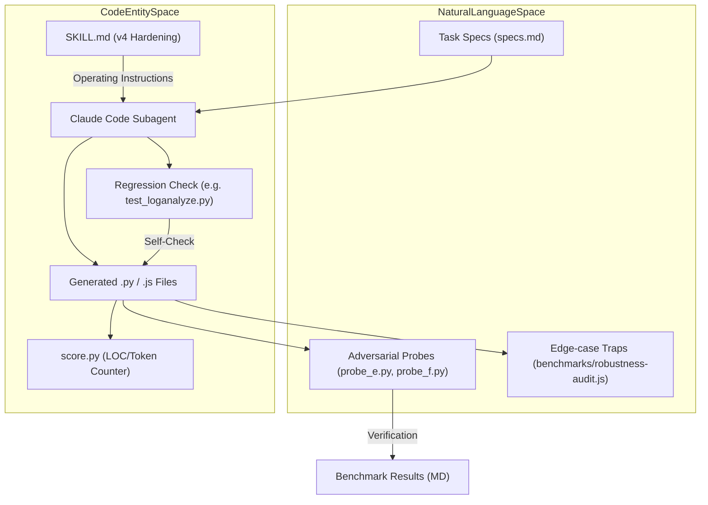
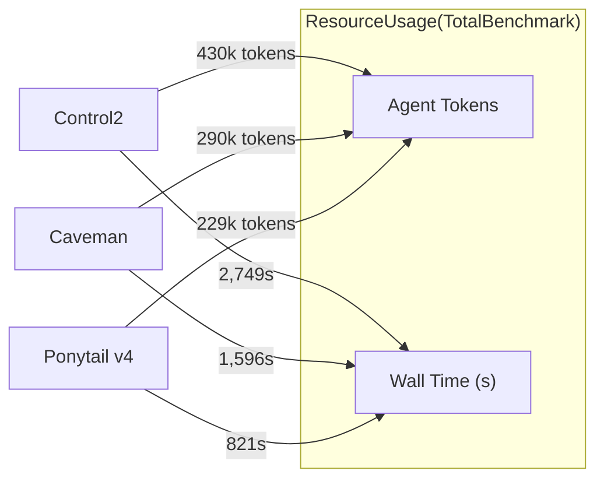

# v4 Hardening Benchmark (A–F Tasks)

Relevant source files

The following files were used as context for generating this wiki page:

- [.agents/rules/ponytail.md](.agents/rules/ponytail.md)
- [.kiro/steering/ponytail.md](.kiro/steering/ponytail.md)
- [benchmarks/behavior.js](benchmarks/behavior.js)
- [benchmarks/behavior.yaml](benchmarks/behavior.yaml)
- [benchmarks/promptfooconfig.gpt.yaml](benchmarks/promptfooconfig.gpt.yaml)
- [benchmarks/results/2026-06-12-v4-hardening-vs-caveman.md](benchmarks/results/2026-06-12-v4-hardening-vs-caveman.md)
- [benchmarks/results/2026-06-16-correctness-gate-fix.md](benchmarks/results/2026-06-16-correctness-gate-fix.md)
- [benchmarks/results/2026-06-16-robustness-audit.md](benchmarks/results/2026-06-16-robustness-audit.md)
- [benchmarks/robustness-audit.js](benchmarks/robustness-audit.js)
- [scripts/check-rule-copies.js](scripts/check-rule-copies.js)

This page documents the v4 hardening benchmark, a comprehensive evaluation of Ponytail's minimalism philosophy when subjected to safety-critical requirements and adversarial probes. The benchmark compares Ponytail v4 against a "Control" arm (no instructions) and the "Caveman" arm (an alternative minimalism skill).

## Purpose and Scope
The v4 benchmark was designed to verify that Ponytail's pursuit of minimalism does not sacrifice correctness or security. It introduces three specific "Hardening Rules" to the core instructions and tests them across six complex tasks (A–F). The evaluation measures:
*   **Build Phase:** Lines of Code (LOC), token usage, and wall-clock time.
*   **Extension Phase:** The cost of modifying existing code to meet new requirements.
*   **Safety Verification:** Resilience against adversarial probes targeting security and concurrency.
*   **Robustness Audit:** Verification of edge-case handling on weak models (GPT-mini series).

## The v4 Hardening Rules
The v4 update introduced approximately 10 lines of prompt hardening to `AGENTS.md` and platform-specific rule files such as `.kiro/steering/ponytail.md` [benchmarks/results/2026-06-12-v4-hardening-vs-caveman.md:14-25](), [.kiro/steering/ponytail.md:26-29]().

| Rule | Description | Implementation Goal |
| :--- | :--- | :--- |
| **Test Reflex** | Non-trivial logic must include ONE runnable check (e.g., `if __name__ == "__main__":` or a small `test_*.py`). | Ensure minimal code is actually functional without framework bloat [.kiro/steering/ponytail.md:29](). |
| **Ceiling Comments** | Every `ponytail:` shortcut must name its specific ceiling and the upgrade path. | Provide a roadmap for future engineers when the minimal solution is outgrown [.kiro/steering/ponytail.md:27](). |
| **Robust Variant** | When choosing between two same-size stdlib options, select the one that is edge-case correct. | Prioritize correctness over the absolute shortest character count [.kiro/steering/ponytail.md:26](). |

## Benchmark Architecture: Task Flow
The following diagram illustrates the lifecycle of a benchmark task from initial prompt to safety verification.

**Benchmark Task Lifecycle**

Sources: [benchmarks/results/2026-06-12-v4-hardening-vs-caveman.md:4-9](), [benchmarks/results/2026-06-12-v4-hardening-vs-caveman.md:77-78](), [benchmarks/robustness-audit.js:35-93]()

## Tasks A–F: Build Phase Results
The benchmark used six distinct tasks to evaluate the "Test Reflex" and "Ceiling Comments" [benchmarks/results/2026-06-12-v4-hardening-vs-caveman.md:31-37]().

| ID | Task Name | Ponytail v4 (LOC/Files) | Caveman (LOC/Files) | Control (LOC/Files) |
| :--- | :--- | :--- | :--- | :--- |
| **A** | Log-analysis CLI | 145 / 2 | 283 / 1 | 946 / 13 |
| **B** | File Sync | 99 / 1 | 228 / 2 | 656 / 9 |
| **C** | Notification Dispatcher | 73 / 1 | 396 / 10 | 808 / 13 |
| **D** | Validation Engine | 70 / 1 | 218 / 3 | 677 / 8 |
| **E** | Auth Module | 49 / 1 | 148 / 1 | 260 / 1 |
| **F** | Money Ledger | 54 / 1 | 167 / 1 | 282 / 1 |
| **Total** | | **490** | **1,440** | **3,629** |

### Key Finding: The Test Reflex
Despite the new requirement to ship a runnable check, Ponytail v4 remained leaner than v3 (which had no test requirement) in 6/6 tasks [benchmarks/results/2026-06-12-v4-hardening-vs-caveman.md:39-44](). Task A is the only instance where Ponytail produced more files than Caveman (2 vs 1) because Ponytail separated the 24-line regression check into `test_loganalyze.py` while Caveman skipped the test entirely [benchmarks/results/2026-06-12-v4-hardening-vs-caveman.md:41-44]().

## Extension Phase (Tasks C & D)
To test long-term maintainability, agents were given "surprise requests" to extend Tasks C and D. Ponytail's use of "seams" (like duck-typed registries) allowed for significantly cheaper modifications [benchmarks/results/2026-06-12-v4-hardening-vs-caveman.md:46-56]().

| Metric | Task C (v4) | Task C (Caveman) | Task D (v4) | Task D (Caveman) |
| :--- | :--- | :--- | :--- | :--- |
| Lines Changed | **41** | 156 | **55** | 257 |
| Files Touched | 1 | 7 | 1 | 3 |

Sources: [benchmarks/results/2026-06-12-v4-hardening-vs-caveman.md:48-51]()

## Safety & Adversarial Probes
Adversarial probes were executed independently to verify that minimal code is not insecure code.

### Probe E: Security (Auth Module)
The agent was tasked with building an authentication module. Ponytail v4 achieved 8/8 security checks by selecting robust primitives [benchmarks/results/2026-06-12-v4-hardening-vs-caveman.md:64-65]():
*   **Hashing:** PBKDF2-HMAC-SHA256 with 600k iterations.
*   **Salting:** 16-byte `secrets` salt.
*   **Comparison:** `hmac.compare_digest` (timing attack prevention).
*   **Tokens:** `token_urlsafe(32)`.

### Probe F: Concurrency (Money Ledger)
The agent built a ledger with a global lock. The `ponytail:` comment explicitly named the upgrade path to "per-account locks" [benchmarks/results/2026-06-12-v4-hardening-vs-caveman.md:66-68](). It passed 6/6 concurrency checks while using 3x less code than the Caveman implementation [benchmarks/results/2026-06-12-v4-hardening-vs-caveman.md:66-68]().

## Efficiency Metrics (Same-Model Control)
Using exact telemetry from agent runs, Ponytail v4 demonstrated significant cost and time savings over both the standard "production-normal" approach (Control2) and the Caveman skill [benchmarks/results/2026-06-12-v4-hardening-vs-caveman.md:102-109]().

**Efficiency Comparison**

Sources: [benchmarks/results/2026-06-12-v4-hardening-vs-caveman.md:104-108]()

## Robustness Audit & Edge-Case Traps
A specialized audit was conducted using `benchmarks/robustness-audit.js` to verify if Ponytail's pressure for brevity degrades performance on weak models like `gpt-4.1-mini` [benchmarks/robustness-audit.js:1-5]().

### Algorithmic Edge Cases
The audit tested 12 classic traps, including `is_prime` (negatives), `binary_search` (empty lists), and `is_leap_year` (century rule) [benchmarks/robustness-audit.js:35-93](). Ponytail held baseline parity on 12/12 algorithmic tasks [benchmarks/results/2026-06-16-robustness-audit.md:31-49]().

### The Email Validation Slip
A specific defect was identified in email validation on OpenAI models. Under "stdlib-first" pressure, these models reach for `email.utils.parseaddr`, which is a parser rather than a strict validator, accepting invalid strings like `@missing-local.com` [benchmarks/results/2026-06-16-robustness-audit.md:53-67](). This behavior was notably **absent** on Claude models, where Ponytail achieved 100% correctness [benchmarks/results/2026-06-16-robustness-audit.md:68-77]().

## Summary of Acceptance Criteria
All five criteria defined in the benchmark brief were met [benchmarks/results/2026-06-12-v4-hardening-vs-caveman.md:74-92]():
1.  **Probes 100%:** Passed (8/8 security, 6/6 concurrency).
2.  **Runnable Checks:** Every arm shipped a test/demo (A: `test_loganalyze.py`; B–F: `__main__` checks) [benchmarks/results/2026-06-12-v4-hardening-vs-caveman.md:77-78]().
3.  **LOC Target:** Every arm was at or below v3 (no bloat creep).
4.  **Ceiling Comments:** Verified upgrade paths documented in comments (e.g., global lock → per-account locks in task F) [benchmarks/results/2026-06-12-v4-hardening-vs-caveman.md:81-85]().
5.  **Head-to-Head:** Strictly better than Caveman on size, extension cost, and reviewability.

Sources: [benchmarks/results/2026-06-12-v4-hardening-vs-caveman.md:76-92](), [benchmarks/results/2026-06-16-robustness-audit.md:9-21]()
