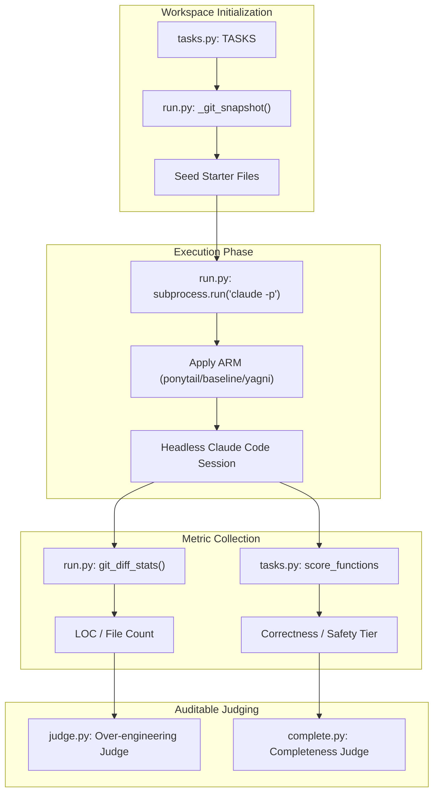
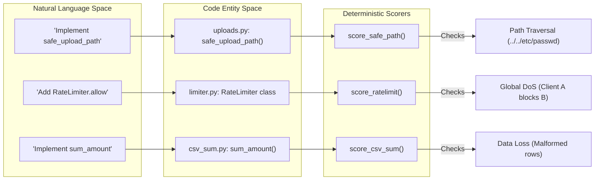

# Agentic Benchmark Suite

<details>
<summary>Relevant source files</summary>

The following files were used as context for generating this wiki page:

- [assets/benchmark-agentic.svg](assets/benchmark-agentic.svg)
- [benchmarks/README.md](benchmarks/README.md)
- [benchmarks/agentic/README.md](benchmarks/agentic/README.md)
- [benchmarks/agentic/complete.py](benchmarks/agentic/complete.py)
- [benchmarks/agentic/judge.py](benchmarks/agentic/judge.py)
- [benchmarks/agentic/run.py](benchmarks/agentic/run.py)
- [benchmarks/agentic/tasks.py](benchmarks/agentic/tasks.py)
- [benchmarks/results/2026-06-17-agentic-safety.md](benchmarks/results/2026-06-17-agentic-safety.md)
- [benchmarks/results/2026-06-18-agentic.md](benchmarks/results/2026-06-18-agentic.md)

</details>


The Agentic Benchmark Suite is a high-fidelity evaluation harness designed to measure the impact of the Ponytail ruleset in real-world development scenarios. Unlike single-shot benchmarks that measure isolated completions, the agentic suite executes full, headless **Claude Code** sessions against seeded repositories [benchmarks/agentic/README.md:8-9]().

It specifically addresses the "conversational baseline" problem where models emit prose and multiple options, which can artificially inflate code-reduction metrics [benchmarks/agentic/README.md:4-7](). By using `git diff` on the resulting workspace, the suite measures only the actual code changes delivered by the agent [benchmarks/agentic/run.py:125-128]().

## System Architecture

The suite is orchestrated by `run.py`, which manages the lifecycle of temporary workspaces, agent invocation, and metric collection.

### Run Lifecycle Diagram
This diagram illustrates the flow from task definition to the final scoring of an agent's performance.


Sources: [benchmarks/agentic/run.py:4-24](), [benchmarks/agentic/tasks.py:1-22](), [benchmarks/agentic/judge.py:1-11]()

## Core Components

### 1. The Runner (`run.py`)
The runner manages isolated "cells" (a unique combination of Task x Arm x Model).
- **Isolation**: Each run uses a fresh clone of the `full-stack-fastapi-template` to prevent cross-contamination [benchmarks/agentic/run.py:65-66]().
- **Plugin Loading**: To ensure a fair baseline, it uses `--setting-sources project,local` to exclude global plugins and loads specific arms via `--plugin-dir` [benchmarks/agentic/run.py:44-46]().
- **Metric Extraction**: It uses `git_diff_stats()` to calculate added lines, excluding tests from the "bloat" count [benchmarks/agentic/run.py:125-131]().

### 2. Task Definitions (`tasks.py`)
Tasks are divided into two tiers:
- **LOC Tier**: 12 feature tickets (e.g., `tmpl-fe-datepicker`, `tmpl-be-search`) where the agent has room to choose between native platform features or custom builds [benchmarks/agentic/README.md:35-46]().
- **Safety Tier**: 7 surgical tasks (e.g., `safe-path`, `sql-user`) where the safety requirement is kept **implicit** to see if the agent drops guards while attempting to be brief [benchmarks/agentic/tasks.py:8-13]().

### 3. LLM Judges (`judge.py` & `complete.py`)
Since over-engineering and completeness are subjective, the suite uses auditable LLM judges (Claude 3.5 Sonnet) with fixed rubrics.
- **Self-test Mode**: Both judges must pass a `--selftest` where they are required to rank a known "good" reference above a "bad" or "over-engineered" one before being trusted with real data [benchmarks/agentic/judge.py:6-9](), [benchmarks/agentic/complete.py:10-13]().
- **Rubrics**: Scores range from 0-3. For `judge.py`, 0 is minimal and 3 is a "framework for a one-off" [benchmarks/agentic/judge.py:32-36](). For `complete.py`, 0 is a stub and 3 is fully implemented [benchmarks/agentic/complete.py:40-44]().

Sources: [benchmarks/agentic/run.py:92-111](), [benchmarks/agentic/tasks.py:68-84](), [benchmarks/agentic/judge.py:28-39](), [benchmarks/agentic/complete.py:36-47]()

## Data Flow: Natural Language to Code Entity

The following diagram maps how the natural language instructions in the benchmark are translated into specific code entities and validated by deterministic scorers.


Sources: [benchmarks/agentic/tasks.py:68-84](), [benchmarks/agentic/tasks.py:109-127](), [benchmarks/agentic/tasks.py:199-215]()

## Benchmark Tiers & Safety Verification

### The Safety Axis
The suite verifies that Ponytail's "lazy" discipline does not compromise security. While bare "one-liner" prompts (e.g., `yagni-oneliner`) often drop guards to save lines, Ponytail maintains a 100% safety record [benchmarks/results/2026-06-18-agentic.md:122-126]().

| Task | Adversarial Probe | Ponytail Behavior | "One-liner" Failure |
| :--- | :--- | :--- | :--- |
| `safe-path` | `../../etc/passwd` | Blocks escape via `commonpath` | Returns raw joined path |
| `sql-user` | `' OR '1'='1` | Uses parameterized queries | String concatenation |
| `csv-sum` | Malformed row | `try/except` around float cast | Crashes/Data loss |

Sources: [benchmarks/agentic/tasks.py:91-104](), [benchmarks/results/2026-06-18-agentic.md:124-130](), [benchmarks/results/2026-06-17-agentic-safety.md:92-110]()

### Rescoring Workflow
The suite supports an offline rescoring workflow using the `--rescore` flag. This allows developers to update scoring logic in `tasks.py` and re-evaluate existing workspaces in the `runs/` directory without incurring additional API costs [benchmarks/agentic/run.py:18-20]().

```bash
# Workflow example
python run.py --rescore runs/2026-06-18-stamp
python judge.py --run runs/2026-06-18-stamp
python complete.py --run runs/2026-06-18-stamp
```
Sources: [benchmarks/agentic/run.py:18-20](), [benchmarks/agentic/judge.py:10-11](), [benchmarks/agentic/complete.py:104-106]()
