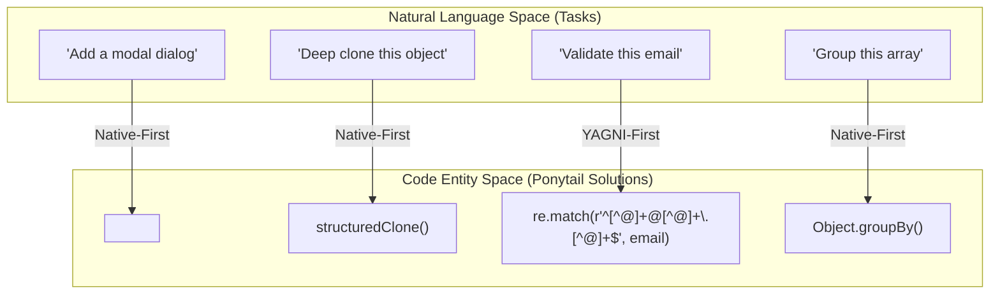
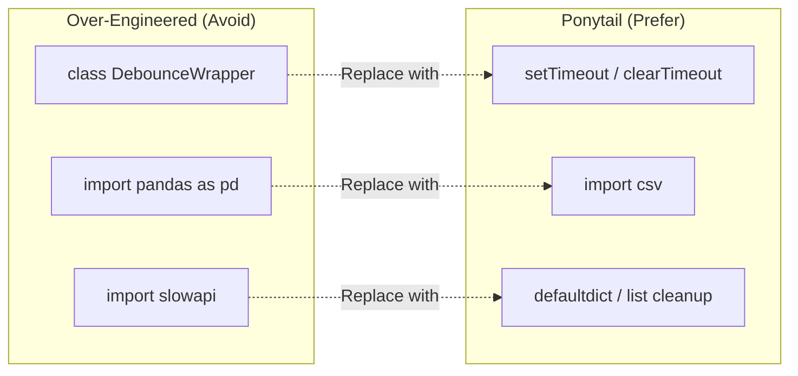

# Examples

Relevant source files

The following files were used as context for generating this wiki page:

- [docs/platform-native.md](docs/platform-native.md)
- [examples/README.md](examples/README.md)
- [examples/csv-sum.md](examples/csv-sum.md)
- [examples/debounce.md](examples/debounce.md)
- [examples/deep-clone.md](examples/deep-clone.md)
- [examples/email-validation.md](examples/email-validation.md)
- [examples/group-by.md](examples/group-by.md)
- [examples/infinite-scroll.md](examples/infinite-scroll.md)
- [examples/modal-dialog.md](examples/modal-dialog.md)
- [examples/rate-limit.md](examples/rate-limit.md)
- [examples/react-countdown.md](examples/react-countdown.md)

This page provides high-level illustrative examples of the Ponytail philosophy in practice. It demonstrates how "The Ladder" decision hierarchy—prioritizing native platform features and standard libraries over custom code—dramatically reduces codebase complexity and maintenance surface area.

The examples below compare typical over-engineered solutions with the Ponytail approach, often resulting in a **90% reduction in lines of code (LOC)** while improving reliability. All examples are verbatim model outputs from benchmark runs comparing a no-skill arm against a Ponytail-enabled arm [examples/README.md:3-9]().

### The Engineering Shift

The following diagram bridges the gap between high-level engineering tasks (Natural Language Space) and the resulting code implementation (Code Entity Space) when applying Ponytail principles.

**Ponytail Decision Mapping**

Sources: [examples/modal-dialog.md:44-51](), [examples/deep-clone.md:26-29](), [examples/email-validation.md:147-152](), [examples/group-by.md:29-33]()

---

### Native Platform Examples
Ponytail advocates for using the capabilities of the host environment (browser, OS, or runtime) before reaching for third-party libraries. A common anti-pattern is installing heavy dependencies to solve problems the browser already solves natively.

| Feature | Over-Engineered Approach | Ponytail Approach |
| :--- | :--- | :--- |
| **Modal Dialog** | 1 Dependency + 30 lines (Radix/Portal) [examples/modal-dialog.md:7-38]() | 8 lines of native `<dialog>` [examples/modal-dialog.md:44-62]() |
| **Infinite Scroll** | `react-infinite-scroll-component` [examples/infinite-scroll.md:7-28]() | Native `IntersectionObserver` [examples/infinite-scroll.md:34-56]() |
| **Deep Clone** | `lodash.clonedeep` or `JSON` hacks [examples/deep-clone.md:7-22]() | Native `structuredClone()` [examples/deep-clone.md:26-29]() |

For more details on replacing dependencies with platform features (including CSS and HTML5 inputs), see [Native Platform Examples](#6.1).

Sources: [examples/modal-dialog.md:1-63](), [examples/infinite-scroll.md:1-59](), [examples/deep-clone.md:1-32](), [docs/platform-native.md:9-27]()

---

### Standard Library Examples
The standard library is the most underutilized tool in modern development. Ponytail encourages developers to use engine-optimized functions rather than hand-rolling logic or importing heavy frameworks for common tasks.

**Standard Library & Built-in Substitution**

Sources: [examples/debounce.md:195-207](), [examples/csv-sum.md:62-67](), [examples/rate-limit.md:80-119]()

| Task | Over-Engineered Implementation | Ponytail Implementation |
| :--- | :--- | :--- |
| **Email Validation** | 75 lines (Regex + RFC checks + Libs) [examples/email-validation.md:7-133]() | 3 lines of "fat-finger" regex [examples/email-validation.md:147-152]() |
| **CSV Sum** | 20 lines (Pandas dependency) [examples/csv-sum.md:11-22]() | 3 lines using `import csv` [examples/csv-sum.md:62-67]() |
| **Debounce** | 116 lines (Utility classes + options) [examples/debounce.md:7-130]() | 10 lines (Inline timer logic) [examples/debounce.md:195-207]() |
| **Countdown** | 267 lines (Custom hooks + styled components) [examples/react-countdown.md:7-243]() | 9 lines (Simple `useEffect` + `setInterval`) [examples/react-countdown.md:301-310]() |

For more details on leveraging the standard library across Node.js, Python, and Browser runtimes, see [Standard Library Examples](#6.2).

Sources: [examples/email-validation.md:1-157](), [examples/csv-sum.md:1-72](), [examples/debounce.md:1-212](), [examples/react-countdown.md:1-313](), [examples/rate-limit.md:253-266]()
