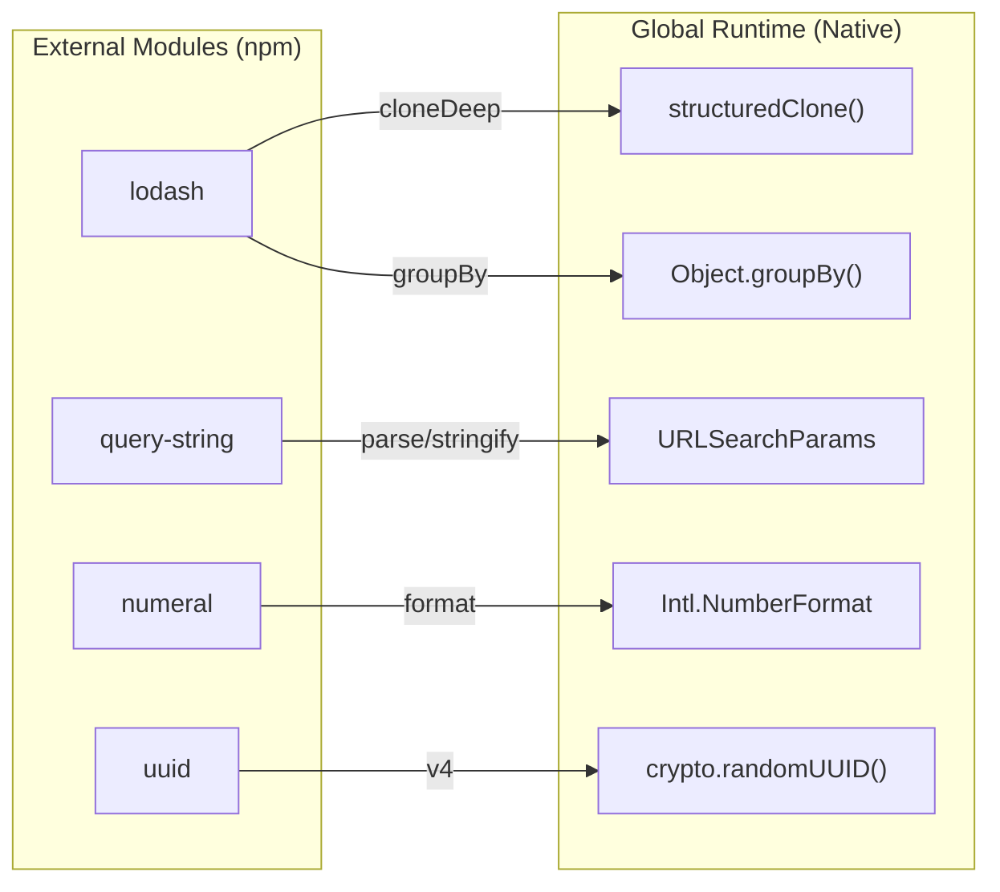

# Native Platform Examples

<details>
<summary>Relevant source files</summary>

The following files were used as context for generating this wiki page:

- [docs/platform-native.md](docs/platform-native.md)
- [examples/deep-clone.md](examples/deep-clone.md)
- [examples/group-by.md](examples/group-by.md)
- [examples/infinite-scroll.md](examples/infinite-scroll.md)
- [examples/modal-dialog.md](examples/modal-dialog.md)
- [examples/number-formatting.md](examples/number-formatting.md)
- [examples/url-params.md](examples/url-params.md)

</details>


This page provides technical examples of the Ponytail philosophy in practice, specifically focusing on replacing external dependencies and custom implementations with native browser and platform features. By prioritizing the "Native" level of **The Ladder** (Ponytail's decision hierarchy), developers can eliminate maintenance overhead, reduce bundle sizes, and leverage accessibility features built directly into the platform.

## The Native-First Pattern

The core principle demonstrated here is that the browser is a feature-rich environment. Ponytail instructs agents to favor native elements and APIs over third-party libraries unless specific, non-standard requirements exist [docs/platform-native.md:3-6]().

### Example 1: Infinite Scroll (IntersectionObserver)

A common over-engineering pattern involves importing a specialized library like `react-infinite-scroll-component` to handle scroll detection. This introduces a dependency to watch scroll position and fire callbacks, often leading to jank if not throttled correctly [examples/infinite-scroll.md:7-30]().

#### Ponytail Implementation
Following the Ponytail philosophy, the developer uses `IntersectionObserver`. It fires only when a "sentinel" element enters the viewport, requiring no scroll event listeners or manual throttling [examples/infinite-scroll.md:35-58]().

```jsx
// ponytail: IntersectionObserver does this, no scroll listener needed
export function Feed({ items, fetchMore, hasMore }) {
  const sentinel = useRef(null);

  useEffect(() => {
    const observer = new IntersectionObserver(([entry]) => {
      if (entry.isIntersecting && hasMore) fetchMore();
    });
    if (sentinel.current) observer.observe(sentinel.current);
    return () => observer.disconnect();
  }, [hasMore, fetchMore]);

  return (
    <>
      {items.map(item => <Card key={item.id} item={item} />)}
      <div ref={sentinel} />
    </>
  );
}
```

**Impact:**
- **Reduction:** 1 dependency → 0 dependencies [examples/infinite-scroll.md:58-58]().
- **Performance:** Offloads visibility detection to the browser engine's optimized internal loop.

Sources: [examples/infinite-scroll.md:1-58]()

---

### Example 2: Modal Dialog (<dialog> element)

Libraries like `@radix-ui/react-dialog` or `react-modal` are frequently used to manage portals, overlays, and focus trapping for simple confirmation boxes [examples/modal-dialog.md:7-40]().

#### Ponytail Implementation
The native `<dialog>` element provides built-in focus trapping, backdrop rendering via `::backdrop`, and automatic closing on the `Escape` key [examples/modal-dialog.md:45-62]().

```html
<!-- ponytail: browser has one, with focus trapping and backdrop built in -->
<dialog id="confirm-delete">
  <p>This action cannot be undone.</p>
  <button id="cancel">Cancel</button>
  <button id="confirm">Delete</button>
</dialog>
```

```js
const dialog = document.getElementById("confirm-delete");
dialog.showModal(); // Native method to open as modal
```

**Impact:**
- **Reduction:** 1 dependency + 30 lines → 0 dependencies + 8 lines [examples/modal-dialog.md:62-62]().
- **Accessibility:** Native focus management is accessible by default [examples/modal-dialog.md:62-62]().

Sources: [examples/modal-dialog.md:1-63]()

---

## Native API Data Flow

The following diagram illustrates how Ponytail shifts the responsibility of UI state and interaction from the Application Layer (JavaScript) to the Platform Layer (Browser/OS).

### Logic Displacement Diagram: Native UI Components

```mermaid
graph TD
    subgraph "Application Space (Over-engineered)"
        A["External Library (Radix/Flatpickr)"] -- "manages" --> B["Custom DOM Tree"]
        C["JS Event Listeners"] -- "throttle/debounce" --> A
        D["Portal/Overlay Logic"] -- "mounts" --> A
    end

    subgraph "Native Platform Space (Ponytail)"
        E["<dialog> / <input type='date'>"] -- "Browser Engine" --> F["Shadow DOM / OS UI"]
        G["Built-in Accessibility"] -- "Focus Trapping" --> E
        H["CSS ::backdrop"] -- "Styling" --> E
    end

    style E stroke-width:4px
    style F stroke-width:4px
```



Sources: [examples/modal-dialog.md:42-63](), [docs/platform-native.md:9-27]()

---

## JavaScript & Runtime Built-ins

Ponytail identifies modern JS APIs that replace legacy utility libraries like `lodash` or `query-string`.

### Deep Clone & Grouping
Instead of `lodash.clonedeep` or `lodash.groupby`, Ponytail uses the global `structuredClone` and `Object.groupBy` [docs/platform-native.md:61-62]().

| Task | Without Ponytail (Library) | With Ponytail (Native) |
| :--- | :--- | :--- |
| **Deep Clone** | `import { cloneDeep } from "lodash"` | `structuredClone(obj)` |
| **Group By** | `import { groupBy } from "lodash"` | `Object.groupBy(arr, fn)` |
| **URL Params** | `import qs from "query-string"` | `new URLSearchParams(query)` |
| **UUID** | `import { v4 } from "uuid"` | `crypto.randomUUID()` |

Sources: [examples/deep-clone.md:12-28](), [examples/group-by.md:12-31](), [examples/url-params.md:13-35](), [docs/platform-native.md:69-69]()

### Formatting & Internationalization
The `Intl` object replaces libraries like `numeral` or `accounting` for locale-aware formatting [examples/number-formatting.md:7-35]().

```js
// ponytail: Intl.NumberFormat does this, locale-aware
new Intl.NumberFormat("en-US", { style: "currency", currency: "USD" }).format(1234.56);
// → "$1,234.56"
```

Sources: [examples/number-formatting.md:21-38](), [docs/platform-native.md:64-67]()

---

## Entity Mapping: Utility Library vs. Platform

This diagram maps how specific utility functions are redirected from third-party modules to the global runtime namespace.

### Entity Mapping: Utility Migration



Sources: [docs/platform-native.md:58-78](), [examples/deep-clone.md:27-28](), [examples/url-params.md:27-38]()

## Key Takeaways

1.  **Dependency Avoidance:** If the platform (Browser, Node.js, Python Framework) has a built-in way to solve the problem, that is the "Native" solution and should be preferred over libraries [docs/platform-native.md:3-6]().
2.  **Modern Standards:** Many libraries (like `query-string`) were polyfills for APIs that have now shipped everywhere for years [examples/url-params.md:41-42]().
3.  **Self-Documenting Minimalism:** Use the `ponytail:` comment prefix to explain *why* a simpler native approach was chosen (e.g., `// ponytail: structuredClone does this`) [examples/deep-clone.md:27-27]().

Sources: [examples/infinite-scroll.md:35](), [examples/modal-dialog.md:45](), [examples/group-by.md:30]()
