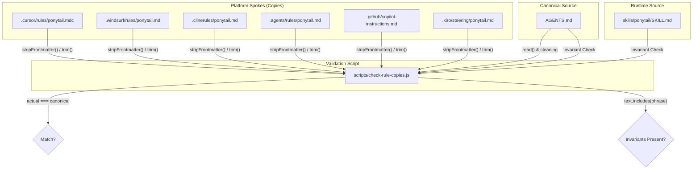
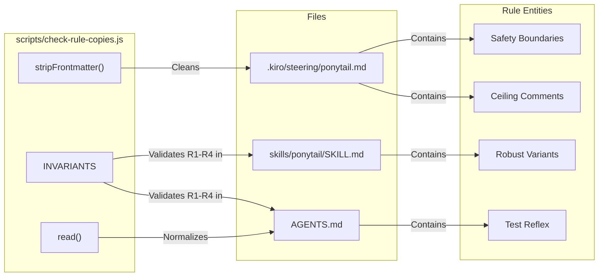

# Rule Synchronization (check-rule-copies.js)

Relevant source files

The following files were used as context for generating this wiki page:

- [.agents/rules/ponytail.md](.agents/rules/ponytail.md)
- [.kiro/steering/ponytail.md](.kiro/steering/ponytail.md)
- [AGENTS.md](AGENTS.md)
- [benchmarks/behavior.js](benchmarks/behavior.js)
- [benchmarks/behavior.yaml](benchmarks/behavior.yaml)
- [scripts/check-rule-copies.js](scripts/check-rule-copies.js)

The Ponytail project distributes its core ruleset across multiple AI agent platforms. To ensure consistency without manual overhead, the repository uses a hub-and-spoke distribution model. The `scripts/check-rule-copies.js` script acts as the enforcement mechanism, verifying that platform-specific rule files remain synchronized with the canonical source and that core safety invariants are preserved in the runtime skill definitions.

## Hub-and-Spoke Distribution Model

Ponytail maintains a single source of truth for its ruleset to prevent "instruction drift" across the various supported environments.

*   **Canonical Source**: `AGENTS.md` is the master document containing the full text of the "lazy senior dev" ruleset [AGENTS.md:1-27]().
*   **Platform Spokes (Compact Copies)**: Six platform-specific files reside in various hidden directories to be automatically picked up by those agents. These include Cursor, Windsurf, Cline, generic agents, GitHub Copilot, and Kiro [scripts/check-rule-copies.js:19-26]().
*   **Runtime Source**: `skills/ponytail/SKILL.md` contains the instructions used by the dynamic plugin/extension hooks. It is longer than the compact copies because it includes additional metadata and formatting for the internal skill system [scripts/check-rule-copies.js:38-42]().

### Rule Synchronization Flow
The following diagram illustrates how `check-rule-copies.js` validates the relationship between the canonical source, the platform-specific spokes, and the runtime skill file.

**Rule Verification Data Flow**

Sources: [scripts/check-rule-copies.js:5-26](), [scripts/check-rule-copies.js:30-36](), [scripts/check-rule-copies.js:58-67]()

## The check-rule-copies.js Implementation

The synchronization script uses two primary strategies: strict byte-comparison for platform copies and invariant verification for the runtime skill file.

### Normalization and Comparison
Because different platforms require different metadata formats (like YAML frontmatter), the script uses a `normalize` function mapping for each file [scripts/check-rule-copies.js:19-26]().

1.  **Frontmatter Stripping**: For platforms like Cursor and Kiro, the script uses `stripFrontmatter` to remove YAML blocks (delimited by `---`) before comparison [scripts/check-rule-copies.js:11-13]().
2.  **Line Ending Normalization**: The `read()` function processes files to use `\n` line endings and trims whitespace to ensure cross-platform consistency [scripts/check-rule-copies.js:7-9]().
3.  **Canonical Cleaning**: The script removes the self-referential footer `(Yes, this file also applies...)` from `AGENTS.md` before using it as the comparison base [scripts/check-rule-copies.js:15-16]().

### Load-Bearing Invariants
The runtime file `skills/ponytail/SKILL.md` is significantly longer than the compact body and cannot be byte-compared [scripts/check-rule-copies.js:38-41](). Instead, the script verifies the presence of an `INVARIANTS` array containing phrases that represent the core logic and safety boundaries of the Ponytail philosophy [scripts/check-rule-copies.js:43-56]().

| Invariant Phrase | Rule/Boundary it protects |
| :--- | :--- |
| `naive heuristic` | The ceiling-comment rule for intentional simplifications [scripts/check-rule-copies.js:44]() |
| `ONE runnable check` | The test reflex rule for non-trivial logic [scripts/check-rule-copies.js:45]() |
| `flimsier algorithm` | The robust-variant rule (lazy != flimsy) [scripts/check-rule-copies.js:46]() |
| `input validation at trust boundaries` | Safety carve-out for validation [scripts/check-rule-copies.js:51]() |
| `prevents data loss` | Safety carve-out for data integrity [scripts/check-rule-copies.js:52]() |
| `security` | Safety carve-out for security [scripts/check-rule-copies.js:53]() |
| `accessibility` | Safety carve-out for accessibility [scripts/check-rule-copies.js:54]() |
| `Lazy code without its check is unfinished` | The one-check headline rule [scripts/check-rule-copies.js:55]() |

Sources: [scripts/check-rule-copies.js:11-13](), [scripts/check-rule-copies.js:19-26](), [scripts/check-rule-copies.js:43-56](), [scripts/check-rule-copies.js:58-67]()

## Technical Logic Mapping

The following diagram maps the logical verification steps in `check-rule-copies.js` to the physical files and the rules they contain.

**Code-to-Rule Mapping**

Sources: [scripts/check-rule-copies.js:11-13](), [scripts/check-rule-copies.js:43-56](), [.kiro/steering/ponytail.md:21-29](), [AGENTS.md:21-24]()

## Execution and Failure Handling

The script is intended to run in CI or as a pre-commit check to ensure no rule drift occurs during maintenance.

*   **Drift Detection**: If `actual !== canonical` for any platform copy, the script logs an error naming the drifted file [scripts/check-rule-copies.js:32-35]().
*   **Invariant Verification**: The script iterates through `INVARIANTS` and checks both `SKILL.md` and `AGENTS.md` [scripts/check-rule-copies.js:60-67]().
*   **Exit Status**: If any check fails, `failed` is set to true, an error message is printed, and the process exits with code `1` [scripts/check-rule-copies.js:69-72]().

Sources: [scripts/check-rule-copies.js:28-36](), [scripts/check-rule-copies.js:60-72]()
