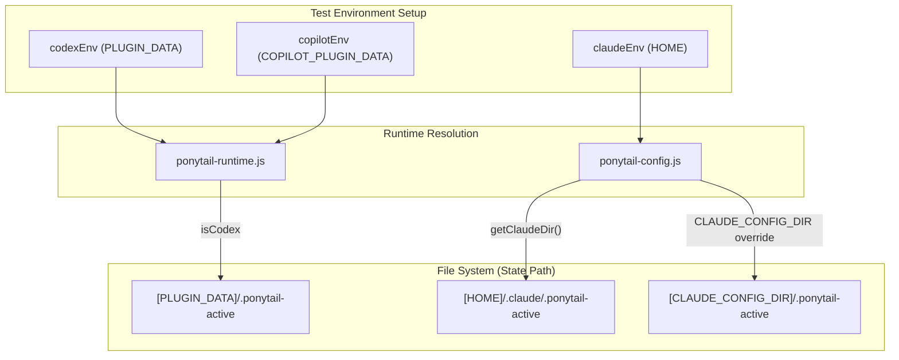

# Hook Tests & CI

<details>
<summary>Relevant source files</summary>

The following files were used as context for generating this wiki page:

- [.agents/plugins/marketplace.json](.agents/plugins/marketplace.json)
- [.github/plugin/marketplace.json](.github/plugin/marketplace.json)
- [.github/workflows/test.yml](.github/workflows/test.yml)
- [benchmarks/correctness.js](benchmarks/correctness.js)
- [hooks/claude-codex-hooks.json](hooks/claude-codex-hooks.json)
- [hooks/copilot-hooks.json](hooks/copilot-hooks.json)
- [hooks/ponytail-config.js](hooks/ponytail-config.js)
- [hooks/ponytail-mode-tracker.js](hooks/ponytail-mode-tracker.js)
- [hooks/ponytail-runtime.js](hooks/ponytail-runtime.js)
- [package.json](package.json)
- [tests/behavior.test.js](tests/behavior.test.js)
- [tests/copilot-plugin.test.js](tests/copilot-plugin.test.js)
- [tests/gemini-extension.test.js](tests/gemini-extension.test.js)
- [tests/hooks-windows.test.js](tests/hooks-windows.test.js)
- [tests/hooks.test.js](tests/hooks.test.js)

</details>


The `tests/hooks.test.js` suite provides automated verification for the lifecycle hooks used by the Claude Code, Codex, and Copilot integrations. It ensures that state persistence, mode transitions, and JSON I/O remain consistent across different runtime environments.

## Overview of the Test Suite

The test suite is a standalone Node.js script that uses the native `assert` and `child_process` modules to execute the hook scripts in isolated environments. It focuses on simulating the host environment by mocking environment variables and file system structures.

### Key Coverage Areas
- **Activation Lifecycle**: Verifies that `ponytail-activate.js` correctly initializes the state file and outputs the expected system messages [tests/hooks.test.js:50-59]().
- **Mode Tracking**: Ensures `ponytail-mode-tracker.js` parses user prompts (e.g., `@ponytail lite`) and updates the persistent state [tests/hooks.test.js:60-69]().
- **Deactivation Logic**: Validates that "normal mode" triggers deactivation and removes the state file [tests/hooks.test.js:70-79]().
- **Environment Detection**: Confirms the hooks correctly switch between Claude-style paths (`~/.claude/`), Codex-style paths (`PLUGIN_DATA`), and Copilot paths (`COPILOT_PLUGIN_DATA`) [tests/hooks.test.js:97-109](), [tests/hooks.test.js:132-147]().
- **Shell Safety**: Validates the `isShellSafe` utility to prevent shell injection when embedding paths in statusline scripts [tests/hooks.test.js:14-19]().

**Sources:**
- [tests/hooks.test.js:1-171]()
- [hooks/ponytail-config.js:50-52]()

---

## The `run()` Helper Pattern

The test suite utilizes a centralized `run()` helper to execute hook scripts. This ensures that every test case runs in a clean process with controlled environment variables and standard input.

### Execution Flow
1. **Process Spawning**: Uses `spawnSync` to invoke the Node.js executable on a specific script in the `hooks/` directory [tests/hooks.test.js:21-22]().
2. **Environment Injection**: Merges the current `process.env` with test-specific overrides (like `HOME`, `PLUGIN_DATA`, or `CLAUDE_CONFIG_DIR`) [tests/hooks.test.js:23]().
3. **I/O Handling**: Passes a JSON string to `stdin` (simulating the host's payload) and captures `stdout` and `stderr` for assertions [tests/hooks.test.js:24-26]().

### Diagram: run() Helper Execution
This diagram illustrates how the `run()` helper bridges the test script to the hook implementation.

"Natural Language Space" | "Code Entity Space"
--- | ---
"Test Script" | `tests/hooks.test.js`
"Execution Helper" | `run(script, env, input)`
"System Call" | `spawnSync(process.execPath, ...)`
"Hook Implementation" | `hooks/ponytail-activate.js` or `hooks/ponytail-mode-tracker.js`
"Result Validation" | `assert.equal(result.status, 0)`

**Sources:**
- [tests/hooks.test.js:21-27]()

---

## Environment Mocking and Data Flow

The tests simulate three distinct host environments by manipulating environment variables. This is critical for testing the logic inside `ponytail-runtime.js` and `ponytail-config.js` regarding path resolution.

### Host Detection Logic
The `ponytail-runtime.js` module determines the host based on environment presence:
- **Copilot**: `COPILOT_PLUGIN_DATA` is set [hooks/ponytail-runtime.js:6]().
- **Codex**: `PLUGIN_DATA` is set (and not Copilot) [hooks/ponytail-runtime.js:7]().
- **Claude**: Default fallback using `getClaudeDir()` [hooks/ponytail-runtime.js:9]().

### Diagram: State Persistence Logic
This diagram shows how environment variables determine the file system destination for state data.



**Sources:**
- [hooks/ponytail-runtime.js:5-13]()
- [hooks/ponytail-config.js:71-74]()
- [tests/hooks.test.js:111-130]()

---

## Adapter & Plugin Tests

Beyond the core hooks, the suite includes specific tests for various platform adapters to prevent configuration drift.

### Gemini Extension (`tests/gemini-extension.test.js`)
- **Pinned Versions**: Ensures the manifest version is a pinned semver to prevent supply-chain issues [tests/gemini-extension.test.js:17-24]().
- **Rule Invariants**: Verifies that the file pointed to by `contextFileName` (usually `AGENTS.md`) actually contains the load-bearing Ponytail rules [tests/gemini-extension.test.js:32-38]().
- **Hook Isolation**: Confirms that Gemini does not attempt to auto-load Claude/Codex hooks which use unsupported events [tests/gemini-extension.test.js:85-91]().

### Windows Compatibility (`tests/hooks-windows.test.js`)
- **PowerShell Syntax**: Guards against using `%VAR%` syntax in `commandWindows` entries, enforcing `$env:VAR` which is required for PowerShell execution in Claude Code [tests/hooks-windows.test.js:33-41]().
- **Script Presence**: Verifies that every hook command points to a script that actually exists in the `hooks/` directory [tests/hooks-windows.test.js:43-52]().

### Command Integrity (`tests/commands.test.js` & `tests/copilot-plugin.test.js`)
- **Command Surface**: Ensures that required commands like `ponytail-debt.toml` are present in the `commands/` directory as expected by the Copilot manifest [tests/copilot-plugin.test.js:22-33]().

**Sources:**
- [tests/gemini-extension.test.js:1-91]()
- [tests/hooks-windows.test.js:1-60]()
- [tests/copilot-plugin.test.js:1-34]()

---

## CI Integration

The test suite is integrated into the GitHub Actions workflow to ensure every PR maintains hook compatibility and rule integrity.

### Workflow Steps (`.github/workflows/test.yml`)
1. **Rule Sync Check**: Runs `scripts/check-rule-copies.js` to ensure the ruleset is identical across all adapter files [ .github/workflows/test.yml:25-26]().
2. **Test Execution**: Runs `npm test`, which triggers the Node.js test runner for all `tests/*.test.js` files [package.json:8](), [.github/workflows/test.yml:28-29]().
3. **Correctness Gates**: Executes `benchmarks/correctness.js` (via the agentic suite) to prove that Ponytail's "less code" philosophy does not result in broken functional logic [benchmarks/correctness.js:1-7]().

### Running Locally
```bash
# Run all tests including hooks and extensions
npm test

# Run only the hook tests
node tests/hooks.test.js
```

**Sources:**
- [.github/workflows/test.yml:1-30]()
- [package.json:7-9]()
- [benchmarks/correctness.js:1-12]()
