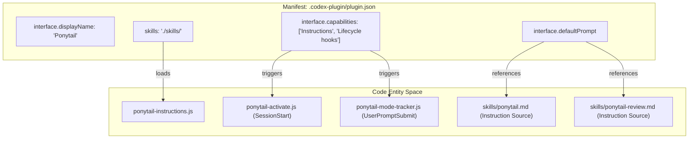
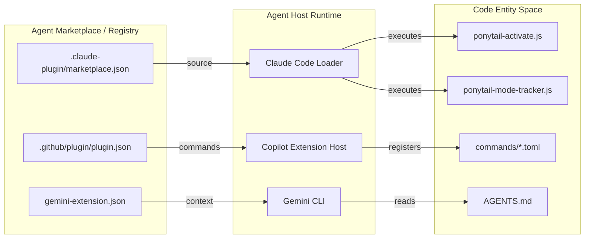

# Marketplace & Plugin Manifests

Relevant source files

The following files were used as context for generating this wiki page:

- [.claude-plugin/marketplace.json](.claude-plugin/marketplace.json)
- [.claude-plugin/plugin.json](.claude-plugin/plugin.json)
- [.codex-plugin/plugin.json](.codex-plugin/plugin.json)
- [.github/plugin/plugin.json](.github/plugin/plugin.json)
- [gemini-extension.json](gemini-extension.json)

This page documents the metadata structures used to register Ponytail across different AI agent marketplaces and plugin ecosystems. Ponytail utilizes multiple manifest files to define its identity, capabilities, and distribution source for various host environments, ensuring that the "Lazy Senior Dev" ruleset is portable across Claude, Copilot, Gemini, and Codex-compatible agents.

## Overview of Manifest Files

Ponytail is distributed as a multi-platform plugin. To ensure consistent behavior and discovery, it maintains several specific manifest files:

| Manifest File | Target Environment | Primary Role |
|:---|:---|:---|
| `.claude-plugin/plugin.json` | Claude Code | Core plugin definition for Claude Code, including hook registration. |
| `.claude-plugin/marketplace.json` | Claude Code Marketplace | Registration in the Anthropic marketplace ecosystem. |
| `.codex-plugin/plugin.json` | Codex / Pi Agent | Deep metadata including skills, hooks, and UI branding. |
| `.github/plugin/plugin.json` | GitHub Copilot | Integration for Copilot Extensions, defining commands and hooks. |
| `gemini-extension.json` | Gemini CLI / Extension | Simplified manifest for Gemini-based environments. |

---

## Claude Code & Marketplace Manifests

Ponytail uses two files within the `.claude-plugin/` directory to manage its presence in the Claude Code ecosystem.

### Plugin Definition
The `.claude-plugin/plugin.json` file defines the plugin version and points to the lifecycle hooks configuration.
- **`version`**: Current version is `4.7.0` [.claude-plugin/plugin.json:3-3]().
- **`hooks`**: Points to `./hooks/claude-codex-hooks.json` to register the `SessionStart` and `UserPromptSubmit` logic [.claude-plugin/plugin.json:9-9]().

### Marketplace Registration
The manifest located at `.claude-plugin/marketplace.json` adheres to the Anthropic Claude Code schema. It defines the plugin's high-level metadata and points to the local directory as the source.
- **`$schema`**: Points to the official Anthropic marketplace schema for validation [.claude-plugin/marketplace.json:2-2]().
- **`owner`**: Attributes the plugin to the developer and links to the GitHub profile [.claude-plugin/marketplace.json:5-8]().
- **`plugins`**: An array containing the plugin definition. For Ponytail, the `source` is set to `./`, indicating that the plugin assets reside within the root of the repository [.claude-plugin/marketplace.json:9-16]().

**Sources:**
- [.claude-plugin/plugin.json:1-10]()
- [.claude-plugin/marketplace.json:1-17]()

---

## Codex & Pi Agent Plugin Manifest

The `.codex-plugin/plugin.json` file is the most detailed manifest in the repository. It provides the configuration for agents that support advanced lifecycle hooks and rich UI elements.

### Technical Specifications
- **Metadata**: Defines version `4.7.0` and keywords such as `yagni`, `minimalism`, and `code-review` [.codex-plugin/plugin.json:3-12]().
- **Capabilities**: Explicitly declares support for `Instructions` and `Lifecycle hooks` [.codex-plugin/plugin.json:21-21]().
- **Skills**: Points to the `./skills/` directory for instruction sets [.codex-plugin/plugin.json:13-13]().
- **Hooks**: Shares the same `./hooks/claude-codex-hooks.json` used by Claude Code [.codex-plugin/plugin.json:14-14]().
- **Interface & Branding**:
    - **`defaultPrompt`**: Provides suggested starting points for users, such as "Review this diff for over-engineering" [.codex-plugin/plugin.json:23-27]().
    - **Assets**: Defines the `composerIcon` and `logo` using local paths [.codex-plugin/plugin.json:29-30]().

### Manifest-to-Code Mapping (Natural Language to Entity Space)

The following diagram illustrates how the `plugin.json` manifest bridges high-level intent to specific code capabilities and UI components.

**Manifest Entity Mapping**

**Sources:**
- [.codex-plugin/plugin.json:1-32]()
- [.claude-plugin/plugin.json:1-10]()

---

## GitHub Copilot & Gemini Manifests

Ponytail extends its reach to Copilot and Gemini through dedicated manifests that map commands and context files.

### GitHub Copilot Extension
The manifest at `.github/plugin/plugin.json` configures the plugin for the GitHub ecosystem.
- **`commands`**: Points to the `commands/` directory where TOML definitions reside [.github/plugin/plugin.json:13-13]().
- **`hooks`**: Points to `hooks/copilot-hooks.json` for Copilot-specific lifecycle management [.github/plugin/plugin.json:15-15]().

### Gemini Extension
The `gemini-extension.json` file is a minimalist manifest designed for the Gemini CLI or extensions.
- **`contextFileName`**: Specifically points to `AGENTS.md` as the source of truth for ruleset context [.gemini-extension.json:5-5]().

---

## Plugin Registration Flow

This diagram shows how different agent runtimes use their respective manifests to resolve the Ponytail plugin into executable logic and commands.

**Plugin Registration Data Flow**

**Sources:**
- [.claude-plugin/marketplace.json:1-17]()
- [.github/plugin/plugin.json:1-16]()
- [gemini-extension.json:1-6]()
- [.codex-plugin/plugin.json:1-32]()
