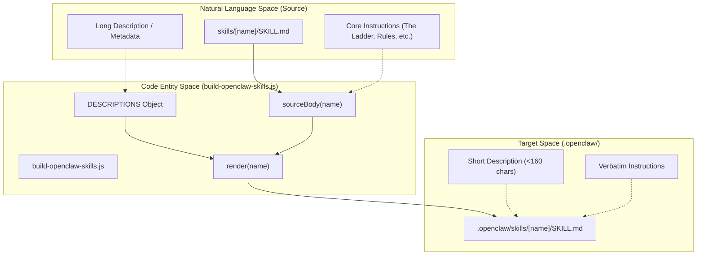
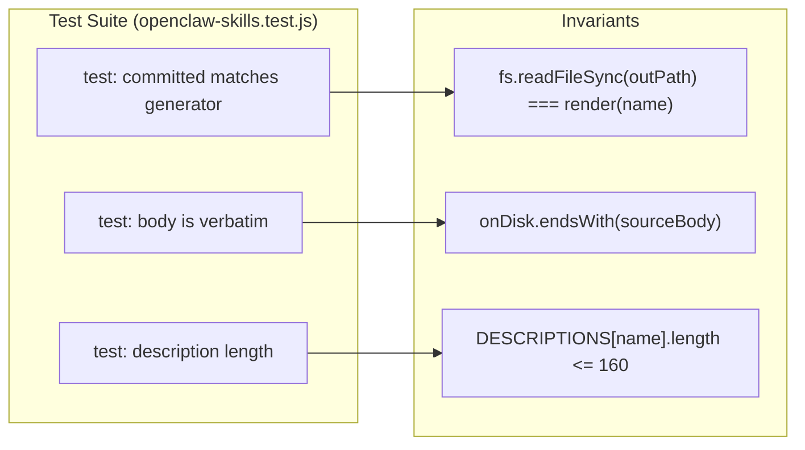

# OpenClaw Skills Build (build-openclaw-skills.js)

Relevant source files

The following files were used as context for generating this wiki page:

- [.openclaw/skills/ponytail-audit/SKILL.md](.openclaw/skills/ponytail-audit/SKILL.md)
- [.openclaw/skills/ponytail-debt/SKILL.md](.openclaw/skills/ponytail-debt/SKILL.md)
- [.openclaw/skills/ponytail-gain/SKILL.md](.openclaw/skills/ponytail-gain/SKILL.md)
- [.openclaw/skills/ponytail-help/SKILL.md](.openclaw/skills/ponytail-help/SKILL.md)
- [.openclaw/skills/ponytail-review/SKILL.md](.openclaw/skills/ponytail-review/SKILL.md)
- [.openclaw/skills/ponytail/SKILL.md](.openclaw/skills/ponytail/SKILL.md)
- [.opencode/command/ponytail-gain.md](.opencode/command/ponytail-gain.md)
- [scripts/build-openclaw-skills.js](scripts/build-openclaw-skills.js)
- [skills/ponytail-gain/SKILL.md](skills/ponytail-gain/SKILL.md)
- [tests/openclaw-skills.test.js](tests/openclaw-skills.test.js)

The OpenClaw platform requires skills to be packaged with specific YAML frontmatter constraints, notably a strict length limit on descriptions. The `build-openclaw-skills.js` script automates the generation of these packages from the canonical source files, ensuring the Ponytail ruleset remains consistent across platforms while satisfying OpenClaw's metadata requirements.

## Overview and Purpose

The OpenClaw skills build system bridges the gap between the high-context skill definitions used by Claude Code/Codex and the metadata-constrained format required by OpenClaw/ClawHub [scripts/build-openclaw-skills.js:2-8]().

Key requirements handled by the build script:
*   **Description Constraints**: OpenClaw descriptions must be a single line, contain no double quotes, and be under 160 characters [scripts/build-openclaw-skills.js:39-41]().
*   **Verbatim Integrity**: The instruction body (the "ruleset") must be copied exactly from the source `skills/` directory to prevent logic drift [scripts/build-openclaw-skills.js:6-8]().
*   **Frontmatter Injection**: Standardized metadata (homepage, license, name) is injected into each `SKILL.md` file [scripts/build-openclaw-skills.js:42-44]().

### Data Flow: Canonical to OpenClaw

The following diagram illustrates how the build script transforms source skill definitions into OpenClaw-compatible packages.

**Skill Transformation Pipeline**

Sources: [scripts/build-openclaw-skills.js:19-51](), [tests/openclaw-skills.test.js:11-26]()

## Implementation Details

### Build Script Logic
The script `build-openclaw-skills.js` defines a hardcoded `DESCRIPTIONS` map containing the truncated descriptions for each skill [scripts/build-openclaw-skills.js:19-26](). 

The `sourceBody` function extracts the content from the source `skills/` directory by stripping the original frontmatter using a regular expression [scripts/build-openclaw-skills.js:30-35](). The `render` function then assembles the new OpenClaw-compatible file [scripts/build-openclaw-skills.js:37-45]().

| Function | Role |
| :--- | :--- |
| `sourceBody(name)` | Reads source `SKILL.md` and strips YAML frontmatter using `replace()` and `match()`. |
| `render(name)` | Validates description length/format and prepends new YAML frontmatter to the body. |
| `outPath(name)` | Determines the destination in `.openclaw/skills/[name]/SKILL.md`. |
| `main` block | Iterates through `NAMES`, creates directories, and writes files to disk. |

Sources: [scripts/build-openclaw-skills.js:30-60]()

### Validation and Guardrails
The build process is protected by `tests/openclaw-skills.test.js`, which ensures that the committed files in `.openclaw/` never drift from the source or the generator's logic [tests/openclaw-skills.test.js:2-4]().

**Validation Logic Association**

Sources: [tests/openclaw-skills.test.js:11-26]()

## OpenClaw Platform Requirements

The generated `SKILL.md` files follow a specific structure required by the OpenClaw environment.

### YAML Frontmatter
OpenClaw requires specific keys in the frontmatter to register the skill correctly in the agent's environment:
*   **name**: The unique identifier for the skill (e.g., `ponytail-audit`) [.openclaw/skills/ponytail-audit/SKILL.md:2]().
*   **description**: A concise summary used by the agent to decide when to invoke the skill [.openclaw/skills/ponytail-audit/SKILL.md:3]().
*   **homepage**: Link to the repository for documentation [.openclaw/skills/ponytail-audit/SKILL.md:4]().
*   **license**: Standard MIT license [.openclaw/skills/ponytail-audit/SKILL.md:5]().

### Instruction Body
The body of the file contains the actual prompts that govern the agent's behavior. For example, in the `ponytail` skill, this includes:
*   **The Ladder**: The decision hierarchy for choosing the simplest solution [.openclaw/skills/ponytail/SKILL.md:20-33]().
*   **Intensity Levels**: Definitions for `lite`, `full`, and `ultra` modes [.openclaw/skills/ponytail/SKILL.md:55-67]().
*   **Boundaries**: Explicit instructions on when the agent should *not* be lazy (e.g., security, data loss) [.openclaw/skills/ponytail/SKILL.md:68-74]().

Sources: [.openclaw/skills/ponytail/SKILL.md:1-93](), [.openclaw/skills/ponytail-audit/SKILL.md:1-38]()
