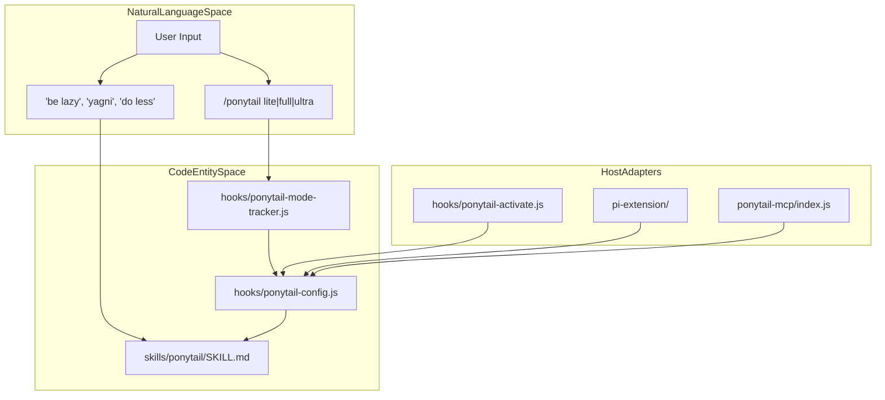
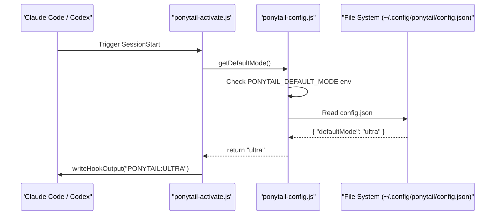

# Glossary

Relevant source files

The following files were used as context for generating this wiki page:

- [.agents/plugins/marketplace.json](.agents/plugins/marketplace.json)
- [.agents/rules/ponytail.md](.agents/rules/ponytail.md)
- [.kiro/steering/ponytail.md](.kiro/steering/ponytail.md)
- [.openclaw/skills/ponytail-audit/SKILL.md](.openclaw/skills/ponytail-audit/SKILL.md)
- [.openclaw/skills/ponytail-review/SKILL.md](.openclaw/skills/ponytail-review/SKILL.md)
- [.openclaw/skills/ponytail/SKILL.md](.openclaw/skills/ponytail/SKILL.md)
- [.opencode/plugins/ponytail.mjs](.opencode/plugins/ponytail.mjs)
- [README.md](README.md)
- [benchmarks/behavior.js](benchmarks/behavior.js)
- [benchmarks/behavior.yaml](benchmarks/behavior.yaml)
- [docs/agent-portability.md](docs/agent-portability.md)
- [hooks/ponytail-config.js](hooks/ponytail-config.js)
- [hooks/ponytail-mode-tracker.js](hooks/ponytail-mode-tracker.js)
- [opencode.json](opencode.json)
- [ponytail-mcp/README.md](ponytail-mcp/README.md)
- [scripts/check-rule-copies.js](scripts/check-rule-copies.js)
- [skills/ponytail-help/SKILL.md](skills/ponytail-help/SKILL.md)
- [skills/ponytail/SKILL.md](skills/ponytail/SKILL.md)
- [tests/hooks.test.js](tests/hooks.test.js)
- [tests/openclaw-skills.test.js](tests/openclaw-skills.test.js)
- [tests/opencode-plugin.test.js](tests/opencode-plugin.test.js)

This page provides definitions for Ponytail-specific terminology, implementation concepts, and the decision-making framework used by the agent. It serves as a reference for engineers onboarding to the codebase to understand how natural language instructions map to system behavior.

## Core Concepts

### The Ladder
The core decision-making hierarchy that the agent must follow before writing any code. It is designed to force the agent toward the most minimal solution by exhausting simpler alternatives first [README.md:82-91]().

| Rung | Logic | Code Entity / Instruction |
| :--- | :--- | :--- |
| **1. YAGNI** | Does this need to exist? | `skip it` [skills/ponytail/SKILL.md:33]() |
| **2. Stdlib** | Standard library does it? | `Use it` [skills/ponytail/SKILL.md:34]() |
| **3. Native** | Native platform feature? | `CSS over JS`, `<input type="date">` [skills/ponytail/SKILL.md:35]() |
| **4. Deps** | Already-installed dependency? | `Never add a new one` [skills/ponytail/SKILL.md:36]() |
| **5. One-line** | Can it be one line? | `One line` [skills/ponytail/SKILL.md:37]() |
| **6. Minimum** | Only then: write code. | `minimum code that works` [skills/ponytail/SKILL.md:38]() |

### Intensity Levels
Ponytail supports three distinct operational modes that determine how aggressively it applies The Ladder [skills/ponytail/SKILL.md:64-70]().

*   **Lite**: Build what is asked but suggest the lazier alternative in a one-line comment [skills/ponytail/SKILL.md:68]().
*   **Full**: The default mode. The Ladder is strictly enforced with the shortest possible diff and explanation [skills/ponytail/SKILL.md:69]().
*   **Ultra**: Extremist YAGNI. The agent is encouraged to delete code before adding it and challenge requirements [skills/ponytail/SKILL.md:70]().

### Ponytail Comment (`ponytail:`)
A mandatory source code comment used to mark deliberate simplifications. This signals to human reviewers that a shortcut was taken by design rather than ignorance [skills/ponytail/SKILL.md:51]().
*   **Ceiling**: If a shortcut has a known limit (e.g., O(n²) complexity), the comment must name that ceiling and the upgrade path [skills/ponytail/SKILL.md:51](), [scripts/check-rule-copies.js:43-44]().

### Test Reflex
A hardening rule requiring that any non-trivial logic (branches, loops, parsers) must leave behind exactly **one** runnable check [skills/ponytail/SKILL.md:88-93]().
*   **Implementation**: Usually an `assert`-based `demo()` function or a small `test_*.py` file [skills/ponytail/SKILL.md:89-91]().
*   **Exception**: Trivial one-liners require no tests [skills/ponytail/SKILL.md:92]().

**Sources:** [README.md](), [skills/ponytail/SKILL.md](), [scripts/check-rule-copies.js]()

---

## Technical Architecture & Code Entities

### Natural Language to Code Mapping
The following diagram bridges user-facing commands and natural language triggers to the underlying Node.js modules and skill definitions.

**Diagram: Interface to Implementation Mapping**

**Sources:** [skills/ponytail/SKILL.md](), [hooks/ponytail-config.js](), [hooks/ponytail-mode-tracker.js](), [ponytail-mcp/README.md]()

### State & Lifecycle Entities

*   **`.ponytail-active`**: A flag file written to `getClaudeDir()` (usually `~/.claude/`) or `PLUGIN_DATA` that persists the current mode across turns [hooks/ponytail-config.js:71-74](), [tests/hooks.test.js:48-52]().
*   **`ponytail-activate.js`**: The SessionStart hook where Ponytail initializes the state file and returns the system message for the session [tests/hooks.test.js:50-58]().
*   **`ponytail-mode-tracker.js`**: The UserPromptSubmit hook that parses user input for mode-switch commands (e.g., `/ponytail lite`) or deactivation phrases [tests/hooks.test.js:60-68]().
*   **`check-rule-copies.js`**: A maintenance script that ensures platform-specific rule files (Cursor, Windsurf, etc.) remain synchronized with the canonical `AGENTS.md` [scripts/check-rule-copies.js:19-26]().

**Diagram: Data Flow for Mode Resolution**

**Sources:** [hooks/ponytail-config.js](), [hooks/ponytail-activate.js](), [tests/hooks.test.js]()

---

## Metric & Benchmark Terms

### LOC / Net-Lines
The primary metric for Ponytail's success. It refers to the lines of code generated compared to a baseline. Ponytail aims for ~54% less code on average [README.md:22-23]().
*   **Net-Lines Metric**: Used specifically in `ponytail-review` and `ponytail-audit` to score potential savings: `net: -<N> lines possible` [.openclaw/skills/ponytail-review/SKILL.md:41]().

### Safety Tier / Trust Boundaries
Ponytail maintains a 100% safety record by exempting critical paths from "lazy" logic [README.md:59-61]().
*   **Exemptions**: Input validation at trust boundaries, error handling preventing data loss, security, and accessibility [skills/ponytail/SKILL.md:79-82]().

### Rule Invariants
Hardcoded substrings in `scripts/check-rule-copies.js` that must exist in both `SKILL.md` and `AGENTS.md`. If a rule is reworded and drifts between these files, the CI fails [scripts/check-rule-copies.js:43-56]().
1.  `naive heuristic` (Ceiling comments)
2.  `ONE runnable check` (Test reflex)
3.  `flimsier algorithm` (Robust variant)
4.  `input validation at trust boundaries` (Security boundary)

**Sources:** [README.md](), [scripts/check-rule-copies.js](), [.openclaw/skills/ponytail-review/SKILL.md]()
