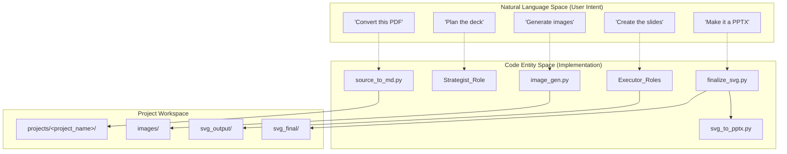
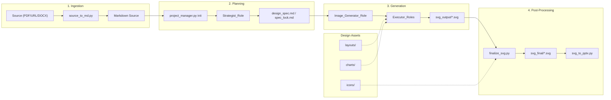

# Overview

Relevant source files

The following files were used as context for generating this wiki page:

- [.claude-plugin/marketplace.json](.claude-plugin/marketplace.json)
- [README.md](README.md)
- [README_CN.md](README_CN.md)
- [docs/project-positioning.md](docs/project-positioning.md)
- [docs/roadmap.md](docs/roadmap.md)
- [docs/what-is-ppt.md](docs/what-is-ppt.md)
- [docs/why-ppt-master.md](docs/why-ppt-master.md)

## Purpose and Scope

This document provides a high-level introduction to the PPT Master system: its definition, problem domain, core architectural components, and primary workflows. PPT Master is an AI-driven presentation generation system that converts source documents (PDF/DOCX/URL/Markdown) into natively editable PPTX with real PowerPoint shapes (DrawingML) through multi-role collaboration [docs/why-ppt-master.md:21-23](). It is designed to bridge the gap between AI-driven reasoning and professional-grade PowerPoint construction [docs/project-positioning.md:27-28]().

## What is PPT Master

PPT Master is an AI-driven multi-format SVG content generation platform. It operates as a "skill" or workflow within AI IDEs (such as Claude Code, Cursor, or VS Code + Copilot), allowing users to generate professional presentations through natural language conversation [.claude-plugin/marketplace.json:15-21]().

Unlike traditional tools that export flat images or basic text boxes, PPT Master produces **natively editable** PowerPoint files where every shape, text box, and chart is a clickable DrawingML object [docs/why-ppt-master.md:23-24](). The system supports a wide range of canvas formats beyond standard slides, including social media ratios (3:4, 1:1, 9:16) and A4 print [docs/why-ppt-master.md:69-72]().

**Sources:** [.claude-plugin/marketplace.json:1-21](), [docs/why-ppt-master.md:1-24](), [README.md:1-11](), [docs/project-positioning.md:13-25]()

## Problem Domain

PPT Master addresses the limitations of existing AI presentation tools:

### 1. The "Image Export" Problem
Most AI tools render slides as flat images or HTML screenshots. PPT Master takes a "fourth path": AI generates SVG, and scripts compile SVG → DrawingML [docs/why-ppt-master.md:15-21](). This works because SVG and DrawingML are both absolute-coordinate 2D vector formats where rectangles, paths, and gradients map one-to-one [docs/why-ppt-master.md:21-22]().

### 2. Logic vs. Layout
A useful deck requires reasoning about the argument before drawing slides [docs/project-positioning.md:27-33](). PPT Master uses a **Strategist** role to settle the core message, narrative mode, and hierarchy before visual authoring begins [docs/why-ppt-master.md:42-48]().

### 3. Native Depth and Reusability
Programmatic PPTX generators often produce basic, uninspired layouts. PPT Master authors PowerPoint's native object model itself—including slide masters (`p:sldMaster`), layouts (`p:sldLayout`), and native transitions—allowing for a high-quality draft that users can continue refining [docs/why-ppt-master.md:23-30]().

### 4. Data Privacy and Local Execution
PPT Master is 100% local; source documents are converted, SVGs generated, and PPTX exported entirely on the user's machine [docs/why-ppt-master.md:39-43](). It avoids platform lock-in by supporting multiple AI models and providers [docs/project-positioning.md:61-63]().

**Sources:** [docs/why-ppt-master.md:11-53](), [README.md:39-43](), [docs/project-positioning.md:13-39]()

## System Architecture

The system is composed of four main subsystems: AI Roles, Tools, Templates, and the Viewer.

### Natural Language to Code Entity Space

The following diagram bridges the user's conceptual workflow with the specific code entities and scripts that execute them.

**Diagram: "PPT Master Conceptual to Code Mapping"**

**Sources:** [docs/why-ppt-master.md:57-72](), [README.md:39-43](), [docs/roadmap.md:15-16]()

### Core Subsystems and Data Flow

The data flow follows a strict serial pipeline from source ingestion to final export.

**Diagram: "System Architecture and Data Flow"**

**Sources:** [docs/why-ppt-master.md:59-72](), [README.md:39-43](), [docs/roadmap.md:45-49]()

## Core Capabilities

### AI Role System
A collaborative architecture involving specialized roles. The **Strategist** defines the design specification through a two-stage confirmation process [docs/roadmap.md:49](). The **Image_Generator** creates visual assets using a unified prompt structure. **Executor** variants provide distinct design styles, ranging from academic research to consulting-decision [docs/why-ppt-master.md:61]().

### Multi-Format SVG Generation
The system generates SVG content that serves as an intermediate representation. It supports 9+ canvas formats, including standard 16:9, social media ratios (3:4, 1:1), and print formats (A4) [docs/why-ppt-master.md:69-72]().

### SVG Post-Processing Pipeline
The `finalize_svg.py` tool executes a multi-step transformation including embedding icons, smart cropping images, fixing aspect ratios, and converting assets to Base64 for self-contained portability [docs/why-ppt-master.md:27-28]().

### PowerPoint Compatibility
The system maintains high fidelity by mapping SVG elements to native DrawingML. In the exported PPTX, every shape, text box, gradient, and shadow is a native PowerPoint object. It also supports native data-backed charts and tables via the `--native-charts-and-tables` opt-in [docs/roadmap.md:49]().

**Sources:** [docs/why-ppt-master.md:11-24](), [docs/why-ppt-master.md:57-72](), [docs/roadmap.md:11-16]()

## Navigation
- **Getting Started**: Setup and first generation.
- **System Architecture**: Deep dive into the four subsystems and deterministic routing.
- **AI Role System**: Detailed role definitions, collaboration protocols, and confirmation UI.
- **Tool Ecosystem**: Documentation for the project management, quality assurance, and SVG processing suites.
- **Template and Design System**: The library of charts, icons, and layouts.
- **Workflows and Usage Guides**: Practical end-to-end tutorials for SVG and direct PPTX paths.
