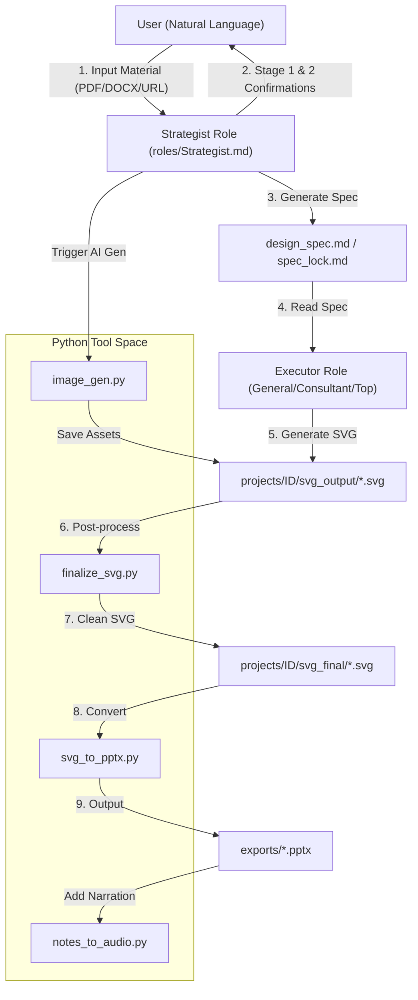
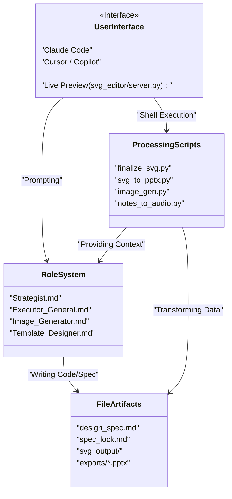

# Getting Started

<details>
<summary>Relevant source files</summary>

The following files were used as context for generating this wiki page:

- [.env.example](.env.example)
- [CONTRIBUTING.md](CONTRIBUTING.md)
- [docs/faq.md](docs/faq.md)
- [docs/getting-started.md](docs/getting-started.md)
- [docs/windows-installation.md](docs/windows-installation.md)

</details>


This page provides technical instructions for setting up the PPT Master repository and generating your first presentation. It covers environment configuration, project initialization, and the AI-driven generation workflow using the system's specialized roles and Python tools.

---

## Prerequisites and Installation

PPT Master requires a Python environment and an AI IDE (agent) capable of reading files and executing shell commands.

### 1. System Requirements
- **Python 3.10+**: The primary requirement for all processing scripts [[docs/windows-installation.md:11-15]](), [[CONTRIBUTING.md:19]]().
- **AI IDE**: Recommended tools include **Claude Code**, **Cursor**, or **VS Code + Copilot** [[docs/getting-started.md:33]](), [[docs/getting-started.md:61]]().
- **Node.js 18+ & Pandoc**: Optional fallbacks for specific document conversion paths [[CONTRIBUTING.md:20]](), [[docs/windows-installation.md:97]]().
- **Office 2016+**: Required to open and edit the generated `.pptx` files containing native DrawingML shapes [[docs/windows-installation.md:85]]().

### 2. Repository Setup
Clone the repository and install the required Python dependencies:

**macOS / Linux / Windows (Git):**
```bash
# Clone the repository
git clone https://github.com/hugohe3/ppt-master.git
cd ppt-master

# Install dependencies
pip install -r requirements.txt
```
**Sources**: [[CONTRIBUTING.md:24-28]](), [[docs/windows-installation.md:41-44]]()

**Windows (Manual):**
1. Download ZIP from [GitHub](https://github.com/hugohe3/ppt-master) and unzip [[docs/windows-installation.md:33-37]]().
2. **⚠️ CRITICAL**: During Python installation, check **"Add python.exe to PATH"** [[docs/windows-installation.md:17]]().
3. Run `pip install -r requirements.txt` in PowerShell [[docs/windows-installation.md:50-53]]().

**Sources**: [[docs/windows-installation.md:11-55]]()

### 3. Environment Configuration
For AI image generation and advanced TTS, configure your API keys in a `.env` file. The system checks for `.env` in the current directory, the repo root, or `~/.ppt-master/.env` [[.env.example:10-14]]().

```bash
cp .env.example .env
```

Edit `.env` to select your `IMAGE_BACKEND` (e.g., `openai`, `gemini`, `qwen`, `zhipu`, `volcengine`) and provide the corresponding provider-specific API keys [[.env.example:21-24]](). Note that `IMAGE_API_KEY` and `IMAGE_MODEL` are no longer supported in favor of provider-specific variables like `OPENAI_API_KEY` [[.env.example:34-39]]().

**Sources**: [[.env.example:1-170]]()

---

## Project Initialization

The system uses `project_manager.py` to handle the project lifecycle. Projects are stored in the `projects/` directory [[docs/getting-started.md:63]]().

### Starting a New Project
Drop your source material (PDF, DOCX, Markdown, or URL) into `projects/` [[docs/getting-started.md:63]](). You can then tell the AI to generate a deck from these sources.

| Workflow | Command/Trigger | Result |
| :--- | :--- | :--- |
| **Free Design** | "Make a deck from projects/sources/ref.pdf" | AI creates new layouts from scratch [[docs/getting-started.md:21]](). |
| **Template Fill** | "Fill this deck with new content: ref.pptx" | patches text/table/chart data directly in OOXML [[docs/getting-started.md:27]](). |
| **Style Replication** | "/create-template projects/brand/deck.pptx" | Creates a Brand, Style, Layout, or Deck workspace [[docs/getting-started.md:28-35]](). |

**Sources**: [[docs/getting-started.md:19-55]]()

---

## The Generation Workflow

The generation process bridges "Natural Language Space" (user requirements) to "Code Entity Space" (SVG/PPTX files) through a structured pipeline.

### Data Flow Diagram
The following diagram illustrates the interaction between the User, AI Roles, and the Python Toolchain.


**Sources**: [[docs/getting-started.md:59-72]](), [[.env.example:5-8]](), [[docs/getting-started.md:172-183]]()

### Step 1: Content Preparation
Provide the AI with your source material. The AI handles content analysis and layout planning [[docs/getting-started.md:63-68]]().

### Step 2: Strategist Confirmation
The **Strategist** role analyzes content and requests confirmation on design specifications (template, format, page count, etc.) [[docs/getting-started.md:49]](). In **Quick Mode**, this stage is skipped [[docs/getting-started.md:77-84]]().

### Step 3: Executor Generation
The **Executor** generates SVG files page-by-page. While generating, a browser preview can be used for visual inspection [[docs/getting-started.md:71]]().

### Step 4: Finalization and Export
The system automatically runs the finalization pipeline to ensure PowerPoint compatibility:
1. **`finalize_svg.py`**: Embeds icons, crops images, and fixes aspect ratios [[docs/getting-started.md:82]]().
2. **`svg_to_pptx.py`**: Converts SVGs to native DrawingML shapes [[docs/getting-started.md:69]](), [[docs/faq.md:78-82]]().

**Sources**: [[docs/getting-started.md:59-72]](), [[docs/faq.md:78-87]]()

---

## Technical Implementation Mapping

This diagram maps the high-level workflow steps to the specific code entities responsible for execution.


**Sources**: [[docs/getting-started.md:1-72]](), [[.env.example:5-8]](), [[docs/windows-installation.md:73-87]]()

---

## Troubleshooting

### Python Not Found (Windows)
Ensure you checked **"Add python.exe to PATH"** during installation [[docs/windows-installation.md:17]](). Verify by running `python --version` in PowerShell [[docs/windows-installation.md:21-23]]().

### ModuleNotFoundError
If scripts fail with missing modules, ensure `pip` is targeting the correct Python instance [[docs/windows-installation.md:139-141]]():
```powershell
python -m pip install -r requirements.txt
```

### Image Generation Issues
If images fail to generate, verify your `IMAGE_BACKEND` in `.env` and ensure the provider-specific API key (e.g., `OPENAI_API_KEY`) is set [[.env.example:21-45]](). If no key is available, the AI can fall back to zero-config web search using `image_search.py` [[docs/faq.md:70-76]]().

**Sources**: [[docs/windows-installation.md:101-150]](), [[docs/faq.md:70-76]]()
