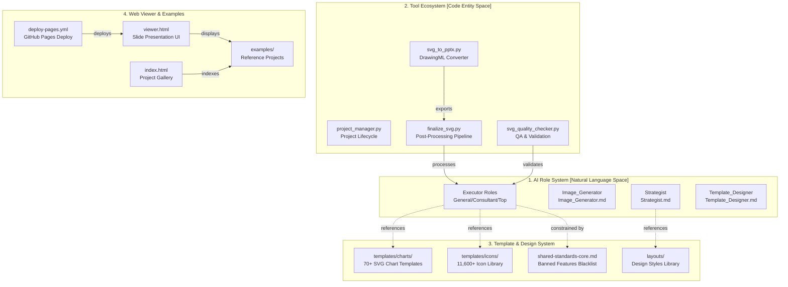
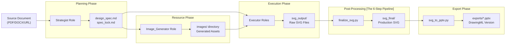
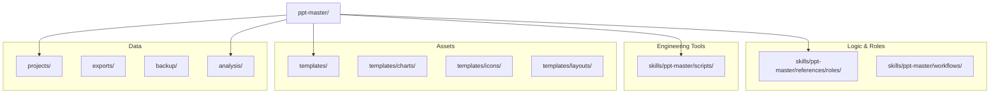
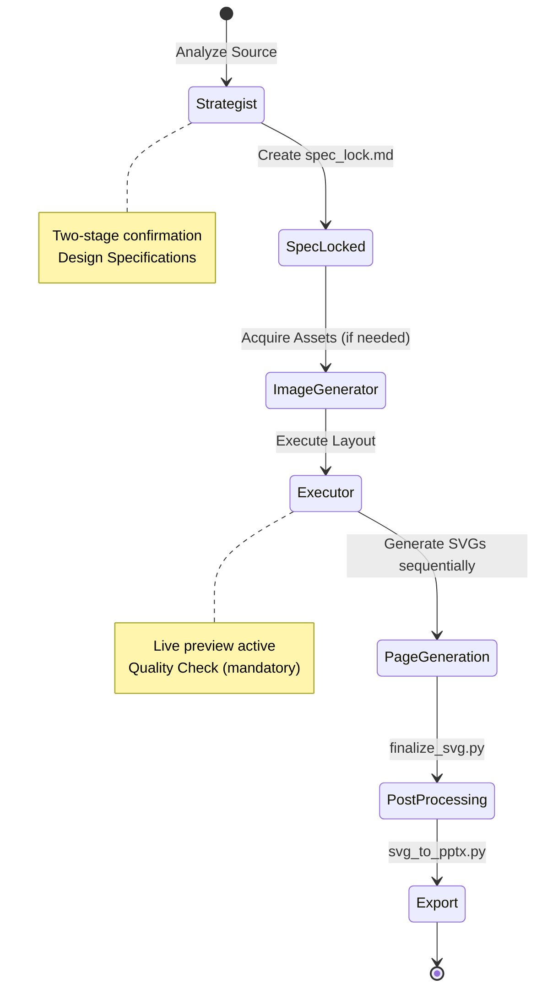

# System Architecture

Relevant source files

The following files were used as context for generating this wiki page:

- [.github/ISSUE_TEMPLATE/bug_report.yml](.github/ISSUE_TEMPLATE/bug_report.yml)
- [.github/MAINTAINER_PLAYBOOK.md](.github/MAINTAINER_PLAYBOOK.md)
- [AGENTS.md](AGENTS.md)
- [CLAUDE.md](CLAUDE.md)
- [docs/technical-design.md](docs/technical-design.md)

## Purpose and Scope

This document provides a comprehensive overview of the PPT Master system architecture, explaining how the four main subsystems work together to transform source documents into high-quality SVG presentations and other visual content formats. It covers the system's structural organization, data flow patterns, and integration mechanisms.

The architecture is designed around a **Design Draft** philosophy: the AI serves as a designer providing a high-quality starting point (90% of the work), while the system provides engineering tools to convert these designs into natively editable PowerPoint (DrawingML) objects [[docs/technical-design.md:7-11]]().

---

## Architectural Overview

PPT Master is structured around four independent but coordinated subsystems that collectively enable AI-driven visual content generation. The system follows a pipeline architecture where each subsystem has a clearly defined responsibility and interface.

### Four Core Subsystems

**Subsystem Characteristics**

| Subsystem | Type | Primary Artifacts | Execution Environment |
|-----------|------|-------------------|----------------------|
| AI Role System | Markdown specifications | Design specs, SVG code | AI chat interfaces (Cursor, Claude Code) |
| Tool Ecosystem | Python scripts | Processed SVG, PPTX files | Local Python 3.x runtime |
| Template & Design System | Static resources | SVG templates, JSON metadata | Referenced during generation |
| Web Viewer & Examples | HTML/JavaScript | Interactive galleries | Browser (GitHub Pages) |

Sources: [[docs/technical-design.md:15-56]](), [[docs/technical-design.md:91-105]](), [[AGENTS.md:22-28]]()

---

## Route Selection and Workflow Dispatch

The system uses a deterministic routing system to select the correct pipeline or standalone workflow for each request type. This ensures that tasks like "optimize this PPT" are routed either to `beautify-pptx` (to preserve page count) or the main SVG pipeline (to rethink the story).

For details, see [Route Selection and Workflow Dispatch](#3.1).

### Route Decision Matrix

| Request Shape | Route | Boundary |
|---------------|-------|----------|
| Topic only, no source file | `topic-research` | Web/source collection pre-pipeline [[AGENTS.md:13]]() |
| Source files/text, restructure allowed | Main SVG pipeline | Strategist redesigns story [[docs/technical-design.md:77]]() |
| PPTX source, 1:1 count/wording | `beautify-pptx` | Content and pagination locked [[AGENTS.md:18]]() |
| Native PPTX template + new material | `template-fill-pptx` | Clone/fill native slides; no SVG [[AGENTS.md:15]]() |
| Existing PPTX + Audio/Notes | `native-enhance-pptx` | Direct OOXML patching [[AGENTS.md:19]]() |

Sources: [[docs/technical-design.md:68-88]](), [[AGENTS.md:11-20]]()

---

## Data Flow Architecture

The system implements a unidirectional data pipeline with mandatory checkpoints (GATES) and quality gates. Raw source documents flow through multiple transformation stages.

### Complete Pipeline Flow

**Pipeline Characteristics**

| Stage | Input | Output | Mandatory Gate |
|-------|-------|--------|----------------|
| Content Conversion | Raw files | Markdown | `source_to_md.py` dispatcher [[docs/technical-design.md:61]]() |
| Planning | Markdown source | `spec_lock.md` | Two-stage Strategist confirmation [[AGENTS.md:14]]() |
| Execution | `spec_lock.md` | Raw SVGs | `svg_quality_checker.py` [[docs/technical-design.md:83-86]]() |
| Post-Processing | `svg_output/` | `svg_final/` | `finalize_svg.py` [[docs/technical-design.md:44]]() |
| Export | `svg_final/` | `.pptx` | `svg_to_pptx.py` [[docs/technical-design.md:35]]() |

Sources: [[docs/technical-design.md:15-56]](), [[docs/technical-design.md:91-105]](), [[AGENTS.md:9]]()

---

## Technical Bridge: From SVG to DrawingML

The system uses SVG as the intermediate format because it shares the same "Canvas Worldview" as PowerPoint's DrawingML, unlike HTML which uses a "Document Flow" worldview [[docs/technical-design.md:137-160]]().

### Coordinate and Element Mapping

| SVG Element | DrawingML Equivalent | Code Entity |
|-------------|----------------------|-------------|
| `<path d="...">` | `<a:custGeom>` | `svg_to_pptx/drawingml_elements.py` [[docs/technical-design.md:153]]() |
| `<rect rx="...">` | `<a:prstGeom prst="roundRect">` | `svg_to_pptx/drawingml_converter.py` [[docs/technical-design.md:154]]() |
| `<circle>` | `<a:prstGeom prst="ellipse">` | `svg_to_pptx/drawingml_converter.py` [[docs/technical-design.md:155]]() |
| `transform="rotate"` | `<a:xfrm rot="...">` | `svg_to_pptx/drawingml_elements.py` [[docs/technical-design.md:156]]() |
| `linearGradient` | `<a:gradFill>` | `svg_to_pptx/drawingml_elements.py` [[docs/technical-design.md:157]]() |
| `fill-opacity` | `<a:alpha>` | `svg_to_pptx/drawingml_elements.py` [[docs/technical-design.md:158]]() |

Sources: [[docs/technical-design.md:149-160]]()

---

## File System Organization

The repository uses a strict directory structure to separate AI logic, engineering tools, and project data.

### Core Directory Structure

**Directory Access Patterns**

| Directory | Primary Tool / Role | Purpose |
|-----------|---------------------|---------|
| `scripts/source_to_md.py` | `source_to_md.py` | Initial content ingestion [[AGENTS.md:47]]() |
| `analysis/` | `pptx_intake.py` | Structural facts and source profiles [[docs/technical-design.md:68]]() |
| `templates/charts/` | `charts_index.json` | Programmatic lookup for AI Executors [[docs/technical-design.md:175]]() |
| `templates/layouts/` | `layouts_index.json` | Style definitions for Strategist [[docs/technical-design.md:175]]() |

Sources: [[docs/technical-design.md:17-56]](), [[docs/technical-design.md:114-131]](), [[AGENTS.md:24-28]]()

---

## AI Role Coordination Protocol

The system implements a strict sequential protocol. Roles are switched via explicit triggers and artifact handoffs.

### Role Switching and Execution Flow

**Execution Rules**
1. **Design Draft Mindset**: Output is a draft requiring final human polish [[docs/technical-design.md:7-9]]().
2. **Mandatory QA**: `svg_quality_checker.py` must pass with 0 errors before export [[docs/technical-design.md:86]]().
3. **Artifact Ownership**: Clear boundaries between `svg_output/` (authoring) and `svg_final/` (processed) [[docs/technical-design.md:133]]().

Sources: [[docs/technical-design.md:7-12]](), [[docs/technical-design.md:30-45]](), [[docs/technical-design.md:108-134]](), [[AGENTS.md:14]]()

---

## Tool Integration and Post-Processing

The Python tool ecosystem provides the "Engineering Conversion" stage that transforms AI-generated drafts into production-ready assets.

### The finalize_svg.py Pipeline
The `finalize_svg.py` script executes a mandatory sequence of transformations to prepare SVGs for PowerPoint [[docs/technical-design.md:44]]():
1. **embed-icons**: Replaces icon placeholders with vector paths.
2. **crop-images**: Smart cropping for aspect ratio matching.
3. **fix-aspect**: Prevents image stretching.
4. **embed-images**: Base64 conversion for portability.
5. **flatten-text**: SVG text element normalization.
6. **fix-rounded**: Translation of rounded corners to path data.

Sources: [[docs/technical-design.md:44-51]](), [[docs/technical-design.md:122-123]]()
