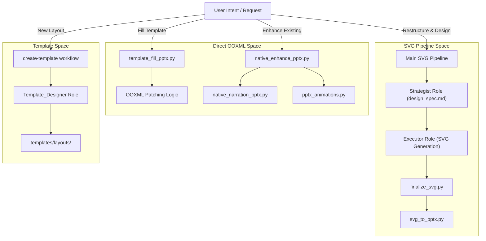
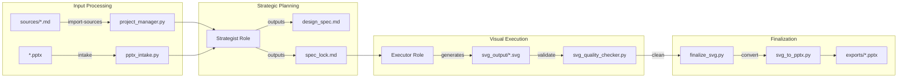

# Route Selection and Workflow Dispatch

Relevant source files

The following files were used as context for generating this wiki page:

- [.github/MAINTAINER_PLAYBOOK.md](.github/MAINTAINER_PLAYBOOK.md)
- [CLAUDE.md](CLAUDE.md)
- [docs/technical-design.md](docs/technical-design.md)

This page documents the deterministic routing system used by PPT Master to select the appropriate execution path for any given user request. The system ensures that requests are dispatched to either the full SVG-based design pipeline or specialized direct-OOXML workflows based on preconditions and the desired output stability.

## Deterministic Routing Logic

The routing system acts as the primary traffic controller for the codebase. It differentiates between requests that require creative restructuring (SVG Pipeline) and those that require structural preservation (Direct PPTX Workflows).

### The Route Matrix

The following matrix defines how the system maps request shapes to specific workflows and code entities.

| Request Shape | Workflow Route | Implementation Logic | Boundary / Constraint |
| :--- | :--- | :--- | :--- |
| Topic only (no source) | `topic-research` | `topic-research.md` | Web collection is a pre-pipeline step. |
| Source files / text | **Main SVG Pipeline** | `SKILL.md` (Steps 1-9) | Strategist may reorder or redesign content. |
| PPTX source (restructure) | `ppt_to_md` + SVG | `ppt_to_md.py` | PPTX geometry is a candidate, not a constraint. |
| PPTX Template + Data | `template-fill-pptx` | `template_fill_pptx.py` | Clones native slides; bypasses SVG. |
| PPTX (1:1 preservation) | `beautify-pptx` | `beautify-pptx` profile | Content and pagination are locked. |
| Finished PPTX (add-ons) | `native-enhance-pptx` | `native_enhance_pptx.py` | Direct OOXML patch; no design changes. |
| Reusable Template creation | `create-template` | `Template_Designer` role | Outputs to `templates/layouts/`. |

**Sources:** `[docs/technical-design.md:58-87]()`, `[docs/zh/technical-design.md:68-87]()`

### Generation Sub-Routes: Quick vs. Beautify

The system supports specialized profiles that modify the standard pipeline behavior:

*   **Quick Generate (`quick-generate`):** Bypasses separate planning/confirmation, the first-page gate, and preview finalization. It retains a single lockless final quality gate. `[docs/technical-design.md:49-52]()`
*   **Beautify (`beautify-pptx`):** Uses the standard lifecycle but enforces 1:1 source constraints. If "Quick" is also requested, it follows the `quick-generate` path while maintaining structural preservation. `[docs/technical-design.md:47-50]()`

### Decision Discriminator: "Optimize this PPT"
When a user provides an ambiguous request to "improve" an existing PowerPoint file, the system uses a single discriminator to select the route:
1. **Preserve original page count/order/wording?** → Route to `beautify-pptx`.
2. **Treat deck as raw source material for restructuring?** → Route to **Main SVG Pipeline**.

**Sources:** `[docs/technical-design.md:87-88]()`, `[docs/zh/technical-design.md:87-88]()`

---

## Workflow Dispatch Architecture

The dispatch system bridges Natural Language requests to specific Python tools and AI roles.

### Natural Language to Code Entity Mapping

The following diagram illustrates how high-level user intents are dispatched to the underlying code infrastructure.

**Intent Dispatch Diagram**

**Sources:** `[docs/technical-design.md:17-56]()`, `[docs/technical-design.md:58-65]()`

---

## Workflow Preconditions and Registry

Each workflow has strict entry requirements (preconditions) that must be met before dispatch.

### SVG Pipeline vs. Direct Workflows

| Workflow | Entry Precondition | Primary Tool/Script |
| :--- | :--- | :--- |
| **Main SVG Pipeline** | `design_spec.md` and `spec_lock.md` must exist. | `project_manager.py` |
| **template-fill-pptx** | A valid `.pptx` template and `fill_plan.json`. | `template_fill_pptx.py` |
| **native-enhance-pptx** | An existing `.pptx` in the project directory. | `native_enhance_pptx.py` |
| **create-template** | A design brief or reference `.pptx`. | `pptx_template_import.py` |

**Sources:** `[docs/technical-design.md:58-65]()`, `[docs/zh/technical-design.md:126-131]()`

### Failure Recovery Matrix

The system follows a structured recovery protocol when a route fails:
*   **Validation Failures:** `svg_quality_checker.py` enforces the project contract. Errors block the flow; the checker does not silently rewrite pages. `[docs/technical-design.md:34-34]()`
*   **Conversion Failures:** `svg_to_pptx.py` defensively validates compiler mappings and the package. It requires a matching quality report for release. `[docs/technical-design.md:35-35]()`
*   **Role Failures:** The Maintainer Playbook mandates that if a model/service fails, the project should not adapt to it; instead, the provider or model should be switched. `[.github/MAINTAINER_PLAYBOOK.md:42-42]()`

---

## Data Flow and Code Entity Association

This diagram bridges the conceptual data flow with the actual file-system artifacts and processing scripts.

**Data Flow to Code Entity Mapping**

**Sources:** `[docs/technical-design.md:91-106]()`, `[docs/zh/technical-design.md:114-124]()`

### Key Execution Roles
*   **Strategist:** Manages the two-stage confirmation process (communication confirmation in Stage 1, solution confirmation in Stage 2). `[docs/technical-design.md:77-77]()`
*   **Executor:** Generates pages continuously from P02 to the final page after P01 passes the initial quality gate. `[docs/technical-design.md:84-85]()`
*   **Template_Designer:** Specialized role for creating reusable SVG templates, triggered by the `create-template` workflow. `[docs/technical-design.md:75-75]()`

**Sources:** `[docs/technical-design.md:77-85]()`, `[docs/zh/technical-design.md:26-34]()`
