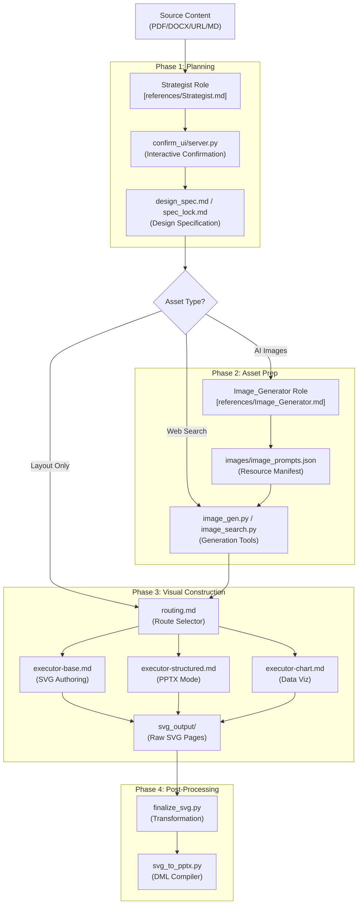
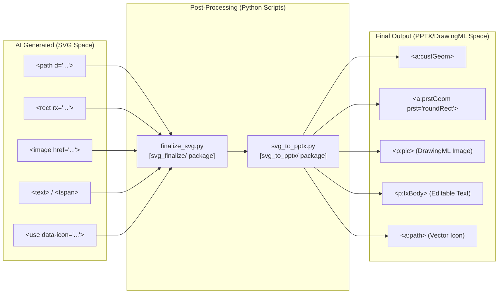

# AI Role System

Relevant source files

The following files were used as context for generating this wiki page:

- [AGENTS.md](AGENTS.md)
- [docs/technical-design.md](docs/technical-design.md)

## Purpose and Scope

The AI Role System is the core collaborative engine of PPT Master. It implements a multi-role pipeline where specialized AI agents (Strategist, Image_Generator, Executor variants, and Template_Designer) work in sequence to transform source documents into high-quality, editable presentations. This system bridges the gap between unstructured input and structured SVG design drafts.

The system is designed to eliminate "blank-page syndrome" by having the AI handle visual design, layout, and content structure, delivering a high-quality design draft that is natively editable in PowerPoint [docs/technical-design.md:7-12](). The architecture distinguishes between the **Default Generate** pipeline (with human-in-the-loop strategy) and the **Quick profile** (lockless, direct execution) [skills/ppt-master/AGENTS.md:9-10]().

For details on the mandatory coordination mechanisms, see [Role Collaboration Protocol](#4.1).

Sources: [skills/ppt-master/AGENTS.md:1-10](), [skills/ppt-master/SKILL.md:1-10](), [docs/technical-design.md:7-12]()

---

## Role Inventory

The system consists of specialized roles defined by specifications in the `skills/ppt-master/references/` directory.

| Role ID | Primary Responsibility | Activation Condition |
|---------|------------------------|---------------------|
| **Strategist** | Two-stage confirmation & Design Spec generation | Always in Default Generate [docs/technical-design.md:77-78]() |
| **Image_Generator** | Prompt optimization & asset resource management | Conditional on resource manifest [docs/technical-design.md:79-80]() |
| **Executor_General** | Flexible, creative SVG authoring | Default style selection [skills/ppt-master/AGENTS.md:11-15]() |
| **Executor_Structured** | Template-adherent PPTX layout authoring | Structured mode [skills/ppt-master/AGENTS.md:11-15]() |
| **Executor_Chart** | Specialized data visualization authoring | Decks with charts [skills/ppt-master/AGENTS.md:11-15]() |
| **Template_Designer** | Creation of reusable global library assets | `/create-template` workflow [skills/ppt-master/AGENTS.md:24-24]() |

Sources: [skills/ppt-master/AGENTS.md:7-27](), [docs/technical-design.md:30-33](), [docs/technical-design.md:77-82]()

---

## Architecture and Pipeline

The system operates on a **Strict Serial Execution** model defined in `SKILL.md`. Parallelizing steps is forbidden to ensure context integrity and design consistency [skills/ppt-master/SKILL.md:5-10]().

### Pipeline Workflow Diagram

This diagram maps the high-level workflow to the specific code entities and artifacts generated at each stage.

Sources: [skills/ppt-master/AGENTS.md:11-27](), [skills/ppt-master/SKILL.md:1-10](), [docs/technical-design.md:45-95](), [skills/ppt-master/workflows/routing.md:1-20]()

---

## Role Summaries

### Strategist
The Strategist is the "architect" of the project. It conducts a two-stage confirmation process: Stage 1 locks the communication contract and template choice; Stage 2 confirms the full solution before production [docs/technical-design.md:77-78](). It generates the `design_spec.md` and `spec_lock.md` which serve as the project's visual and structural DNA. In modern workflows, it utilizes `confirm_ui/server.py` for an interactive browser-based confirmation stage [skills/ppt-master/AGENTS.md:59-61]().
*   For details, see [Strategist Role](#4.2).

Sources: [skills/ppt-master/AGENTS.md:9](), [docs/technical-design.md:77-78](), [docs/technical-design.md:97-99]()

### Image_Generator
A conditional role triggered when visuals are required. It optimizes prompts using the Unified Prompt Structure and manages resource status types (Pending/Existing/Placeholder) [docs/technical-design.md:79-80](). It interfaces with `image_gen.py` (multi-provider dispatch) and `image_search.py` (web sources) [skills/ppt-master/AGENTS.md:63-65]().
*   For details, see [Image Generator Role](#4.3).

Sources: [skills/ppt-master/AGENTS.md:63-71](), [docs/technical-design.md:32-33](), [docs/technical-design.md:79-80]()

### Executor Roles
Executors are the "builders" who generate the actual SVG code. They follow the `spec_lock.md` constraints strictly. Variants include `executor-base.md` for standard pages, `executor-structured.md` for template-driven layouts, and `executor-chart.md` for complex data visualizations [skills/ppt-master/AGENTS.md:11-15](). They apply design principles like **page_rhythm** (anchor/dense/breathing) and the **SCQA framework** [docs/technical-design.md:100-102]().
*   For details, see [Executor Roles](#4.4).

Sources: [skills/ppt-master/AGENTS.md:11-15](), [docs/technical-design.md:100-102]()

### Template_Designer
The Template_Designer is a specialized utility role used to expand the system's library. It is triggered by the `/create-template` workflow [skills/ppt-master/AGENTS.md:24-24](). It extracts assets from existing PPTX files using `pptx_template_import.py` and creates standardized layouts in `templates/layouts/`, `templates/styles/`, or `templates/brands/` [docs/technical-design.md:82-82]().
*   For details, see [Template Designer Role](#4.5).

Sources: [skills/ppt-master/AGENTS.md:24-27](), [skills/ppt-master/workflows/create-template.md:1-20](), [docs/technical-design.md:82-82]()

---

## Technical Constraints and SVG Space

The system bridges **Natural Language Space** to **Code Entity Space** (SVG/DrawingML). Roles must strictly adhere to the "Banned Features" list (e.g., no `mask`, `style` tags, or `foreignObject`) to ensure the resulting SVG can be converted to native PowerPoint shapes [docs/technical-design.md:15-16]().

### SVG to DrawingML Mapping Logic

This diagram illustrates how AI-generated SVG entities are mapped to PowerPoint DrawingML entities by the post-processing tools.

Sources: [skills/ppt-master/references/shared-standards-core.md:1-50](), [docs/technical-design.md:15-36](), [docs/technical-design.md:103-105]()

---

## Child Pages

*   [Role Collaboration Protocol](#4.1) — Mandatory role switching, checkpoints, and execution discipline.
*   [Strategist Role](#4.2) — Two-stage confirmation and Design Specification (design_spec.md).
*   [Image Generator Role](#4.3) — Prompt optimization and image resource management.
*   [Executor Roles](#4.4) — Base, Structured, and Chart variants for SVG generation.
*   [Template Designer Role](#4.5) — Library expansion and PPTX reference extraction.
