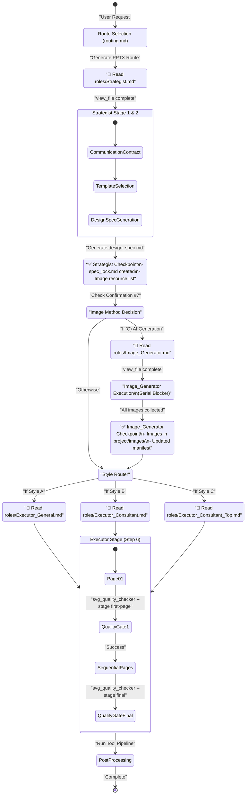
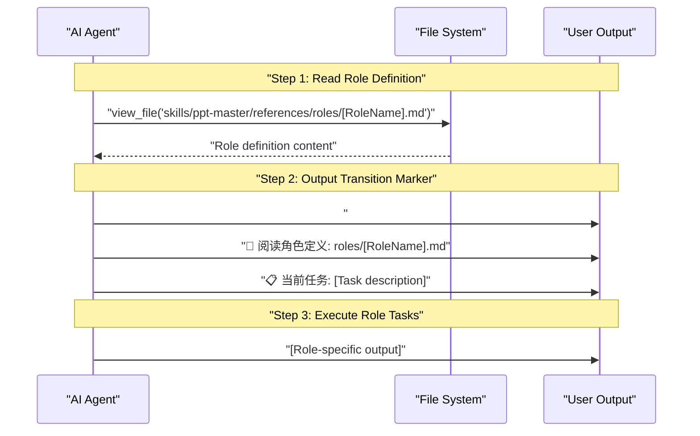
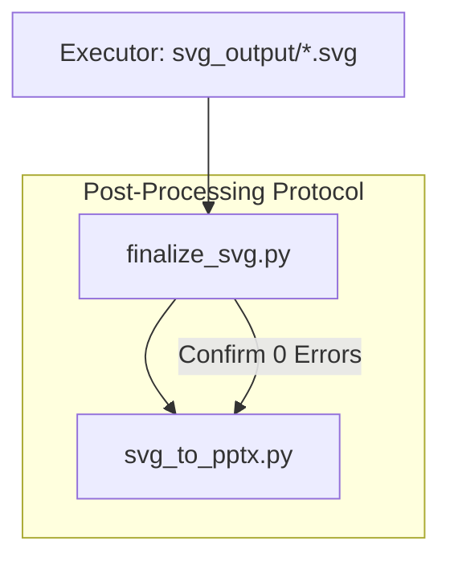
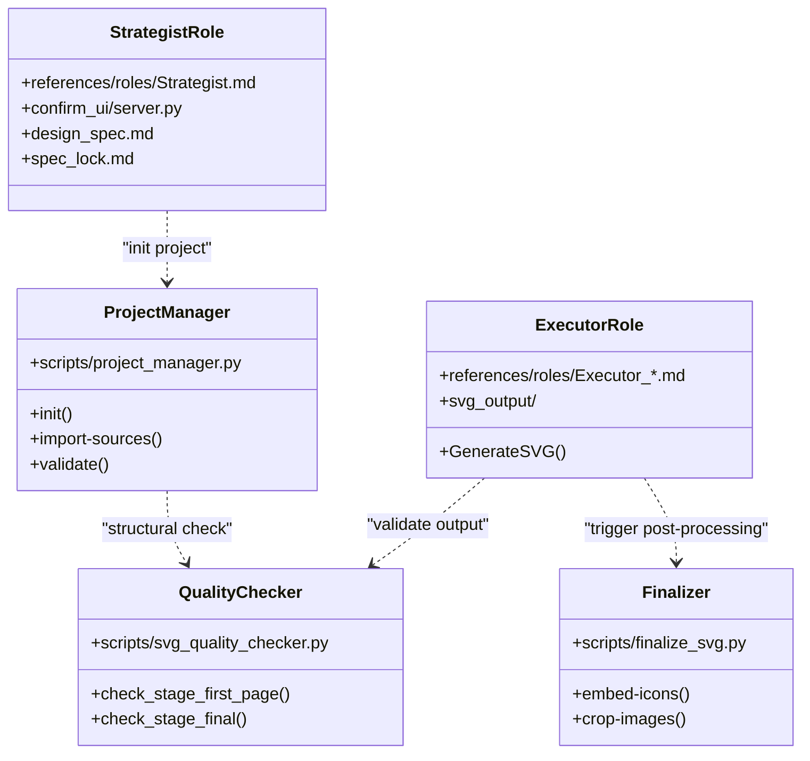

# Role Collaboration Protocol

<details>
<summary>Relevant source files</summary>

The following files were used as context for generating this wiki page:

- [AGENTS.md](AGENTS.md)
- [CLAUDE.md](CLAUDE.md)
- [docs/technical-design.md](docs/technical-design.md)

</details>


## Purpose and Scope

This document specifies the mandatory coordination protocols that govern AI role interactions in the PPT Master system. These protocols ensure proper sequencing, prevent workflow violations, and maintain data consistency across role transitions. The protocol is defined as a strict serial pipeline where bundling or parallelizing steps is explicitly forbidden [skills/ppt-master/AGENTS.md:5-5]().

For information about individual role capabilities and responsibilities, see [Strategist Role](4.2), [Image Generator Role](4.3), [Executor Roles](4.4), and [Template Designer Role](4.5). For end-to-end user workflows, see [End-to-End Generation Workflow](8.1).

**Sources:** [skills/ppt-master/AGENTS.md:1-20](), [skills/ppt-master/SKILL.md:1-15]()

---

## Protocol Architecture

The role collaboration protocol enforces a strict finite state machine with mandatory checkpoints, explicit state transitions, and conditional branching logic. The protocol prevents common failure modes: skipping role definitions, executing stages out of order, and missing critical confirmations.

### Role Collaboration State Machine



**Key Protocol Properties:**

- **Strict Serial Execution**: Steps 1-9 in `SKILL.md` must be executed one by one; bundling or parallelizing is FORBIDDEN [skills/ppt-master/AGENTS.md:5-5]().
- **Main Agent Generation**: SVG pages MUST be generated by the current main agent with full project context. Delegating to sub-agents or using external code generation blocks without direct oversight is FORBIDDEN [docs/technical-design.md:100-101]().
- **Sequential Rhythm**: In Step 6 (Executor), pages must be generated sequentially. Batching pages (e.g., 5 at a time) is FORBIDDEN [skills/ppt-master/AGENTS.md:82-87]().
- **Mandatory Reads**: Role definitions must be loaded via `view_file` before execution [skills/ppt-master/CLAUDE.md:3-5]().

**Sources:** [skills/ppt-master/AGENTS.md:1-19](), [docs/technical-design.md:8-12](), [docs/technical-design.md:82-87](), [skills/ppt-master/CLAUDE.md:1-5]()

---

## Global Execution Discipline (8 Rules)

The system operates under 8 mandatory rules that govern role behavior and data integrity:

1.  **Serial Integrity**: Steps 1-9 must be executed sequentially [skills/ppt-master/AGENTS.md:5-5]().
2.  **Role Identity**: Always read the role definition file before assuming a role [skills/ppt-master/CLAUDE.md:3-5]().
3.  **Context Locking**: The `spec_lock.md` file is the immutable source of truth for design parameters [docs/technical-design.md:77-77]().
4.  **No Batching**: SVG generation must be continuous and sequential, not batched [skills/ppt-master/AGENTS.md:82-87]().
5.  **Direct Generation**: The primary agent must perform the SVG coding, not a sub-agent [docs/technical-design.md:100-101]().
6.  **Tool First**: Always use `project_manager.py` and `finalize_svg.py` instead of manual file operations [skills/ppt-master/AGENTS.md:48-51](), [skills/ppt-master/AGENTS.md:84-84]().
7.  **Quality Gate**: `svg_quality_checker.py` must be run before final export [skills/ppt-master/AGENTS.md:73-73]().
8.  **Output Path**: Never export from `svg_output/`; always use `svg_final/` via the post-processing pipeline [skills/ppt-master/AGENTS.md:82-87]().

**Sources:** [skills/ppt-master/AGENTS.md:5-87](), [docs/technical-design.md:30-105](), [skills/ppt-master/CLAUDE.md:1-5]()

---

## Mandatory Role Switching Protocol

### Three-Step Transition Requirement

Every role transition MUST follow this three-step sequence to ensure the AI's internal state matches the system requirements:



**Sources:** [skills/ppt-master/AGENTS.md:5-15](), [skills/ppt-master/CLAUDE.md:1-5]()

### Role Definition File Mapping

| Role Transition | Required File | Trigger Condition |
|-----------------|---------------|-------------------|
| Strategy Planning | [skills/ppt-master/references/roles/Strategist.md]() | User presents new content generation request |
| Image Generation | [skills/ppt-master/references/roles/Image_Generator.md]() | User selects "C) AI Generation" in Confirmation #7 |
| General Style | [skills/ppt-master/references/roles/Executor_General.md]() | Style A selected in Confirmation #4 |
| Consultant Style | [skills/ppt-master/references/roles/Executor_Consultant.md]() | Style B selected in Confirmation #4 |
| MBB Style | [skills/ppt-master/references/roles/Executor_Consultant_Top.md]() | Style C selected in Confirmation #4 |
| Template Design | [skills/ppt-master/references/roles/Template_Designer.md]() | Workflow `/create-template` triggered |

**Sources:** [skills/ppt-master/AGENTS.md:9-19](), [docs/technical-design.md:30-38]()

---

## Role Transition Checkpoints (GATES)

Each role completion requires passing a structured checkpoint. These act as "GATES" that must be satisfied before the next role can activate.

### Strategist Checkpoint (GATE 1)
The Strategist MUST complete the "Eight Confirmations" (Canvas, Pages, Audience, Style, Color, Icon, Image, Content Logic) via the interactive server [skills/ppt-master/AGENTS.md:56-57]().

**Critical Output**: `design_spec.md` and `spec_lock.md` [docs/technical-design.md:77-77]().

### Image_Generator Checkpoint (GATE 2 - BLOCKING)
If AI Image Generation is selected, this step is **BLOCKING**. The Executor cannot proceed until images are physically present in the project directory [skills/ppt-master/AGENTS.md:65-67]().

**Execution Command**:
```bash
python3 skills/ppt-master/scripts/image_gen.py --manifest <project_path>/images/image_prompts.json
```
[skills/ppt-master/AGENTS.md:66-66]()

---

## Workflow Coordination Mechanisms

### spec_lock Re-read Requirement
Before an Executor generates any SVG code, it MUST read `spec_lock.md` in the project directory. This ensures that the generated SVG adheres to the dimensions, colors, and fonts confirmed in Stage 1 [docs/technical-design.md:77-77](), [docs/technical-design.md:97-98]().

### SVG Generation Rhythm
Executors must follow a specific internal loop:
1. Read `spec_lock.md`.
2. Generate `page01.svg`.
3. Validate `page01.svg` using `svg_quality_checker.py --stage first-page` [skills/ppt-master/AGENTS.md:83-83]().
4. Proceed to generate all remaining pages continuously [skills/ppt-master/AGENTS.md:85-85]().
5. Run `svg_quality_checker.py --stage final` [skills/ppt-master/AGENTS.md:86-86]().

### Post-Processing Pipeline Coordination
The transition from AI generation to final PPTX is governed by a strict sequence of tool calls [skills/ppt-master/AGENTS.md:82-87]():



**Rule**: NEVER run these commands in a single code block or shell invocation. They must be executed one by one with manual confirmation of success between steps [skills/ppt-master/AGENTS.md:82-87]().

**Sources:** [skills/ppt-master/AGENTS.md:82-87](), [docs/technical-design.md:44-44]()

---

## Code Entity Mapping

This diagram bridges the conceptual roles to the specific code entities that manage their execution and validation.



**Sources:** [skills/ppt-master/AGENTS.md:48-73](), [docs/technical-design.md:15-56]()
