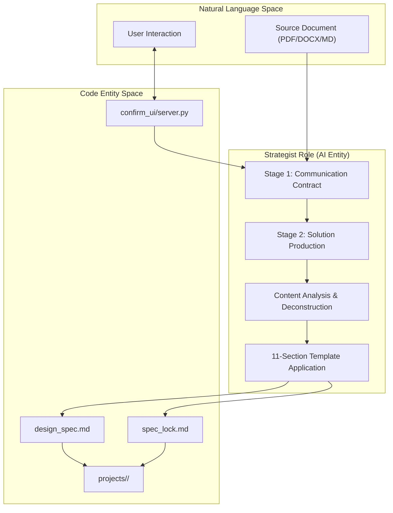
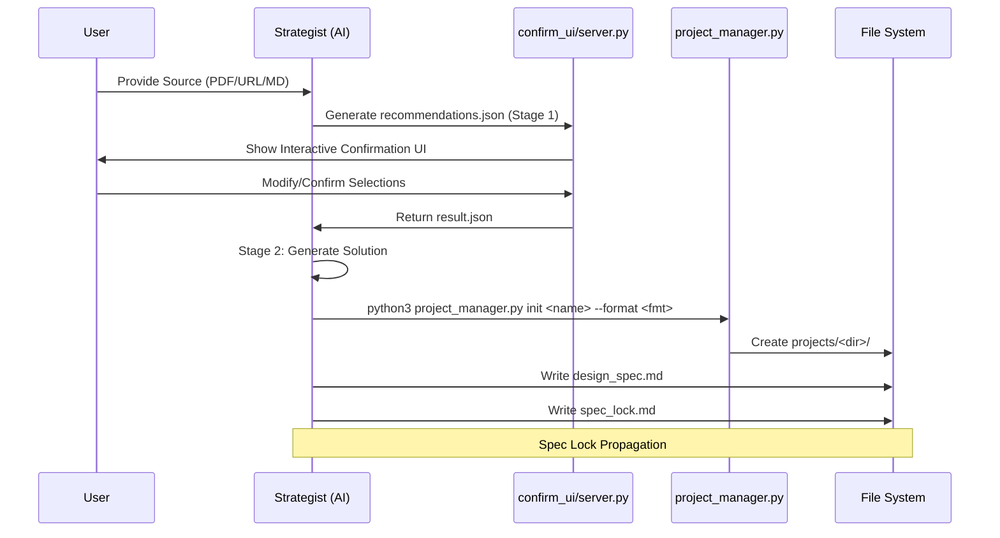

# Strategist Role

Relevant source files

The following files were used as context for generating this wiki page:

- [docs/technical-design.md](docs/technical-design.md)
- [docs/templates-architecture.md](docs/templates-architecture.md)
- [examples/ppt169_attention_is_all_you_need/design_spec.md](examples/ppt169_attention_is_all_you_need/design_spec.md)

This document describes the Strategist role, the first AI role in the PPT Master generation pipeline. The Strategist is responsible for content analysis, design planning, and producing the Design Specification and Execution Lock that constrain all downstream generation.

---

## Purpose and Scope

The Strategist role serves as the entry point and planning authority for all content generation workflows. Its primary responsibility is to perform the **Two-Stage Confirmation** interactive process with the user, analyze source content, and produce a comprehensive `design_spec.md` and a machine-readable `spec_lock.md`. These documents serve as the contract between planning and execution phases.

The Strategist does not generate SVG code. It produces planning documents that are consumed by downstream roles (Image_Generator, Executors).

**Sources**: [docs/technical-design.md:30-32](), [docs/technical-design.md:77-78]()

---

## Role Position in Workflow

The Strategist occupies the first position in the AI role pipeline. It is a mandatory role that must execute before any other generation activity, unless using the "Quick Generate" profile which bypasses separate planning/confirmation.

### Workflow Entry Point

The diagram below illustrates how the Strategist transitions from natural language input to structured code-ready specifications.

Title: Strategist Interaction and Output Flow

**Sources**: [docs/technical-design.md:30-32](), [docs/technical-design.md:72-78]()

---

## Two-Stage Confirmation Process

The Strategist operates under a two-stage confirmation protocol to ensure user alignment before high-cost generation begins.

### Stage 1: Communication & Template Selection
In Stage 1, the Strategist confirms the communication method and design direction. This includes selecting template candidates (Brand, Style, Layout, or Deck). Selected workspaces are validated and installed only after this stage is confirmed.

### Stage 2: Final Solution Production
Once the direction and templates are locked, Stage 2 produces the full design solution, including the specific content outline, image strategies, and visualization mappings.

| # | Confirmation Item | Type | Purpose | Output Format |
|---|-------------------|------|---------|---------------|
| 1 | Canvas Format | Selection | Determine output dimensions | Format ID (e.g., `ppt169`) |
| 2 | Page Count Range | Range | Scope content decomposition | Integer range (e.g., 12-16) |
| 3 | Target Audience | Analysis | Inform tone and complexity | Audience description |
| 4 | Design Style | Selection | Choose executor variant | General / Consultant / MBB |
| 5 | Color Scheme | Design | Define visual palette | 8-role HEX color values |
| 6 | Icon Method | Selection | Determine icon integration | Library ID (e.g., `tabler-outline`) |
| 7 | Image Usage | Selection | Activate Image_Generator | AI Gen / User / Placeholder |
| 8 | Language | Selection | Determine output language | English / Chinese / etc. |

**Sources**: [docs/technical-design.md:72-78](), [examples/ppt169_attention_is_all_you_need/design_spec.md:5-15]()

---

## Confirm UI (confirm_ui/server.py)

The confirmation process is facilitated by a browser-based interactive stage (`confirm_ui/server.py`). This ensures the user has granular control over the Strategist's "first draft" of the project plan.

### Three-Stage Schema
The `confirm_ui` system operates on a three-stage contract:
1.  **recommendations.json**: The Strategist generates initial suggestions for all confirmation items based on source analysis.
2.  **Interactive Session**: The `server.py` hosts a UI where the user can accept, modify, or chat with the AI to refine these recommendations.
3.  **result.json**: Once the user clicks "Confirm", the final selections are saved, triggering the generation of `design_spec.md`.

### Chat Fallback
If the UI cannot resolve a conflict or if the user provides complex natural language feedback (e.g., "Make it more like a McKinsey deck but use NASA colors"), the system falls back to a chat-based refinement loop before finalizing the contract.

**Sources**: [docs/technical-design.md:77-78](), [docs/technical-design.md:85-85]()

---

## Catalogs: Modes and Visual Styles

The Strategist selects from standardized catalogs to ensure consistency across different presentation types.

### Modes Catalog
Defines the communication framework:
- **Narrative**: Story-driven, sequential flow.
- **Pyramid**: Minto Pyramid principle, conclusion-first.
- **Briefing**: Data-heavy, high density for decision-makers.

### Visual Styles Catalog
Defines the aesthetic "skin":
- **Swiss-Minimal**: Clean, grid-based, high whitespace.
- **Dark-Tech**: Dark backgrounds, neon accents, high-contrast.
- **Glassmorphism**: Translucent layers, soft shadows, modern UI feel.

**Sources**: [docs/templates-architecture.md:15-20](), [docs/templates-architecture.md:60-65]()

---

## Design Specification (design_spec.md)

The primary human-readable output of the Strategist is the `design_spec.md`.

### The 11-Section Structure

1.  **Project Information**: Name, format, page count, style, audience.
2.  **Canvas Specification**: Dimensions, `viewBox`, margins, and content area.
3.  **Visual Theme**: Style, theme (dark/light), tone, and complete color scheme (8 roles).
4.  **Typography System**: Font families, size hierarchy (H1-H3, Body, Caption, KPI).
5.  **Layout Principles**: Page structure (Header/Content/Footer) and pattern library.
6.  **Icon Usage**: Library source (`tabler-outline`, `chunk`, etc.) and inventory.
7.  **Visualization Reference**: Mapping content to chart types (e.g., `kpi_cards`, `vertical_pillars`).
8.  **Image Resource List**: Filenames, dimensions, intent, and status (Pending/Existing).
9.  **Content Outline**: Page-by-page breakdown with themes and elements.
10. **Design Principles**: Specific rules like "Professional MBB" or "Blueprint Tech".
11. **Appendices**: Gradient definitions or specific technical constraints.

**Sources**: [examples/ppt169_attention_is_all_you_need/design_spec.md:5-193]()

---

## Execution Lock (spec_lock.md)

While `design_spec.md` is for narrative, `spec_lock.md` is the **machine-readable execution contract**. The Executor MUST read this file before generating every single SVG page to resist context-compression drift.

### Structure and Key Fields

- **canvas**: `viewBox` and `format`.
- **colors**: Hex codes for `bg`, `primary`, `accent`, `text`, `border`, etc.
- **typography**: Exact pixel values for `title`, `body`, `subtitle`.
- **icons**: The specific library and the allowed `inventory` of icon names.
- **images**: Mapping of logic IDs to file paths.
- **page_rhythm**: A sequence of tags (`anchor`, `dense`, `breathing`) for each page.
- **page_charts**: Specific chart templates assigned to pages.
- **forbidden**: A blacklist of SVG features (e.g., `rgba()`, `<style>`, `mask`).

**Sources**: [examples/ppt169_attention_is_all_you_need/spec_lock.md:1-91]()

---

## Content Analysis and Format Selection

The Strategist performs a deep analysis of the source content to select visual metaphors and layout rhythms.

### Mapping Content to Code Entities

| Content Type | Code Entity / Asset | Source |
|--------------|---------------------|--------|
| Quantitative Data | `templates/charts/` templates | [examples/ppt169_attention_is_all_you_need/spec_lock.md:74-84]() |
| Abstract Concepts | `icons/library` + `inventory` | [examples/ppt169_attention_is_all_you_need/spec_lock.md:38-41]() |
| Visual Hierarchy | `page_rhythm` tags | [examples/ppt169_attention_is_all_you_need/spec_lock.md:56-72]() |
| Layout Principles | `design_spec.md` Section V | [examples/ppt169_attention_is_all_you_need/design_spec.md:123-166]() |

### Layout Rhythm Planning
The Strategist assigns a `page_rhythm` to each slide:
- **anchor**: High-impact, low-density (Cover, Chapter, Ending).
- **dense**: High-information, multi-column (Content, Comparison).
- **breathing**: Moderate content with significant whitespace (Overview, Quotes).

**Sources**: [examples/ppt169_attention_is_all_you_need/spec_lock.md:56-72]()

---

## Implementation Details

### Interaction Flow

Title: Strategist Implementation Sequence

**Sources**: [docs/technical-design.md:64-78](), [docs/technical-design.md:85-85]()

### Data Flow for Images
If "AI Generation" is selected, the Strategist populates the `Image Resource List` with status types:
- **Pending**: Needs generation by `image_gen.py`.
- **Existing**: Already present in the `images/` folder.
- **Placeholder**: To be filled by the user later.

**Sources**: [examples/ppt169_attention_is_all_you_need/design_spec.md:185-193](), [docs/technical-design.md:32-32]()
