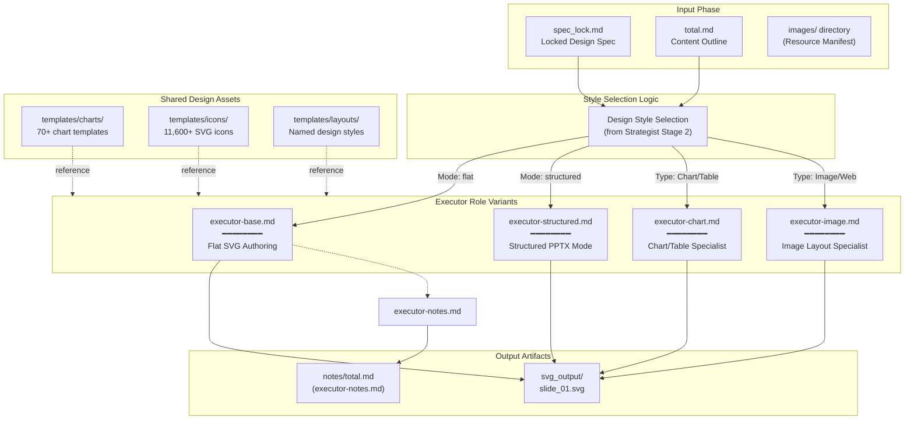
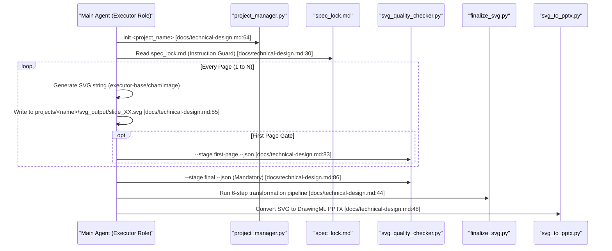

# Executor Roles

Relevant source files

The following files were used as context for generating this wiki page:

- [docs/powerpoint-svg-mapping.md](docs/powerpoint-svg-mapping.md)
- [docs/technical-design.md](docs/technical-design.md)

## Purpose and Scope

This document details the Executor role variants in the PPT Master AI pipeline. Executors are responsible for translating design specifications into SVG code or native PowerPoint structures, generating slide content page-by-page. The system supports multiple specialized executors: flat SVG page authoring (`executor-base.md`), structured PPTX mode (`executor-structured.md`), chart/table authoring (`executor-chart.md`), image layout (`executor-image.md`), and speaker notes (`executor-notes.md`). These roles implement distinct design philosophies while maintaining strict technical constraints required for DrawingML conversion.

For the mandatory execution rules, see [Role Collaboration Protocol](4.1). For the design specification that drives these roles, see [Strategist Role](4.2).

## Executor Role Architecture

The Executor role is a conditional branch in the pipeline, triggered after the Strategist and Image Generator have finalized the project's visual and content foundation.

**Execution Logic Flow**

**Key Execution Rules:**
- **Step 6 Ownership**: SVG generation must be performed by the main agent with full project context [docs/technical-design.md:100-101]().
- **Serial Generation**: Pages must be generated sequentially in one continuous pass; batching is forbidden to maintain context [docs/technical-design.md:36-38]().
- **Spec Adherence**: The Executor must read `spec_lock.md` before every single page generation to prevent "instruction drift" [docs/technical-design.md:30-31]().

**Sources:** [docs/technical-design.md:15-56](), [docs/technical-design.md:91-105]()

## Common Technical Specifications

All Executor variants share a mandatory set of technical requirements that ensure compatibility with the `svg_to_pptx.py` converter and DrawingML standards.

### SVG Structure and Banned Features

| Requirement | Specification | Rationale |
|-------------|---------------|-----------|
| **viewBox** | Must match format exactly (e.g., `0 0 1280 720` for `ppt169`) | Prevents scaling artifacts and coordinate drift [docs/powerpoint-svg-mapping.md:41-43]() |
| **Banned Features** | No `mask`, `style`, `class`, `foreignObject`, `symbol`, `textPath` | Not supported by DrawingML; inline attributes only [docs/technical-design.md:103-104]() |
| **Coordinate Model** | `1 SVG px = 9,525 EMU` at 96 DPI | Mapping between SVG and DrawingML units [docs/powerpoint-svg-mapping.md:41-43]() |
| **Z-order** | SVG source order (back to front) | Reconstructed in PPTX shape-tree order [docs/powerpoint-svg-mapping.md:46-46]() |

### Layout Techniques: Page Rhythm Tags

Executors apply `page_rhythm` tags to maintain visual variety throughout the deck:

- **Anchor (锚点型)**: Heavy, visual-centric pages. Examples include the Cover and Chapter dividers.
- **Dense (稠密型)**: High information density, data-heavy layouts. Examples include KPI dashboards with multiple cards.
- **Breathing (呼吸型)**: High white space, focus on a single key insight or quote.

**Sources:** [docs/technical-design.md:36-38](), [docs/powerpoint-svg-mapping.md:41-46]()

## Executor Role Variants

### 1. Flat SVG Authoring (executor-base.md)
The standard mode where content remains slide-local. It uses the `pptx_structure.mode: flat` configuration [docs/powerpoint-svg-mapping.md:55-55]().
- **Responsibility**: Authoring the core visual layer using standard SVG elements mapped to DrawingML.
- **Output**: Individual SVG files in `svg_output/` [docs/powerpoint-svg-mapping.md:44-44]().

### 2. Structured PPTX Mode (executor-structured.md)
Used when the project requires reusable native Master, Layout, or placeholder behavior [docs/powerpoint-svg-mapping.md:55-55]().
- **Responsibility**: Managing explicit `p:sldMaster` and `p:sldLayout` assignments [docs/powerpoint-svg-mapping.md:60-60]().
- **Constraint**: Triggered only when a validated deck/layout template workspace exists [docs/powerpoint-svg-mapping.md:55-55]().

### 3. Chart and Table Authoring (executor-chart.md)
A specialized branch for complex data visualizations.
- **Responsibility**: Programmatic lookup of templates in `templates/charts/` via `charts_index.json`.
- **Constraint**: Must ensure data-to-visual mapping remains "Native-normalized" or "Native-stable" for editability in PowerPoint.

### 4. Image Layout (executor-image.md + executor-web-image.md)
Handles the placement and processing of visual assets.
- **Responsibility**: Implementing smart cropping using `preserveAspectRatio=slice` and aspect ratio fixing [docs/technical-design.md:44-51]().
- **Web Integration**: `executor-web-image.md` handles sourcing and licensing discipline for external assets.

### 5. Speaker Notes (executor-notes.md)
Generates the textual narration for the deck.
- **Responsibility**: Creating `notes/total.md` which maps to PowerPoint slide notes [docs/technical-design.md:87-87]().
- **Downstream**: These notes can be processed by `notes_to_audio.py` for TTS generation.

## Consulting-Style Frameworks (SCQA)

For high-end consulting decks (e.g., `consulting-decision` style), Executors implement the **SCQA Framework**:
1.  **Situation (S)**: Context and current state.
2.  **Complication (C)**: The challenge or problem.
3.  **Question (Q)**: The core strategic question.
4.  **Answer (A)**: The proposed solution (the "Insight").

**Implementation rules for consulting styles:**
- **Conclusion-First**: Slide titles must be full sentences stating the key insight.
- **Pyramid Principle**: Supporting evidence organized into pillars below the main conclusion.

**Sources:** [docs/technical-design.md:9-11]()

## SVG Generation Workflow (Code Perspective)

The following diagram bridges the natural language request to the code entities and execution pipeline.

### Critical Post-Processing
After the Executor generates the SVG, the `finalize_svg.py` script performs mandatory transformations:
1.  **embed-icons**: Replaces `<use data-icon>` placeholders with paths.
2.  **crop-images**: Applies smart crop with `preserveAspectRatio=slice`.
3.  **fix-aspect**: Prevents image stretching.
4.  **embed-images**: Converts to Base64.
5.  **flatten-text**: Normalizes `tspan` to `text`.
6.  **fix-rounded**: Converts `rect rx` to `path` [docs/technical-design.md:44-51]().

**Sources:** [docs/technical-design.md:44-51](), [docs/technical-design.md:81-88](), [docs/powerpoint-svg-mapping.md:41-62]()
