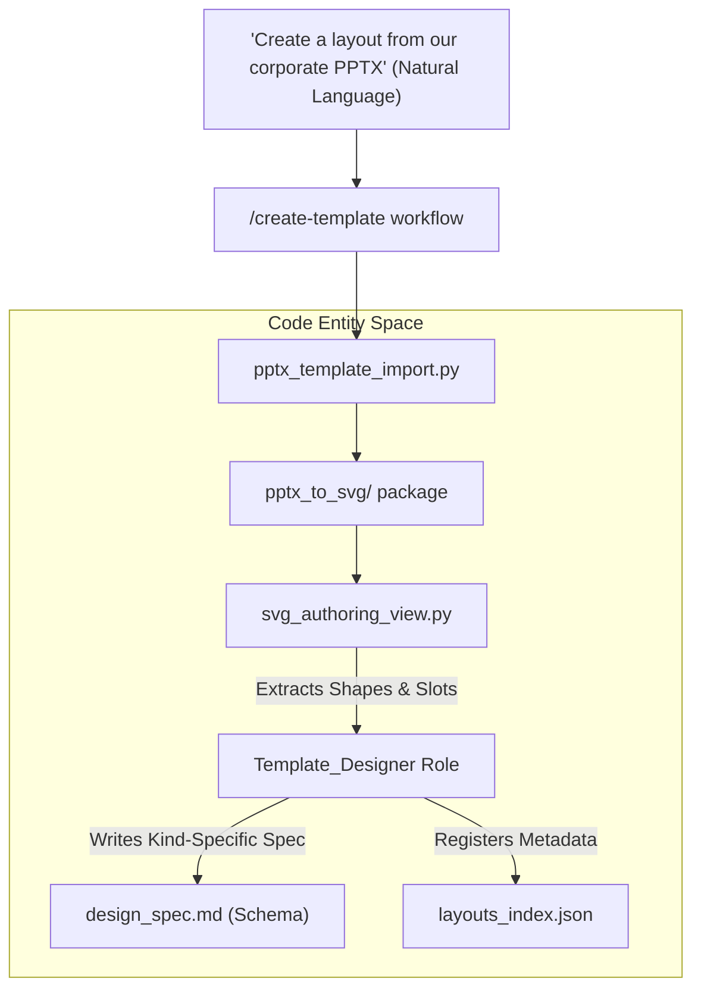
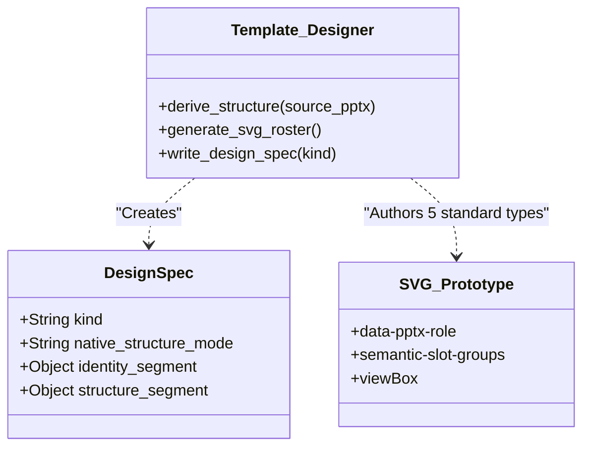

# Template Designer Role

<details>
<summary>Relevant source files</summary>

The following files were used as context for generating this wiki page:

- [docs/technical-design.md](docs/technical-design.md)
- [docs/templates-architecture.md](docs/templates-architecture.md)
- [docs/templates-guide.md](docs/templates-guide.md)

</details>


## Purpose and Scope

The **Template_Designer** is a specialized AI role dedicated to the creation and expansion of the global design library. Unlike Executor roles that generate specific presentation content for a project, the Template_Designer focuses on generating reusable, high-quality design primitives. This role is triggered exclusively via the `/create-template` workflow (including its child workflows for brands, styles, layouts, and decks) and outputs standardized assets to the `templates/` directory [docs/templates-architecture.md:1-20](). It manages the fusion of brand identity, communication methods, and structural layouts [docs/templates-architecture.md:23-26]().

**Sources:** [docs/templates-architecture.md:1-20](), [docs/templates-architecture.md:23-26]()

---

## Role Overview

The Template_Designer functions as a design system architect. It analyzes reference materials—extracted from existing professional PowerPoint files, brand guidelines, or natural language briefs—to define the visual language and structural components of a new template workspace [docs/templates-guide.md:7-13]().

### Key Characteristics

| Attribute | Specification |
|-----------|---------------|
| **Trigger Mechanism** | `/create-template` standalone workflow [docs/templates-guide.md:23-23]() |
| **Input Sources** | Reference PPTX, Brand URLs, PDFs, or SVG sets [docs/templates-guide.md:23-23]() |
| **Primary Tools** | `pptx_template_import.py`, `pptx_to_svg.py` [docs/templates-architecture.md:112-114]() |
| **Output Targets** | `templates/layouts/<id>/`, `templates/brands/<id>/`, `templates/styles/<id>/`, or `templates/decks/<id>/` [docs/templates-architecture.md:15-20]() |
| **Registration** | Updates `layouts_index.json`, `brands_index.json`, `styles_index.json`, or `decks_index.json` [docs/templates-architecture.md:82-86]() |

**Sources:** [docs/templates-architecture.md:15-20](), [docs/templates-architecture.md:82-86](), [docs/templates-architecture.md:112-114](), [docs/templates-guide.md:7-23]()

---

## Technical Workflow: Template Creation

The Template_Designer follows a specific pipeline to ensure new templates are compatible with the DrawingML conversion engine and the system's design standards.

### Data Flow Diagram: Natural Language to Code Entity

This diagram bridges the user's intent to the specific code entities and scripts used during template creation.


**Sources:** [docs/templates-architecture.md:87-114](), [docs/templates-guide.md:23-23](), [docs/technical-design.md:72-75]()

### Reference Extraction
The designer uses `pptx_template_import.py` to extract reference code from existing PPTX files. This process involves:
- **Identity Extraction:** Mapping theme colors and fonts to the `design_spec.md` identity segment [docs/templates-architecture.md:60-65]().
- **Structure Extraction:** Using `pptx_to_svg` to create temporary lossless SVGs that keep native-shape metadata and hidden carriers [docs/templates-architecture.md:112-114]().
- **Authoring View:** `svg_authoring_view.py` creates editable versions of these SVGs for the Template_Designer to refine into reusable prototypes [docs/templates-architecture.md:112-114]().

**Sources:** [docs/templates-architecture.md:60-65](), [docs/templates-architecture.md:112-114]()

---

## The Four Template Kinds

The Template_Designer handles four distinct kinds of template bundles. Each workspace's `design_spec.md` must declare its `kind` [docs/templates-architecture.md:23-26]().

| Kind | Library Workspace Root | What it Writes |
|---|---|---|
| **Brand** | `templates/brands/<id>/` | **Identity segment**: color, typography, logo, voice, icon style [docs/templates-architecture.md:17-17](). |
| **Style** | `templates/styles/<id>/` | **Portable direction**: communication method, page-role vocabulary, visual defaults [docs/templates-architecture.md:18-18](). |
| **Layout** | `templates/layouts/<id>/` | **Structure segment**: canvas, page structure, semantic text roles, page types, SVG roster [docs/templates-architecture.md:19-19](). |
| **Deck** | `templates/decks/<id>/` | **Full family**: Application context + integrated identity + structure [docs/templates-architecture.md:20-20](). |

**Sources:** [docs/templates-architecture.md:17-20](), [docs/templates-architecture.md:23-26]()

### Three-Way Fusion Logic
When a project is initialized, the system fuses these parallel bundles. The Template_Designer ensures that segments do not overlap to allow clean overrides [docs/templates-architecture.md:23-26]().

| Project Component | Source Kind | Native Projection |
|---|---|---|
| **Identity** | Brand or Deck | Theme colors/fonts, logo assets [docs/templates-architecture.md:62-65](). |
| **Structure** | Layout or Deck | Master/Layout/Placeholder topology, reusable geometry [docs/templates-architecture.md:64-65](). |
| **Method** | Style | Advisory review focus, data expression defaults [docs/templates-architecture.md:63-65](). |

**Sources:** [docs/templates-architecture.md:23-26](), [docs/templates-architecture.md:62-65]()

---

## Implementation Details: Layouts and Decks

### Required Page Roster
For `layout` and `deck` kinds, the Template_Designer must generate a standard set of SVG prototypes to ensure a complete presentation can be authored [docs/templates-architecture.md:22-22]().

1. `cover.svg`: Title slide.
2. `toc.svg`: Table of contents.
3. `chapter.svg`: Section transition.
4. `content.svg`: Main body slide.
5. `ending.svg`: Closing slide.

**Sources:** [docs/templates-architecture.md:22-22](), [docs/templates-guide.md:33-33]()

### Slot and Semantic Mapping
The Template_Designer defines **semantic text roles** and **spatial slot behavior** within the SVG prototypes. These are authoritative markers that the exporter uses to map SVG groups to native PowerPoint placeholders [docs/templates-architecture.md:22-22]().


**Sources:** [docs/templates-architecture.md:22-22](), [docs/templates-architecture.md:28-54]()

---

## Directory Structure and Registration

### Workspace Organization
The Template_Designer outputs to a standardized workspace root. Empty optional directories (like `images/` or `icons/`) are omitted [docs/templates-architecture.md:87-101]().

```text
<template_workspace>/
├── templates/
│   ├── design_spec.md          # Frontmatter kind must match directory
│   └── [cover|toc|chapter|content|ending].svg
├── images/                     # Optional; referenced by SVGs
├── icons/
│   └── imported/               # Optional; canonical vector assets
└── exports/                    # Git-ignored; review evidence only
```
**Sources:** [docs/templates-architecture.md:87-107]()

### Registration and Discovery
The workflow does not scan directories for discovery. The Template_Designer must update the corresponding global index file in `templates/` [docs/templates-architecture.md:82-86](). These indexes (e.g., `layouts_index.json`) serve as the source of truth for the Stage 1 template selector [docs/templates-guide.md:72-80]().

**Sources:** [docs/templates-architecture.md:82-86](), [docs/templates-guide.md:72-80]()
