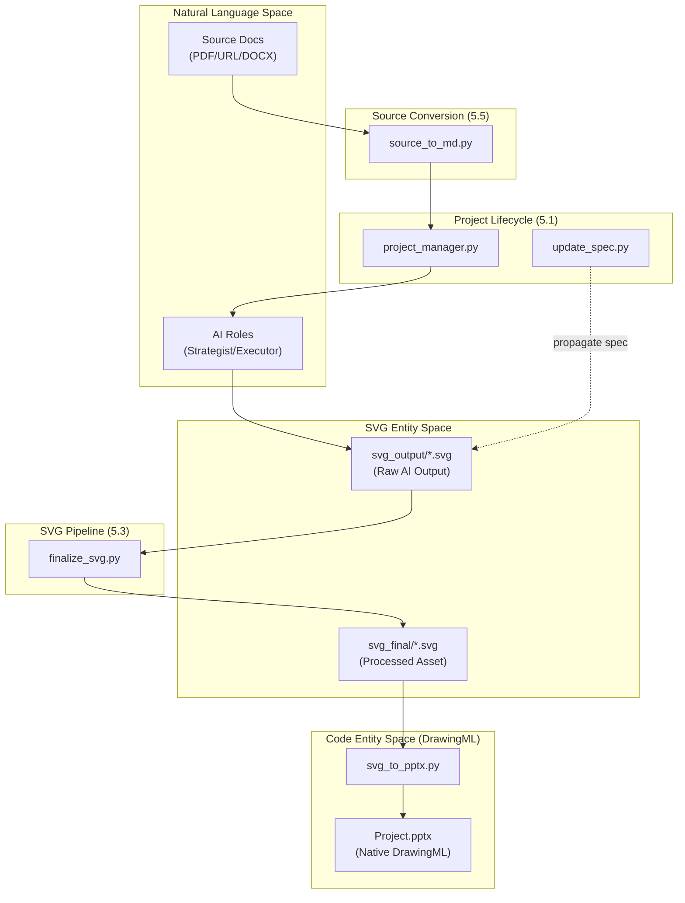
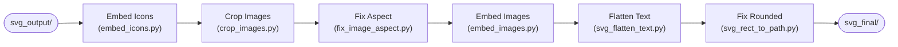

# Tool Ecosystem

<details>
<summary>Relevant source files</summary>

The following files were used as context for generating this wiki page:

- [.github/ISSUE_TEMPLATE/bug_report.yml](.github/ISSUE_TEMPLATE/bug_report.yml)
- [.github/ISSUE_TEMPLATE/feature_request.yml](.github/ISSUE_TEMPLATE/feature_request.yml)
- [docs/README.md](docs/README.md)

</details>


The Tool Ecosystem provides a comprehensive Python suite for converting source documents, managing project lifecycles, post-processing AI-generated SVG content, and ensuring quality compliance. These tools bridge the gap between raw AI outputs and production-ready PowerPoint artifacts.

This page provides a high-level overview of the tool categories and their integration. For deep technical details, see the child pages:

*   **Project Lifecycle Management**: [Project Lifecycle Tools](#5.1) — Project initialization, validation, and structure management.
*   **Quality Validation**: [Quality Assurance Tools](#5.2) — Technical compliance checks, font-size ramp validation, and visual review.
*   **SVG Transformation Pipeline**: [SVG Processing Pipeline](#5.3) — The 6-step transformation from raw SVG to PPT-compatible assets.
*   **Export and Conversion**: [Export and Conversion Tools](#5.4) — SVG-to-PPTX conversion, coordinate calculations, and animations.
*   **Source Conversion**: [Source Conversion Tools](#5.5) — Converting PDF, DOCX, and URLs into Markdown for the AI.
*   **Image Generation**: [Image Generation Tools](#5.6) — Multi-provider AI image generation and analysis.
*   **Audio Narration**: [Audio Narration Tools](#5.7) — TTS generation and audio embedding.

---

## Tool Categories and Workflow Integration

The tool ecosystem is organized into functional blocks that support the end-to-end generation pipeline. These tools are often the primary point of contact for users reporting issues via the [Bug Report template](.github/ISSUE_TEMPLATE/bug_report.yml:1-92)().

| Category | Primary Tools | Role in Workflow |
| :--- | :--- | :--- |
| **Source Conversion** | `source_to_md.py`, `pdf_to_md.py` | Converts raw input into AI-readable Markdown. |
| **Project Lifecycle** | `project_manager.py`, `update_spec.py` | Initializes workspace and synchronizes design specs. |
| **Asset Generation** | `image_gen.py`, `latex_render.py` | Generates visual assets and formula images. |
| **SVG Processing** | `finalize_svg.py` | Transforms AI SVGs into self-contained files. |
| **Quality Assurance** | `svg_quality_checker.py`, `batch_validate.py` | Enforces the Banned Features Blacklist and visual rubrics. |
| **Export** | `svg_to_pptx.py`, `pptx_animations.py` | Maps SVG elements to native DrawingML shapes and animations. |

**Sources:** [.github/ISSUE_TEMPLATE/bug_report.yml:10-22](), [.github/ISSUE_TEMPLATE/feature_request.yml:21-35]()

---

## System Architecture

### Tool Orchestration and Data Flow

The following diagram illustrates how tools bridge the **Natural Language Space** (Source Docs/AI Roles) to the **Code Entity Space** (SVG/DrawingML).

**Tool Flow Diagram**


**Sources:** [.github/ISSUE_TEMPLATE/bug_report.yml:15-18](), [.github/ISSUE_TEMPLATE/feature_request.yml:26-31]()

---

## The Post-Processing Pipeline

The `finalize_svg.py` script is the central orchestrator for SVG transformation. It ensures that the AI's output, which often uses placeholders or non-standard SVG features, is converted into a format compatible with PowerPoint's DrawingML engine.

### 6-Step Transformation Logic

**SVG Transformation Pipeline**


For details on each step, see [SVG Processing Pipeline](#5.3).

**Sources:** [.github/ISSUE_TEMPLATE/bug_report.yml:17-17]()

---

## Technical Constraints and Compatibility

A critical function of the tool ecosystem is enforcing compatibility rules. PowerPoint's SVG-to-DrawingML conversion engine is restrictive; tools like `svg_quality_checker.py` and `finalize_svg.py` work to replace banned features with compliant alternatives.

| Banned Feature | Tool/Workflow Alternative |
| :--- | :--- |
| `<style>` / `class` | Converted to inline `fill`, `stroke` attributes. |
| `<symbol>` + `<use>` | Replaced by `embed_icons.py` with actual `<path>` data. |
| `rgba()` colors | Converted to `fill-opacity` and `stroke-opacity`. |
| `rx`/`ry` on `<rect>` | Converted to `<path>` by `svg_rect_to_path.py`. |
| `<tspan>` | Flattened to absolute-positioned `<text>` elements by `svg_flatten_text.py`. |

**Sources:** [.github/ISSUE_TEMPLATE/bug_report.yml:15-17]()

---

## Command Reference Quick Start

Commonly used commands for interacting with the tool ecosystem:

```bash
# 1. Convert source to markdown
python3 scripts/source_to_md/pdf_to_md.py input.pdf

# 2. Initialize project structure
python3 scripts/project_manager.py init my_project --format ppt169

# 3. Post-process AI generated SVGs
python3 scripts/finalize_svg.py projects/my_project

# 4. Export to PPTX
python3 scripts/svg_to_pptx.py projects/my_project
```

**Sources:** [.github/ISSUE_TEMPLATE/bug_report.yml:16-18]()

---

## Summary of Child Pages

*   **[Project Lifecycle Tools](#5.1)**: Explains `project_manager.py` subcommands (`init`, `import-sources`, `validate`, `info`, `page-context`) and the `projects/` directory lifecycle from creation to promotion to `examples/`.
*   **[Quality Assurance Tools](#5.2)**: Details the technical validation logic in `svg_quality_checker.py` and `batch_validate.py`, including font-size ramp checks, `spec_lock` drift detection, and the `visual_review.py` Playwright workflow.
*   **[SVG Processing Pipeline](#5.3)**: Breaks down the 6-step transformation pipeline in `finalize_svg.py` and the `svg_finalize/` subpackage (icon embedding, image cropping, text flattening).
*   **[Export and Conversion Tools](#5.4)**: Documents the conversion of SVG to DrawingML via `svg_to_pptx.py`, animation configuration via `pptx_animations.py`, and direct OOXML patching via `native_enhance_pptx.py`.
*   **[Source Conversion Tools](#5.5)**: Covers the `source_to_md/` suite for converting PDF, DOCX, Excel, and Web URLs (via `web_to_md.py`) into AI-ready Markdown with sidecar profiles.
*   **[Image Generation Tools](#5.6)**: Explains the multi-provider dispatch system in `image_gen.py` supporting 14+ AI backends (Gemini, OpenAI, etc.) and formula rendering via `latex_render.py`.
*   **[Audio Narration Tools](#5.7)**: Documents `notes_to_audio.py` for TTS generation (Edge-TTS, ElevenLabs), timing synchronization via `narration_sync.py`, and the live preview server.
