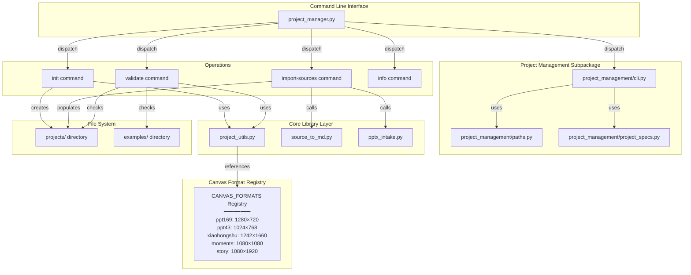
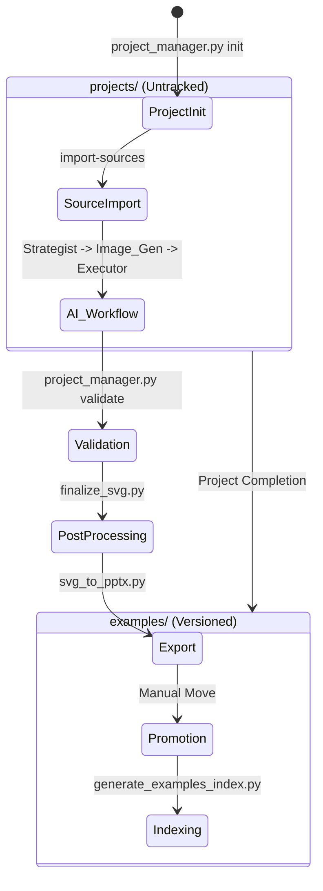

# Project Lifecycle Tools

<details>
<summary>Relevant source files</summary>

The following files were used as context for generating this wiki page:

- [docs/README.md](docs/README.md)
- [docs/technical-design.md](docs/technical-design.md)

</details>


This document covers the project initialization, source ingestion, validation, and management tools in PPT Master. These tools establish and enforce project structure standards, manage source document conversion, and provide automated scaffolding for new projects.

For SVG quality validation and compliance checking, see [Quality Assurance Tools](5.2). For post-processing workflows, see [SVG Processing Pipeline](5.3).

---

## Overview

The project lifecycle tools manage the creation and validation of project directories within the `projects/` workspace. These tools ensure that all projects follow a standardized structure, enabling consistent workflows and automated processing by downstream tools.

**Core Components:**

| Tool | Primary Function | Key Operations |
|------|------------------|----------------|
| `project_manager.py` | Project lifecycle management | `init`, `import-sources`, `validate`, `info`, `page-context` |
| `project_utils.py` | Shared utility library | Format definitions (`CANVAS_FORMATS`), parsing, validation |
| `update_spec.py` | Specification propagation | Propagate `spec_lock.md` to SVG headers |
| `source_to_md.py` | Unified dispatcher | High-level interface for all `source_to_md/` converters |
| `pptx_intake.py` | PPTX Analysis | Extraction of visual/content bundles from existing decks |

Sources: [skills/ppt-master/scripts/project_manager.py:59-63](), [skills/ppt-master/scripts/project_utils.py:1-20]()

---

## System Architecture

### Component Interaction Model



**Architecture Notes:**
- `project_manager.py` acts as a command dispatcher for the project setup phase [skills/ppt-master/scripts/project_manager.py:59-63]().
- The `project_management/` subpackage handles the underlying logic for CLI parsing (`cli.py`), path resolution (`paths.py`), and specification handling (`project_specs.py`).
- The lifecycle follows a strict path from `projects/` (work-in-progress) to `examples/` (promoted reference) [.gitignore:182-183]().
- `source_to_md.py` serves as a unified entry point that routes different file types to their respective converters in `source_to_md/`.

Sources: [skills/ppt-master/scripts/project_manager.py:59-63](), [skills/ppt-master/scripts/project_utils.py:1-20](), [.gitignore:182-183]()

---

## Project Manager Command Reference

### 1. Project Initialization (`init`)
Creates a new project with a standardized directory structure.

**Syntax:**
```bash
python3 skills/ppt-master/scripts/project_manager.py init <project_name> --format ppt169
```

**Naming Convention:**
- **Pattern:** `<title>_<format>_<YYYYMMDD>` (e.g., `ai_strategy_ppt169_20240520`).
- **format:** Must match a key in `CANVAS_FORMATS` (e.g., `ppt169`, `xiaohongshu`).

**Created Structure:**
Initializes subdirectories including `sources/`, `images/`, `svg_output/`, and `svg_final/`.

Sources: [skills/ppt-master/scripts/project_manager.py:60](), [skills/ppt-master/scripts/project_utils.py:10-25]()

### 2. Source Ingestion (`import-sources`)
Automates the conversion of external documents into the project's source directory using the unified dispatcher.

**Syntax:**
```bash
python3 skills/ppt-master/scripts/project_manager.py import-sources <project_path> <source_files_or_URLs...> --move
```

**Behavior:**
- Invokes `source_to_md.py` to handle various formats [docs/technical-design.md:61]().
- For `.pptx` files, it may also trigger `pptx_intake.py` to extract visual identity and slide libraries [docs/technical-design.md:68]().
- The `--move` flag relocates original files into the project's `sources/` folder [docs/technical-design.md:67]().

Sources: [skills/ppt-master/scripts/project_manager.py:61](), [docs/technical-design.md:61-70]()

### 3. Structure Verification (`validate`)
Checks project directory integrity and compliance against the standard schema.

**Syntax:**
```bash
python3 skills/ppt-master/scripts/project_manager.py validate <project_path>
```

**Validation Checks:**
- Verifies the existence of required Markdown files (`design_spec.md`, `spec_lock.md`).
- Ensures directory structure matches the expected lifecycle stage.
- Checks both `projects/` and `examples/` for consistency.

Sources: [skills/ppt-master/scripts/project_manager.py:62]()

### 4. Page Context Retrieval (`page-context`)
Retrieves the contextual metadata for specific pages within a project, used by Executors to maintain consistency.

Sources: [skills/ppt-master/scripts/project_manager.py:63]()

---

## Specialized Ingestion Tools

### source_to_md.py (Unified Dispatcher)
This script acts as the primary interface for content conversion [docs/technical-design.md:61](). It detects the file type and routes it to specialized scripts:
- **PDF**: Uses `pdf_to_md.py` (PyMuPDF with font-size heading detection).
- **Office/Ebook**: Uses `doc_to_md.py` (native conversion with pandoc fallback).
- **Spreadsheets**: Uses `excel_to_md.py`.
- **Web**: Uses `web_to_md.py` (with `curl_cffi` for TLS/fingerprint bypassing).

### pptx_intake.py
Used for analyzing existing PowerPoint files to create an "analysis bundle" including `identity.json`, `slide_library.json`, and `source_profile.json` [docs/technical-design.md:68](). This is critical for workflows like `beautify-pptx` or `template-fill-pptx` where the AI needs to understand the structure of an existing deck before modification.

Sources: [docs/technical-design.md:61-70]()

---

## Design Specification Synchronization

### update_spec.py
This tool ensures that the `spec_lock.md` constraints (colors, fonts, layout rules) are propagated across generated SVGs.

**Workflow:**
1. **Strategist** creates `design_spec.md` and `spec_lock.md` [docs/technical-design.md:77]().
2. **Executor** generates SVGs into `svg_output/` [docs/technical-design.md:85]().
3. **update_spec.py** scans all SVGs in `svg_output/` and updates their metadata headers or style definitions to match the latest `spec_lock.md` [skills/ppt-master/scripts/update_spec.py:1-50]().

**Importance:**
- Prevents visual drift during Phase B (SVG generation).
- Ensures that if a user manually tweaks `spec_lock.md`, the changes can be reflected across the entire deck without regenerating every slide.

Sources: [skills/ppt-master/scripts/update_spec.py:1-50](), [docs/technical-design.md:77-85]()

---

## Project Lifecycle: Creation to Promotion

The system distinguishes between active workspaces and reference examples.



**Lifecycle Rules:**
- **WIP Projects:** Reside in `projects/` and are excluded from version control via `.gitignore` [.gitignore:182-185]().
- **Promotion:** Completed projects are moved to `examples/` and registered in `examples/examples.json` [examples/examples.json:1-10]().
- **Version Control:** Only `projects/README.md` is tracked; all other content in `projects/` is ignored to keep the repository size manageable [.gitignore:186-187]().

Sources: [.gitignore:179-187](), [examples/examples.json:1-10]()

---

## Canvas Format Registry (`project_utils.py`)

The `CANVAS_FORMATS` dictionary in `project_utils.py` serves as the single source of truth for all layout dimensions.

| Format Code | Aspect Ratio | Dimensions (px) | Primary Use Case |
|-------------|--------------|-----------------|------------------|
| `ppt169` | 16:9 | 1280 × 720 | Standard Widescreen |
| `ppt43` | 4:3 | 1024 × 768 | Classic Presentation |
| `xiaohongshu` | 3:4 | 1242 × 1660 | Social Media (XHS) |
| `moments` | 1:1 | 1080 × 1080 | Square Posts |
| `story` | 9:16 | 1080 × 1920 | Vertical Mobile |

Sources: [skills/ppt-master/scripts/project_utils.py:5-20]()
