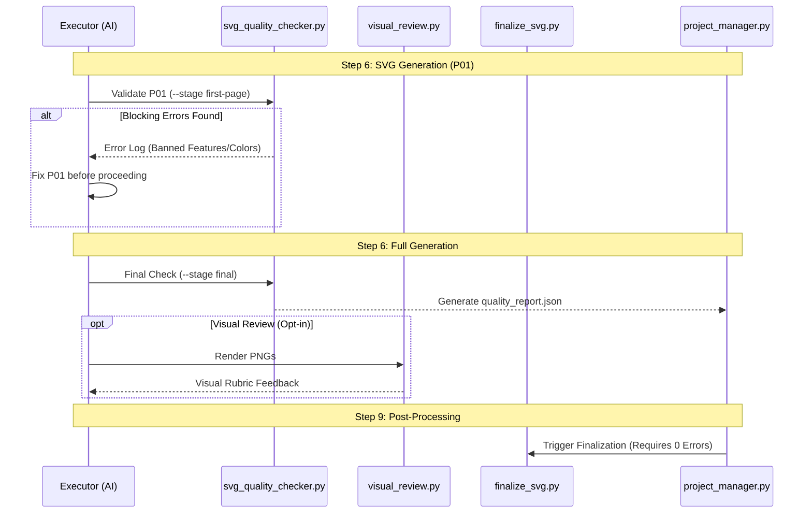

# Quality Assurance Tools

<details>
<summary>Relevant source files</summary>

The following files were used as context for generating this wiki page:

- [docs/rules/README.md](docs/rules/README.md)
- [docs/rules/code-style.md](docs/rules/code-style.md)
- [docs/technical-design.md](docs/technical-design.md)

</details>


## Purpose and Scope

The Quality Assurance (QA) subsystem in PPT Master provides technical validation and visual verification to ensure that AI-generated SVG content is both design-compliant and technically compatible with PowerPoint's DrawingML format. These tools enforce the "Banned Features Blacklist," validate typography and color schemes against the `spec_lock.md`, and provide a rendering-based feedback loop for visual polish.

The QA suite bridges the gap between the flexible SVG generation of the Executor roles and the rigid requirements of the `svg_to_pptx.py` conversion engine. It also extends to package-level validation for PPTX files and governance auditing for prompt/token usage.

**Sources:** [docs/technical-design.md:7-16](), [docs/technical-design.md:34-36]()

---

## QA System Architecture

The QA tools operate as gates between major pipeline stages. They translate natural language design constraints (from the Strategist) into programmatic checks on XML/SVG attributes and OOXML structures.

### Tool-to-Code Mapping

The following diagram associates high-level validation concepts with the specific code entities and data structures that implement them.

```mermaid
graph TB
    subgraph "Natural_Language_Space"
        Banned["Banned_Features_Blacklist"]
        SpecLock["spec_lock.md_Constraints"]
        VisualRubric["Visual_Rubric_Standards"]
        Governance["Governance_&_Budget"]
    end

    subgraph "Code_Entity_Space"
        QC["svg_quality_checker.py"]
        BV["batch_validate.py"]
        VR["visual_review.py"]
        PA["prompt_audit.py"]
        DC["pptx_delivery_check.py"]
        PU["project_utils.py:CANVAS_FORMATS"]
    end

    Banned -->|enforced_by| QC
    SpecLock -->|validated_by| QC
    SpecLock -->|checked_across_batch| BV
    VisualRubric -->|rendered_via_Playwright| VR
    Governance -->|linted_by| PA
    PU -->|defines_aspect_ratio| QC
    DC -->|validates_package| "pptx_opc_validation.py"
end
```

**Sources:** [docs/technical-design.md:13-26](), [docs/technical-design.md:83-86]()

---

## Technical Validation Tools

### svg_quality_checker.py

This is the primary enforcement tool for the SVG pipeline. It performs a multi-pass scan of all SVG files in a project's `svg_output/` or `svg_final/` directory. It supports a `--stage` flag to distinguish between the `first-page` gate and the `final` gate.

**Key Validation Categories:**

| Category | Implementation Detail | Constraint |
| :--- | :--- | :--- |
| **Banned Features** | Regex/DOM scan for forbidden tags | No `<mask`, `<style`, `<class`, `<foreignObject`, `<symbol`, `<use`, `<textPath`, or `<script`. |
| **Color Integrity** | HEX validation against `spec_lock.md` | All colors must match the 8-role color scheme; no `rgba()` or named colors. |
| **Typography Ramp** | Font-size envelope check | Font sizes must fall within the 0.5x to 5.0x body font range defined in the spec. |
| **Structural Geometry** | `viewBox` and aspect ratio | Must match `CANVAS_FORMATS` defined in `project_utils.py`. |
| **Transparency** | Attribute check | Opacity must be on leaf nodes (`fill-opacity`), never on groups (`<g opacity="...">`). |

**Sources:** [docs/technical-design.md:34-35](), [docs/technical-design.md:83-86]()

### batch_validate.py

Used for cross-project integrity and large-scale regression testing. It ensures that `spec_lock` drift hasn't occurred across multiple pages or projects.

- **Spec Drift Detection**: Verifies that every slide in a project uses the exact same `brand_id` and font-family configuration.
- **Structural Integrity**: Checks for missing mandatory files (`design_spec.md`, `spec_lock.md`, `notes/total.md`).
- **Batch Reporting**: Generates a summary of "Clean" vs "Dirty" projects in the `projects/` directory.

**Sources:** [docs/technical-design.md:86-86]()

---

## PPTX and Package Validation

### pptx_delivery_check.py & pptx_opc_validation.py

These tools validate the final output after the SVG-to-PPTX conversion to ensure the resulting file is not "corrupt" and meets delivery standards.

- **OPC Validation**: `pptx_opc_validation.py` checks the Open Packaging Conventions (OPC) structure, ensuring relationships (`.rels`) and Content Types are correctly mapped.
- **Delivery Standards**: `pptx_delivery_check.py` verifies the presence of mandatory slide layouts (Cover, Chapter, Content, Ending), checks for broken image links, and ensures speaker notes are attached where required.

**Sources:** [docs/technical-design.md:35-35]()

---

## Visual Review and Rendering

### visual_review.py

A Playwright-based tool that renders SVGs into high-resolution PNGs to facilitate a "Visual Self-Check" by the AI.

1. **PNG Rendering**: Uses a headless browser to ensure CSS-like properties (which the AI might have used despite bans) are rendered as they would appear in a viewer.
2. **Visual Rubric**: The AI reviews these PNGs against a "Visual Rubric" (alignment, contrast, white space, and adherence to the `page_rhythm` tag).
3. **Output**: Renders are stored in `projects/<project_name>/.preview/`.

**Sources:** [docs/technical-design.md:91-95]()

### prompt_audit.py

A maintainer-only tool for governance and cost control.
- **Token Budgeting**: Analyzes the token consumption of specific roles (Strategist vs Executor).
- **Governance Lint**: Checks prompts against the 8 Global Execution Discipline rules to prevent instruction drift.

**Sources:** [docs/rules/README.md:7-8]()

---

## QA Workflow Integration

Quality assurance is a mandatory gate in the pipeline. The `svg_quality_checker.py` is invoked twice: once for the first page (P01) as a method sample, and once for the full deck.



### Execution Discipline Rules
1. **The 0-Error Rule**: `svg_quality_checker.py` must pass with zero errors before `finalize_svg.py` is permitted to run.
2. **Spec Lock Enforcement**: Any manual edit to a slide that introduces a color not in `spec_lock.md` will be flagged by the checker.
3. **Artifact Ownership**: The `project_manager.py validate` command is the authoritative check for project structural completeness.

**Sources:** [docs/technical-design.md:34-38](), [docs/technical-design.md:83-86]()

---

## Command Reference

| Task | Command |
| :--- | :--- |
| **Validate Single Project** | `python3 scripts/project_manager.py validate <project_path>` |
| **Technical SVG Check** | `python3 scripts/svg_quality_checker.py <project_path> --stage final` |
| **Render Visual Previews** | `python3 scripts/visual_review.py <project_path>` |
| **PPTX Package Check** | `python3 scripts/pptx_delivery_check.py <path_to_pptx>` |
| **Prompt Governance** | `python3 scripts/prompt_audit.py --lint` |

**Sources:** [docs/rules/code-style.md:20-25](), [docs/technical-design.md:83-86]()
