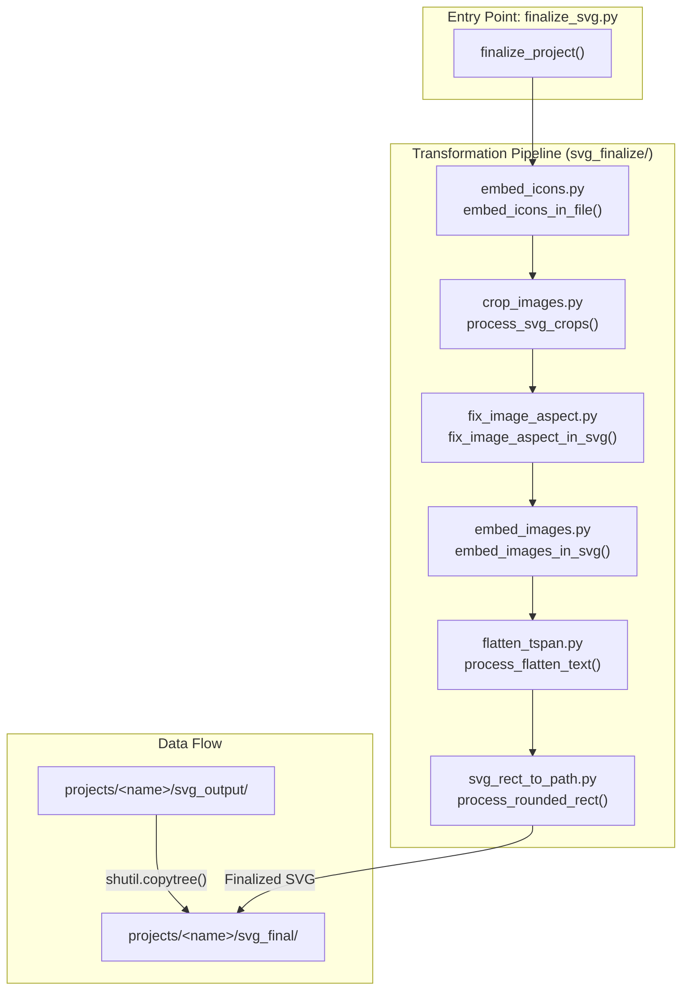
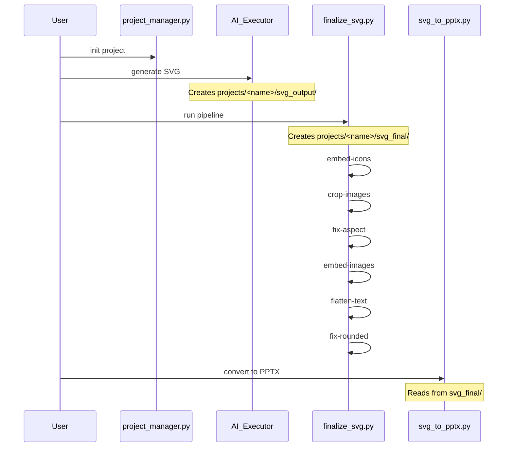

# SVG Processing Pipeline

<details>
<summary>Relevant source files</summary>

The following files were used as context for generating this wiki page:

- [docs/powerpoint-svg-mapping.md](docs/powerpoint-svg-mapping.md)
- [docs/technical-design.md](docs/technical-design.md)

</details>


This document describes the 6-step SVG post-processing pipeline that transforms raw AI-generated SVG files into production-ready, PowerPoint-compatible outputs. The pipeline is orchestrated by `finalize_svg.py` and operates on files in the `svg_output/` directory, writing results to `svg_final/`. It also covers `svg_authoring_view.py` for creating editable IR bundles.

For information about SVG quality validation before processing, see [Quality Assurance Tools (5.2)](). For information about converting finalized SVGs to PowerPoint format, see [Export and Conversion Tools (5.4)]().

---

## Pipeline Overview

The SVG processing pipeline addresses six distinct PowerPoint compatibility issues that cannot be handled during AI generation:

1.  **Icon Placeholder Resolution** - SVG icons cannot be referenced by AI models; placeholders must be post-processed.
2.  **Smart Image Cropping** - Implements `preserveAspectRatio=slice` by recalculating viewports.
3.  **Image Aspect Ratio Preservation** - Prevents image stretching as PowerPoint ignores `preserveAspectRatio` during conversion.
4.  **External Resource Embedding** - Converts relative image paths to Base64 data URIs for self-contained files.
5.  **Text Structure Simplification** - Flattens `<tspan>` hierarchies into simple `<text>` elements.
6.  **Rounded Corner Preservation** - Converts `rx`/`ry` attributes on `<rect>` elements into `<path>` data.

**Sources:** [scripts/finalize_svg.py:1-26](), [scripts/finalize_svg.py:112-202]()

---

## Pipeline Architecture

The processing pipeline is orchestrated by a single entry point that coordinates specialized modules within the `svg_finalize/` subpackage.

### Code Entity Mapping



**Processing Strategy:** The pipeline first copies the entire `svg_output/` directory to `svg_final/` [scripts/finalize_svg.py:115-120](), then applies transformations in-place. This preserves the original files and allows rollback. Each step is conditionally enabled via the `options` dictionary [scripts/finalize_svg.py:126-202]().

**Sources:** [scripts/finalize_svg.py:92-213]()

---

## Step 1: Icon Embedding

### Purpose
Replaces `<use data-icon="...">` placeholder elements with actual SVG path data from the icon library. This resolves references created during AI generation, where the model cannot directly embed icon SVGs.

### Technical Implementation
The script scans for `<use>` elements containing a `data-icon` attribute. It looks up the icon in the 11,600+ icon library (collections: `chunk-filled`, `tabler-filled`, `tabler-outline`, `phosphor-duotone`, `simple-icons`).

| Component | Description |
|-----------|-------------|
| **Input Pattern** | `<use data-icon="tabler-filled/star" x="10" y="10" width="24" height="24"/>` |
| **Lookup Path** | `templates/icons/tabler-filled/star.svg` |
| **Transformation** | Wraps icon content in a `<g transform="translate(x,y)">` and scales to target `width`/`height`. |

**Sources:** [scripts/finalize_svg.py:134-147](), [docs/shared-standards-core.md:124-142]()

---

## Step 2: Smart Image Cropping

### Purpose
Implements `preserveAspectRatio="slice"` behavior. Since PowerPoint ignores this attribute, the tool physically recalculates the image's viewport to simulate a center-crop.

### Implementation Logic
If an `<image>` has `preserveAspectRatio="slice"`, the tool:
1.  Determines the aspect ratio of the target box vs. the source image.
2.  Calculates the "zoom" required to fill the box entirely.
3.  Adjusts `x`, `y`, `width`, and `height` to center the image within the container while clipping the overflow.

**Sources:** [scripts/finalize_svg.py:149-161](), [docs/svg-image-embedding.md:45-60]()

---

## Step 3: Image Aspect Correction

### Purpose
Prevents image distortion. PowerPoint's SVG-to-shape conversion ignores `preserveAspectRatio="meet"`, causing images to stretch if the SVG container doesn't perfectly match the image file's ratio.

### Calculation
The tool reads the actual image dimensions and recalculates the `<image>` element's attributes to match the file's natural ratio while fitting within the designated bounding box.

**Sources:** [scripts/finalize_svg.py:149-161](), [docs/svg-image-embedding.md:45-60]()

---

## Step 4: Image Embedding (Base64)

### Purpose
Converts external image references (`href="path/to/img.png"`) to inline Base64 data URIs. This makes SVG files completely self-contained, ensuring they render correctly in the PPTX exporter and web viewers without relative path issues.

### Transformation
- **Before:** `<image href="../images/photo.jpg" .../>`
- **After:** `<image href="data:image/png;base64,..." .../>`

**Sources:** [scripts/finalize_svg.py:163-174](), [docs/svg-image-embedding.md:1-25]()

---

## Step 5: Text Flattening

### Purpose
Converts hierarchical `<text>` elements containing multiple `<tspan>` children into independent `<text>` elements. This improves compatibility with DrawingML conversion, which handles single-level text nodes more reliably.

### Implementation
- Inherits styles (font-size, fill, family) from the parent `<text>` node.
- Calculates absolute `x` and `y` for each `tspan` based on `dx`/`dy` relative offsets.
- Replaces the parent node with a sequence of flat nodes.

**Sources:** [scripts/finalize_svg.py:176-188](), [docs/shared-standards.md:65-75]()

---

## Step 6: Rounded Corner Conversion

### Purpose
Converts `<rect>` elements with `rx`/`ry` attributes to equivalent `<path>` elements. PowerPoint's "Convert to Shape" feature often resets rounded corners to 90-degree angles; converting to a path "bakes" the curves into the geometry.

### Path Construction
The tool generates a path string using:
- `M` (MoveTo) for the starting corner.
- `L` (LineTo) for straight edges.
- `A` (ArcTo) for the rounded corners using the `rx`/`ry` radii.

**Sources:** [scripts/finalize_svg.py:190-202](), [docs/shared-standards-core.md:144-160]()

---

## SVG Authoring View

`svg_authoring_view.py` serves as a bridge for creating editable IR (Intermediate Representation) bundles from imported SVGs. It generates an "Authoring View" which allows users or AI roles to view a flattened, annotated version of the SVG that highlights editable regions and semantic markers like `data-pptx-layer`.

### Key Functions
- **`generate_authoring_bundle()`**: Creates a project-specific bundle containing the original SVG, a simplified preview, and a metadata JSON mapping SVG IDs to semantic roles.
- **`annotate_svg_for_authoring()`**: Injects visual markers into the SVG to identify placeholders and group boundaries.

**Sources:** [docs/technical-design.md:13-26](), [docs/powerpoint-svg-mapping.md:55-65]()

---

## Execution and Integration

### Command Usage
The pipeline is invoked via the `finalize_svg.py` script. It **must** be run after the AI generates the initial SVGs and before `svg_to_pptx.py`.

```bash
# Standard execution
python3 scripts/finalize_svg.py projects/<project_name>

# Selective processing
python3 scripts/finalize_svg.py projects/<project_name> --only embed-icons,fix-rounded
```

### System Integration Diagram



### Constraints and Discipline
1.  **Serial Execution**: Steps are executed sequentially within `finalize_project` [scripts/finalize_svg.py:126-202]().
2.  **No Direct Export**: Never run `svg_to_pptx.py` on `svg_output/`. Always use the `svg_final/` directory produced by this pipeline to ensure compatibility.
3.  **Banned Features**: The pipeline is a prerequisite for PowerPoint compatibility as it handles features (like relative image paths and icon placeholders) that are problematic for the PPTX builder.

**Sources:** [scripts/finalize_svg.py:92-110](), [scripts/finalize_svg.py:126-202](), [docs/shared-standards.md:10-30]()
