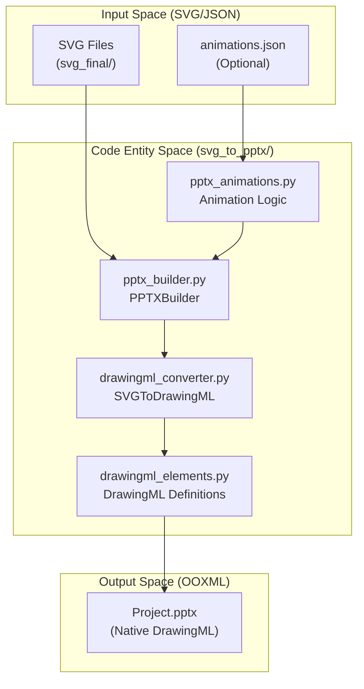
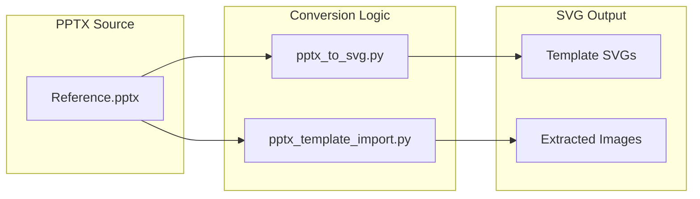

# Export and Conversion Tools

Relevant source files

The following files were used as context for generating this wiki page:

- [docs/animations.md](docs/animations.md)
- [docs/powerpoint-svg-mapping.md](docs/powerpoint-svg-mapping.md)
- [docs/technical-design.md](docs/technical-design.md)

This page documents the tools that transform finalized SVG artifacts into PowerPoint presentations, manage the reverse OOXML→SVG conversion path for template extraction, and handle complex slide-level and element-level animations. These tools ensure that AI-generated visual content is delivered as professional, natively editable PowerPoint files.

---

## Overview

The export and conversion ecosystem consists of four primary paths:

1.  **Forward Path (SVG → PPTX)**: Handled by `svg_to_pptx.py` and its supporting package. It converts project-canonical SVG XML into native DrawingML shapes and applies animations. [docs/technical-design.md:13-17](), [docs/animations.md:7-9]()
2.  **Reverse Path (PPTX → SVG)**: Handled by `pptx_to_svg.py` and the `pptx_to_svg/` package. This is used primarily for importing existing PPTX files as reusable templates or for content analysis. [docs/technical-design.md:69-70]()
3.  **Direct Patching Path**: Handled by `native_enhance_pptx.py` and `native_narration_pptx.py`, which modify existing OOXML files (adding notes, audio, or timings) without full regeneration. [docs/technical-design.md:54-56]()
4.  **Template Filling Path**: Managed by `template_fill_pptx.py`, which clones native PPTX structures and populates them with new content via an analyze/scaffold/apply pipeline. [docs/technical-design.md:54-55]()

---

## PowerPoint Export System

### The svg_to_pptx.py Tool

`svg_to_pptx.py` is the final step in the generation pipeline. It translates SVG files into native PowerPoint `.pptx` files. It translates project-canonical SVG into DrawingML/PPTX package semantics. [docs/powerpoint-svg-mapping.md:15-19](), [docs/technical-design.md:35-35]()

### Package Architecture: svg_to_pptx/

The export logic is encapsulated in the `svg_to_pptx/` package, which maps SVG elements to PowerPoint's OOXML (DrawingML) specification.

**Diagram 1: SVG to PPTX Conversion Architecture**

**Key Components:**
*   **`pptx_builder.py`**: The orchestrator. It initializes the `python-pptx` presentation, creates slides based on the file list, and triggers the conversion process.
*   **`drawingml_converter.py`**: The core logic engine. It parses SVG paths, rects, and text, mapping them to DrawingML equivalents. It handles coordinate transformations from SVG viewboxes to PowerPoint EMUs (English Metric Units) where `1 SVG px = 9,525 EMU`. [docs/powerpoint-svg-mapping.md:43-43]()
*   **`drawingml_elements.py`**: Contains XML templates for shapes, fills, and strokes that `python-pptx` does not natively support at a low level.
*   **`pptx_animations.py`**: Implements slide transitions and element entrance effects using native OOXML nodes. [docs/animations.md:7-9]()

**Sources:** [docs/technical-design.md:35-35](), [docs/powerpoint-svg-mapping.md:41-49](), [docs/animations.md:7-12]()

---

## Animation and Transition Management

The system supports both **Page Transitions** and **Per-element Entrance Animations**.

### Page Transitions
Controlled via the `-t/--transition` flag in `svg_to_pptx.py`. Supported effects include `fade` (default), `push`, `wipe`, `morph`, and `random`. [docs/animations.md:18-18](), [docs/animations.md:63-71]()
*   **Duration**: Set via `--transition-duration` (default 0.4s). [docs/animations.md:18-18]()
*   **Auto-Advance**: Controlled via `--auto-advance <seconds>` for kiosk-style playback. [docs/animations.md:33-33]()

### Per-element Animations
The system identifies top-level `<g id="...">` groups as animation anchors. [docs/animations.md:120-123]()
*   **Start Modes**: Supports `on-click`, `with-previous`, and `after-previous` (default). [docs/animations.md:90-95]()
*   **Customization**: Users can generate an `animations.json` using `animation_config.py scaffold <project>` to manually override order, effect, and timing. [docs/animations.md:126-131]()
*   **Entrance Effects**: The canonical registry contains 203 PowerPoint-native keys, including 53 entrance effects like `entrance_fade`, `entrance_fly_in`, and `entrance_wipe`. [docs/animations.md:112-114]()

### Anchor Mechanism
Animations are anchored to top-level `<g id="...">` groups. [docs/animations.md:120-123]()
*   **Decoration Skipping**: Groups with IDs containing `background`, `header`, `footer`, `logo`, or `nav` are automatically excluded from the animation sequence and appear immediately. [docs/animations.md:135-135]()
*   **Fallback**: For flat SVGs, the system uses individual primitives as anchors if there are 8 or fewer; otherwise, it skips per-element animation for that slide. [docs/animations.md:137-140]()

**Sources:** [docs/animations.md:1-163]()

---

## Reverse Path: PPTX to SVG Conversion

### The pptx_to_svg.py Tool
This tool performs the reverse conversion, allowing existing PowerPoint decks to be ingested into the system as templates or for content analysis.

**Diagram 2: Template Extraction and Conversion**

### Template Import Workflow
*   **`pptx_template_import.py`**: Specifically designed to extract brand assets, logos, and layout references from a corporate PPTX. It populates the `templates/layouts/` or `templates/brands/` directories. [docs/technical-design.md:66-68]()
*   **Integration**: Used in the `/create-template` workflow to ensure that AI-generated layouts match the structural constraints of existing corporate standards.

---

## Direct PPTX Manipulation

The system includes tools for modifying existing PPTX files without regenerating the visual layers.

*   **`template_fill_pptx.py`**: A multi-stage tool (`analyze`, `scaffold`, `check-plan`, `apply`, `validate`) used to clone a native PPTX structure and fill it with new content. [docs/technical-design.md:54-55]()
*   **`native_enhance_pptx.py`**: Appends OOXML patching to add notes, narration audio, timings, and transitions to an existing deck. [docs/technical-design.md:54-56]()
*   **`native_narration_pptx.py`**: Patches existing decks to embed audio files and synchronization data for automated narration. [docs/technical-design.md:54-56]()
*   **`video_motion_plan.py`**: Generates renderer-neutral motion plans from conversion traces, facilitating video export or complex motion design.

---

## Coordinate Calculation: svg_position_calculator.py

The `svg_position_calculator.py` utility is used for precise coordinate math, especially for data-driven charts where the AI needs to calculate the exact `x, y, width, height` of bars or segments within a specific canvas format.

*   **Canvas Formats**: Supports standard definitions like `ppt169` (1280x720) and `ppt43` (1024x768). [docs/powerpoint-svg-mapping.md:43-43]()
*   **Coordinate Validation**: Ensures values are finite and use the registered coordinate grammar. [docs/powerpoint-svg-mapping.md:45-45]()

---

## Command Reference

| Task | Command |
| :--- | :--- |
| **Standard Export** | `python3 skills/ppt-master/scripts/svg_to_pptx.py <project_path>` |
| **Export with Transitions** | `python3 skills/ppt-master/scripts/svg_to_pptx.py <project_path> -t push` |
| **On-Click Animations** | `python3 skills/ppt-master/scripts/svg_to_pptx.py <project_path> -a auto --animation-trigger on-click` |
| **Scaffold Animations** | `python3 skills/ppt-master/scripts/animation_config.py scaffold <project_path>` |
| **Template Import** | `python3 skills/ppt-master/scripts/pptx_template_import.py <source.pptx> <target_dir>` |
| **Auto-Advance Export** | `python3 skills/ppt-master/scripts/svg_to_pptx.py <project_path> --auto-advance 5` |
| **Describe Transition** | `python3 skills/ppt-master/scripts/pptx_animations.py --describe-transition <effect>` |

**Sources:** [docs/animations.md:30-38](), [docs/animations.md:83-85](), [docs/animations.md:126-131](), [docs/technical-design.md:66-68]()
