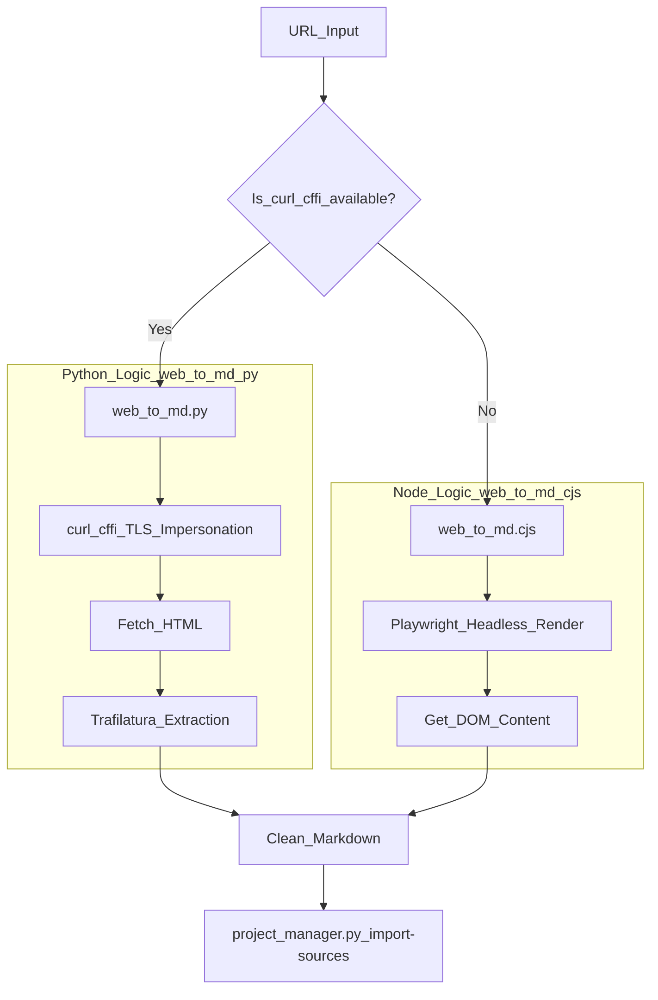

# Source Conversion Tools

<details>
<summary>Relevant source files</summary>

The following files were used as context for generating this wiki page:

- [docs/README.md](docs/README.md)
- [docs/technical-design.md](docs/technical-design.md)

</details>


The Source Conversion Tools are a suite of specialized scripts designed to ingest diverse input formats—including PDF, DOCX, PPTX, Excel, and Web URLs—and transform them into structured Markdown. This conversion is the critical first step in the PPT Master pipeline, enabling the AI Strategist to analyze content and the Executor roles to generate SVG slides based on a unified text representation.

### Overview of Conversion Pipeline

The conversion process standardizes heterogeneous data into a consistent Markdown format that preserves structural hierarchy (headings, lists, tables) and identifies key assets like images. The unified dispatcher `source_to_md.py` manages the routing to specific sub-scripts based on file extensions.

| Tool | Input Formats | Primary Engine | Key Feature |
| :--- | :--- | :--- | :--- |
| `pdf_to_md.py` | `.pdf` | PyMuPDF (fitz) | Font-size based heading detection |
| `doc_to_md.py` | `.docx`, `.html`, `.epub`, `.ipynb` | Native / Pandoc | Multi-format fallback system |
| `ppt_to_md.py` | `.pptx` | python-pptx | Slide-by-slide text extraction |
| `excel_to_md.py` | `.xlsx`, `.xlsm` | openpyxl / pandas | Sheet-to-table conversion |
| `web_to_md.py` | URLs (incl. WeChat) | curl_cffi / Trafilatura | TLS fingerprint impersonation for anti-bot bypass |
| `web_to_md.cjs` | URLs | Node.js / Playwright | Headless browser fallback |

**Sources:** [docs/technical-design.md:59-62](), [docs/technical-design.md:69-70]()

---

### PDF Conversion (`pdf_to_md.py`)

The PDF converter uses `PyMuPDF` to extract text and uses a heuristic-based approach to reconstruct the document's logical structure. Unlike simple text extractors, it analyzes font sizes to distinguish between headings and body text.

#### Implementation Logic
1.  **Text Block Extraction**: The tool iterates through PDF pages to retrieve text spans with metadata including font size, font flags, and color.
2.  **Heading Detection**: It calculates the statistical distribution of font sizes across the document. Text spans with font sizes significantly larger than the median (body text) are mapped to Markdown heading levels (`#`, `##`, etc.).
3.  **Image Extraction**: Identifies image objects within the PDF and saves them to the project's `images/` directory, maintaining a reference in the Markdown output.

**Sources:** [docs/technical-design.md:59-62]()

---

### Document and Spreadsheet Conversion

#### Document Conversion (`doc_to_md.py`)
This script provides a robust multi-format entry point. It prioritizes native Python libraries for common formats and falls back to `pandoc` for legacy or specialized document types.
*   **Native Support**: Handles `.docx` (via `python-docx`), `.html`, `.epub`, and `.ipynb` directly.
*   **Pandoc Fallback**: If the input is a legacy format like `.doc`, `.odt`, `.rtf`, or `.tex`, the script invokes the system's `pandoc` binary to perform the conversion to Markdown.

#### Spreadsheet Conversion (`excel_to_md.py`)
Converts Excel workbooks into Markdown tables. It iterates through worksheets, preserving the tabular structure which is essential for the AI Executor to generate data-driven charts in later stages.

**Sources:** [docs/technical-design.md:59-62]()

---

### Web Conversion (`web_to_md.py` & `web_to_md.cjs`)

Web conversion is handled by two distinct scripts to ensure high success rates across different website architectures and anti-scraping measures.

#### Python Implementation (`web_to_md.py`)
This is the primary tool. It utilizes `curl_cffi` to perform "impersonation" of modern browser TLS fingerprints. This is specifically required for accessing platforms like WeChat Articles or sites protected by Cloudflare that block standard `urllib` or `requests` headers. It uses `Trafilatura` for clean main-text extraction, stripping away navigation and ads.

#### Node.js Fallback (`web_to_md.cjs`)
If `curl_cffi` is unavailable or if the target site requires heavy JavaScript execution to render content, the system provides a Node.js fallback that uses Playwright for headless browsing to capture the fully rendered DOM.

#### Web Content Ingestion Flow
The following diagram illustrates how a URL is processed into a project-ready Markdown file.

**Title: Web Content Ingestion Flow**

**Sources:** [docs/technical-design.md:59-62]()

---

### Integration with Project Lifecycle

The source conversion tools are designed to work in tandem with `project_manager.py`. Once a source is converted to Markdown, it is imported into the project structure. A shared output contract ensures that every conversion generates a Markdown file and a `conversion_profile.json` sidecar containing metadata about the source.

#### Conversion and Import Workflow
1.  **Convert**: Run the unified dispatcher `source_to_md.py` against the user input [docs/technical-design.md:61]().
2.  **Initialize**: Create a new project directory using `project_manager.py init <project_name>` [docs/technical-design.md:64]().
3.  **Import**: Move the resulting `.md` and extracted images into the project using `project_manager.py import-sources <project_path> <sources...>` [docs/technical-design.md:66]().

**Title: Entity Mapping: Source Tools to Project Manager**
```mermaid
graph LR
    subgraph "Source_Conversion_Layer"
        Dispatcher["source_to_md.py"]
        PDF["pdf_to_md.py"]
        DOC["doc_to_md.py"]
        WEB["web_to_md.py"]
    end

    subgraph "Project_Management_Layer"
        PM_INIT["project_manager.py_init"]
        PM_IMPORT["project_manager.py_import-sources"]
        VAL["svg_quality_checker.py"]
    end

    Dispatcher --> PDF
    Dispatcher --> DOC
    Dispatcher --> WEB

    PDF -->|".md_+_images/"| PM_IMPORT
    DOC -->|".md"| PM_IMPORT
    WEB -->|".md"| PM_IMPORT
    
    PM_INIT -->| "Create_Project_Structure" | PM_IMPORT
    PM_IMPORT -->| "Populate_sources_directory" | VAL
```

**Sources:** [docs/technical-design.md:59-71]()

### Technical Constraints and Usage
*   **Sequential Execution**: Source processing is a pre-pipeline step that must be completed before the project is analyzed and the Strategist role is engaged [docs/technical-design.md:61-77]().
*   **Output Contract**: All tools aim to produce a single Markdown file that serves as the "source of truth" for the AI Strategist's content analysis.
*   **Source Profile**: Conversion results in a `source_profile.json` which helps the system understand the nature of the imported content [docs/technical-design.md:68]().
*   **Intake for PPTX**: When source files are PPTX, `project_manager.py import-sources` runs a specialized intake process to extract slide libraries and identity JSON files [docs/technical-design.md:68-69]().

**Sources:** [docs/technical-design.md:59-71]()
