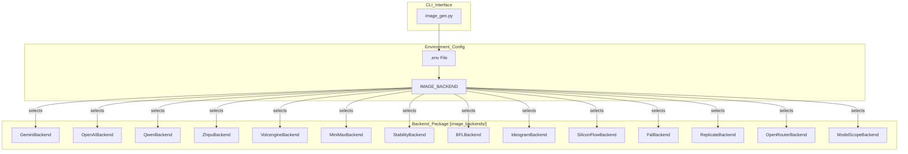
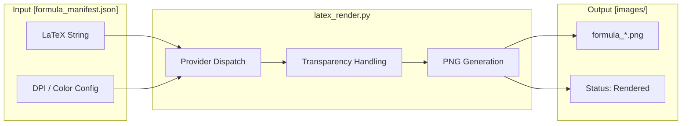

# Image Generation Tools

Relevant source files

The following files were used as context for generating this wiki page:

- [.env.example](.env.example)
- [docs/technical-design.md](docs/technical-design.md)

The image generation subsystem in PPT Master provides a unified interface for high-quality visual asset creation across 14 different AI model providers. It manages the transition from natural language prompts to physical image files, handling aspect ratio constraints, provider-specific API nuances, and local resource organization.

## Multi-Provider Dispatch System

The core of the image generation logic resides in `image_gen.py`, which acts as a dispatcher. It reads configuration from environment variables (often loaded from a `.env` file) to determine which backend to instantiate.

### Implementation and Data Flow

The system uses a factory-like pattern where `image_gen.py` imports specific backend classes from the `image_backends/` package. Each backend implements a standardized interface, ensuring that the main script can remain provider-agnostic.

1.  **Configuration Loading**: The script checks for `IMAGE_BACKEND` in the environment to identify the active provider [[.env.example:21-24]]().
2.  **Manifest Mode**: For production pipelines, the system uses `--manifest` to process batch requests from a JSON file (e.g., `image_prompts.json`). It supports concurrent execution via `IMAGE_CONCURRENCY`, which automatically halves upon encountering rate limits [[.env.example:26-29]]().
3.  **Prompt Processing**: The user-provided prompt is passed to the backend along with metadata such as aspect ratio and resolution requirements.
4.  **API Execution**: The backend handles the specific HTTP request structure required by the provider, including custom endpoints via `*_BASE_URL` [[.env.example:47-156]]().
5.  **Resource Persistence**: Generated images are saved to the project's `images/` directory. The manifest tracks the status of each asset, transitioning them from `Pending` to `Generated` or `Rendered` [[docs/technical-design.md:79-80]]().

### System Entity Mapping: Dispatcher to Backends

The following diagram illustrates how the `image_gen.py` script maps system-level requests to specific code entities within the `image_backends/` package.

**Image Generation Dispatch Flow**

Sources: [[.env.example:10-157]](), [[docs/technical-design.md:79-80]]()

---

## Supported Provider Backends

The system supports 14 backends, categorized by their primary use case and regional availability.

| Provider | Backend Key | Primary Model | Configuration Variables |
| :--- | :--- | :--- | :--- |
| **Gemini** | `gemini` | `gemini-3.1-flash-image-preview` | `GEMINI_API_KEY`, `GEMINI_MODEL` [[.env.example:65-67]]() |
| **OpenAI** | `openai` | `gpt-image-2` | `OPENAI_API_KEY`, `OPENAI_MODEL` [[.env.example:44-46]]() |
| **Qwen** | `qwen` | `qwen-image-2.0-pro` | `QWEN_API_KEY`, `QWEN_MODEL` [[.env.example:84-86]]() |
| **Zhipu** | `zhipu` | `glm-image` | `ZHIPU_API_KEY`, `ZHIPU_MODEL` [[.env.example:92-94]]() |
| **Volcengine** | `volcengine` | `doubao-seedream-4-5-251128` | `VOLCENGINE_API_KEY`, `VOLCENGINE_MODEL` [[.env.example:100-102]]() |
| **MiniMax** | `minimax` | `image-01` | `MINIMAX_API_KEY`, `MINIMAX_MODEL` [[.env.example:73-75]]() |
| **Stability** | `stability` | `stable-image-core` | `STABILITY_API_KEY`, `STABILITY_MODEL` [[.env.example:109-110]]() |
| **BFL** | `bfl` | `flux-pro-1.1-ultra` | `BFL_API_KEY`, `BFL_MODEL` [[.env.example:113-114]]() |
| **Ideogram** | `ideogram` | `ideogram-v3` | `IDEOGRAM_API_KEY`, `IDEOGRAM_MODEL` [[.env.example:117-118]]() |
| **SiliconFlow**| `siliconflow`| `Qwen/Qwen-Image` | `SILICONFLOW_API_KEY`, `SILICONFLOW_MODEL` [[.env.example:128-129]]() |
| **Fal** | `fal` | `fal-ai/imagen3/fast` | `FAL_KEY`, `FAL_MODEL` [[.env.example:132-133]]() |
| **Replicate** | `replicate` | `flux-1.1-pro` | `REPLICATE_API_TOKEN`, `REPLICATE_MODEL` [[.env.example:136-137]]() |
| **OpenRouter** | `openrouter` | `google/gemini-3.1...` | `OPENROUTER_API_KEY`, `OPENROUTER_MODEL` [[.env.example:140-141]]() |
| **ModelScope** | `modelscope` | `Z-Image-Turbo` | `MODELSCOPE_API_KEY`, `MODELSCOPE_MODEL` [[.env.example:153-155]]() |

Sources: [[.env.example:41-157]]()

---

## Image Search and Web Sources

When generated images are not required, `image_search.py` utilizes the `image_sources/` package to fetch existing assets from public repositories.

### Providers and Licensing
The system supports multiple web-based providers:
- **Openverse**: General creative commons search.
- **Wikimedia**: High-quality historical and scientific assets.
- **Pexels / Pixabay**: High-resolution photography.

The system enforces "license tier discipline," prioritizing public domain or CC-BY assets suitable for corporate presentations [[docs/technical-design.md:79-80]]().

---

## Utility Tools

### analyze_images.py
Before images are embedded into SVGs, `analyze_images.py` is used to validate the integrity and metadata of the generated assets.
- **Metadata Extraction**: Generates analysis containing Width, Height, AspectRatio, and PixelAspectRatio.
- **Asset Classification**: Categorizes images (e.g., "Portrait") and calculates coverage areas.
- **Compatibility Check**: Verifies if assets are `SvgRenderable` and `PptxNativeSupported` [[docs/technical-design.md:83-86]]().

### latex_render.py
Used for mathematical formula rendering. It converts LaTeX strings into high-quality PNG assets via external rendering providers.

**Formula Rendering Pipeline**

Sources: [[docs/technical-design.md:83-86]]()

---

## Configuration Pattern (.env)

The system utilizes a provider-specific environment variable pattern. This prevents naming collisions and allows multiple providers to be configured simultaneously.

### Implementation Details
- **Precedence**: Process environment variables take precedence over `.env` file values [[.env.example:5-8]]().
- **Resolution Order**: The system searches for `.env` in the following order:
    1.  Current working directory (`./.env`) [[.env.example:16]]()
    2.  Skill installation directory [[.env.example:17]]()
    3.  Repository root [[.env.example:18]]()
    4.  User-level config (`~/.ppt-master/.env`) [[.env.example:19]]()
- **Deprecated Variables**: `IMAGE_API_KEY`, `IMAGE_MODEL`, and `IMAGE_BASE_URL` are no longer supported to encourage provider-specific configuration [[.env.example:34-39]]().

Sources: [[.env.example:1-39]]()
