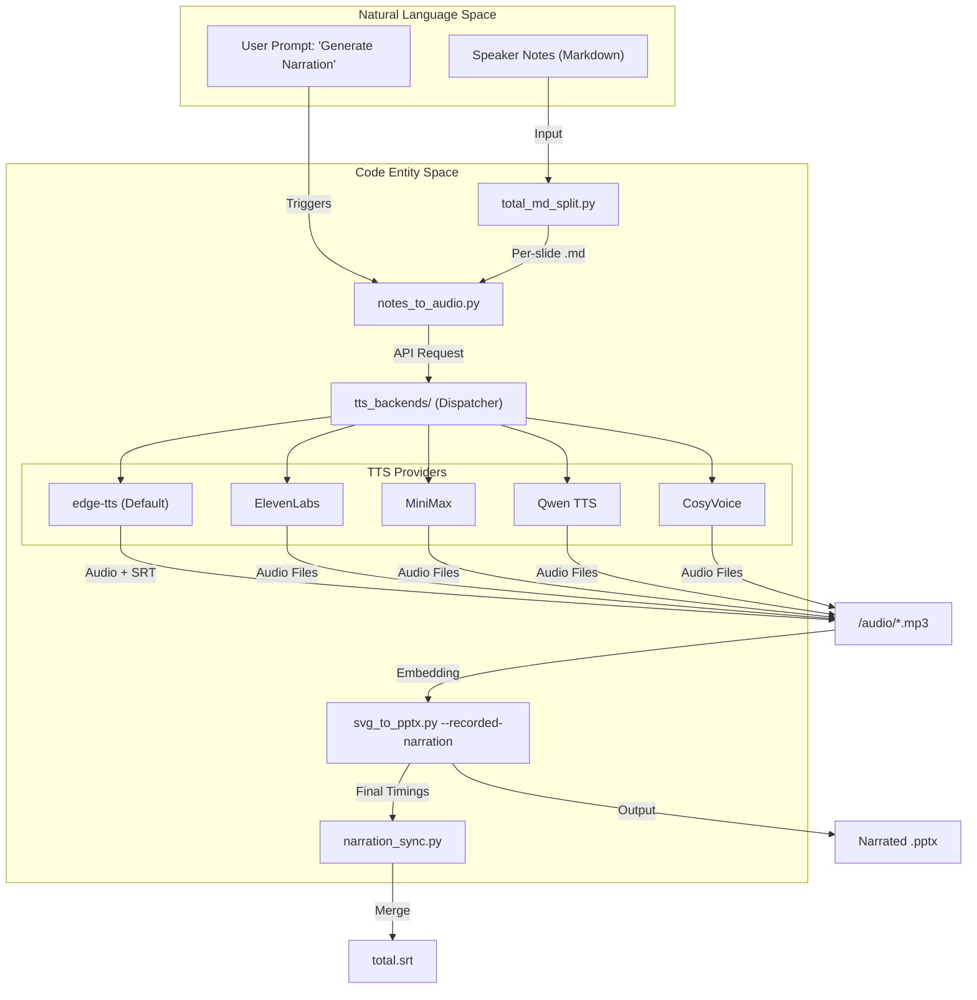
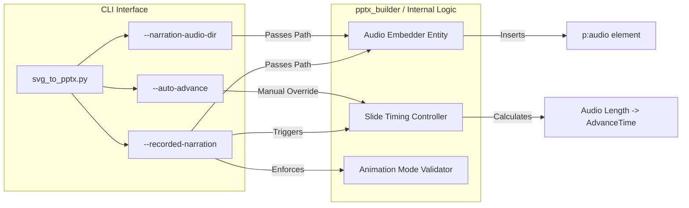

# Audio Narration Tools

<details>
<summary>Relevant source files</summary>

The following files were used as context for generating this wiki page:

- [.env.example](.env.example)
- [docs/animations.md](docs/animations.md)
- [docs/audio-narration.md](docs/audio-narration.md)

</details>


The Audio Narration Tools in PPT Master enable the transformation of speaker notes into high-quality voiceovers. By leveraging neural TTS (Text-to-Speech) engines, the system generates per-slide audio files, embeds them into the PowerPoint structure, and synchronizes slide transitions with audio duration. This allows for the creation of fully narrated presentations and automated video exports without manual timing adjustments.

## Overview and Workflow

The narration pipeline follows a structured "One question, one answer" interaction model where the AI analyzes the presentation's language and content density to recommend optimal voices and speaking rates [docs/audio-narration.md:21-23]().

### The Generation Pipeline

1.  **Note Preparation**: Speaker notes are extracted and split into per-slide Markdown files via `total_md_split.py` [docs/audio-narration.md:63-64]().
2.  **Voice Selection**: The system identifies the deck's primary locale (e.g., `zh-CN`, `en-US`) and fetches compatible voices [docs/audio-narration.md:50-52]().
3.  **Audio Synthesis**: `notes_to_audio.py` calls the selected TTS backend to generate MP3/M4A files for each slide [docs/audio-narration.md:66-98]().
4.  **Subtitle Generation**: With the `edge-tts` backend, the system writes page-local SRT files with word-boundary timing to `notes/subtitles/` [docs/audio-narration.md:11-12]().
5.  **PPTX Embedding**: `svg_to_pptx.py` consumes the generated audio directory, embedding files and setting `auto-advance` timings based on audio length [docs/audio-narration.md:14-15]().

### Narration Data Flow
This diagram bridges the user's intent to the specific scripts and backends involved in audio generation.

"Narration Data Flow: From Notes to Narrated PPTX"

Sources: [docs/audio-narration.md:7-15](), [docs/audio-narration.md:60-98](), [.env.example:172-182]()

---

## TTS Backends and Configuration

PPT Master supports five primary TTS backends. `edge-tts` is the default as it requires no API keys and provides high-quality neural voices across 90+ locales [.env.example:174-179](), [docs/audio-narration.md:7-8]().

### Backend Comparison

| Provider | Authentication | Key Feature | Cloned Voice Support |
| :--- | :--- | :--- | :--- |
| **edge-tts** | None | Free, 90+ locales, SRT output | No |
| **ElevenLabs** | `ELEVENLABS_API_KEY` | Professional multilingual | Yes (`voice_id`) [docs/audio-narration.md:74]() |
| **MiniMax** | `MINIMAX_API_KEY` | High-quality Chinese | Yes (`voice_id`) [docs/audio-narration.md:82]() |
| **Qwen TTS** | `DASHSCOPE_API_KEY` | Alibaba DashScope ecosystem | Yes (`voice_id`) [docs/audio-narration.md:89]() |
| **CosyVoice** | `COSYVOICE_API_KEY` | Advanced voice design | Yes (`voice_id`) [docs/audio-narration.md:97]() |

Sources: [.env.example:174-186](), [docs/audio-narration.md:70-98]()

### Voice Cloning Integration
For providers supporting cloned voices (ElevenLabs, MiniMax, Qwen, CosyVoice), the cloning process happens on the provider's platform. PPT Master acts as the **consumer**, utilizing the resulting `voice_id` to synthesize the deck's content [.env.example:176-182]().

---

## Embedding and Synchronization

The integration of audio into the final PPTX is handled by `svg_to_pptx.py` using two distinct paths [docs/audio-narration.md:29-35]():

### 1. Recorded Narration Path (`--recorded-narration`)
This is the high-level path used for video export. It requires a complete set of audio files matching the slide count.
- **Behavior**: Sets slide auto-advance timings to exactly match the audio duration [docs/audio-narration.md:14-15]().
- **Constraint**: Does not support `on-click` animation triggers; forces `after-previous` or `with-previous` for automated playback [docs/animations.md:96]().

### 2. Manual Audio Directory Path (`--narration-audio-dir`)
A lower-level path used for testing or partial coverage.
- **Behavior**: Embeds audio files where filenames match slide stems (e.g., `01_cover.mp3`) but allows partial coverage and does not force timing synchronization [docs/audio-narration.md:34]().

### 3. Narration Sync and Subtitles
When `edge-tts` is used, subtitles are generated per slide. `narration_sync.py` merges these into a deck-wide `total.srt` by reading the final slide timings from the exported PPTX [docs/audio-narration.md:13]().

### System Entity Association
This diagram maps the CLI parameters to the internal logic of the PPTX builder.

"Audio Embedding Logic and CLI Mapping"

Sources: [docs/audio-narration.md:29-35](), [docs/animations.md:33-38](), [docs/animations.md:96]()

---

## Live Preview and Annotations

The `svg_editor/server.py` provides a live preview environment for visual and narrative review before the final audio generation.

- **Live Preview Server**: A server that renders SVGs in real-time, facilitating immediate feedback on content and layout.
- **Annotation System**: Enables the placement of visual markers and commentary directly on slide previews, allowing for iterative refinement of speaker notes before they are committed to TTS.

Sources: [5.7 Purpose Statement](), [docs/audio-narration.md:21-23]()

## Manual Execution Commands

For advanced users, the scripts can be invoked directly:

```bash
# Step 1: Split notes
python3 skills/ppt-master/scripts/total_md_split.py <project_path>

# Step 2: Generate audio (Example using edge-tts)
python3 skills/ppt-master/scripts/notes_to_audio.py <project_path> \
  --voice zh-CN-YunjianNeural --rate +0%

# Step 3: Embed and set timings for video export
python3 skills/ppt-master/scripts/svg_to_pptx.py <project_path> \
  --recorded-narration audio
```
Sources: [docs/audio-narration.md:60-68](), [docs/audio-narration.md:33]()
