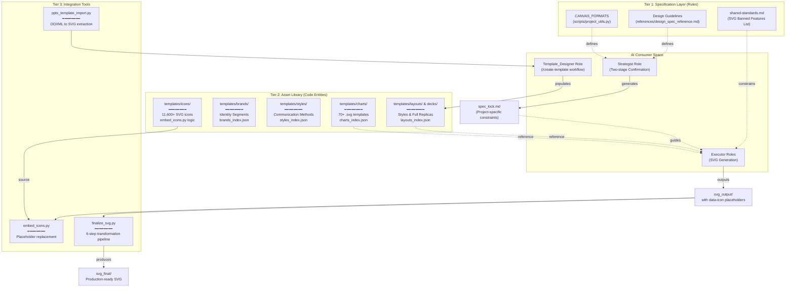
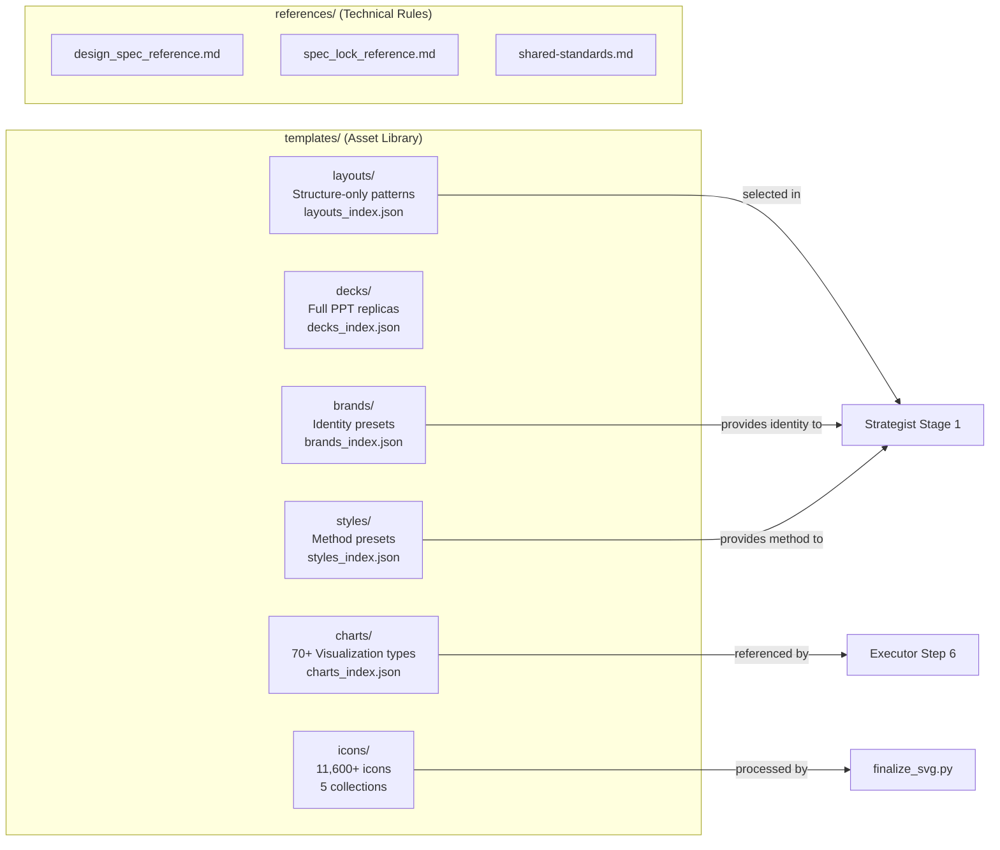

# Template and Design System

Relevant source files

The following files were used as context for generating this wiki page:

- [docs/README.md](docs/README.md)
- [docs/templates-architecture.md](docs/templates-architecture.md)
- [docs/templates-guide.md](docs/templates-guide.md)

## Purpose and Scope

The Template and Design System provides a comprehensive library of reusable design assets that constrain and enable all AI-generated SVG content in PPT Master. This system consists of four primary components: **layout templates** (categorized into Brand, Style, Layout, and Deck kinds), **chart templates** (70+ SVG visualization patterns), **icon library** (11,600+ vector icons), and **design guidelines** (specifications for canvas formats, colors, typography, and layout).

This page provides an overview of the entire design asset ecosystem and how it integrates with the AI role pipeline. For detailed information about specific components, see:
- Chart template specifications and usage → [Chart Template Library](#6.1)
- Icon library integration methods → [Icon Library](#6.2)
- Design specification rules → [Design Guidelines](#6.3)
- PowerPoint compatibility constraints → [PowerPoint Compatibility Rules](#6.4)
- Layout design styles and page types → [Layout and Style Template Library](#6.5)

**Sources**: [docs/templates-guide.md:7-14](), [docs/templates-architecture.md:13-21]()

---

## Design System Architecture

The design system operates as a **three-tier constraint framework** that governs all generated SVG output, bridging the gap between Natural Language requirements and Code Entity generation.

### Design Entity Mapping
The following diagram maps high-level design concepts to their specific code entities and file locations.

**Architecture Explanation**:
- **Tier 1** provides global constants and constraints (e.g., `CANVAS_FORMATS`) that the Strategist uses to initialize a project.
- **Tier 2** contains physical assets (SVGs and JSON indexes) categorized by "Kind" (Brand, Style, Layout, Deck) to allow for modular fusion.
- **Tier 3** consists of Python scripts that process raw AI output or import existing PPTX files into the system.
- **AI Consumer Space** represents the collaborative pipeline where the `Strategist` locks the design, `Executors` generate code, and `Template_Designer` expands the library.

**Sources**: [docs/templates-architecture.md:13-26](), [docs/templates-guide.md:36-42](), [docs/templates-architecture.md:82-107]()

---

## Template Classification (Brand / Style / Layout / Deck)

PPT Master utilizes a four-tier classification for its templates to allow for modular design fusion and conflict resolution.

| Kind | Physical Directory | Segment Ownership | Originating Workflow |
|---|---|---|---|
| **Brand** | `templates/brands/` | **Identity**: Color, Typography, Logo, Voice, Icon Style | `create-brand.md` |
| **Style** | `templates/styles/` | **Method**: Communication method, visual defaults, advisory focus | `create-style.md` |
| **Layout** | `templates/layouts/` | **Structure**: Canvas, Page Structure, Page Types, SVG Roster | `create-layout.md` |
| **Deck** | `templates/decks/` | **Full Family**: Identity + Structure + Application Context | `create-deck.md` |

### Fusion and Native Projection
Project template kinds do not map one-to-one to PresentationML objects; they are compiled during export:
- **Brand** projects into native Theme colors/fonts and fixed identity assets. [docs/templates-architecture.md:62-62]()
- **Layout** projects into Master/Layout/Placeholder topology and semantic text roles. [docs/templates-architecture.md:64-64]()
- **Deck** combines both projections plus descriptive application context and prototypes. [docs/templates-architecture.md:65-65]()
- **Style** provides proposal seeds for colors and fonts but has no reusable package structure; it guides Slide-local authoring. [docs/templates-architecture.md:63-63]()

**Sources**: [docs/templates-architecture.md:13-21](), [docs/templates-architecture.md:56-77]()

---

## Directory Structure and File Organization

The template system is centralized within the `skills/ppt-master/templates/` directory.

**Directory Manifest**:

| Directory | Contents | Purpose |
|-----------|----------|---------|
| `templates/layouts/` | Structure patterns (e.g., `presentation_core`) | Canvas and layout skeletons without brand locks. [docs/templates-architecture.md:19-19]() |
| `templates/decks/` | Full replicas | High-fidelity recreations of existing PPTX designs. [docs/templates-architecture.md:20-20]() |
| `templates/brands/` | Identity presets | Reusable brand guidelines (Colors, Logos, Fonts). [docs/templates-architecture.md:17-17]() |
| `templates/styles/` | Communication methods | Tone, data expression, and advisory review focus. [docs/templates-architecture.md:18-18]() |
| `templates/charts/` | 70+ SVG chart files + `charts_index.json` | Programmatic lookup for visualizations. |
| `templates/icons/` | 11,600+ icons (Chunk, Tabler, Phosphor, Simple) | Vector assets for `data-icon` embedding. |

**Sources**: [docs/templates-architecture.md:13-21](), [docs/templates-architecture.md:89-99]()

---

## Component Inventory

### Layout and Deck Library
The system supports numerous design styles. Each workspace directory contains a `templates/` folder with `design_spec.md` and SVG prototypes.
- **Selection**: Selection occurs in **Stage 1**. Explicit template intent or exact workspace roots expand the selectors. [docs/templates-guide.md:55-62]()
- **Standard Pages**: Workspaces typically include 5 standard page types: `cover`, `chapter`, `content`, `ending`, and `TOC`. [docs/templates-architecture.md:22-22]()

### Chart Template Library
A library of 70+ standardized SVG templates categorized for programmatic lookup:
- **Categories**: KPI Cards, Infographics, Process Diagrams, Strategic Frameworks, Relationship Diagrams.
- **Lookup**: Managed via `charts_index.json`.

### Icon Library
A massive collection of 11,600+ icons across five specialized collections:
- **Chunk-filled**: 640 geometric icons.
- **Tabler (Filled/Outline)**: 6000+ icons.
- **Phosphor-duotone**: 1200+ duotone icons.
- **Simple-icons**: 3400+ brand logos.

**Sources**: [docs/templates-guide.md:7-14](), [docs/templates-guide.md:72-86]()

---

## Design Constraint Hierarchy

The design system enforces constraints to ensure that AI-generated SVGs are compatible with the DrawingML converter.

### Banned vs. Allowed Features
To ensure PowerPoint compatibility, certain SVG features are strictly prohibited as defined in `shared-standards.md`.

| Category | Banned Features (Forbidden) | Allowed/Alternative |
|----------|----------------------------|---------------------|
| **Structural** | `mask`, `<style>`, `class`, `<foreignObject>`, `<symbol>` | `<defs>`, inline attributes |
| **Dynamic** | `<animate*>`, `<script>`, `<iframe>` | Static shapes only |
| **Text** | `textPath`, `@font-face` | Standard `<text>` and `<tspan>` |
| **Opacity** | `rgba()`, `<g opacity>` | `fill-opacity`, `stroke-opacity` |

### Canvas Format Standards
All generated content must strictly adhere to supported canvas formats (e.g., `ppt169`, `ppt43`, `a4`, `story_vertical`). [docs/templates-architecture.md:19-19]()

**Sources**: [docs/templates-architecture.md:13-21](), [docs/templates-guide.md:31-34]()

---

## Integration Workflow

The design system is integrated into the project lifecycle through specific file transformations.

1. **Initialization**: The user provides a template path or intent, triggering candidate preparation in Step 3. [docs/templates-guide.md:46-46]()
2. **Selection**: Stage 1 confirms the communication contract and specific template choice (Brand, Style, Layout, or Deck). [docs/templates-guide.md:55-57]()
3. **Installation**: A non-free selection installs the selected workspace's `templates/`, `images/`, and `icons/` into the project. [docs/templates-guide.md:86-86]()
4. **SVG Generation**: Executors generate raw SVGs using `data-icon` placeholders and adhering to the `design_spec.md`.
5. **Finalization**: `finalize_svg.py` runs the transformation pipeline to embed icons, fix aspect ratios, and flatten text for PPTX compatibility.

**Sources**: [docs/templates-guide.md:46-48](), [docs/templates-guide.md:86-88](), [docs/templates-architecture.md:104-107]()
