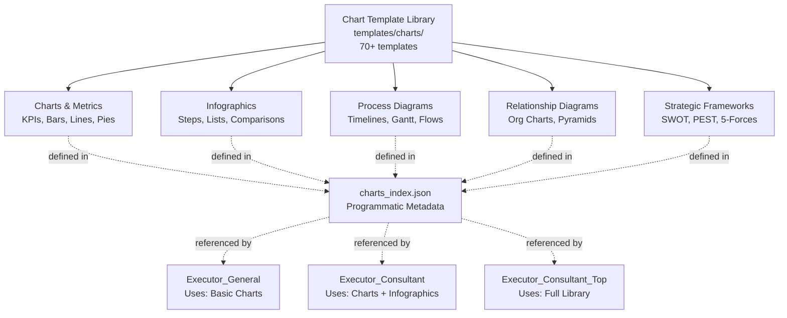
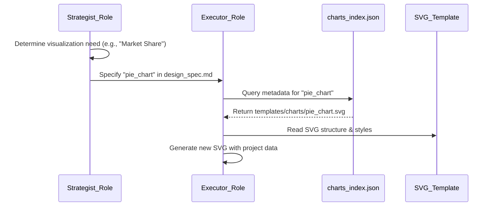
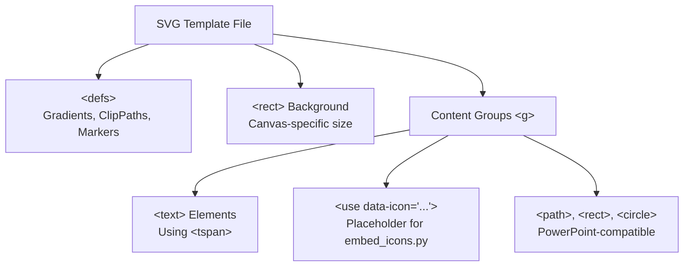

# Chart Template Library

Relevant source files

The following files were used as context for generating this wiki page:

- [docs/templates-architecture.md](docs/templates-architecture.md)
- [docs/templates-guide.md](docs/templates-guide.md)

## Purpose and Scope

The Chart Template Library provides 70+ standardized SVG visualization templates organized by analytical complexity and functional category. These templates serve as reusable building blocks that the Executor roles ([4.4]()) reference during content generation to maintain visual consistency and PowerPoint compatibility. This page documents the template categorization, the `charts_index.json` lookup mechanism, and technical customization patterns.

The library covers everything from standard KPI cards to complex strategic frameworks like Porter's Five Forces, all optimized for conversion to native PowerPoint DrawingML shapes via the `svg_to_pptx.py` pipeline.

---

## Template Organization

The library contains 70+ chart types organized into five primary categories. Each template is a self-contained SVG file following strict technical constraints to ensure it can be parsed by the `svg_to_pptx.py` converter.

### Template Hierarchy

**Sources:** [docs/templates-architecture.md:15-20](), [docs/templates-guide.md:29-34]()

---

## Programmatic Lookup: charts_index.json

The AI roles do not "guess" which templates are available. They consult `templates/charts/charts_index.json`, which serves as the registry for the library. This file maps template IDs to their file paths, display names, and recommended use cases. The Strategist role uses this index to select the most appropriate visualization during the two-stage confirmation process.

### Data Flow from Prompt to Template

**Sources:** [docs/templates-architecture.md:24-27](), [docs/templates-guide.md:86-86]()

---

## Category 1: Charts and Metrics

High-frequency data visualization templates used for quantitative analysis. These are typically the default choice for `Executor_General`.

| Template | File | Use Case |
|----------|------|----------|
| **KPI Cards** | `kpi_cards.svg` | Executive dashboards, high-level financial summaries |
| **Bar Chart** | `bar_chart.svg` | Volume comparison across categories |
| **Line Chart** | `line_chart.svg` | Time-series trends and growth rates |
| **Donut Chart** | `donut_chart.svg` | Composition and market share with center totals |
| **Gauge Chart** | `gauge_chart.svg` | Target achievement and risk levels |

**Key Features:**
- Standardized `viewBox` for specific canvas formats (e.g., `ppt169`). [docs/templates-architecture.md:89-93]()
- Data labels using `<tspan>` for multi-line support.
- Color schemes mapped to the 8-role system defined in `design_spec.md`. [docs/templates-architecture.md:62-65]()

**Sources:** [docs/templates-architecture.md:60-65](), [docs/templates-architecture.md:89-93]()

---

## Category 2: Strategic Frameworks

Professional consulting frameworks designed for the `Executor_Consultant_Top` role to deliver MBB-level analysis.

| Framework | File | Structure |
|-----------|------|-----------|
| **SWOT Analysis** | `swot_analysis.svg` | 2x2 Matrix for Internal/External factors |
| **Porter's Five Forces** | `porter_five_forces.svg` | Radial diagram for industry competitiveness |
| **PESTEL Analysis** | `pestel.svg` | 6-pillar macro-environmental scan |
| **Sankey Diagram** | `sankey_chart.svg` | Flow and distribution analysis (e.g., budget flow) |

**Sources:** [docs/templates-guide.md:31-34](), [docs/templates-guide.md:86-86]()

---

## Technical Structure and Customization

All 70+ templates follow a strict "Banned Features" list to ensure they can be converted to PowerPoint. This is critical because PowerPoint's DrawingML does not support the full SVG 2.0 specification.

### Standard Template Anatomy

### Customization Rules

1.  **Icon Integration**: Templates use `<use data-icon="icon-name" ...>` tags. The `finalize_svg.py` script replaces these with actual vector paths from the icon library during the post-processing phase. [docs/templates-architecture.md:109-111]()
2.  **Color Overrides**: AI roles override default `fill` and `stroke` attributes to match the `primary_color` and role-based colors specified in the project's `spec_lock.md`. [docs/templates-architecture.md:67-76]()
3.  **Typography**: All text must adhere to the semantic text roles defined in the `design_spec.md`, which defines roles for families and weights. [docs/templates-architecture.md:68-71]()

**Sources:** [docs/templates-architecture.md:67-76](), [docs/templates-architecture.md:109-111]()

---

## Usage Scenarios by Role

The complexity of the chart selected depends on the AI role's assigned "style" and the content density required:

*   **General/Flexible**: Uses standard bars, lines, and simple lists.
*   **Consulting (Standard)**: Uses waterfalls, dumbbells, and complex process flows. [docs/templates-guide.md:31-33]()
*   **Top Consulting (MBB)**: Uses specialized frameworks (Porter's, SWOT), Sankey diagrams, and advanced statistical visualizations. [docs/templates-guide.md:34-34]()

### Post-Processing Pipeline
Once a template is customized with project data, it must pass through the following tools:
1.  **finalize_svg.py**: Embeds icons, flattens text, and fixes rounded corners.
2.  **svg_quality_checker.py**: Validates against the banned features list (no `<style>`, `class`, or `filter`).
3.  **svg_to_pptx.py**: Converts the final SVG into native PowerPoint shapes.

**Sources:** [docs/templates-guide.md:7-13](), [docs/templates-guide.md:86-86]()

---

## Reference List of Categories

The library is expanded beyond basic charts to include structural diagrams:
- **Basic Charts**: Quantitative data (Bar, Line, Area, Pie, Donut).
- **Business Infographics**: Step lists, circular flows, comparison tables.
- **Process Diagrams**: Timelines, Gantt charts, and sequential flows.
- **Relationship Diagrams**: Org charts, pyramids, and Venn diagrams.
- **Strategic Frameworks**: SWOT, PESTEL, Porter's 5 Forces, BCG Matrix.

**Sources:** [docs/templates-guide.md:29-34](), [docs/templates-guide.md:86-86]()
