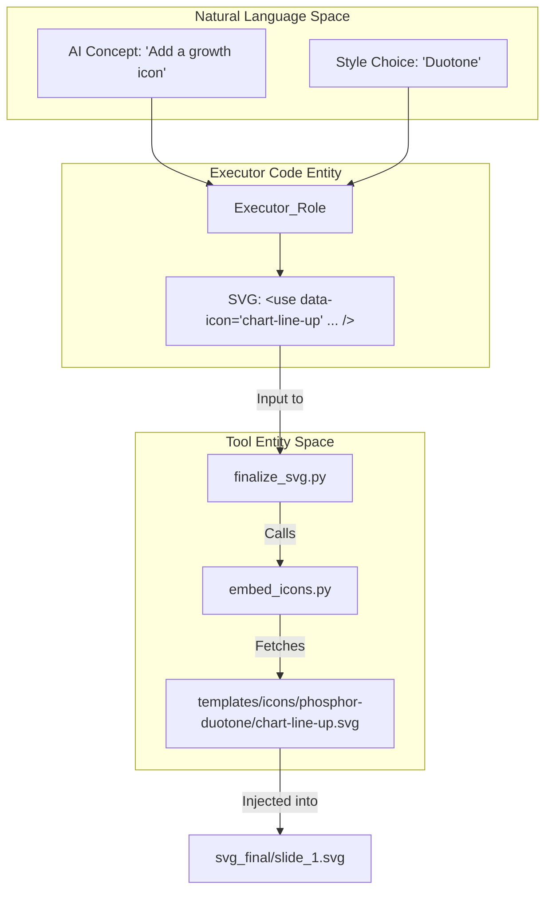
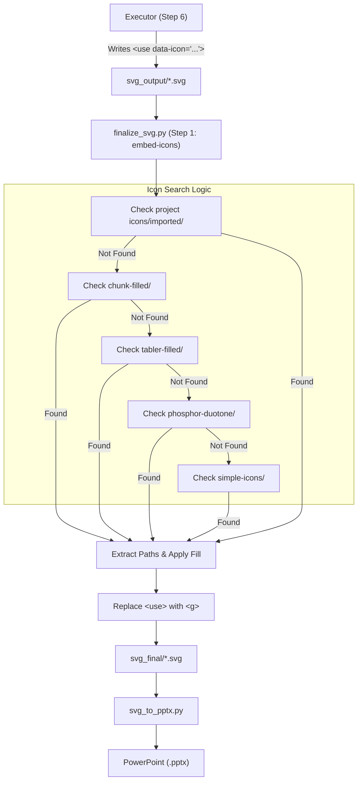

# Icon Library

<details>
<summary>Relevant source files</summary>

The following files were used as context for generating this wiki page:

- [docs/technical-design.md](docs/technical-design.md)
- [docs/templates-architecture.md](docs/templates-architecture.md)

</details>


The Icon Library is a comprehensive collection of over 11,600 pre-designed SVG icons integrated into the PPT Master system. This library provides a consistent visual vocabulary for business presentations, data visualization, and technical diagrams. The collection is categorized into five distinct styles to support various design aesthetics, from solid fills and sharp geometric shapes to modern brand logos and duotone compositions.

---

## Library Collections

The library is organized into five primary collections, each serving different design needs and adhering to specific visual standards.

| Collection | Count | Style | Characteristics |
| :--- | :--- | :--- | :--- |
| **chunk-filled** | 640 | Solid Fill | Sharp, high-contrast geometric icons for bold emphasis. |
| **tabler-filled** | 1000+ | Solid Fill | Rounded solid shapes for consistent UI and status indicators. |
| **tabler-outline** | 5000+ | Stroke/Outline | Modern, lightweight icons with uniform stroke weights. |
| **phosphor-duotone** | 1200+ | Duotone | Two-tone icons for sophisticated, modern visual depth. |
| **simple-icons** | 3400+ | Brand Logos | Official logos for technology, social media, and corporate brands. |

Sources: [docs/templates-architecture.md:109-111](), [docs/technical-design.md:80-80]()

### Directory Structure

The physical library is stored within the `templates/` hierarchy, allowing both global library access and project-specific overrides.

```text
skills/ppt-master/templates/icons/
├── chunk-filled/         # 640 sharp geometric icons
├── tabler-filled/        # 1000+ rounded fill icons
├── tabler-outline/       # 5000+ stroke icons
├── phosphor-duotone/     # 1200+ duotone icons
└── simple-icons/         # 3400+ brand logos
└── imported/             # Canonical imported vector assets
```

Sources: [docs/templates-architecture.md:95-96](), [docs/templates-architecture.md:109-111]()

---

## Integration Methods

PPT Master supports two methods for integrating icons into SVG slides. The system-preferred method uses placeholders to maintain clean source code during generation and allows for post-generation styling.

### Method 1: Placeholder + Script Embedding (Recommended)

This method allows AI Executor roles (such as `executor-base.md` or `executor-chart.md`) to specify icon placement and styling without generating complex path data directly. The `finalize_svg.py` pipeline handles the physical embedding via the `embed_icons` step.

#### Placeholder Syntax
Executors insert icons using the `<use>` element with a `data-icon` attribute. The system searches for the icon name across all collections automatically.

```xml
<!-- Example: Embedding a rocket icon with specific styling -->
<use data-icon="rocket" x="100" y="200" width="48" height="48" fill="#0076A8"/>
```

**Attribute Specifications**:
*   `data-icon`: The filename of the icon (without `.svg` extension). To use project-specific icons, use `imported/<name>`.
*   `x`, `y`: Coordinates for placement on the canvas.
*   `width`, `height`: Target dimensions for scaling.
*   `fill`: The hex color code applied to the icon paths during embedding.

Sources: [docs/templates-architecture.md:109-111](), [docs/technical-design.md:105-106]()

#### Data Flow: Natural Language to Code Entity

This diagram bridges the gap between the AI's conceptual choice of an icon and the technical execution within the codebase.



Sources: [docs/technical-design.md:81-86](), [docs/templates-architecture.md:109-111]()

---

### Method 2: Direct Copy (Path Embedding)

Executors may choose to copy the `<path>` data directly into the SVG. This is typically used for custom icons not found in the library or when immediate visual feedback is required in the `svg_output/` stage before finalization. However, this is discouraged as it bypasses the `svg_quality_checker.py` validation for banned features if the source SVG is not pre-cleaned.

Sources: [docs/technical-design.md:15-17](), [docs/technical-design.md:34-34]()

---

## Automation: finalize_svg.py

The `embed-icons` logic (implemented in the `svg_finalize/` subpackage) is responsible for resolving placeholders.

### Implementation Logic

1.  **Scanning**: The script parses the SVG file in `svg_output/` to find all `<use>` tags containing the `data-icon` attribute.
2.  **Resolution**: It searches the subdirectories (`chunk-filled`, `tabler-filled`, `tabler-outline`, `phosphor-duotone`, `simple-icons`) for a matching filename.
3.  **Transformation**: It calculates a transformation matrix based on the `x`, `y`, `width`, and `height` attributes provided in the placeholder to fit the icon into the designated bounding box.
4.  **Injection**: It extracts the `<path>` or `<polyline>` elements from the source icon, wraps them in a `<g>` (group) tag, applies the calculated transform and `fill` color, and replaces the placeholder.

### Pipeline Execution
Icon embedding is the first step in the 6-step `finalize_svg.py` transformation pipeline.

```bash
# Run as part of the full pipeline
python3 scripts/finalize_svg.py <project_path>

# Targeted execution for icons only
python3 scripts/finalize_svg.py <project_path> --only embed-icons
```

Sources: [docs/technical-design.md:83-86](), [docs/templates-architecture.md:105-107]()

---

## Technical Specifications

To ensure compatibility with the `svg_to_pptx.py` converter and PowerPoint's DrawingML, all icons must follow the project's "Banned Features Blacklist".

| Feature | Specification |
| :--- | :--- |
| **Base ViewBox** | Standardized to `0 0 16 16`, `0 0 24 24`, or `0 0 32 32` depending on collection. |
| **Styling** | Must use `fill` or `stroke` attributes; CSS `style` or `class` tags are **BANNED**. |
| **Complexity** | Simple paths preferred; `mask`, `foreignObject`, `symbol`, and `filter` are **BANNED**. |
| **Output** | Converted to DrawingML `<a:path>` elements within `<p:sp>` (Shape) objects in PPTX. |

Sources: [docs/technical-design.md:15-17](), [docs/templates-architecture.md:22-22]()

### Integration Workflow Diagram



Sources: [docs/technical-design.md:83-86](), [docs/templates-architecture.md:109-111]()

---

## Icon Search Patterns

AI Roles (Strategist and Executor) use specific patterns to select icons based on the `design_spec.md` and the selected `Style` template:

1.  **Business/Consulting**: Prefers `tabler-filled` or `phosphor-duotone` for high-impact KPIs (e.g., `trending-up`, `users`, `currency-dollar`) to provide visual weight.
2.  **Technical/IT**: Prefers `tabler-outline` for complex architecture diagrams (e.g., `database`, `server`, `cpu`) to maintain a lightweight aesthetic.
3.  **Brand References**: Uses `simple-icons` for social media links, technology stack mentions, or partner logos (e.g., `github`, `react`, `aws`).
4.  **Status/Markers**: Prefers `chunk-filled` for list bullets and simple callouts where high contrast is required.

Sources: [docs/templates-architecture.md:17-18](), [docs/templates-architecture.md:26-26]()
