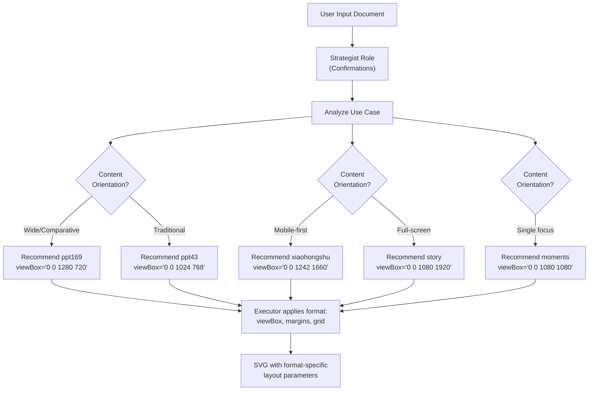
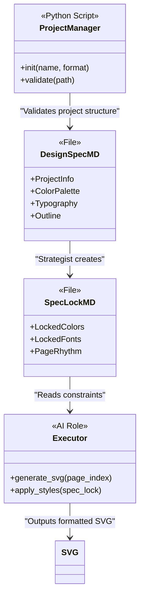

# Design Guidelines

Relevant source files

The following files were used as context for generating this wiki page:

- [docs/powerpoint-svg-mapping.md](docs/powerpoint-svg-mapping.md)
- [docs/templates-architecture.md](docs/templates-architecture.md)
- [examples/ppt169_attention_is_all_you_need/design_spec.md](examples/ppt169_attention_is_all_you_need/design_spec.md)

## Purpose and Scope

This document specifies the design constraints and specifications that govern all AI-generated SVG content in the PPT Master system. These guidelines define canvas formats, color systems, typography hierarchies, layout grids, and the logical principles that the Strategist and Executor roles must follow. 

The system relies on a central "Design Spec" created by the **Strategist** and locked via `spec_lock.md` to ensure visual consistency across multi-page generation.

---

## Canvas Format System

The system supports 9+ canvas formats through a centralized format registry that defines dimensions, aspect ratios, and usage contexts. This registry is the single source of truth for all canvas specifications.

### Format Registry Structure

The canvas format system is implemented in `scripts/project_utils.py` as the `CANVAS_FORMATS` dictionary [scripts/project_utils.py:11-50](). It provides the standard `viewBox` coordinates used by the AI to position elements.

### Format Categories and Specifications

| Category | Format ID | Dimensions | Aspect Ratio | Primary Use Case |
|----------|-----------|------------|--------------|------------------|
| **Presentation** | `ppt169` | 1280×720 | 16:9 | Modern business presentations |
| | `ppt43` | 1024×768 | 4:3 | Traditional projector formats |
| **Social Media** | `xiaohongshu` | 1242×1660 | 3:4 | Knowledge sharing (RED) |
| | `moments` | 1080×1080 | 1:1 | WeChat Moments/Posters |
| | `story` | 1080×1920 | 9:16 | Vertical Short Video/Stories |
| **Marketing** | `wechat` | 1080×1920 | 9:16 | WeChat article headers |
| **Print** | `a4` | 2480×3508 | A4 | Print documents, PDF reports |

### Canvas Format Selection Flow

Title: Canvas Selection Logic

**Sources:** [scripts/project_utils.py:11-50](), [examples/ppt169_attention_is_all_you_need/design_spec.md:19-27](), [docs/powerpoint-svg-mapping.md:41-43]()

---

## Color System Architecture

The system utilizes an 8-role color scheme defined in the `design_spec.md`. This ensures that every element (background, text, emphasis) has a programmatic color mapping.

### 8-Role Color Scheme

As seen in the `attention_is_all_you_need` example, colors are assigned specific functional roles to maintain semantic consistency [examples/ppt169_attention_is_all_you_need/design_spec.md:39-54]().

| Role | HEX (Example) | Purpose |
|------|---------------|---------|
| **Background** | `#FFFFFF` | Page background |
| **Secondary bg** | `#F5F7FA` | Card / region background |
| **Primary** | `#1A365D` | Title, schematic lines, primary box stroke |
| **Accent** | `#3182CE` | Key data, highlighted path, focus elements |
| **Secondary accent** | `#63B3ED` | Gradient transitions, secondary emphasis |
| **Body text** | `#1A202C` | Main body text |
| **Secondary text** | `#4A5568` | Captions, annotations |
| **Border/divider** | `#E2E8F0` | Card borders, divider lines |

### Implementation in Code Space

The color scheme is defined in the `design_spec.md` and then "locked" into `spec_lock.md`. The **Executor** roles read these hex codes to apply `fill` and `stroke` attributes to SVG elements. The `spec_lock.md` file serves as the runtime constant file for the generation phase [examples/ppt169_attention_is_all_you_need/spec_lock.md:7-19]().

**Sources:** [examples/ppt169_attention_is_all_you_need/design_spec.md:39-54](), [examples/ppt169_attention_is_all_you_need/spec_lock.md:7-19](), [docs/templates-architecture.md:60-65]()

---

## Typography Rules

The system follows a strict **font-size ramp** based on the "Body" text size. All other elements must scale proportionally (0.5x to 5.0x).

### Typography Hierarchy (Transformer Paper Example)

**Baseline**: Body font size = **20px** [examples/ppt169_attention_is_all_you_need/design_spec.md:103-103]().

| Purpose | Ratio to body | Example Size | Weight |
|---------|---------------|--------------|--------|
| **Cover title** | 2.5-5x | 64px | Bold |
| **Chapter opener**| 2-2.5x | 44px | Bold |
| **Page title** | 1.5-2x | 36px | Bold |
| **Hero number** | 1.5-2x | 40px | Bold |
| **Subtitle** | 1.2-1.5x | 26px | SemiBold |
| **Body content** | **1x** | **20px** | Regular |
| **Annotation** | 0.7-0.85x | 14px | Regular |
| **Footnote** | 0.5-0.65x | 11px | Regular |

### System Font Stack
The system prioritizes cross-platform compatibility:
- **Title Stack**: `Georgia, "Microsoft YaHei", serif` [examples/ppt169_attention_is_all_you_need/spec_lock.md:25-25]()
- **Body Stack**: `Arial, "Microsoft YaHei", "PingFang SC", sans-serif` [examples/ppt169_attention_is_all_you_need/spec_lock.md:26-26]()
- **Code Stack**: `Consolas, "Courier New", monospace` [examples/ppt169_attention_is_all_you_need/spec_lock.md:28-28]()

**Sources:** [examples/ppt169_attention_is_all_you_need/design_spec.md:101-115](), [examples/ppt169_attention_is_all_you_need/spec_lock.md:23-36]()

---

## Layout Principles: Page Rhythm

To prevent visual fatigue, the system uses the `page_rhythm` principle. Each slide is tagged with a rhythm type that dictates its density.

### Rhythm Types

1.  **Anchor (A)**: High visual impact, low text density (e.g., Covers, Chapter Dividers) [examples/ppt169_attention_is_all_you_need/spec_lock.md:57-57]().
2.  **Dense (D)**: High information density, multiple columns/charts (e.g., Data Dashboards, Detailed Comparison) [examples/ppt169_attention_is_all_you_need/spec_lock.md:58-58]().
3.  **Breathing (B)**: Balanced layout with significant whitespace (e.g., Key Takeaways, Simple Lists) [examples/ppt169_attention_is_all_you_need/spec_lock.md:59-59]().

### Layout Grid Specifications (Example: attention_is_all_you_need)
- **Canvas Size**: 1280×720 [examples/ppt169_attention_is_all_you_need/design_spec.md:24-24]()
- **Safe Margins**: Left/Right 60px, Top/Bottom 50px [examples/ppt169_attention_is_all_you_need/design_spec.md:26-26]()
- **Content Area**: 1160×620 inside margins [examples/ppt169_attention_is_all_you_need/design_spec.md:27-27]()
- **Card Spacing**: 24px gap, 24px padding, 12px border radius [examples/ppt169_attention_is_all_you_need/design_spec.md:159-161]()

**Sources:** [examples/ppt169_attention_is_all_you_need/design_spec.md:123-165](), [examples/ppt169_attention_is_all_you_need/spec_lock.md:56-72]()

---

## Design Spec Template Structure

The **Strategist** generates a 11-section design specification. This document acts as the "source of truth" for the entire project lifecycle.

### 11-Section Structure

1.  **Project Information**: Name, format, page count, style, audience [examples/ppt169_attention_is_all_you_need/design_spec.md:5-15]().
2.  **Canvas Specification**: Dimensions, margins, content area [examples/ppt169_attention_is_all_you_need/design_spec.md:19-28]().
3.  **Visual Theme**: Style (e.g., "General Consulting"), tone, color scheme, image strategy [examples/ppt169_attention_is_all_you_need/design_spec.md:31-62]().
4.  **Typography System**: Font stacks, size hierarchy, formula policy [examples/ppt169_attention_is_all_you_need/design_spec.md:83-120]().
5.  **Layout Principles**: Page structure, pattern library, spacing specs [examples/ppt169_attention_is_all_you_need/design_spec.md:123-165]().
6.  **Icon Usage Specification**: Library source (e.g., `tabler-outline`), stroke width, inventory [examples/ppt169_attention_is_all_you_need/design_spec.md:168-185]().
7.  **Image Strategy**: Backgrounds, rendering style (e.g., "blueprint"), palette.
8.  **Content Analysis**: Core message, logical structure.
9.  **Page Rhythm**: Sequential rhythm tagging (Anchor/Dense/Breathing).
10. **Detailed Outline**: Per-page content, layout patterns, and chart types.
11. **Resource List**: Image and formula manifest.

### Mapping Natural Language to Code Entities

Title: Design Data Flow

**Sources:** [examples/ppt169_attention_is_all_you_need/design_spec.md:1-200](), [examples/ppt169_attention_is_all_you_need/spec_lock.md:1-91](), [docs/templates-architecture.md:13-22]()

---

## Technical Enforcement

### Validation and Restrictions
The system strictly forbids certain SVG features to maintain PowerPoint compatibility [docs/powerpoint-svg-mapping.md:59-60]():
- **Forbidden Features**: `<style>`, `class`, `<foreignObject>`, `textPath`, `<animate*>`, `<symbol>`, and `rgba()` colors [examples/ppt169_attention_is_all_you_need/spec_lock.md:85-91]().
- **Opacity Handling**: Opacity must be set on individual children, not on groups (`<g opacity>`) [examples/ppt169_attention_is_all_you_need/spec_lock.md:89-89]().

### Post-Processing via `finalize_svg.py`
The design is further refined by:
1.  **`embed-icons`**: Replacing `<use data-icon>` with actual paths from the library.
2.  **`fix-aspect`**: Preventing image stretching in `<image>` tags.
3.  **`flatten-text`**: Converting `tspan` structures to simple PPT-compatible text.
4.  **`fix-rounded`**: Converting `rect` with `rx` to `path` for better PowerPoint rendering.

**Sources:** [examples/ppt169_attention_is_all_you_need/spec_lock.md:85-91](), [docs/powerpoint-svg-mapping.md:43-49]()
