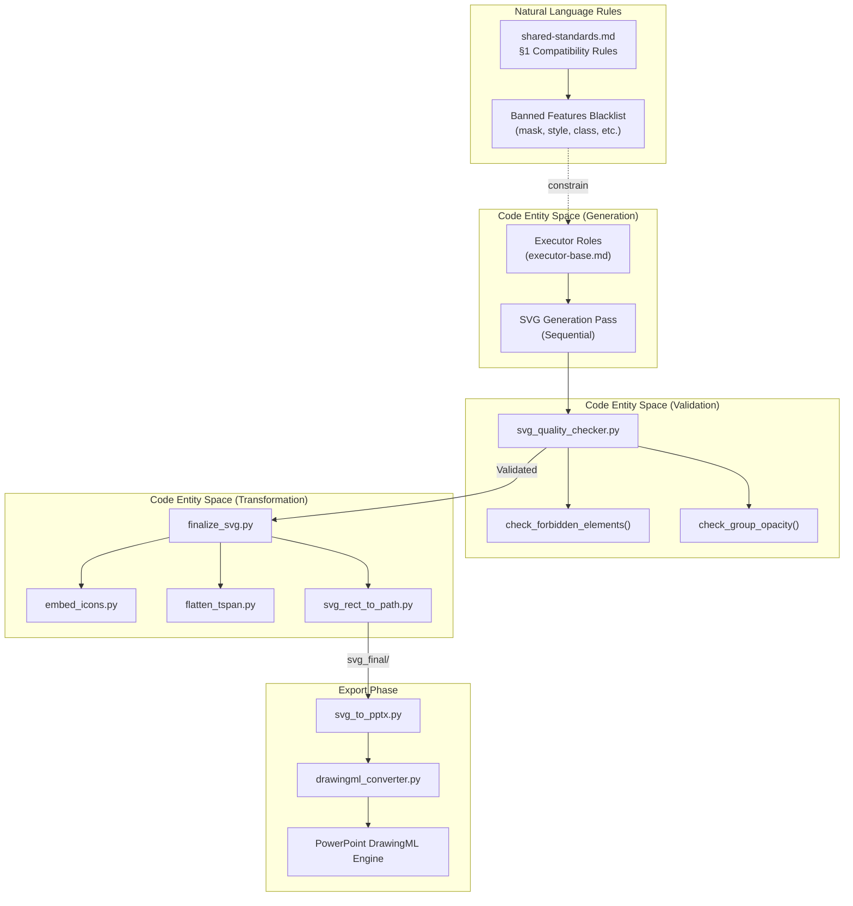
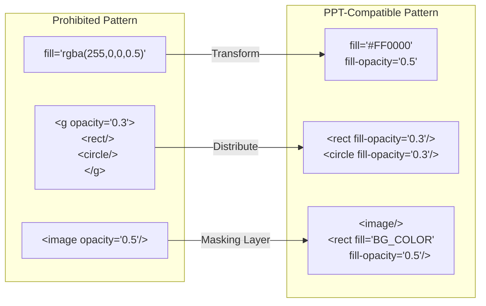

# PowerPoint Compatibility Rules

Relevant source files

The following files were used as context for generating this wiki page:

- [docs/powerpoint-svg-mapping.md](docs/powerpoint-svg-mapping.md)
- [docs/technical-design.md](docs/technical-design.md)

## Purpose and Scope

This document specifies the critical SVG compatibility constraints required for successful export to PowerPoint format. PowerPoint's SVG rendering engine has significant limitations compared to modern web browsers, requiring strict adherence to specific markup patterns to ensure visual fidelity after conversion to native DrawingML shapes.

**Scope**: This page covers transparency handling, prohibited SVG features (the "Banned Features Blacklist"), conditionally allowed features (markers and clipPaths), masking layer solutions, and the DrawingML element mapping table.

**Target Files**: These rules apply to all SVG files generated by Executor roles in `svg_output/` directories before processing by `finalize_svg.py` and conversion by `svg_to_pptx.py`.

**Sources**: [docs/technical-design.md:9-15](), [docs/technical-design.md:141-147]()

---

## Compatibility Architecture Overview

The system uses a multi-stage enforcement pipeline to bridge the gap between AI-generated SVG and PowerPoint's DrawingML. The "project-canonical SVG" acts as an intermediate language that restricts the full SVG standard to a subset PowerPoint can understand.

**Diagram**: PowerPoint Compatibility Enforcement Pipeline - Shows how standard rules are enforced through AI roles, validation scripts, and the final DrawingML conversion.

**Sources**: [docs/technical-design.md:13-26](), [docs/technical-design.md:34-37](), [docs/technical-design.md:83-88]()

---

## Banned Features Blacklist

PowerPoint's SVG engine fails or ignores several standard SVG features. The following elements and attributes are **strictly forbidden** in the generated SVG output.

| Banned Feature | Reason for Ban | Alternative / Workaround |
|:---|:---|:---|
| `mask` | Not supported by PPT SVG parser | Use inverse-opacity masking layer (rect overlay) |
| `<style>`, `class`, external CSS | PPT ignores CSS styling blocks | Use inline attributes (`fill`, `stroke`, etc.) |
| `<foreignObject>` | PPT cannot render HTML inside SVG | Use `<text>` with `<tspan>` for multi-line content |
| `<symbol>` + `<use>` | PPT fails to resolve complex references | Use `embed_icons.py` to flatten into paths |
| `textPath` | PPT renders text along path as standard text | Use standard horizontal/vertical `<text>` |
| `<animate*>` | Animations are lost in static export | Use `pptx_animations.py` for slide transitions |
| `<script>` | Security and compatibility risk | No scripting allowed in presentation SVGs |
| `rgba()` | PPT does not recognize CSS4 colors | Use `fill-opacity` / `stroke-opacity` attributes |

**Sources**: [docs/technical-design.md:141-147](), [docs/powerpoint-svg-mapping.md:11-15]()

---

## Conditionally Allowed Features

Certain features are supported only if they follow strict structural requirements that allow them to be mapped to specific PowerPoint DrawingML properties.

### 1. Markers (Arrows and Terminators)
Referenced `<marker>` elements must live in `<defs>` and meet these criteria:
- **Orientation**: Must use `orient="auto"`.
- **Shapes**: Limited to Triangles (3-vertex path), Diamonds (4-vertex path), or Circles/Ellipses.
- **Mapping**: The `svg_to_pptx` package maps these to native DrawingML `<a:headEnd>` or `<a:tailEnd>` properties on lines.

### 2. Image Clipping (clipPath)
Supported **only** on `<image>` elements.
- **Location**: The `<clipPath>` must live in `<defs>`.
- **Children**: Must contain exactly one shape child (circle, ellipse, rect with rx/ry, path, or polygon).
- **Mapping**: The converter maps these to native DrawingML picture geometry (`<a:prstGeom>` or `<a:custGeom>`).

**Sources**: [docs/technical-design.md:151-160](), [docs/powerpoint-svg-mapping.md:25-35]()

---

## Transparency and Opacity Workarounds

PowerPoint handles transparency at the individual element level but fails at the group or complex color level.

### The "Three No's" Rule
1. **No `rgba()`**: PPT ignores the alpha channel in CSS color strings.
2. **No Group Opacity**: `<g opacity="0.5">` will not apply to children correctly during conversion.
3. **No Image Opacity**: `<image opacity="0.5">` is often ignored by the native parser.

### Implementation Patterns

**Diagram**: Transparency Workaround Mapping - Visual guide for converting prohibited web-standard transparency to PPT-compatible attributes.

**Sources**: [docs/technical-design.md:158-160](), [docs/technical-design.md:21-26]()

---

## DrawingML Element Mapping Table

The `svg_to_pptx.py` tool uses a conversion engine to map SVG elements to their PowerPoint equivalents (DrawingML).

| SVG Element | DrawingML Equivalent | Processing Note |
|:---|:---|:---|
| `<rect>` | `<p:sp>` (Rectangle) | Converted to `<path>` if `rx`/`ry` exists by `fix-rounded` step in `finalize_svg.py`. [docs/powerpoint-svg-mapping.md:62-65]() |
| `<circle>` / `<ellipse>` | `<p:sp>` (Oval) | Mapped to preset geometry `ovl`. [docs/powerpoint-svg-mapping.md:62-65]() |
| `<line>` / `<polyline>` | `<p:cxnSp>` (Connector) | Mapped to open paths or connectors. [docs/powerpoint-svg-mapping.md:62-65]() |
| `<path>` | `<a:custGeom>` (Custom Geometry) | Complex paths are converted to DrawingML path instructions. [docs/powerpoint-svg-mapping.md:62-65]() |
| `<text>` | `<p:sp>` (Text Box) | Requires `<a:p>` and `<a:r>` runs for formatting. [docs/powerpoint-svg-mapping.md:62-65]() |
| `<image>` | `<p:pic>` (Picture) | Must be Base64 embedded or local file ref via `embed-images` step. [docs/powerpoint-svg-mapping.md:62-65]() |
| `<linearGradient>` | `<a:gradFill>` | Supported including `stop-opacity`. [docs/powerpoint-svg-mapping.md:62-65]() |

**Sources**: [docs/powerpoint-svg-mapping.md:41-49](), [docs/powerpoint-svg-mapping.md:62-65]()

---

## Validation and Post-Processing Logic

To ensure compatibility, the system follows a strict sequence of validation and transformation steps before the final PPTX generation.

### Sequential Post-Processing Pipeline
1. **`total_md_split.py`**: Splits the Executor's combined output into individual `.svg` files [docs/technical-design.md:44-44]().
2. **`finalize_svg.py`**: Executes the 6-step transformation [docs/technical-design.md:83-88]():
    - **embed-icons**: Replaces `<use data-icon>` with actual path data from the icon library.
    - **crop-images**: Handles `preserveAspectRatio=slice` via smart cropping.
    - **fix-aspect**: Prevents image stretching by adjusting dimensions based on source aspect ratio.
    - **embed-images**: Converts image URLs/paths to Base64 strings for self-contained SVGs.
    - **flatten-text**: Converts `<tspan>` into individual `<text>` elements.
    - **fix-rounded**: Converts `<rect rx="...">` into `<path>` elements using arc commands.
3. **`svg_to_pptx.py`**: Final conversion from the `svg_final/` directory into the `.pptx` file [docs/technical-design.md:86-88]().

### Quality Check Logic
The `svg_quality_checker.py` script [docs/technical-design.md:34-35]() performs scans for:
- Presence of `rgba()` strings.
- Presence of `opacity` attributes on `<g>` or `<image>` elements.
- Usage of banned elements like `<foreignObject>` or `<style>`.
- Font-size compliance against the design spec's allowed ramp.

**Sources**: [docs/technical-design.md:34-37](), [docs/technical-design.md:83-86](), [docs/technical-design.md:141-147]()
