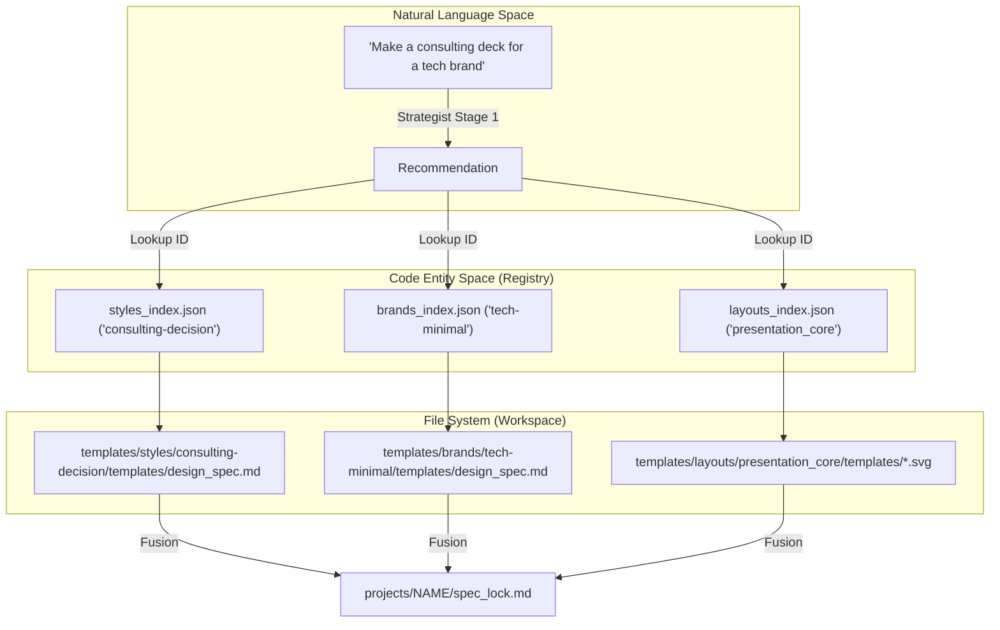
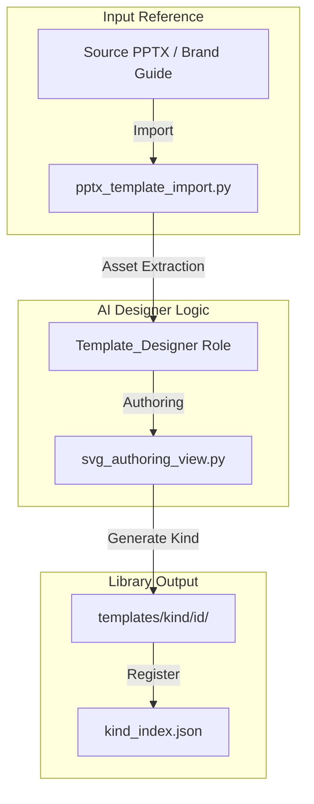

# Layout and Style Template Library

Relevant source files

The following files were used as context for generating this wiki page:

- [docs/technical-design.md](docs/technical-design.md)
- [docs/templates-architecture.md](docs/templates-architecture.md)
- [docs/templates-guide.md](docs/templates-guide.md)

The Layout and Style Template Library is a multi-tier design system that provides the structural and aesthetic foundation for all generated presentations. It decouples visual identity (Brand) from communication methods (Style) and structural blueprints (Layout), allowing the **Strategist** and **Executor** roles to fuse these elements into a cohesive project specification.

## 1. The Four Template Kinds

The library is organized into four distinct "kinds," each managed as a reusable workspace with a specific `kind` field in its `design_spec.md`.

| Kind | Library Workspace Root | Responsibility | Native PPTX Projection |
|:---|:---|:---|:---|
| **Brand** | `templates/brands/<id>/` | Identity: Colors, typography, logos, and icon styles. | Theme colors/fonts, Master logos. |
| **Style** | `templates/styles/<id>/` | Method: Communication approach (e.g., consulting), visual defaults, and review focus. | Slide-local authoring seeds; no Master structure. |
| **Layout** | `templates/layouts/<id>/` | Structure: Canvas formats, page-role vocabulary, and SVG prototypes. | Master/Layout/Placeholder topology. |
| **Deck** | `templates/decks/<id>/` | Full Replica: A recurring presentation family combining identity and structure. | Complete template with integrated Theme and Masters. |

**Sources:**
- [docs/templates-architecture.md:13-20]()
- [docs/templates-architecture.md:56-65]()
- [docs/templates-guide.md:27-34]()

---

## 2. Layout Workspaces and Standard Page Types

Layout workspaces (e.g., `presentation_core`, `report_core`, `story_vertical`) provide the physical SVG prototypes that the **Executor** uses as blueprints. Every layout must implement five standard page types to be considered complete.

### Standard Page Types
1.  **Cover (`cover.svg`)**: Title, subtitle, and primary branding.
2.  **Chapter (`chapter.svg`)**: Section transitions and milestone markers.
3.  **Content (`content.svg`)**: The primary workspace for body text, charts, and images.
4.  **Ending (`ending.svg`)**: Conclusion, contact info, or "Thank You" slides.
5.  **TOC (`toc.svg`)**: Table of Contents or agenda structures.

### Supported Canvas Formats
The library supports 9 canonical formats, including:
*   `presentation_core` (16:9 Landscape)
*   `presentation_core_43` (4:3 Standard)
*   `report_core` (A4 Portrait)
*   `story_vertical` (9:16 Mobile)
*   `xiaohongshu_post` (3:4 Social Media)

**Sources:**
- [docs/templates-architecture.md:41-46]()
- [docs/templates-guide.md:33-33]()
- [docs/templates-architecture.md:89-99]()

---

## 3. Style Templates (Communication Methods)

The `styles/` directory contains 13 named communication-method styles. Unlike Brands or Layouts, Styles do not provide SVG files; they provide the "logic" of the presentation.

*   **Academic-Research**: Focuses on data density, citations, and formal structure.
*   **Consulting-Decision**: Uses the SCQA (Situation, Complication, Question, Answer) framework and pyramid principle.
*   **Creative-Pitch**: High visual impact, minimal text, and narrative-driven flow.

These are indexed in `styles_index.json` for AI lookup during the **Strategist's** Stage 1 selection.

**Sources:**
- [docs/templates-architecture.md:18-18]()
- [docs/templates-architecture.md:35-39]()
- [docs/templates-guide.md:32-32]()

---

## 4. System Mapping: Selection to Code Entities

The following diagrams bridge the gap between Natural Language requests and the underlying code structures.

### Template Selection Logic

### Template Creation Workflow

**Sources:**
- [docs/templates-architecture.md:23-26]()
- [docs/templates-guide.md:53-62]()
- [docs/templates-architecture.md:112-115]()

---

## 5. Fusion Rules and Spec Inheritance

When a project combines multiple template kinds, the system applies deterministic fusion rules to create the final `design_spec.md` and `spec_lock.md`.

*   **Segment Ownership**:
    *   **Identity Segment**: Owned by `Brand`. If a `Deck` is also used, the `Brand` overrides the `Deck's` identity fields.
    *   **Structure Segment**: Owned by `Layout`. If a `Deck` is used, the `Layout` overrides the `Deck's` structural fields.
    *   **Method Segment**: Owned by `Style`.
*   **Conflict Resolution**: The system prevents "mixing" within a single field (e.g., merging two color palettes). It selects one authoritative source per segment.
*   **Provenance**: The fused spec contains a metadata header listing all source workspace IDs for auditability.

**Sources:**
- [docs/templates-architecture.md:23-26]()
- [docs/templates-architecture.md:67-76]()
- [docs/templates-guide.md:36-42]()

---

## 6. The /create-template Workflow

The `/create-template` standalone workflow allows users to expand the library. It supports four child workflows: `create-brand`, `create-style`, `create-layout`, and `create-deck`.

### Workflow Steps:
1.  **Initialization**: Gather the template brief (ID, Kind, Category, Tone).
2.  **Asset Intake**: Use `pptx_template_import.py` to extract colors, fonts, and master layouts from existing `.pptx` files.
3.  **SVG Authoring**: For Layouts and Decks, the `Template_Designer` generates the 5 standard page types.
4.  **Verification**: Run `svg_quality_checker.py` to ensure the new templates don't use banned SVG features (e.g., `<filter>`, `<mask-image>`).
5.  **Indexing**: Update the corresponding `*_index.json` file to make the template available for AI discovery.

**Sources:**
- [docs/templates-guide.md:23-23]()
- [docs/templates-architecture.md:78-87]()
- [docs/templates-architecture.md:112-115]()
- [docs/technical-design.md:34-35]()
