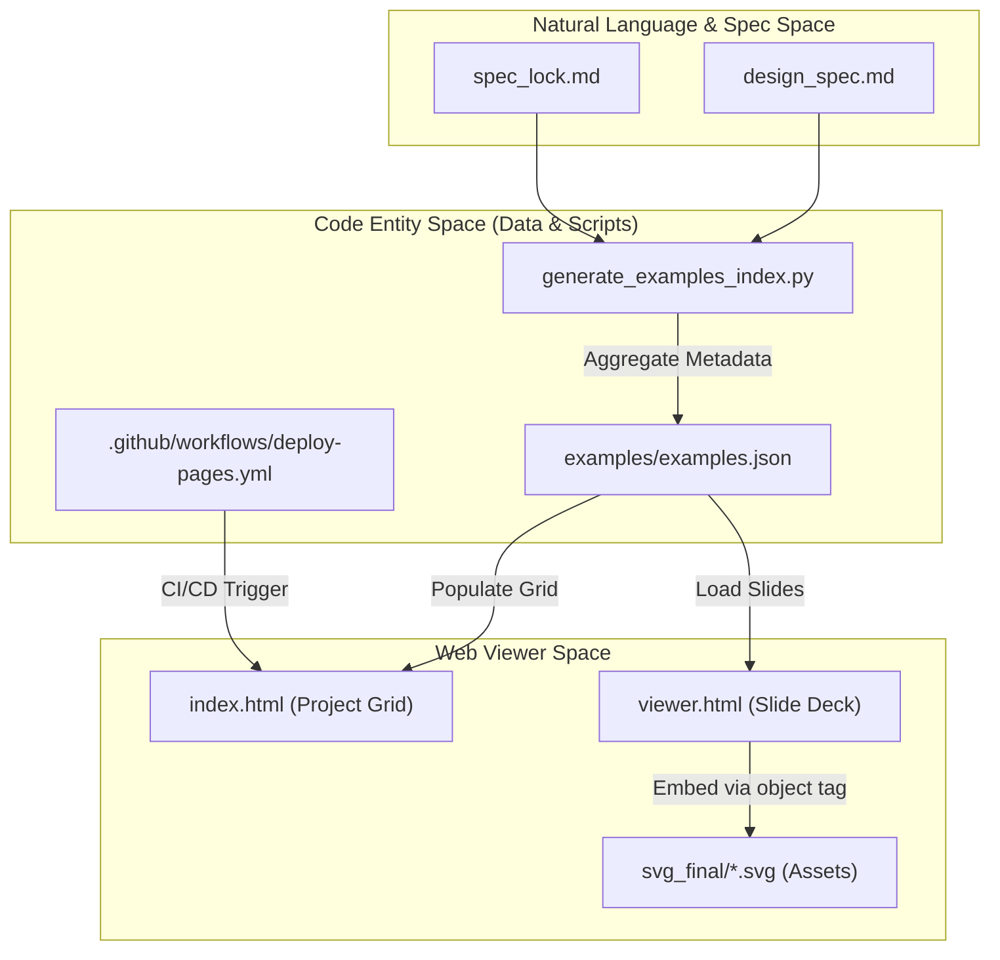
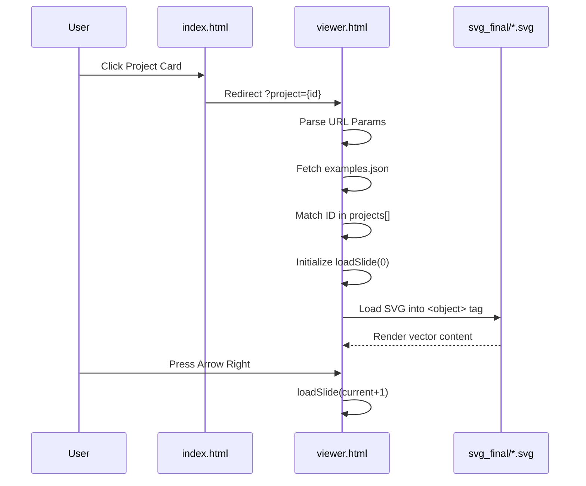

# Web Viewer and Examples Gallery

Relevant source files

The following files were used as context for generating this wiki page:

- [.github/workflows/deploy-pages.yml](.github/workflows/deploy-pages.yml)
- [docs/assets/screenshots/preview_glassmorphism_demo.png](docs/assets/screenshots/preview_glassmorphism_demo.png)
- [docs/assets/screenshots/preview_global_ai_capital.png](docs/assets/screenshots/preview_global_ai_capital.png)
- [docs/assets/screenshots/preview_indie_bookstore_zine.png](docs/assets/screenshots/preview_indie_bookstore_zine.png)
- [docs/assets/screenshots/preview_pritzker_2026.png](docs/assets/screenshots/preview_pritzker_2026.png)
- [docs/assets/screenshots/preview_sugar_rush_memphis.png](docs/assets/screenshots/preview_sugar_rush_memphis.png)
- [docs/assets/screenshots/preview_swiss_grid.png](docs/assets/screenshots/preview_swiss_grid.png)
- [examples/README.md](examples/README.md)
- [examples/examples.json](examples/examples.json)

## Purpose and Scope

The PPT Master Web Viewer is a static web-based presentation system designed to showcase generated SVG slides in a high-fidelity, interactive environment. It provides a centralized gallery for 21 curated example projects, encompassing 280+ pages of professional content [examples/examples.json:4-6](). The system leverages GitHub Pages for deployment, allowing stakeholders to review slide quality, layout rhythm, and design specifications without requiring local Python or PowerPoint environments [examples/README.md:1-5]().

---

## System Architecture and Data Flow

The viewer follows a "Data-Driven Static Site" architecture. It consumes a centralized metadata file, `examples.json`, which acts as the single source of truth for the entire gallery, defining project metadata, tags, and slide listings [examples/README.md:5-7]().

### Web Viewer Component Map

**Sources:** [examples/examples.json:1-10](), [examples/README.md:12-19](), [.github/workflows/deploy-pages.yml:1-14]()

---

## Deployment Pipeline

The gallery is deployed via a GitHub Actions workflow (`deploy-pages.yml`) that automates the synchronization between the repository content and the public-facing site hosted on GitHub Pages.

### Deployment Workflow Implementation
- **Trigger Logic:** The workflow executes on pushes to the `main` branch only when relevant web files (`index.html`, `viewer.html`), example assets (`examples/**`), or the workflow file itself are modified [.github/workflows/deploy-pages.yml:6-14]().
- **Artifact Generation:** The `build` job uses `actions/upload-pages-artifact@v3` to upload the entire repository root, ensuring relative paths for `examples/` and `templates/` assets remain intact [.github/workflows/deploy-pages.yml:31-47]().
- **Permissions:** The workflow requires `pages: write` and `id-token: write` permissions to authenticate the deployment to the `github-pages` environment [.github/workflows/deploy-pages.yml:19-22, 50-52]().

**Sources:** [.github/workflows/deploy-pages.yml:1-59]()

---

## Example Gallery Content and Categories

The gallery hosts 21 curated projects, showcasing the diversity of the AI roles' output across different visual styles and communication methods [examples/examples.json:5]().

### 1. Technical & Academic (Blueprints)
Focuses on technical fidelity, complex diagrams, and LaTeX formula rendering.
- **Attention Is All You Need:** 16 pages deep-diving into the Transformer paper, featuring blueprint-style diagrams, editable tables, and formula slides [examples/examples.json:11-108]().
- **LoRA Hu 2021:** 15 pages analyzing Low-Rank Adaptation with KPI cards and technical implementation details [examples/examples.json:110-203]().

### 2. Consulting & Strategic (MBB Style)
Employs structured communication frameworks and dense, data-rich layouts.
- **Global AI Capital 2024:** High-end strategic report style featuring global distribution maps and investment trends [docs/assets/screenshots/preview_global_ai_capital.png:1-10]().
- **Swiss Grid:** Demonstrates strict typographic alignment and modular layout principles [docs/assets/screenshots/preview_swiss_grid.png:1-10]().

### 3. Creative & Editorial
Showcases the system's ability to handle non-standard layouts like brutalism, memphis, and glassmorphism.
- **Brutalist AI Newspaper:** Editorial style with halftone monochrome photos and dense column grids [examples/examples.json:206-220]().
- **Sugar Rush Memphis:** Vibrant, geometric-heavy creative style with high saturation and playful patterns [docs/assets/screenshots/preview_sugar_rush_memphis.png:1-10]().
- **Glassmorphism Demo:** UI-inspired style featuring frosted glass effects and vibrant gradients [docs/assets/screenshots/preview_glassmorphism_demo.png:1-5]().

**Sources:** [examples/examples.json:1-220](), [docs/assets/screenshots/preview_global_ai_capital.png:1-10](), [docs/assets/screenshots/preview_glassmorphism_demo.png:1-10](), [docs/assets/screenshots/preview_sugar_rush_memphis.png:1-10](), [docs/assets/screenshots/preview_swiss_grid.png:1-10]()

---

## Navigation and Interactive Features

The viewer system provides a professional presentation interface designed for high-resolution SVG rendering and slide navigation.

### Presentation Engine Logic

### Key Navigation Features
- **Project Structure:** Each project maintains a strict hierarchy: `svg_output/` for raw output and `svg_final/` for self-contained SVGs with icons and images embedded via `finalize_svg.py` [examples/README.md:12-21]().
- **Local Preview:** Developers can preview projects locally using `python -m http.server` within the `svg_final` directory [examples/README.md:27-30]().
- **Historical Context:** `design_spec.md` and `spec_lock.md` files in the gallery are frozen snapshots of the capability boundary at the time of generation [examples/README.md:5]().

**Sources:** [examples/README.md:9-32](), [examples/examples.json:9-25]()

---

## Technical Maintenance

To add or refresh a project in the gallery, the following protocol is required:
1. **Asset Preparation:** SVGs must be post-processed into `svg_final/` to ensure icons and images are embedded [examples/README.md:20-21]().
2. **Metadata Registration:** A new entry must be added to the `projects[]` array in `examples.json`, including the `id`, `folder` path, and a slide manifest [examples/examples.json:9-27]().
3. **Quality Assurance:** New examples should pass validation via `svg_quality_checker.py` before being committed [examples/README.md:36]().
4. **Index Update:** The `stats` object in `examples.json` (examples, pages, templates count) should be updated to reflect the new addition [examples/examples.json:4-8]().

**Sources:** [examples/README.md:34-37](), [examples/examples.json:1-8]()
