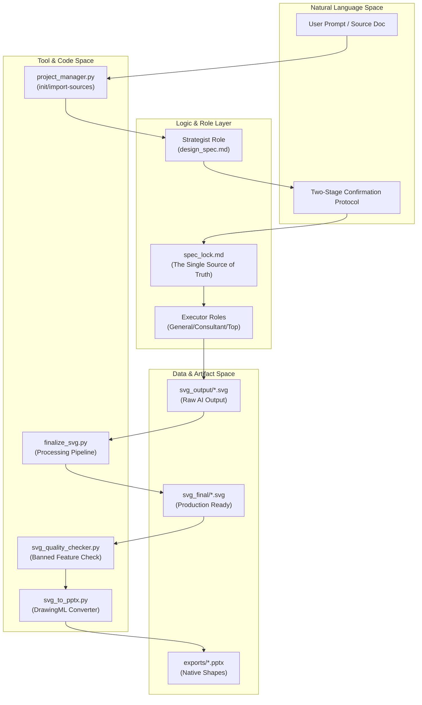

# Workflows and Usage Guides

<details>
<summary>Relevant source files</summary>

The following files were used as context for generating this wiki page:

- [docs/README.md](docs/README.md)
- [docs/faq.md](docs/faq.md)

</details>


## Purpose and Scope

This document introduces the practical workflows for using the PPT Master system, bridging the conceptual architecture with hands-on execution. It provides an overview of the end-to-end generation process, post-processing procedures, and common usage patterns.

**Scope of this document:**
- Overview of the complete generation workflow from source document to final PPTX.
- Post-processing pipeline architecture and when to apply specific filters.
- Common workflow patterns for different project types (Consulting vs. Social Media).
- File system organization and artifact lifecycle management.
- Integration points between AI roles, tools, and templates.

**For detailed procedures, see:**
- [End-to-End Generation Workflow](#8.1) — Complete walkthrough: source preparation, Steps 1-9 in `generate-pptx.md`, and export.
- [SVG Post-Processing Guide](#8.2) — Detailed `finalize_svg.py` usage, selective processing with `--only`, and quality validation.
- [Image Embedding Guide](#8.3) — Image resource management, Base64 embedding, and aspect ratio handling.
- [Template Creation Workflow](#8.4) — Documenting the `/create-template` standalone workflow for library expansion.
- [Direct PPTX Workflows](#8.5) — Documenting the three direct PPTX workflows (template-fill, native-enhance, beautify) that bypass SVG generation.
- [Quick Reference](#8.6) — Command templates, file naming conventions, and troubleshooting.

---

## Workflow Architecture Overview

The PPT Master workflow operates as a sequential pipeline with mandatory checkpoints and role-specific gates. The system uses a deterministic routing logic to select between the standard SVG pipeline and direct PPTX manipulation paths.

### Complete Workflow State Machine

```mermaid
stateDiagram-v2
    [*] --> SourceConversion: "source_to_md.py"
    SourceConversion --> Routing: "routing.md selection"
    
    state "Routing Decision" as Routing {
        SVG_Pipeline: "Standard Path (Default/Quick/Beautify)"
        PPTX_Direct: "Direct PPTX Path"
    }

    state "SVG Pipeline" as SVG_Pipeline {
        state "Strategist Role" as Strategist {
            [*] --> EightConfirmations: "Two-Stage Confirmation"
            EightConfirmations --> DesignSpec: "design_spec.md"
            DesignSpec --> SpecLock: "spec_lock.md"
        }
        
        state "Image Decision Gate" as ImageGate
        Strategist --> ImageGate: "Check Confirmation #7"
        
        state "Image_Generator Role" as ImageGen {
            [*] --> AnalyzeResources: "analyze_images.py"
            AnalyzeResources --> GenerateImages: "image_gen.py / image_search.py"
        }
        
        ImageGate --> ImageGen: "If 'AI Generation' or 'Web Search'"
        ImageGate --> ExecutorRouter: "Otherwise"
        ImageGen --> ExecutorRouter: "After resources ready"
        
        state "Executor Router" as ExecutorRouter {
            ExecGen: "Executor_General"
            ExecCons: "Executor_Consultant"
            ExecTop: "Executor_Consultant_Top"
        }
        
        ExecutorRouter --> PostProcessing
        
        state "Post-Processing" as PostProcessing {
            [*] --> FinalizeSVG: "finalize_svg.py"
            FinalizeSVG --> QualityCheck: "svg_quality_checker.py"
        }
        
        PostProcessing --> ExportPPTX: "svg_to_pptx.py"
    }

    state "Direct PPTX Workflows" as PPTX_Direct {
        Fill: "template-fill-pptx"
        Enhance: "native-enhance-pptx"
        Beautify: "beautify-pptx (SVG hybrid)"
    }

    Routing --> SVG_Pipeline
    Routing --> PPTX_Direct
    SVG_Pipeline --> [*]
    PPTX_Direct --> [*]
```
**Sources:** [docs/faq.md:7-15](), [docs/faq.md:78-83]()

---

## Generation Workflow Stages

### Stage 1: Source Preparation and Strategic Planning
**Entry Condition:** User provides raw content (PDF, URL, DOCX, etc.).  
**Tools:** `source_to_md.py` unified dispatcher, `project_manager.py`.  
**Role:** Strategist.  
**Key Activities:**
- Convert source to Markdown using specialized scripts like `pdf_to_md.py` or `web_to_md.py` [docs/faq.md:7-10]().
- Initialize project structure with `project_manager.py init` [docs/faq.md:39-43]().
- **Two-Stage Confirmation**: Locking format, style, and content via the `confirm_ui` or chat [docs/faq.md:11-16]().

### Stage 2: Resource Collection (Conditional)
**Role:** Image_Generator.  
**Key Activities:**
- Triggered if AI images or Web-sourced images are selected [docs/faq.md:66-77]().
- Uses `image_gen.py` to call backends (Gemini, OpenAI, FLUX, etc.) or `image_search.py` for open-license assets [docs/faq.md:66-72]().
- Validates image status (Pending/Existing/Placeholder) before Executor starts.

### Stage 3: SVG Generation (Mandatory for SVG Path)
**Role:** Executor (General, Consultant, or Top Consulting).  
**Execution Model:** Sequential, page-by-page generation in one continuous pass.  
**Outputs:** Raw SVG files in `svg_output/` referencing `spec_lock.md` for consistency.

### Stage 4: Post-Processing Pipeline
**Tool:** `finalize_svg.py`.  
**Purpose:** Convert AI-generated SVGs into DrawingML-compatible formats.  
**Steps:** 
1. `embed-icons`: Resolves `data-icon` placeholders.
2. `crop-images`: Handles `preserveAspectRatio=slice` via `crop_images.py`.
3. `fix-aspect`: Prevents image stretching via `fix_image_aspect.py`.
4. `embed-images`: Base64 conversion for self-contained files via `embed_images.py`.
5. `flatten-text`: Converts `<tspan>` to simple `<text>` for PPT compatibility.
6. `fix-rounded`: Converts `rx` rects to `<path>`.

**Sources:** [docs/faq.md:78-83](), [docs/README.md:29-31]()

---

## Integration Points Between Subsystems

The workflow bridges the gap between high-level AI reasoning and low-level file transformations.

### Code Entity Integration Map


**Sources:** [docs/faq.md:78-83](), [docs/README.md:29-31]()

---

## File System and Artifact Lifecycle

Projects follow a strict lifecycle from initialization to export.

| Phase | Directory | Tool | Artifact Description |
|-------|-----------|------|----------------------|
| **Init** | `projects/<name>/` | `project_manager.py` | Scaffolds `images/`, `svg_output/`, `svg_final/`. |
| **Input** | `projects/<name>/` | `source_to_md.py` | `source_document.md` containing extracted text. |
| **Planning**| `projects/<name>/` | AI (Strategist) | `design_spec.md` and `spec_lock.md`. |
| **Draft** | `svg_output/` | AI (Executor) | Raw SVGs with `data-icon` and relative image links. |
| **Finalize**| `svg_final/` | `finalize_svg.py` | Clean SVGs with Base64 images and flattened text. |
| **Export** | `exports/` | `svg_to_pptx.py` | Final `.pptx` (native) and timestamped backups [docs/faq.md:78-83](). |

**Sources:** [docs/faq.md:39-43](), [docs/faq.md:78-83]()

---

## Decision Points and Constraints

### Canvas Format Selection
Selected during the Strategist's confirmation stage. Supported formats include:
- `ppt169` (16:9 Landscape)
- `ppt43` (4:3 Landscape)
- `xhs` (Xiaohongshu 3:4)
- `moments` (WeChat Moments 1:1)
- `story` (TikTok/Story 9:16)
- `a4` (A4 Print)
**Sources:** [docs/faq.md:17-29]()

### Technical Constraints (Non-negotiable)
- **Banned Features**: `mask`, `<style>`, `class`, `<foreignObject>`, `textPath`, `<animate*>`, `<script>`, `<symbol>`+`<use>`.
- **PowerPoint Compatibility**: Native shapes require strict adherence to DrawingML mapping rules [docs/README.md:29-31]().

---

## Next Steps

For detailed walkthroughs of these workflows, refer to the child pages:
- For the full 9-step generation, see [End-to-End Generation Workflow](#8.1).
- For cleaning and fixing SVGs, see [SVG Post-Processing Guide](#8.2).
- For managing image assets, see [Image Embedding Guide](#8.3).
- For adding new styles to the system, see [Template Creation Workflow](#8.4).
- For direct OOXML manipulation, see [Direct PPTX Workflows](#8.5).
- For command templates and troubleshooting, see [Quick Reference](#8.6).
