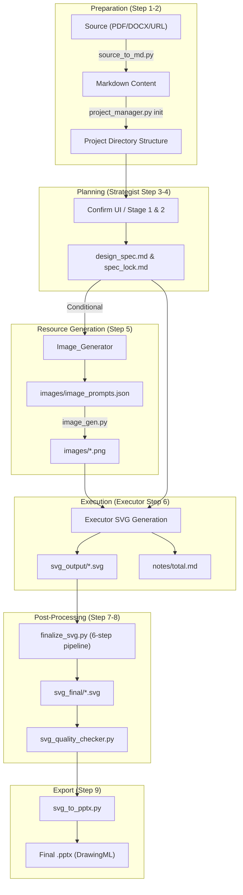
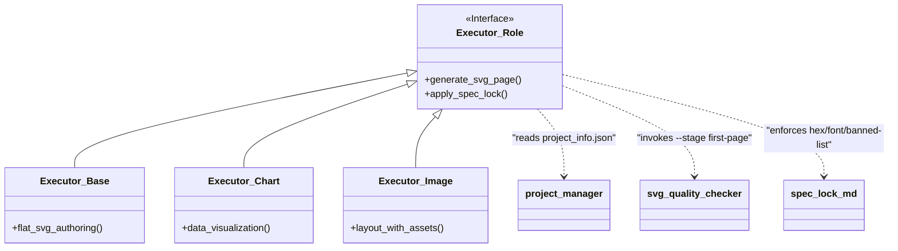

# End-to-End Generation Workflow

<details>
<summary>Relevant source files</summary>

The following files were used as context for generating this wiki page:

- [docs/technical-design.md](docs/technical-design.md)
- [examples/ppt169_attention_is_all_you_need/README.md](examples/ppt169_attention_is_all_you_need/README.md)
- [examples/ppt169_attention_is_all_you_need/design_spec.md](examples/ppt169_attention_is_all_you_need/design_spec.md)

</details>


## Purpose and Scope

This document provides a technical walkthrough of the complete PPT Master project lifecycle. It details the transition from source document preparation through the nine-step pipeline defined in `generate-pptx.md`, covering AI role transitions, tool invocations, and file transformations.

**Scope**: This page documents the standard sequential execution path, including mandatory blocking checkpoints and technical prerequisites for each stage. It specifically details the flow from "Natural Language Space" (user requirements) to "Code Entity Space" (SVG/DrawingML generation).

---

## Workflow Overview

The generation workflow follows a strict serial execution model. The pipeline is divided into Phase A (Planning) and Phase B (Execution/Export). It distinguishes between three profiles:
*   **Default**: The full two-stage confirmation and multi-step pipeline.
*   **Quick Generate**: Bypasses planning/confirmation and first-page gates for speed. [docs/technical-design.md:48-52]()
*   **Beautify**: Inherits visual identity from a source PPTX to re-layout content. [docs/technical-design.md:47-49]()

### System Data Flow



**Sources**: [docs/technical-design.md:58-91](), [examples/ppt169_attention_is_all_you_need/README.md:9-13](), [examples/ppt169_attention_is_all_you_need/design_spec.md:3-15]()

---

## Stage 1: Preparation & Initialization

### Source Conversion
The `source_to_md.py` unified dispatcher converts unstructured sources into structured Markdown. [docs/technical-design.md:61-62]()

| Script | Purpose | Key Dependency |
| :--- | :--- | :--- |
| `pdf_to_md.py` | Converts PDF to MD with heading detection | PyMuPDF |
| `doc_to_md.py` | Converts DOCX/HTML/EPUB | Pandoc (fallback) |
| `excel_to_md.py` | Converts XLSX/XLSM tables to MD | Openpyxl |
| `web_to_md.py` | Scrapes URLs (WeChat/TLS support) | `curl_cffi` |

### Project Lifecycle Initialization
The `project_manager.py` tool creates the standardized workspace. [docs/technical-design.md:64-64]()

```bash
# Initialize a new project (Step 2)
python3 scripts/project_manager.py init <project_name> --format ppt169
```

**Implementation Detail**: The `import-sources` command moves files into the `sources/` boundary and runs `pptx_intake.py` on any PPTX files to extract `identity.json` and `slide_library.json`. [docs/technical-design.md:66-70]()

**Sources**: [docs/technical-design.md:61-70](), [examples/ppt169_attention_is_all_you_need/design_spec.md:9-11]()

---

## Stage 2: Strategist Planning (Step 3-4)

The **Strategist** role establishes the "Spec Lock" through a two-stage confirmation process.

### Two-Stage Confirmation Protocol
1.  **Stage 1 (Communication Contract)**: Confirms the communication method (narrative, pyramid, etc.) and design style (swiss-minimal, dark-tech, etc.). [docs/technical-design.md:72-75]()
2.  **Stage 2 (Solution Confirmation)**: Confirms the full page-by-page plan and technical specifications. [docs/technical-design.md:77-77]()

### Output Artifacts (Step 4)
*   `design_spec.md`: Detailed layout and content plan for every slide. [examples/ppt169_attention_is_all_you_need/design_spec.md:1-170]()
*   `spec_lock.md`: A technical anchor file containing the HEX palette, font rules, and canvas dimensions. [examples/ppt169_attention_is_all_you_need/spec_lock.md:1-91]()

**Sources**: [docs/technical-design.md:72-77](), [examples/ppt169_attention_is_all_you_need/design_spec.md:1-170](), [examples/ppt169_attention_is_all_you_need/spec_lock.md:1-91]()

---

## Stage 3: Conditional Image Generation (Step 5)

If the design spec requires visual assets, the **Image_Generator** role is activated. [docs/technical-design.md:79-79]()

### Image Resource Manifest
The role identifies needs for AI generation, web search, or asset slicing. It creates a manifest and triggers `image_gen.py`, which dispatches requests to providers (Gemini, OpenAI, Flux, etc.) via the `image_backends/` package.

**Sources**: [docs/technical-design.md:79-79](), [examples/ppt169_attention_is_all_you_need/spec_lock.md:43-55]()

---

## Stage 4: Executor SVG Generation (Step 6)

The **Executor** (General, Consultant, or Chart variant) generates the visual and logical content.

### The Dual Output
1.  **Visual Construction**: Generating SVG files into `svg_output/`. [docs/technical-design.md:85-85]()
2.  **Logic Construction**: Generating speaker notes into `notes/total.md`. [docs/technical-design.md:87-87]()

### Technical Constraints & Gates
*   **First-Page Gate**: `svg_quality_checker.py --stage first-page` must pass before continuing to P02. [docs/technical-design.md:83-84]()
*   **Forbidden List**: Executors must avoid `mask`, `<style>`, `class`, `<foreignObject>`, and `textPath`. [examples/ppt169_attention_is_all_you_need/spec_lock.md:85-91]()

### Entity Mapping: Executor to Code


**Sources**: [docs/technical-design.md:81-87](), [examples/ppt169_attention_is_all_you_need/spec_lock.md:85-91]()

---

## Stage 5: Post-Processing Pipeline (Step 7-8)

The transition from `svg_output/` to `svg_final/` is handled by `finalize_svg.py`. [docs/technical-design.md:93-93]()

### The 6-Step Transformation
1.  **Embed Icons**: Replaces `<use data-icon="...">` with paths via `embed_icons.py`.
2.  **Crop Images**: Applies smart cropping for `preserveAspectRatio=slice`.
3.  **Fix Aspect**: Prevents image stretching.
4.  **Embed Images**: Converts external files to Base64 via `embed_images.py`.
5.  **Flatten Text**: Converts `<tspan>` to simple `<text>`.
6.  **Fix Rounded**: Converts `rect rx` to explicit `path` data.

**Sources**: [docs/technical-design.md:93-93](), [examples/ppt169_attention_is_all_you_need/README.md:9-10]()

---

## Stage 6: Export and Validation (Step 9)

### SVG to PPTX Conversion
`svg_to_pptx.py` maps SVG elements to DrawingML (native PowerPoint shapes) using `pptx_builder.py` and `drawingml_converter.py`. [docs/technical-design.md:98-98]()

| SVG Element | DrawingML Mapping |
| :--- | :--- |
| `<path>` | `<a:custGeom>` (Custom Geometry) |
| `<rect>` | `<a:prstGeom prst="rect">` |
| `linearGradient` | `<a:gradFill>` | [examples/ppt169_attention_is_all_you_need/design_spec.md:64-79]() |

### Final Quality Assurance Gate
`svg_quality_checker.py --stage final` is mandatory. It blocks export if errors exist, ensuring the output meets PPTX compatibility standards. [docs/technical-design.md:86-86]()

**Sources**: [docs/technical-design.md:86-98](), [examples/ppt169_attention_is_all_you_need/spec_lock.md:85-91]()
