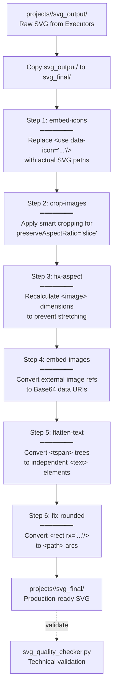

# SVG Post-Processing Guide

<details>
<summary>Relevant source files</summary>

The following files were used as context for generating this wiki page:

- [docs/powerpoint-svg-mapping.md](docs/powerpoint-svg-mapping.md)
- [docs/technical-design.md](docs/technical-design.md)

</details>


## Purpose and Scope

This document details the SVG post-processing procedures that transform raw AI-generated SVG files into production-ready, PowerPoint-compatible outputs. Post-processing addresses technical compatibility issues—such as image stretching, icon placeholders, and rounded corner rendering—that cannot be reliably resolved during initial AI generation by the **Executor** roles.

**Scope covered:**
- The `finalize_svg.py` orchestrator and its 6-step pipeline.
- Individual processing utilities (embedding icons, fixing aspect ratios, Base64 encoding).
- The transition from `svg_output/` to `svg_final/`.
- Quality validation procedures with `svg_quality_checker.py`.

**Sources:** [skills/ppt-master/scripts/finalize_svg.py:1-30](), [docs/technical-design.md:82-92](), [docs/powerpoint-svg-mapping.md:7-19]()

---

## Post-Processing Pipeline Architecture

The post-processing pipeline is implemented as a multi-step sequential transformation orchestrated by `finalize_svg.py`. It serves as a mandatory bridge between the raw output and the final PPTX conversion, ensuring compliance with the project-canonical SVG intermediate language [docs/technical-design.md:13-26]().

### Pipeline Flow



**Sources:** [skills/ppt-master/scripts/finalize_svg.py:92-212](), [docs/technical-design.md:88-92]()

### System Entities to Code Mapping

This diagram bridges the conceptual processing steps to the specific Python modules and functions responsible for the transformation.

```mermaid
classDiagram
    class FinalizeOrchestrator {
        +finalize_svg.py
        +run_pipeline(project_path)
    }
    class IconProcessor {
        +embed_icons.py
        +process_svg_file()
    }
    class ImageProcessor {
        +fix_image_aspect.py
        +fix_image_aspect_in_svg()
        +crop_images.py
    }
    class ImageEmbedder {
        +embed_images.py
        +embed_images_in_svg()
    }
    class TextProcessor {
        +flatten_tspan.py
        +flatten_text_with_tspans()
    }
    class ShapeProcessor {
        +svg_rect_to_path.py
        +process_svg()
    }

    FinalizeOrchestrator --> IconProcessor : "Step 1: embed-icons"
    FinalizeOrchestrator --> ImageProcessor : "Step 2 & 3: fix-aspect"
    FinalizeOrchestrator --> ImageEmbedder : "Step 4: embed-images"
    FinalizeOrchestrator --> TextProcessor : "Step 5: flatten-text"
    FinalizeOrchestrator --> ShapeProcessor : "Step 6: fix-rounded"
```

**Sources:** [skills/ppt-master/scripts/finalize_svg.py:33-38](), [skills/ppt-master/scripts/finalize_svg.py:215-243]()

---

## The finalize_svg.py Orchestrator

### Core Functionality

The `finalize_svg.py` script is the unified entry point. It ensures that transformations are performed in the correct order to avoid dependency conflicts (e.g., fixing aspect ratios must happen before embedding images to ensure the script can read original file metadata).

**Key Rules:**
- **Sequential Execution**: Steps must run one at a time. Bundling or parallelizing steps is discouraged [skills/ppt-master/scripts/finalize_svg.py:92-212]().
- **Directory Transition**: It creates a clean `svg_final/` directory from `svg_output/` [skills/ppt-master/scripts/finalize_svg.py:102-120]().
- **Source Protection**: It treats `svg_output/` as read-only and performs all modifications in `svg_final/` [skills/ppt-master/scripts/finalize_svg.py:102-120]().

### Selective Processing with --only Flag

Users can target specific issues using the `--only` flag. This is useful for debugging or when only one asset type (like icons) has changed.

| Flag | Function Called | Target Issue |
| :--- | :--- | :--- |
| `embed-icons` | `embed_icons.process_svg_file` | Placeholders like `<use data-icon="rocket">` |
| `crop-images` | `crop_images.process` | Images using `slice` (fill) behavior |
| `fix-aspect` | `fix_image_aspect.fix_image_aspect_in_svg` | Images stretched by PPT's "Convert to Shape" |
| `embed-images` | `embed_images.embed_images_in_svg` | Local file paths in `href` attributes |
| `flatten-text` | `flatten_tspan.flatten_text_with_tspans` | Complex nested `<tspan>` structures |
| `fix-rounded` | `svg_rect_to_path.process_svg` | Rounded corners disappearing in PPT |

**Sources:** [skills/ppt-master/scripts/finalize_svg.py:215-243](), [skills/ppt-master/scripts/finalize_svg.py:249-268]()

---

## Key Processing Modules

### Image Aspect and Cropping (Step 2 & 3)

PowerPoint's DrawingML engine often ignores the SVG `preserveAspectRatio` attribute when converting to native shapes [docs/powerpoint-svg-mapping.md:135-139]().
- **`fix-aspect`**: Recalculates `x`, `y`, `width`, and `height` based on the actual dimensions of the image file found in the `images/` directory [skills/ppt-master/scripts/fix_image_aspect.py:195-314]().
- **`crop-images`**: If an image is set to "slice" (fill), this script calculates the necessary crop parameters so the resulting SVG uses a simpler "meet" (fit) behavior that PPT understands [skills/ppt-master/scripts/finalize_svg.py:148-161]().

### Image Embedding (Step 4)

To ensure the SVG is self-contained and portable, all external image references are converted to Base64 data URIs. This is critical because the DrawingML exporter requires embedded data to handle images correctly during the flat-to-OOXML transition [docs/powerpoint-svg-mapping.md:135-144]().
- **Input**: `href="../images/photo.jpg"`
- **Output**: `href="data:image/png;base64,..."`
- **Supported**: JPEG, PNG, GIF, WebP [skills/ppt-master/scripts/finalize_svg.py:163-174]().

### Rounded Corner Conversion (Step 6)

PowerPoint treats `<rect rx="10">` as a standard rectangle without corners during shape conversion.
- **Logic**: The `svg_rect_to_path.py` utility converts the rectangle into a `<path>` element using `L` (line) and `A` (arc) commands to ensure the rounded visual is preserved in DrawingML [skills/ppt-master/scripts/finalize_svg.py:70-90](), [docs/powerpoint-svg-mapping.md:104-106]().

---

## Quality Validation

### svg_quality_checker.py

Before exporting to PPTX, the `svg_quality_checker.py` script must be run to ensure the finalized SVGs adhere to the "Banned Features" list and coordinate standards [docs/technical-design.md:34-34]().

**Checks performed:**
- **ViewBox**: Ensures `viewBox` matches the project's `canvas_format` (e.g., `0 0 1280 720` for 16:9) [docs/powerpoint-svg-mapping.md:43-43]().
- **Banned Elements**: Scans for `<foreignObject>`, `<style>`, `class`, and `<script>` [docs/powerpoint-svg-mapping.md:323-328]().
- **Resource Check**: Verifies all images are embedded (no local file paths remaining).
- **Coordinate Integrity**: Checks for valid `x`, `y` numeric values [docs/powerpoint-svg-mapping.md:45-45]().

**Sources:** [skills/ppt-master/scripts/project_manager.py:62-62](), [docs/technical-design.md:34-35](), [docs/powerpoint-svg-mapping.md:323-335]()

---

## Common Commands

```bash
# 1. Run the full post-processing pipeline
python3 skills/ppt-master/scripts/finalize_svg.py projects/my_project

# 2. Validate the results (Mandatory stage)
python3 skills/ppt-master/scripts/svg_quality_checker.py projects/my_project --stage final

# 3. Export to PPTX (Targeting the svg_final directory)
python3 skills/ppt-master/scripts/svg_to_pptx.py projects/my_project
```

**Sources:** [skills/ppt-master/scripts/finalize_svg.py:204-211](), [docs/technical-design.md:86-88]()
