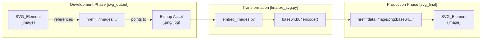
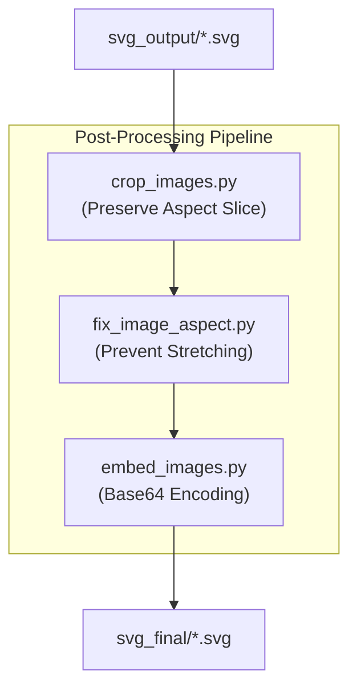

# Image Embedding Guide

<details>
<summary>Relevant source files</summary>

The following files were used as context for generating this wiki page:

- [docs/technical-design.md](docs/technical-design.md)
- [examples/ppt169_attention_is_all_you_need/image_analysis.csv](examples/ppt169_attention_is_all_you_need/image_analysis.csv)
- [examples/ppt169_attention_is_all_you_need/images/image_prompts.md](examples/ppt169_attention_is_all_you_need/images/image_prompts.md)

</details>


## Purpose and Scope

This guide explains the complete workflow for integrating images into SVG slides in the PPT Master system, from defining image requirements to final Base64 embedding and aspect ratio correction. It covers the image resource manifest format, the distinction between external references and embedded images, automated processing with `finalize_svg.py`, and aspect ratio preservation for PowerPoint compatibility.

For information about generating AI images for projects, see [Image Generator Role](4.3.-Image-Generator-Role). For the complete post-processing pipeline that includes image embedding, see [SVG Post-Processing Guide](8.2.-SVG-Post-Processing-Guide). For the end-to-end generation workflow, see [End-to-End Generation Workflow](8.1.-End-to-End-Generation-Workflow).

Sources: `docs/technical-design.md:79-80`(), `skills/ppt-master/scripts/finalize_svg.py:1-20`()

---

## Image Resource Manifest System

### Manifest Structure

The image resource manifest is tracked in the `image_prompts.json` file (and rendered to `image_prompts.md`). It defines all images required for a project and their states.

**Key Data Structure**:
The `items` array in `image_prompts.json` contains objects with these key fields:
- `filename`: Target filename in the `images/` directory [examples/ppt169_attention_is_all_you_need/images/image_prompts.json:13]().
- `status`: Current lifecycle state of the asset [examples/ppt169_attention_is_all_you_need/images/image_prompts.json:21]().
- `aspect_ratio`: Target ratio (e.g., "16:9", "3:4") [examples/ppt169_attention_is_all_you_need/images/image_prompts.json:17]().
- `prompt`: Detailed instructions for AI generation [examples/ppt169_attention_is_all_you_need/images/image_prompts.json:19]().
- `purpose`: Functional role of the image (e.g., "Cover background") [examples/ppt169_attention_is_all_you_need/images/image_prompts.json:14]().

Sources: [examples/ppt169_attention_is_all_you_need/images/image_prompts.json:11-22](), [examples/ppt169_attention_is_all_you_need/images/image_prompts.md:12-20]()

### Image Status Types

The system distinguishes between three primary input states and a final generated state to manage the asset lifecycle.

| Status | Meaning | System Handling |
|-------|---------|-------------------|
| `Pending` | Requires AI generation, has description | Trigger `image_gen.py` to produce asset. |
| `Existing` | User-provided image or already generated | `analyze_images.py` validates metadata. |
| `Placeholder` | Not yet available, deferred | Executor renders a dashed rectangle in SVG. |
| `Generated` | Successfully created by AI | Ready for post-processing pipeline. |

Sources: [examples/ppt169_attention_is_all_you_need/images/image_prompts.json:21-21](), [docs/technical-design.md:17-23]()

### File Organization

```
project_name/
├── images/                          # Image source directory
│   ├── cover_bg.png                # Actual bitmap files
│   ├── image_prompts.json          # Resource manifest
│   └── image_prompts.md            # Human-readable prompts
├── svg_output/                      # Raw SVG with external references
│   └── 01_cover.svg                # <image href="../images/cover_bg.png"/>
└── svg_final/                       # Processed SVG with embedded images
    └── 01_cover.svg                # <image href="data:image/png;base64,..."/>
```

Sources: [examples/ppt169_attention_is_all_you_need/images/image_prompts.json:1-10](), [docs/technical-design.md:85-86]()

---

## Image Integration Methods

### Code Entity Space: Integration Workflow

The transformation from external references to embedded Base64 data is handled by the `svg_finalize` subpackage.



| Method | Advantages | Disadvantages | Use Case |
|--------|-----------|---------------|----------|
| **External Reference** | Small SVG size; easy to update. | Requires relative path resolution. | Development and iteration |
| **Base64 Embedded** | Self-contained; works offline. | Larger file size (~33% overhead). | PPTX Export and Distribution |

Sources: [skills/ppt-master/scripts/svg_finalize/embed_images.py:1-20](), [docs/technical-design.md:15-16]()

---

## Image Processing Pipeline

### Automation Logic

Image processing is handled by specialized modules within the `svg_finalize` package, orchestrated by `finalize_svg.py`.



### Aspect Ratio Preservation

**The Stretching Problem**: PowerPoint's DrawingML conversion often ignores `preserveAspectRatio="xMidYMid slice"`, stretching the image to fill the container.

1.  **`crop_images.py`**: Physically crops the source bitmap if `preserveAspectRatio="slice"` is detected, ensuring the image dimensions match the SVG frame exactly.
2.  **`fix_image_aspect.py`**: Recalculates the `<image>` element's `width`, `height`, `x`, and `y` attributes based on the actual pixel dimensions of the source file to maintain the correct visual ratio without relying on CSS-like scaling.

Sources: [skills/ppt-master/scripts/svg_finalize/crop_images.py:1-15](), [skills/ppt-master/scripts/svg_finalize/fix_image_aspect.py:1-20]()

---

## Pre-flight Image Analysis

### analyze_images.py Tool

Before finalizing SVGs, `analyze_images.py` performs a pre-flight check on all assets in the `images/` directory to ensure they meet the project requirements.

**Functionality**:
- **Metadata Extraction**: Reads pixel dimensions and calculates `AspectRatio` [examples/ppt169_attention_is_all_you_need/image_analysis.csv:2]().
- **Source Verification**: Identifies if the ratio is "pixel" based (from file) or "manifest" based [examples/ppt169_attention_is_all_you_need/image_analysis.csv:2]().
- **Reporting**: Generates `image_analysis.csv` to highlight discrepancies between intended and actual sizes.

**Analysis Output Example**:
[examples/ppt169_attention_is_all_you_need/image_analysis.csv:1-4]()

| Column | Description |
|--------|-------------|
| `AspectRatio` | Calculated `Width / Height` [examples/ppt169_attention_is_all_you_need/image_analysis.csv:1](). |
| `SvgRenderable` | Boolean check if format is supported in SVG [examples/ppt169_attention_is_all_you_need/image_analysis.csv:1](). |
| `PptxNativeSupported` | Boolean check for DrawingML compatibility [examples/ppt169_attention_is_all_you_need/image_analysis.csv:1](). |
| `Category` | Classification based on ratio (e.g., "Portrait") [examples/ppt169_attention_is_all_you_need/image_analysis.csv:2](). |

Sources: [examples/ppt169_attention_is_all_you_need/image_analysis.csv:1-4](), [docs/technical-design.md:89-90]()

---

## Usage Guide

### Command Reference

**Full Pipeline Run**:
```bash
# Processes icons, crops images, fixes aspect, and embeds Base64
python3 skills/ppt-master/scripts/finalize_svg.py projects/my_project
```

**Selective Image Embedding**:
```bash
# Run only the Base64 conversion step
python3 skills/ppt-master/scripts/finalize_svg.py projects/my_project --only embed-images
```

### Validation Checklist

1.  **Existence**: Check `images/` folder against `image_prompts.json`.
2.  **Analysis**: Run `analyze_images.py` to ensure high-resolution assets (e.g., "2K" as requested in manifest [examples/ppt169_attention_is_all_you_need/images/image_prompts.json:18]()).
3.  **Preview**: Verify that `svg_output/` files correctly reference the relative path to `images/`.
4.  **Finalization**: Verify `svg_final/` files contain `data:image/...` URIs to ensure they are self-contained for export.

Sources: [skills/ppt-master/scripts/finalize_svg.py:1-50](), [docs/technical-design.md:86-88]()
