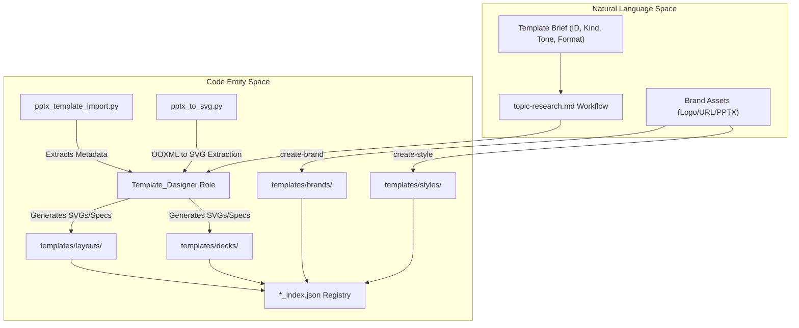
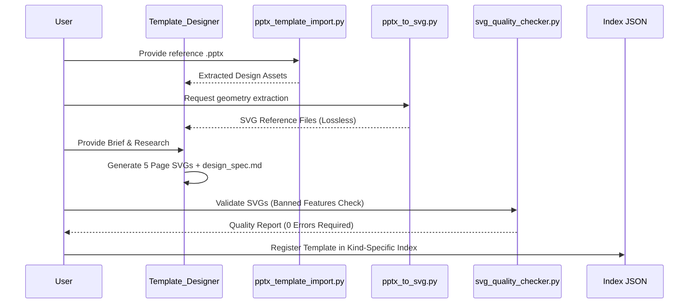

# Template Creation Workflow

<details>
<summary>Relevant source files</summary>

The following files were used as context for generating this wiki page:

- [docs/technical-design.md](docs/technical-design.md)
- [docs/templates-architecture.md](docs/templates-architecture.md)
- [docs/templates-guide.md](docs/templates-guide.md)

</details>


The `/create-template` workflow is a specialized, standalone pipeline within PPT Master designed to expand the system's design capabilities. Unlike the standard presentation generation pipeline, this workflow focuses on creating reusable, high-quality layout templates, brand identities, or full deck replicas that are registered in the global library for future use.

## 1. Workflow Overview

The template creation process transitions from a design brief to a functional, multi-page SVG template set. It utilizes the dedicated `Template_Designer` role and specific scripts to extract assets from reference materials. The workflow supports four distinct child paths: `create-brand`, `create-style`, `create-layout`, and `create-deck` [docs/templates-architecture.md:13-20]().

### Template Creation Pipeline
1.  **Gather Brief**: Define ID, Display Name, Kind, Category, Tone, and Canvas Format [docs/templates-guide.md:27-34]().
2.  **Reference Import**: Extract colors, fonts, and images from existing PPTX files using `pptx_template_import.py` [skills/ppt-master/scripts/pptx_template_import.py]().
3.  **Design Execution**: Invoke `Template_Designer` role [skills/ppt-master/references/roles/Template_Designer.md]() to generate the mandatory page types for layout/deck kinds.
4.  **Validation**: Verify structural integrity and SVG compatibility using `svg_quality_checker.py` [skills/ppt-master/scripts/svg_quality_checker.py]().
5.  **Registration**: Update the relevant index file (e.g., `layouts_index.json`, `styles_index.json`, `brands_index.json`, or `decks_index.json`) to make the template discoverable [docs/templates-architecture.md:24-27]().

### Workflow Data Flow
The following diagram illustrates the data flow from the initial brief to the registered template library, bridging the gap between user intent and code entities.

"Template Creation Data Flow"


**Sources:** [docs/templates-architecture.md:13-27](), [docs/templates-guide.md:15-25](), [docs/technical-design.md:72-75]()

---

## 2. Template Categories and Schemas

PPT Master distinguishes between four types of templates, each with a specific directory and data model [docs/templates-architecture.md:13-20]().

| Kind | Directory | Contents | Workflow |
| :--- | :--- | :--- | :--- |
| **Brand** | `templates/brands/` | Identity (Color, Typography, Logo, Voice, Icon Style) | `create-brand.md` |
| **Style** | `templates/styles/` | Portable Method (Communication method, page-role vocabulary) | `create-style.md` |
| **Layout** | `templates/layouts/` | Structure (Canvas, Page Types, SVG Roster) | `create-layout` branch |
| **Deck** | `templates/decks/` | Full Replica (Integrated Identity + Structure + Prototypes) | `create-deck` branch |

### Mandatory Page Types
For `Layout` and `Deck` kinds, the system expects standard page types defined in the `Page Types` section of the `design_spec.md` [docs/templates-architecture.md:22-22]():
1.  **Cover**: Opening slide with title/subtitle placeholders.
2.  **TOC**: Table of Contents layout.
3.  **Chapter**: Transitional slides for section breaks.
4.  **Content**: Main body slides with flexible layout areas.
5.  **Ending**: Closing slide with contact info or "Thank You".

**Sources:** [docs/templates-architecture.md:13-22](), [docs/templates-guide.md:27-34]()

---

## 3. Implementation Details

### Reference Asset Extraction
Two primary paths exist for extracting design data from existing PowerPoint files:
1.  **Metadata Extraction**: `pptx_template_import.py` extracts color palettes (HEX), typography (families/sizes), and image placeholders [skills/ppt-master/scripts/pptx_template_import.py]().
2.  **Visual Extraction**: `pptx_to_svg.py` performs a reverse OOXML-to-SVG conversion. The resulting SVGs are used by `svg_authoring_view.py` to create editable bundles for the `Template_Designer` [docs/templates-architecture.md:113-115]().

### The Template_Designer Role
The `Template_Designer` [skills/ppt-master/references/roles/Template_Designer.md]() is triggered exclusively via the `/create-template` workflow. It consumes the `design_spec.md` requirements and outputs valid SVG files to the template workspace. It is responsible for ensuring the output adheres to the project-canonical SVG intermediate language [docs/technical-design.md:13-17]().

### Technical Constraints (Shared Standards)
Templates must strictly follow the SVG compatibility rules to ensure they can be converted back to DrawingML [docs/technical-design.md:15-15]().

*   **Banned Features**: `mask`, `<style>`, `class`, `<foreignObject>`, `symbol/use`, `textPath`, `animate*`, `script` [docs/technical-design.md:15-15]().
*   **Structure**: Every new Layout/Deck SVG must be a complete preview with root Master/Layout keys and top-level semantic slot groups [docs/templates-architecture.md:22-22]().

"Role and Tool Interaction"


**Sources:** [docs/technical-design.md:13-25](), [docs/templates-architecture.md:22-27](), [docs/templates-architecture.md:113-115]()

---

## 4. Specific Workflow Branches

### Brand Creation (`create-brand`)
Focused purely on identity. It analyzes brand assets to determine the primary color, typography, and icon style. The output is a `design_spec.md` in `templates/brands/<id>/` with `kind: brand` [docs/templates-architecture.md:17-17]().

### Style Creation (`create-style`)
Creates portable communication methods (e.g., "consulting-decision"). It defines visual defaults and advisory review focus without binding to a specific canvas or brand [docs/templates-architecture.md:18-18]().

### Layout and Deck Creation
These branches involve SVG authoring. `Layout` is brand-neutral structure, while `Deck` integrates identity and structure for a recurring application (e.g., "Weekly Report") [docs/templates-architecture.md:19-20]().

**Sources:** [docs/templates-architecture.md:13-20](), [docs/templates-guide.md:27-34]()

---

## 5. Registration and Indexing

Once validated, templates must be registered in their respective index files to be selectable by the `Strategist` role during Stage 1 of the generation workflow [docs/templates-guide.md:70-75]().

### Directory Structure
Templates are physically separated by their `kind` in the workspace [docs/templates-architecture.md:87-99]():
```text
templates/
├── <kind>/
│   └── <id>/
│       ├── templates/
│       │   ├── design_spec.md
│       │   └── *.svg (for Layout/Deck)
│       ├── images/     # optional
│       └── icons/      # optional
```

### Index Registration
The workflow never scans directories directly; it relies on the global index files [docs/templates-guide.md:77-77](). Each index (e.g., `layouts_index.json`) contains metadata such as `canvas_format`, `summary`, and `page_types` to enable AI lookup [docs/templates-architecture.md:166-177]().

**Sources:** [docs/templates-architecture.md:87-108](), [docs/templates-guide.md:70-86]()
