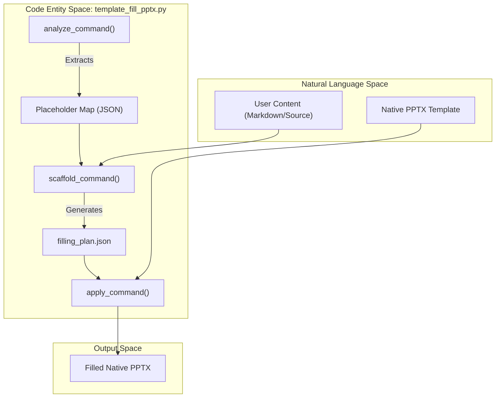
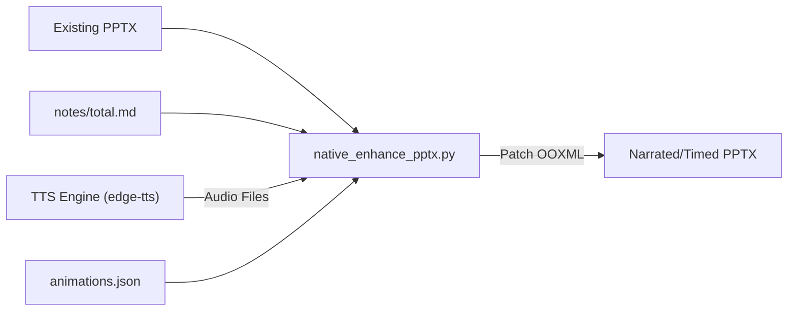

# Direct PPTX Workflows

Relevant source files

The following files were used as context for generating this wiki page:

- [docs/powerpoint-svg-mapping.md](docs/powerpoint-svg-mapping.md)
- [docs/technical-design.md](docs/technical-design.md)

Direct PPTX workflows are specialized execution paths in PPT Master that bypass the standard SVG generation pipeline. While the core system focuses on AI-driven SVG-to-DrawingML conversion, these workflows operate directly on the PowerPoint Open XML (OOXML) structure to achieve specific goals: cloning existing slide shells, patching finished decks with multimedia, or performing structural beautification while maintaining content 1:1.

## Workflow Overview and Routing

The system uses a deterministic routing logic to dispatch requests to the appropriate direct PPTX handler based on the input type and the user's intent regarding slide structure preservation.

| Workflow | Input Role | Output Mechanics | Primary Use Case |
| :--- | :--- | :--- | :--- |
| `template-fill-pptx` | Native PPTX template + new content | Clones selected slide masters and patches OOXML text/tables | Filling branded corporate templates with new data. |
| `native-enhance-pptx` | Finished PPTX | Append-only OOXML patching for notes, audio, and timings | Adding narration and transitions to a finalized deck. |
| `beautify-pptx` | Existing PPTX | Fact extraction followed by SVG-pipeline regeneration | Improving the layout of a deck while keeping page count/wording. |

### Routing Preconditions
The decision to use a direct workflow is governed by the route selection logic [docs/technical-design.md:54-56](). If the user requires preserving PowerPoint slide shells rather than converting them to SVG, `template-fill-pptx` is selected [docs/technical-design.md:55-55](). If the request is to keep content/layout stable but add enhancements like audio, `native-enhance-pptx` is triggered [docs/technical-design.md:54-55](). The `beautify-pptx` profile uses the standard lifecycle but with 1:1 source constraints [docs/technical-design.md:48-50]().

Sources: [docs/technical-design.md:45-57]()

---

## 1. template-fill-pptx

The `template-fill-pptx` workflow is designed for "cloning and filling." It treats a native PPTX file as a structural scaffold, using AI to map new content into the existing placeholders of that template. This route is explicitly for raw PPTX template requests [docs/technical-design.md:75-75]().

### Implementation Pipeline
The workflow is implemented via `template_fill_pptx.py` and follows a five-stage command sequence:
1.  **Analyze**: Extracts the structure and placeholders of the source PPTX.
2.  **Scaffold**: Creates a mapping between the new content and the available slide layouts.
3.  **Check-Plan**: A validation step to ensure the AI's mapping plan aligns with the template's constraints.
4.  **Apply**: Executes the OOXML patching to insert text, update tables, and swap chart data.
5.  **Validate**: Final structural check of the generated file.

### Data Flow: Native Template Filling
The following diagram illustrates how the `template-fill-pptx` workflow maps natural language content into code-managed OOXML structures.

**Template Filling Architecture**

Sources: [docs/technical-design.md:54-56](), [docs/technical-design.md:75-75]()

---

## 2. native-enhance-pptx

The `native-enhance-pptx` workflow provides an append-only mechanism for adding professional presentation features to a deck without altering its visual design. It operates directly on OOXML [docs/technical-design.md:54-55]().

### Key Capabilities
*   **Speaker Notes**: Generates and inserts native PowerPoint notes.
*   **Narration Audio**: Integrates TTS-generated audio files into the slide's relationship folder.
*   **Timings & Transitions**: Configures `auto-advance` timings based on audio duration and applies slide transitions defined in `animations.json` [docs/powerpoint-svg-mapping.md:126-126]().

### Audio and Animation Integration
The workflow leverages the `pptx_animations.py` and `pptx_builder` modules to patch the underlying XML. It maps animation effects to specific DrawingML transition types.

**Enhancement Pipeline**

Sources: [docs/technical-design.md:54-55](), [docs/powerpoint-svg-mapping.md:126-130]()

---

## 3. beautify-pptx

The `beautify-pptx` workflow is a hybrid. It is used when a user has an existing deck and wants to "fix the design" while strictly maintaining the original content, page count, and sequence. It uses the standard generation lifecycle but enforces 1:1 constraints [docs/technical-design.md:48-50]().

### Process
1.  **Fact Extraction**: The system runs intake on each archived PPTX to write analysis files (`.identity.json`, `.slide_library.json`) [docs/technical-design.md:68-68]().
2.  **Locked Regeneration**: The workflow uses the `beautify-pptx` profile, which bypasses separate planning/confirmation if "Quick" is also selected, but keeps 1:1 source constraints [docs/technical-design.md:48-52]().
3.  **SVG Pipeline Dispatch**: The content is sent through the Executor to generate new SVGs.
4.  **Final Export**: The SVGs are converted back to DrawingML via `svg_to_pptx.py`.

### Comparison of Boundaries
| Feature | `template-fill` | `native-enhance` | `beautify` |
| :--- | :--- | :--- | :--- |
| **Changes Layout?** | No (Uses template's) | No (Preserves original) | Yes (Regenerates) |
| **Changes Content?** | Yes (Adds new) | No (Adds metadata) | No (Refines only) |
| **Uses SVG Pipeline?** | No | No | Yes |

Sources: [docs/technical-design.md:48-56](), [docs/technical-design.md:66-70]()

---

## Technical Components and Classes

### OOXML Patching Logic
The direct workflows rely on the `svg_to_pptx/` package's lower-level utilities, specifically those that interact with `python-pptx` and direct XML manipulation.

*   **`pptx_builder.py`**: Handles the assembly of the final PPTX structure.
*   **`pptx_animations.py`**: Manages the `timing` and `transition` XML elements within the slide part [docs/powerpoint-svg-mapping.md:126-126]().
*   **`native_enhance_pptx.py` / `native_narration_pptx.py`**: Specifically handle the embedding of binary audio blobs and setting the triggers.

### Direct Preservation vs. SVG Mapping
The system distinguishes between features that are `Native-stable` (survive SVG export/import) and those that require `Direct preservation` [docs/powerpoint-svg-mapping.md:29-34](). Direct PPTX workflows are used when `Direct preservation` is required for OOXML features that the main SVG compiler does not recreate [docs/powerpoint-svg-mapping.md:34-34]().

| PowerPoint Feature | Project Representation | PPTX Result |
| :--- | :--- | :--- |
| Slide Master | `data-pptx-layer="master"` | Reusable Master part [docs/powerpoint-svg-mapping.md:61-61]() |
| Slide Layout | `data-pptx-layer="layout"` | Reusable Layout part [docs/powerpoint-svg-mapping.md:62-62]() |
| Native Charts | `data-pptx-type="chart"` | `c:chart` Graphic Frame [docs/powerpoint-svg-mapping.md:99-99]() |

Sources: [docs/powerpoint-svg-mapping.md:27-35](), [docs/powerpoint-svg-mapping.md:57-65](), [docs/powerpoint-svg-mapping.md:97-105]()
