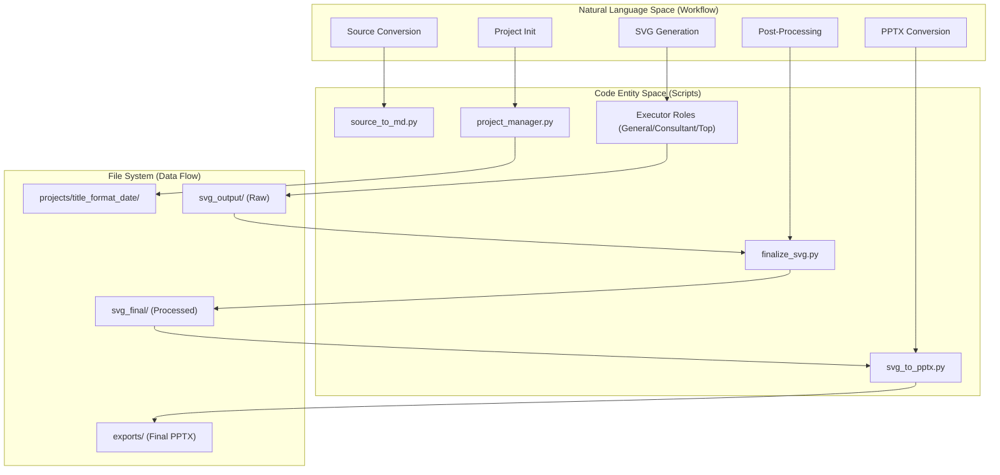
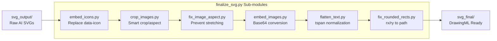

# Quick Reference

<details>
<summary>Relevant source files</summary>

The following files were used as context for generating this wiki page:

- [docs/README.md](docs/README.md)
- [docs/faq.md](docs/faq.md)
- [docs/getting-started.md](docs/getting-started.md)

</details>


This page provides condensed command templates, file path references, naming conventions, and troubleshooting patterns for experienced users of the PPT Master system. It is designed as a quick lookup reference for technical operations rather than a tutorial.

For complete workflow tutorials, see [8.1 End-to-End Generation Workflow](). For detailed post-processing procedures, see [8.2 SVG Post-Processing Guide](). For comprehensive image handling, see [8.3 Image Embedding Guide]().

---

## Command Templates

### Source Document Conversion
Converts various input formats into a unified Markdown format used by the AI roles.

```bash
# Unified dispatcher for all supported formats
python3 skills/ppt-master/scripts/source_to_md.py <input_file_or_url>

# Format-specific scripts (called by dispatcher)
python3 skills/ppt-master/scripts/source_to_md/pdf_to_md.py <PDF_file>
python3 skills/ppt-master/scripts/source_to_md/doc_to_md.py <DOCX_file>
python3 skills/ppt-master/scripts/source_to_md/ppt_to_md.py <PPTX_file>
python3 skills/ppt-master/scripts/source_to_md/web_to_md.py <URL>
```

**Sources:** [docs/faq.md:7-9](), [docs/faq.md:12-13]()

### Project Management
Commands for lifecycle management using `project_manager.py`.

```bash
# Initialize new project
# Format naming: <title>_<format>_<YYYYMMDD>
python3 skills/ppt-master/scripts/project_manager.py init <project_name> --format ppt169

# Supported canvas formats: ppt169, ppt43, xhs (3:4), moments (1:1), story (9:16), banner, a4
# Example: Initialize for Xiaohongshu
python3 skills/ppt-master/scripts/project_manager.py init my_post --format xhs

# Import source files into project (moves files to sources/ directory)
python3 skills/ppt-master/scripts/project_manager.py import-sources <project_path> <source_files...> --move

# Validate project structure and file integrity
python3 skills/ppt-master/scripts/project_manager.py validate <project_path>
```

**Sources:** [docs/faq.md:17-29](), [docs/getting-started.md:63-69]()

### SVG Post-Processing Pipeline
The pipeline **MUST** be run sequentially. `finalize_svg.py` is the critical transformation engine before export.

```bash
# Step 1: Execute 6-step finalization (icons, cropping, Base64 embedding, text flattening)
python3 skills/ppt-master/scripts/finalize_svg.py <project_path>

# Step 2: Export to PowerPoint (Native DrawingML)
python3 skills/ppt-master/scripts/svg_to_pptx.py <project_path>

# Optional: Export with strict line fidelity (one text box per line)
python3 skills/ppt-master/scripts/svg_to_pptx.py <project_path> --no-merge

# Optional: Enable element-level animations
python3 skills/ppt-master/scripts/svg_to_pptx.py <project_path> -a auto --animation-trigger on-click
```

**Sources:** [docs/faq.md:81-83](), [docs/getting-started.md:69-71]()

---

## Tool Chain Architecture

### Workflow to Code Mapping
This diagram maps high-level system requirements to specific code entities and their file system outputs.



**Sources:** [docs/faq.md:7-9](), [docs/faq.md:67-69](), [docs/getting-started.md:63-71]()

### Processing Pipeline Details
The internal data flow of `finalize_svg.py` showing the transformation of raw AI SVGs into PowerPoint-compatible assets.



**Sources:** [docs/faq.md:81-83](), [docs/getting-started.md:69-71]()

---

## File Structure Patterns

### Project Directory Layout
Standard project structure as managed by `project_manager.py`.

```text
projects/<title>_<format>_YYYYMMDD/
├── README.md                              # Project metadata
├── spec_lock.md                           # Machine-readable design contract
├── design_spec.md                         # Human-readable Strategist spec
├── sources/                               # Markdown source materials
├── images/                                # Local assets & generated images
│   ├── image_prompts.json                 # Manifest for image_gen.py
│   └── formula_manifest.json              # LaTeX formulas for latex_render.py
├── svg_output/                            # Raw AI SVG files
└── svg_final/                             # Processed SVGs (ready for export)
```

**Sources:** [docs/faq.md:67-69](), [docs/getting-started.md:46-49]()

### File Naming Conventions

| Entity | Pattern | Example |
|--------|---------|---------|
| **Project folder** | `<title>_<format>_<YYYYMMDD>` | `ai_roadmap_ppt169_20260520` |
| **SVG slide** | `slide_<NN>_<topic>.svg` | `slide_01_cover.svg` |
| **Exported PPTX** | `<project_name>_<timestamp>.pptx` | `ai_roadmap_202605201430.pptx` |

**Sources:** [docs/faq.md:67-69](), [docs/getting-started.md:69-71]()

---

## Technical Specifications

### PowerPoint Compatibility Rules
Critical constraints for SVG generation to ensure successful DrawingML conversion.

| Feature | Status | Alternative / Rule |
|---------|--------|---------------------|
| `rgba()` | **Banned** | Use `fill-opacity` or `stroke-opacity` |
| `<g opacity>` | **Banned** | Set opacity on each child individually |
| `mask`, `style` | **Banned** | Use inline attributes only |
| `foreignObject` | **Banned** | Use standard `<text>` and `<tspan>` |
| `clipPath` | **Allowed** | Only on `<image>`, single shape child |
| `pattern` | **Conditional**| Use `data-pptx-pattern` from preset list |

**Sources:** [docs/README.md:29-31]()

### Role Variants (Executors)

| Role | Use Case | Characteristics |
|------|----------|-----------------|
| `Executor_General` | Standard scenarios | Flexible layout, high creative variance |
| `Executor_Consultant` | Business/Corporate | Structured, data-heavy, professional |
| `Executor_Consultant_Top`| MBB/Tier 1 | SCQA framework, 5 core consulting techniques |

**Sources:** [docs/README.md:37-39]()

---

## Troubleshooting & FAQ

### Common Issues

**Q: Text overflows or elements are misaligned.**
*   **Cause**: Model coordinate calculation error or font metric mismatch.
*   **Fix**: Switch to **Claude (Opus/Sonnet)**. Use the `live-preview` workflow to annotate and re-generate the specific page.
*   **Sources**: [docs/faq.md:84-86]()

**Q: How to update the global design (colors/fonts) across all slides?**
*   **Workflow**: 
    1. Update `spec_lock.md` with new hex codes or font sizes.
    2. Run `python3 skills/ppt-master/scripts/update_spec.py <project_path>`.
    3. Re-run Executor for affected pages to ingest the updated contract.
*   **Sources**: [docs/getting-started.md:49-51]()

**Q: The generated PPTX won't open or shows "Repaired" message.**
*   **Cause**: Invalid SVG features (e.g., non-standard patterns or CSS classes).
*   **Fix**: Check `svg_quality_checker.py` (if available) or verify SVG source against banned features.
*   **Sources**: [docs/README.md:29-31]()

### Quick Reminders
*   **LaTeX Formulas**: Supported via `latex_render.py` [docs/faq.md:9]().
*   **Audio/Video**: Run narration workflows; uses `notes_to_audio.py` [docs/getting-started.md:13-14]().
*   **Direct PPTX Fill**: Use the **Fill Native PPTX** route to clone existing deck designs [docs/getting-started.md:27]().
*   **Update Repo**: Run `python3 skills/ppt-master/scripts/update_repo.py` to sync latest capabilities [docs/faq.md:35-53]().

**Sources:** [docs/faq.md:1-100](), [docs/getting-started.md:1-100](), [docs/README.md:1-47]()
