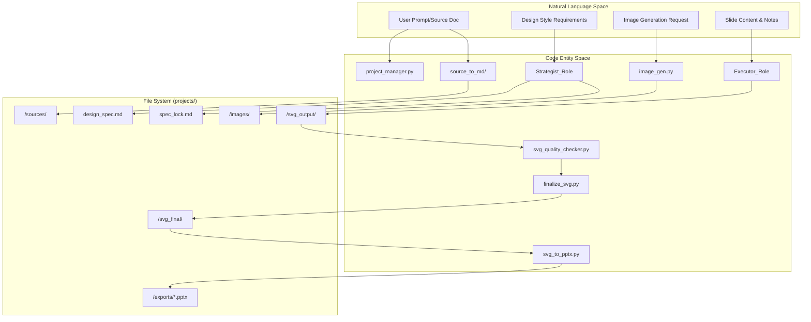
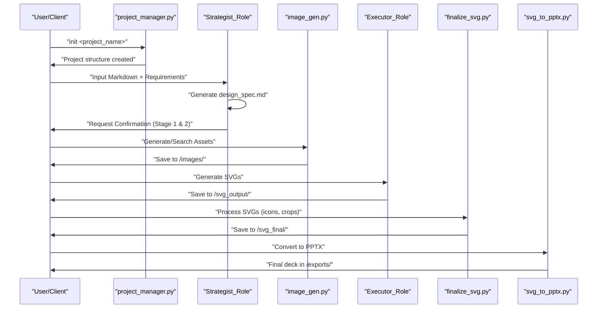

# Glossary

Relevant source files

The following files were used as context for generating this wiki page:

- [.claude-plugin/marketplace.json](.claude-plugin/marketplace.json)
- [.env.example](.env.example)
- [docs/powerpoint-svg-mapping.md](docs/powerpoint-svg-mapping.md)
- [docs/technical-design.md](docs/technical-design.md)
- [docs/templates-architecture.md](docs/templates-architecture.md)

This glossary defines the technical terms, architectural concepts, and domain-specific jargon used within the PPT Master codebase. It is intended to assist onboarding engineers in navigating the multi-role AI collaboration pipeline and the SVG-to-DrawingML conversion engine.

## Core Concepts & Architecture

### Multi-Role Collaboration
The system operates on a sequential pipeline of specialized AI roles. Each role has a distinct set of responsibilities and constraints defined in the system documentation [docs/technical-design.md:30-38]().

*   **Strategist**: The lead role responsible for content analysis and the "Eight Confirmations" process. It produces the `design_spec.md` and `spec_lock.md` [docs/technical-design.md:30-30]().
*   **Image_Generator**: A conditional role that activates to generate visual assets or search for web images based on the Strategist's requirements [docs/technical-design.md:32-32]().
*   **Executor**: The role that performs the "Two-Phase Generation": Visual Construction (SVG) and Logic Construction (Speaker Notes) [docs/technical-design.md:34-38]().
*   **Template_Designer**: A specialized role triggered via the `/create-template` workflow to generate reusable layouts and page templates [docs/templates-architecture.md:17-20]().

### DrawingML
The underlying XML-based language used by Microsoft PowerPoint to describe vector shapes, images, and charts. PPT Master's core value proposition is converting standard SVG elements into native DrawingML objects, making them fully editable in PowerPoint [docs/powerpoint-svg-mapping.md:18-19]().

| SVG Element | DrawingML Mapping |
| :--- | :--- |
| `<path d="...">` | `<a:custGeom>` |
| `<rect rx="...">` | `<a:prstGeom prst="roundRect">` |
| `<circle>` | `<a:prstGeom prst="ellipse">` |
| `transform` | `<a:xfrm>` |

**Sources:** [docs/powerpoint-svg-mapping.md:41-48](), [docs/technical-design.md:103-104]()

### Spec Lock (`spec_lock.md`)
A mandatory configuration file generated by the **Strategist** that "locks" the design language for a project. It contains the chosen color palette, typography ramp, canvas format, and icon style [docs/technical-design.md:77-77](). All **Executor** roles must adhere to this file to ensure visual consistency [docs/technical-design.md:11-11]().

### Canvas Format
The aspect ratio and coordinate system for the presentation. PPT Master supports multiple formats beyond standard 16:9 [docs/powerpoint-svg-mapping.md:43-43]().

| Format | viewBox |
| :--- | :--- |
| `ppt169` | `0 0 1280 720` |
| `ppt43` | `0 0 1024 768` |
| `red` (Xiaohongshu) | `0 0 1242 1660` |

**Sources:** [docs/powerpoint-svg-mapping.md:51-51](), [docs/templates-architecture.md:19-19]()

---

## Technical Terms & Jargon

### Banned Features
A set of SVG features that are forbidden because they cannot be reliably mapped to native DrawingML objects. These include `<style>`, `class`, `<mask>`, `<foreignObject>`, and `<script>` [docs/technical-design.md:15-15]().

### DrawingML Converter
The logic within `svg_to_pptx.py` that translates SVG paths and attributes into PowerPoint's XML schema. It produces native DrawingML shapes by default [docs/technical-design.md:35-35]().

### Eight Confirmations
A protocol followed by the **Strategist** to validate project requirements (e.g., target audience, tone, language, key messages) before any generation begins [docs/technical-design.md:30-30]().

### Page Rhythm
A design concept used by **Executors** to vary the visual density of slides.
*   **Anchor**: High-impact, low-text visual slides (e.g., Cover, Closing).
*   **Dense**: Information-heavy content slides.
*   **Breathing**: Transition or quote slides with significant whitespace.

### Post-processing Pipeline
A mandatory transformation sequence to turn raw AI output into a valid presentation [docs/technical-design.md:44-44]().
1.  `total_md_split.py`: Splits combined speaker notes into individual files [docs/technical-design.md:87-87]().
2.  `finalize_svg.py`: Performs technical cleanup (embedding icons, fixing aspect ratios) [docs/technical-design.md:84-86]().
3.  `svg_to_pptx.py`: Converts cleaned SVGs to `.pptx` [docs/technical-design.md:35-35]().

### Quick Generate Profile
A bypass route that skips separate planning, the first-page gate, and interactive confirmation to speed up generation [docs/technical-design.md:50-52]().

### Beautify Profile
A workflow that re-layouts an existing deck verbatim through the SVG pipeline while inheriting its visual identity [docs/technical-design.md:48-50]().

### Image Resource List
A manifest of images required for a presentation, including their status (Pending, Existing, or Placeholder) and specific metadata [docs/technical-design.md:79-79]().

### SCQA Framework
(Situation, Complication, Question, Answer) A structured thinking and communication framework primarily used for consulting-style decks.

### Template Kinds
The system distinguishes four parallel reusable-rule bundles [docs/templates-architecture.md:13-20]():
*   **Brand**: Identity (color, typography, logo).
*   **Style**: Communication method and visual defaults.
*   **Layout**: Brand-neutral structure (canvas, slots).
*   **Deck**: Integrated identity + structure for recurring applications.

### `conversion_profile.json`
A sidecar file generated during source conversion that stores metadata about the original document's profile [docs/technical-design.md:68-68]().

### `svg_authoring_view.py`
A script that creates editable authoring IR (Intermediate Representation) bundles from imported SVGs [docs/templates-architecture.md:113-113]().

### `video_motion_plan.py`
A tool for generating renderer-neutral motion plans from conversion traces for use in video production.

### `prompt_audit.py`
A maintainer-only tool for governance linting and monitoring token budgets across AI prompts.

### `pptx_delivery_check.py`
A validation tool used to verify the integrity and standards-compliance of the final generated PPTX package.

### `data-icon` placeholder
An attribute used in SVG to indicate where an icon from the icon library should be embedded [docs/templates-architecture.md:109-109]().

### Catalogs (Modes, Visual-Styles, Image-Types)
Standardized libraries used by the Strategist and Image Generator:
*   **Modes**: Narrative structures (pyramid, briefing, etc.).
*   **Visual-Styles**: Design aesthetics (swiss-minimal, glassmorphism, etc.).
*   **Image-Type-Templates**: Layout patterns for generated visuals (flowchart, matrix).

---

## System Data Flow

The following diagrams illustrate the transition from Natural Language requirements to Code Entities and physical files.

### Natural Language to Code Entity Mapping

**Sources:** [docs/technical-design.md:59-95](), [docs/templates-architecture.md:89-99]()

### Technical Pipeline Execution

**Sources:** [docs/technical-design.md:59-95](), [docs/templates-architecture.md:22-26]()

---

## Tooling & Scripts

### Project Manager (`project_manager.py`)
The primary CLI tool for project lifecycle management, including `init` for directory structure and `import-sources` for content collection [docs/technical-design.md:64-66]().

### Image Backend Dispatcher (`image_gen.py`)
A multi-provider system that abstracts 14+ image generation APIs (Gemini, OpenAI, Qwen, etc.) behind a unified interface [.env.example:21-25]().

### SVG Quality Checker (`svg_quality_checker.py`)
A validation tool that scans generated SVGs for **Banned Features** and technical errors before conversion [docs/technical-design.md:35-35]().

### `finalize_svg.py`
A critical post-processing script that applies a 6-step transformation pipeline to raw SVGs (embed-icons, crop-images, etc.) to prepare them for DrawingML conversion [docs/technical-design.md:44-44]().

### `svg_to_pptx.py`
The final conversion script that takes processed SVGs and converts them into a natively editable PowerPoint (`.pptx`) file [docs/technical-design.md:35-35]().

### `pptx_template_import.py`
A script used in the `/create-template` workflow to extract reference assets and structural information from existing PPTX files [docs/technical-design.md:68-69]().

### `svg_editor/server.py`
A Python script that launches a live preview server for generated SVGs, allowing for real-time visual review [docs/technical-design.md:82-82]().

**Sources:** [docs/technical-design.md:35-44](), [docs/templates-architecture.md:109-113]()
