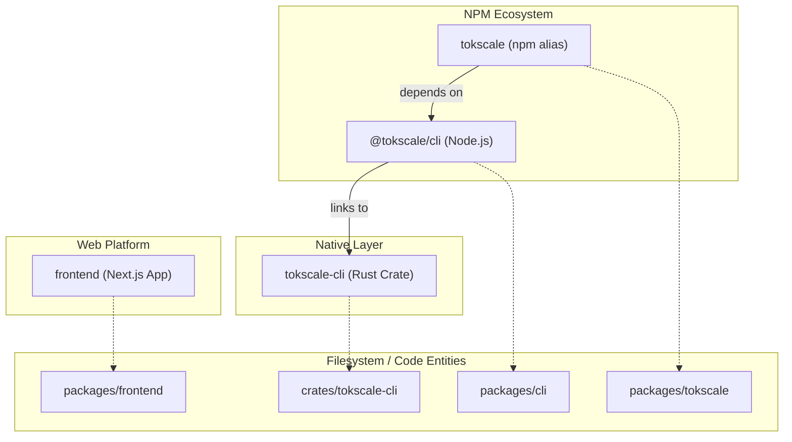
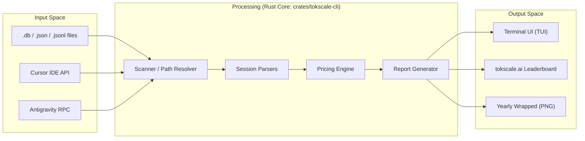

# Overview

Relevant source files

The following files were used as context for generating this wiki page:

- [README.ja.md](README.ja.md)
- [README.ko.md](README.ko.md)
- [README.md](README.md)
- [README.zh-cn.md](README.zh-cn.md)
- [crates/tokscale-cli/src/antigravity.rs](crates/tokscale-cli/src/antigravity.rs)
- [crates/tokscale-cli/src/paths.rs](crates/tokscale-cli/src/paths.rs)
- [packages/cli/package.json](packages/cli/package.json)
- [packages/tokscale/package.json](packages/tokscale/package.json)

## Purpose and Scope

This document provides a high-level introduction to Tokscale, describing its purpose as an AI token usage tracking system, the main architectural components, and how they work together. Tokscale is designed to provide developers with transparency into the costs and consumption patterns of various AI coding assistants.

## What is Tokscale?

Tokscale is a high-performance system for tracking, analyzing, and visualizing token consumption from AI coding assistants. It supports over 25 different clients, including OpenCode, Claude Code, Cursor, Gemini, and GitHub Copilot CLI [[README.md:54-78]]().

The system consists of three major components:
1.  **CLI tool** (`@tokscale/cli`): A command-line interface with an interactive Terminal UI (TUI) for local data exploration [[packages/cli/package.json:2-10]]().
2.  **Native Rust core** (`tokscale-cli` crate): A high-performance engine for parsing local session databases and files, calculating costs, and generating reports [[crates/tokscale-cli/src/lib.rs:1-10]]().
3.  **Web platform** (`tokscale.ai`): A Next.js application for social leaderboards, public profiles, and 3D usage visualizations [[README.md:46-48]]().

**Sources:** [README.md:9-10](), [README.md:54-78](), [packages/cli/package.json:2-10]()

## System Components

The Tokscale monorepo is organized into several packages and crates that handle specific layers of the application:

| Package/Crate | Type | Purpose |
| :--- | :--- | :--- |
| `@tokscale/cli` | TypeScript / Node.js | Provides the `tokscale` command and manages the TUI environment [[packages/cli/package.json:2-10]](). |
| `tokscale-cli` | Rust Crate | The high-performance core responsible for file scanning, session parsing, and pricing resolution [[crates/tokscale-cli/src/lib.rs:1-10]](). |
| `tokscale` | npm Wrapper | An alias package that installs `@tokscale/cli` for user convenience [[packages/tokscale/package.json:2-10]](). |
| `frontend` | Next.js | The web application at [tokscale.ai](https://tokscale.ai) [[README.md:48]](). |

### Monorepo Dependency Graph

The following diagram illustrates how the different code entities relate to one another, bridging the high-level system names to specific directories and packages.

**Sources:** [packages/cli/package.json:2-10](), [packages/tokscale/package.json:2-10](), [README.md:145-150]()

## Supported AI Coding Assistants

Tokscale tracks token usage from a wide variety of AI coding assistants by scanning their local storage paths. Key supported clients include:

| Client | Primary Data Location |
| :--- | :--- |
| **OpenCode** | `~/.local/share/opencode/opencode.db` [[README.md:58]]() |
| **Claude Code** | `~/.claude/projects/` and `~/.claude/transcripts/` [[README.md:59]]() |
| **GitHub Copilot** | `~/.copilot/otel/*.jsonl` [[README.md:62]]() |
| **Cursor IDE** | `~/.config/tokscale/cursor-cache/` (via API sync) [[README.md:65]]() |
| **Gemini CLI** | `~/.gemini/tmp/*/chats/*.json` [[README.md:64]]() |
| **Antigravity** | `~/.config/tokscale/antigravity-cache/` [[crates/tokscale-cli/src/antigravity.rs:30-35]]() |

**Sources:** [README.md:58-78](), [crates/tokscale-cli/src/antigravity.rs:30-35]()

## Data Flow Pipeline

The system follows a pipeline from local raw data to aggregated reports and optional social submission.

**Sources:** [README.md:58-78](), [crates/tokscale-cli/src/lib.rs:1-10](), [crates/tokscale-cli/src/antigravity.rs:147-160]()

## Key Technologies and Performance

Tokscale is built for speed and efficiency, especially when dealing with thousands of session files:

*   **Rust Core**: Provides native performance for file I/O and parsing, significantly outperforming pure TypeScript implementations for large datasets [[README.md:13]]().
*   **SIMD JSON**: Uses SIMD-accelerated JSON parsing to process large volumes of session logs rapidly.
*   **Rayon**: Utilizes data parallelism for scanning directories and parsing files across multiple CPU cores.
*   **Antigravity Sync**: Implements a custom RPC-based synchronization for Google Antigravity sessions [[crates/tokscale-cli/src/antigravity.rs:147-155]]().
*   **Cross-Platform Support**: Distributed as native binaries for macOS (Intel/M1), Linux (glibc/musl), and Windows [[packages/cli/package.json:32-39]]().

**Sources:** [README.md:13](), [packages/cli/package.json:32-39](), [crates/tokscale-cli/src/antigravity.rs:147-155]()

## Configuration and Storage

Tokscale adheres to platform-standard directories for storing configuration and cached data.

| Item | Path |
| :--- | :--- |
| **Config Dir** | `~/.config/tokscale/` (or `TOKSCALE_CONFIG_DIR`) [[crates/tokscale-cli/src/paths.rs:23-30]]() |
| **Cache Dir** | `~/.cache/tokscale/` [[crates/tokscale-cli/src/paths.rs:70]]() |
| **Antigravity Cache**| `~/.config/tokscale/antigravity-cache/` [[crates/tokscale-cli/src/antigravity.rs:30-31]]() |
| **Legacy macOS** | `~/Library/Application Support/tokscale` [[crates/tokscale-cli/src/paths.rs:25-30]]() |

**Sources:** [crates/tokscale-cli/src/paths.rs:23-35](), [crates/tokscale-cli/src/antigravity.rs:30-35]()
