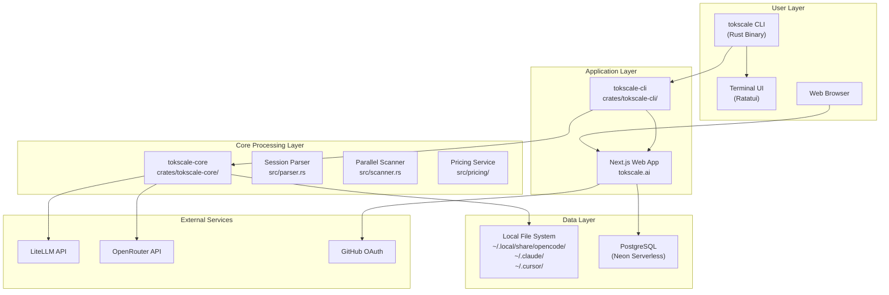
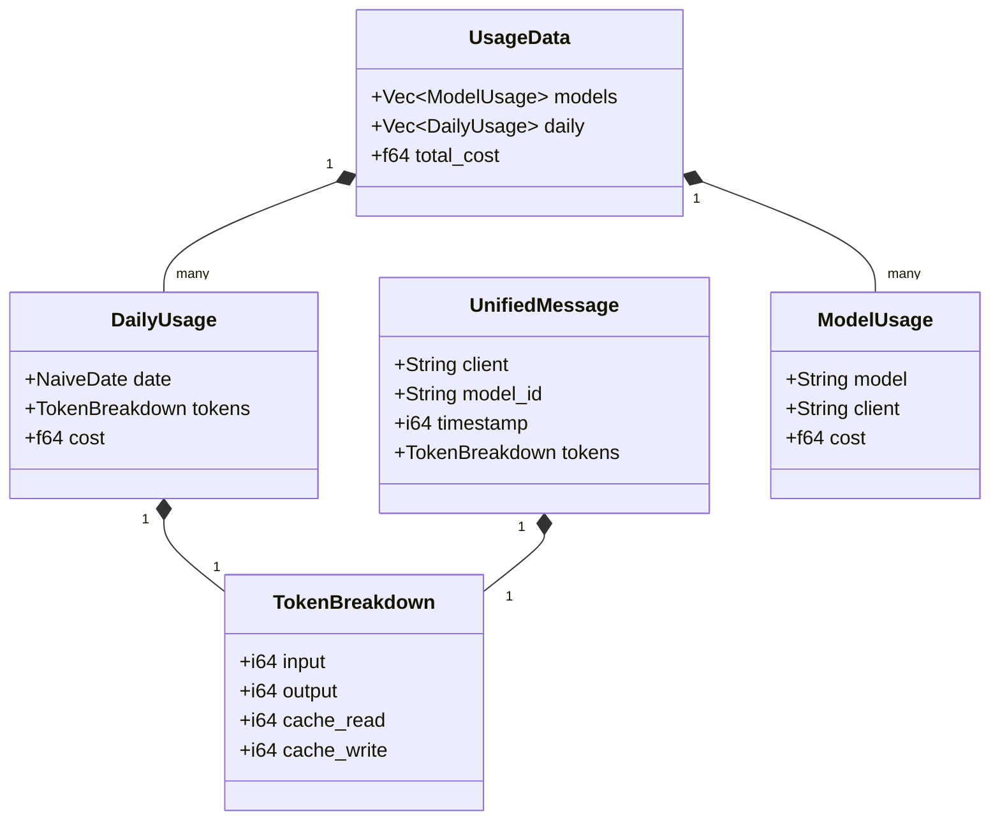

# Architecture

Relevant source files

The following files were used as context for generating this wiki page:

- [Cargo.toml](Cargo.toml)
- [crates/tokscale-cli/src/commands/wrapped.rs](crates/tokscale-cli/src/commands/wrapped.rs)
- [crates/tokscale-cli/src/main.rs](crates/tokscale-cli/src/main.rs)
- [crates/tokscale-cli/src/tui/client_ui.rs](crates/tokscale-cli/src/tui/client_ui.rs)
- [crates/tokscale-cli/src/tui/data/mod.rs](crates/tokscale-cli/src/tui/data/mod.rs)
- [crates/tokscale-cli/src/tui/ui/widgets.rs](crates/tokscale-cli/src/tui/ui/widgets.rs)
- [crates/tokscale-core/src/aggregator.rs](crates/tokscale-core/src/aggregator.rs)
- [crates/tokscale-core/src/clients.rs](crates/tokscale-core/src/clients.rs)
- [crates/tokscale-core/src/lib.rs](crates/tokscale-core/src/lib.rs)
- [crates/tokscale-core/src/scanner.rs](crates/tokscale-core/src/scanner.rs)
- [crates/tokscale-core/src/sessions/mod.rs](crates/tokscale-core/src/sessions/mod.rs)
- [packages/cli-darwin-arm64/package.json](packages/cli-darwin-arm64/package.json)
- [packages/cli-darwin-x64/package.json](packages/cli-darwin-x64/package.json)
- [packages/cli-linux-arm64-gnu/package.json](packages/cli-linux-arm64-gnu/package.json)
- [packages/cli-linux-arm64-musl/package.json](packages/cli-linux-arm64-musl/package.json)
- [packages/cli-linux-x64-gnu/package.json](packages/cli-linux-x64-gnu/package.json)
- [packages/cli-linux-x64-musl/package.json](packages/cli-linux-x64-musl/package.json)
- [packages/cli-win32-arm64-msvc/package.json](packages/cli-win32-arm64-msvc/package.json)
- [packages/cli-win32-x64-msvc/package.json](packages/cli-win32-x64-msvc/package.json)

This document describes the overall system architecture of Tokscale, including the monorepo structure, component relationships, and how the CLI, native Rust core, and web frontend work together. For details on specific subsystems, see [Monorepo Structure](#2.1) and [Data Flow Pipeline](#2.2).

## System Overview

Tokscale is architected as a monorepo containing a high-performance native Rust core and a command-line interface. The system follows a layered architecture where a native Rust core handles data-intensive operations (parsing, pricing, aggregation), while the CLI provides both a traditional command interface and a rich Terminal UI (TUI).

**Sources:** [crates/tokscale-cli/src/main.rs:1-126](), [crates/tokscale-core/src/lib.rs:1-19]()

## Three-Tier Architecture

### CLI Tool (`tokscale-cli`)

The CLI provides the primary user interface. It is written in Rust and uses `clap` for command-line argument parsing and `ratatui` for the interactive Terminal UI.

**Key Components:**
- **Entry Point:** [crates/tokscale-cli/src/main.rs:19-87]() - Command routing via the `Cli` struct.
- **TUI Application:** [crates/tokscale-cli/src/tui/client_ui.rs]() - Interactive dashboard using `ratatui`.
- **Command Handlers:** [crates/tokscale-cli/src/commands/]() - Logic for specific commands like `models`, `monthly`, and `wrapped`.
- **Social Integration:** [crates/tokscale-cli/src/auth.rs]() - Authentication and data submission to the social platform.

**Sources:** [crates/tokscale-cli/src/main.rs:89-215](), [crates/tokscale-cli/src/commands/wrapped.rs:100-158]()

### Native Rust Core (`tokscale-core`)

The core library handles all performance-critical operations. It is designed to be highly parallel, utilizing `rayon` for directory scanning and file parsing.

**Key Components:**
- **Parallel Scanner:** [crates/tokscale-core/src/scanner.rs:59-121]() - Discovers session files across 25+ supported AI clients.
- **Session Parser:** [crates/tokscale-core/src/parser.rs]() - Normalizes heterogeneous JSON/SQLite data into `UnifiedMessage` structures.
- **Pricing Engine:** [crates/tokscale-core/src/pricing/mod.rs]() - Resolves model IDs to costs using LiteLLM and OpenRouter data.
- **Aggregator:** [crates/tokscale-core/src/aggregator.rs]() - Summarizes raw message data into `TokenBreakdown` and `DailyTotals`.

**Sources:** [crates/tokscale-core/src/lib.rs:137-170](), [crates/tokscale-core/src/scanner.rs:1-8]()

### Frontend Web Application

The web application (hosted at tokscale.ai) is a Next.js project that serves as a social hub. It displays leaderboards, user profiles, and interactive 3D contribution graphs.

**Key Features:**
- **Leaderboard:** Ranks users by token usage and cost across different time periods.
- **User Profiles:** Visualizes individual usage history and model preferences.
- **Embeds:** Generates SVG badges and profile cards for use in GitHub READMEs.

## Data Structures and Code Entities

The following diagram bridges the gap between high-level concepts and the specific Rust structs used in the codebase.

**Sources:** [crates/tokscale-core/src/lib.rs:137-150](), [crates/tokscale-cli/src/tui/data/mod.rs:48-58](), [crates/tokscale-cli/src/tui/data/mod.rs:136-149]()

## Build and Distribution

Tokscale is distributed primarily as a native binary via npm. The monorepo includes several platform-specific packages to ensure compatibility across operating systems.

**Native Platform Targets:**
| Package Name | OS | Architecture | Libc |
|--------------|----|--------------|------|
| `@tokscale/cli-darwin-arm64` | macOS | ARM64 | - |
| `@tokscale/cli-linux-x64-gnu` | Linux | x64 | glibc |
| `@tokscale/cli-linux-x64-musl` | Linux | x64 | musl |
| `@tokscale/cli-win32-x64-msvc` | Windows | x64 | - |

**Sources:** [packages/cli-darwin-arm64/package.json:1-12](), [packages/cli-linux-x64-gnu/package.json:1-15](), [packages/cli-win32-x64-msvc/package.json:1-12]()

## Component Communication

### CLI to Native Core
The `tokscale-cli` crate depends directly on `tokscale-core`. It invokes core functions such as `parse_local_unified_messages` to retrieve and process data from the local filesystem.

**Sources:** [crates/tokscale-cli/src/tui/data/mod.rs:8-12]()

### CLI to Social API
The CLI communicates with the web backend via HTTPS. It uses a device flow for authentication ([crates/tokscale-cli/src/auth.rs]()) and submits aggregated JSON reports to the `/api/submit` endpoint.

**Sources:** [crates/tokscale-cli/src/main.rs:204-215]()

### TUI Data Loading
The TUI uses a `DataLoader` struct to manage asynchronous data fetching. It leverages `tokio` to run the core's parsing logic without blocking the UI rendering thread.

**Sources:** [crates/tokscale-cli/src/tui/data/mod.rs:151-156]()
