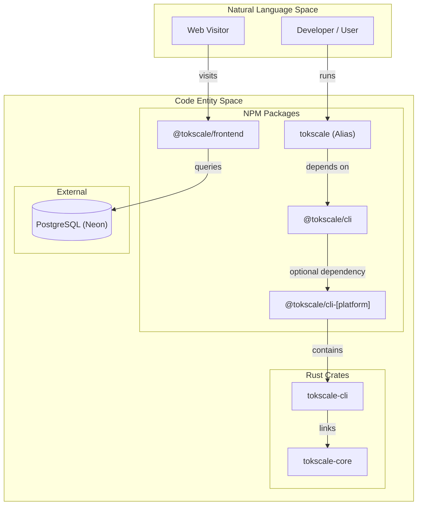
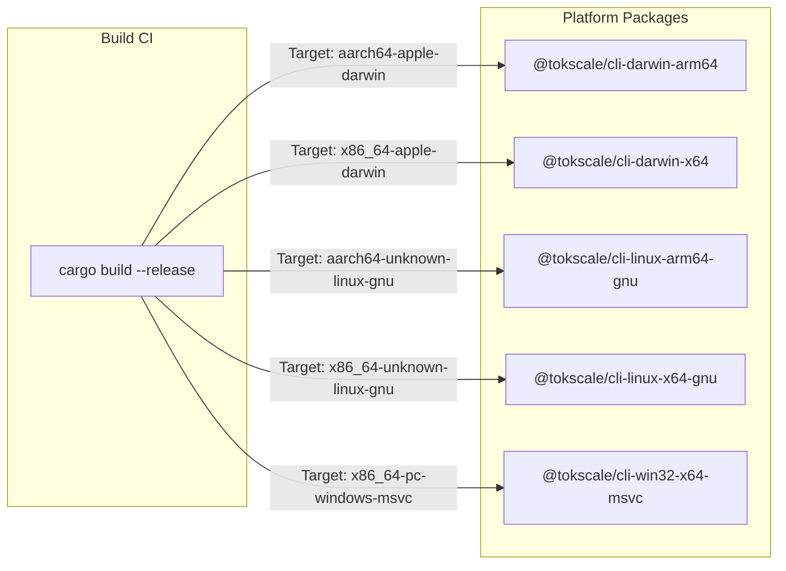

# Monorepo Structure

<details>
<summary>Relevant source files</summary>

The following files were used as context for generating this wiki page:

- [Cargo.toml](Cargo.toml)
- [bun.lock](bun.lock)
- [packages/cli-darwin-arm64/package.json](packages/cli-darwin-arm64/package.json)
- [packages/cli-darwin-x64/package.json](packages/cli-darwin-x64/package.json)
- [packages/cli-linux-arm64-gnu/package.json](packages/cli-linux-arm64-gnu/package.json)
- [packages/cli-linux-arm64-musl/package.json](packages/cli-linux-arm64-musl/package.json)
- [packages/cli-linux-x64-gnu/package.json](packages/cli-linux-x64-gnu/package.json)
- [packages/cli-linux-x64-musl/package.json](packages/cli-linux-x64-musl/package.json)
- [packages/cli-win32-arm64-msvc/package.json](packages/cli-win32-arm64-msvc/package.json)
- [packages/cli-win32-x64-msvc/package.json](packages/cli-win32-x64-msvc/package.json)
- [packages/cli/package.json](packages/cli/package.json)
- [packages/frontend/package.json](packages/frontend/package.json)
- [packages/frontend/src/app/layout.tsx](packages/frontend/src/app/layout.tsx)
- [packages/frontend/src/lib/providers/Providers.tsx](packages/frontend/src/lib/providers/Providers.tsx)
- [packages/frontend/src/lib/providers/index.ts](packages/frontend/src/lib/providers/index.ts)
- [packages/tokscale/package.json](packages/tokscale/package.json)

</details>


This document details the organization of the Tokscale monorepo, explaining the workspace structure, package dependencies, and the build relationships between the high-performance Rust core and the Node.js/TypeScript packages.

## Workspace Organization

Tokscale is organized as a monorepo using **Bun workspaces**. The project structure separates the high-performance native core, the CLI application, the web frontend, and platform-specific binary distributions.

### Directory Structure

```text
tokscale/
├── packages/
│   ├── cli/              # Main CLI logic (@tokscale/cli)
│   ├── tokscale/         # Entry point alias (tokscale)
│   ├── frontend/         # Next.js web application (@tokscale/frontend)
│   ├── benchmarks/       # Performance testing suite
│   └── cli-[platform]/   # 8 platform-specific binary packages
├── crates/
│   ├── tokscale-core/    # Native Rust core library
│   └── tokscale-cli/     # Native Rust CLI implementation
├── Cargo.toml            # Rust workspace configuration
└── bun.lock              # Unified Bun lockfile
```

**Sources:** [bun.lock:4-115](), [Cargo.toml:1-6]()

## Package Dependency Architecture

The system follows a tiered dependency model where the user-facing `tokscale` package acts as a thin wrapper around the primary CLI package, which in turn leverages native binaries for performance-critical operations.

### Dependency Graph

Title: Package Dependency and Data Flow


**Sources:** [packages/tokscale/package.json:29-31](), [packages/cli/package.json:31-40](), [Cargo.toml:15-17](), [bun.lock:73-84]()

## Core Packages

### 1. @tokscale/cli
The primary logic for the CLI tool. While the core processing is handled in Rust, this package manages the distribution and orchestration.
- **Main Entry:** `./dist/index.js` [packages/cli/package.json:7]()
- **Binary Mapping:** Maps the `tokscale` command to `./bin.js` [packages/cli/package.json:8-10]()
- **Optional Dependencies:** Includes 8 platform-specific packages (e.g., `@tokscale/cli-darwin-arm64`) to ensure the correct native binary is pulled during installation [packages/cli/package.json:31-40]().

### 2. tokscale (Alias Package)
A convenience package published as `tokscale` on npm to provide a clean installation command (`npm install -g tokscale`).
- **Dependency:** Depends directly on `@tokscale/cli` [packages/tokscale/package.json:30]().
- **Role:** Forwards execution to the main CLI package [packages/tokscale/bin.js:8]().

### 3. @tokscale/frontend
The Next.js application powering `tokscale.ai`.
- **Framework:** Next.js 16 [bun.lock:81]().
- **Data Access:** Uses `drizzle-orm` to interface with a Neon PostgreSQL database [bun.lock:74,79]().
- **Visualization:** Utilizes `obelisk.js` for isometric 3D graph rendering [bun.lock:83]().

**Sources:** [packages/cli/package.json:1-44](), [packages/tokscale/package.json:1-31](), [bun.lock:70-92]()

## Rust Workspace and Native Core

The performance-critical components are written in Rust and managed via a Cargo workspace [Cargo.toml:1-6]().

### Crate Relationships

| Crate | Path | Role | Key Dependencies |
|-------|------|------|------------------|
| `tokscale-core` | `crates/tokscale-core` | Core library for parsing sessions, pricing lookup, and report generation. | `rayon`, `simd-json`, `rusqlite` |
| `tokscale-cli` | `crates/tokscale-cli` | TUI and CLI command implementation. | `ratatui`, `clap`, `tokscale-core` |

### Native Dependencies
The Rust core utilizes several high-performance libraries to ensure rapid processing of large session files:
- **Parallelism:** `rayon` for multi-threaded session parsing [Cargo.toml:20]().
- **JSON Parsing:** `simd-json` for SIMD-accelerated JSON processing [Cargo.toml:23]().
- **Database:** `rusqlite` (bundled) for local caching and data management [Cargo.toml:49-50]().
- **UI:** `ratatui` and `crossterm` for the Terminal User Interface [Cargo.toml:59-61]().

**Sources:** [Cargo.toml:1-93]()

## Platform-Specific Binaries

To provide a zero-dependency installation experience for users without a Rust toolchain, Tokscale pre-compiles the Rust crates into platform-specific NPM packages.

Title: Binary Distribution Strategy


Each platform package contains a `bin` directory with the compiled executable and defines `os` and `cpu` constraints in its `package.json` [packages/cli-darwin-arm64/package.json:7-16](), [packages/cli-linux-x64-gnu/package.json:7-16]().

**Sources:** [packages/cli-darwin-arm64/package.json:1-20](), [packages/cli-linux-x64-gnu/package.json:1-20](), [packages/cli-win32-x64-msvc/package.json:1-20]()

## Versioning Strategy

All published packages (CLI, Core, and Platform Binaries) are kept in sync with a single version number to ensure compatibility.
- **Current Workspace Version:** `2.1.0` [Cargo.toml:9]().
- **Synchronization:** The `@tokscale/cli` package requires exact versions of the platform-specific optional dependencies [packages/cli/package.json:32-39]().

**Sources:** [Cargo.toml:9](), [packages/cli/package.json:3]()
