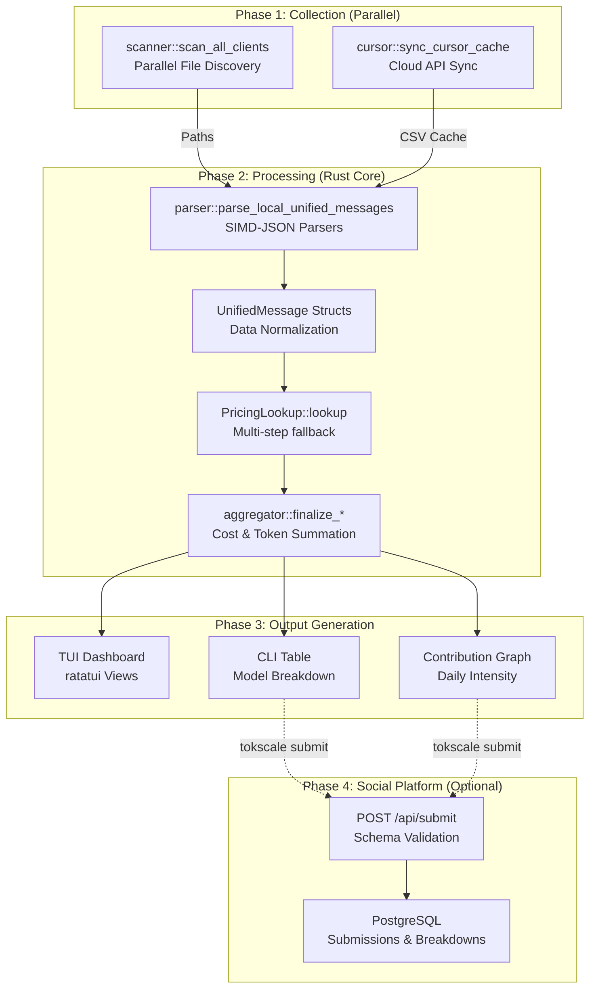

# Data Flow Pipeline

Relevant source files

The following files were used as context for generating this wiki page:

- [AGENTS.md](AGENTS.md)
- [crates/tokscale-cli/src/commands/wrapped.rs](crates/tokscale-cli/src/commands/wrapped.rs)
- [crates/tokscale-cli/src/main.rs](crates/tokscale-cli/src/main.rs)
- [crates/tokscale-cli/src/tui/client_ui.rs](crates/tokscale-cli/src/tui/client_ui.rs)
- [crates/tokscale-cli/src/tui/data/mod.rs](crates/tokscale-cli/src/tui/data/mod.rs)
- [crates/tokscale-cli/src/tui/ui/widgets.rs](crates/tokscale-cli/src/tui/ui/widgets.rs)
- [crates/tokscale-cli/tests/cli_tests.rs](crates/tokscale-cli/tests/cli_tests.rs)
- [crates/tokscale-core/src/aggregator.rs](crates/tokscale-core/src/aggregator.rs)
- [crates/tokscale-core/src/clients.rs](crates/tokscale-core/src/clients.rs)
- [crates/tokscale-core/src/lib.rs](crates/tokscale-core/src/lib.rs)
- [crates/tokscale-core/src/message_cache.rs](crates/tokscale-core/src/message_cache.rs)
- [crates/tokscale-core/src/pricing/litellm.rs](crates/tokscale-core/src/pricing/litellm.rs)
- [crates/tokscale-core/src/pricing/lookup.rs](crates/tokscale-core/src/pricing/lookup.rs)
- [crates/tokscale-core/src/pricing/mod.rs](crates/tokscale-core/src/pricing/mod.rs)
- [crates/tokscale-core/src/pricing/openrouter.rs](crates/tokscale-core/src/pricing/openrouter.rs)
- [crates/tokscale-core/src/provider_identity.rs](crates/tokscale-core/src/provider_identity.rs)
- [crates/tokscale-core/src/scanner.rs](crates/tokscale-core/src/scanner.rs)
- [crates/tokscale-core/src/sessions/codex.rs](crates/tokscale-core/src/sessions/codex.rs)
- [crates/tokscale-core/src/sessions/gemini.rs](crates/tokscale-core/src/sessions/gemini.rs)
- [crates/tokscale-core/src/sessions/mod.rs](crates/tokscale-core/src/sessions/mod.rs)
- [crates/tokscale-core/src/sessions/opencode.rs](crates/tokscale-core/src/sessions/opencode.rs)

This document describes the end-to-end data flow in Tokscale, from local session file discovery through parsing, pricing, aggregation, and final output generation. The pipeline is designed for high performance using a native Rust core with parallel processing and SIMD-accelerated JSON parsing.

## Pipeline Overview

The Tokscale data pipeline consists of four main phases executed sequentially. The Rust core handles the heavy lifting of Phase 1 and 2, while the CLI and TUI manage the lifecycle and display.

**Sources:** [crates/tokscale-cli/src/main.rs:19-87](), [crates/tokscale-core/src/lib.rs:1-19](), [crates/tokscale-core/src/aggregator.rs:1-50]()

## Phase 1: Data Collection

### Local File System Scanning
Local session files are discovered using parallel directory traversal. The scanner maps specific directory patterns to supported AI clients.

| Client | Path Pattern | Root Strategy |
| :--- | :--- | :--- |
| **OpenCode** | `opencode/storage/message/*.json` | `XdgData` |
| **Claude** | `.claude/projects/*.jsonl` | `Home` |
| **Codex** | `sessions/*.jsonl` | `EnvVar(CODEX_HOME)` |
| **Cursor** | `cursor-cache/usage*.csv` | `Home` |
| **Gemini** | `.gemini/tmp/*.json` | `Home` |

The `ScannerSettings` struct allows users to provide additional paths via `~/.config/tokscale/settings.json` [crates/tokscale-core/src/scanner.rs:25-48](). The `scan_all_clients` function uses `walkdir` with `rayon` to perform high-speed discovery [crates/tokscale-core/src/scanner.rs:168-210]().

**Sources:** [crates/tokscale-core/src/clients.rs:167-215](), [crates/tokscale-core/src/scanner.rs:59-77]()

### Cursor IDE API Sync
Since Cursor stores usage data in the cloud, the CLI includes a dedicated module to fetch and cache this data locally.
1. `cursor::is_cursor_logged_in()` checks for local credentials [crates/tokscale-cli/src/commands/wrapped.rs:179-181]().
2. `cursor::sync_cursor_cache()` fetches usage rows and writes them to `~/.config/tokscale/cursor-cache/usage.csv` [crates/tokscale-cli/src/commands/wrapped.rs:180-185]().
3. The parser later treats this CSV as a standard local source [crates/tokscale-core/src/clients.rs:198-206]().

**Sources:** [crates/tokscale-cli/src/commands/wrapped.rs:160-204]()

## Phase 2: Processing in Rust Core

### Parsing and Normalization
The core converts heterogeneous JSON/CSV formats into a `UnifiedMessage` [crates/tokscale-core/src/sessions/mod.rs:32-52](). 

- **SIMD-JSON:** Parsers like `opencode` and `claudecode` use SIMD-accelerated JSON parsing for maximum throughput.
- **Stateful Parsing:** The `Codex` parser maintains a `CodexParseState` to handle cumulative token counts and delta calculations [crates/tokscale-core/src/sessions/codex.rs:152-163]().
- **Agent Normalization:** For tools like `OpenCode`, agent names are title-cased and normalized (e.g., "omo" → "Sisyphus") [crates/tokscale-core/src/sessions/mod.rs:58-81]().

**Sources:** [crates/tokscale-core/src/sessions/mod.rs:191-212](), [crates/tokscale-core/src/sessions/codex.rs:66-150]()

### Pricing Lookup
The `PricingLookup` struct manages a sophisticated resolution strategy [crates/tokscale-core/src/pricing/lookup.rs:81-94]().

1. **Exact Match:** Checks internal LiteLLM and OpenRouter maps.
2. **Alias Resolution:** Resolves nicknames (e.g., `gpt-4o-latest`) to base models.
3. **Tier Stripping:** Strips reasoning effort suffixes like `(high)` or `(low)` [crates/tokscale-core/src/lib.rs:34-50]().
4. **Provider Ranking:** Prefers original creators over resellers (e.g., prefers `openai/` over `azure/`) [crates/tokscale-core/src/pricing/lookup.rs:19-45]().

**Sources:** [crates/tokscale-core/src/pricing/lookup.rs:168-213](), [crates/tokscale-core/src/lib.rs:52-86]()

### Message Caching and Fingerprinting
To avoid re-parsing thousands of files, Tokscale uses a binary cache (`source-message-cache.bin`).
- **Fingerprinting:** Files are fingerprinted using size, modified time, and sampled hashes [crates/tokscale-core/src/message_cache.rs:103-110]().
- **Incremental Parsing:** For large JSONL files (like Codex), the cache stores the `consumed_offset` to only parse new lines [crates/tokscale-core/src/message_cache.rs:181-187]().

**Sources:** [crates/tokscale-core/src/message_cache.rs:13-20]()

## Phase 3: Aggregation and Reporting

The `aggregator` module takes the stream of `UnifiedMessage` objects and generates final reports.

### Aggregation Logic
The `DataLoader` in the TUI or the CLI commands group data based on a `GroupBy` strategy [crates/tokscale-core/src/lib.rs:99-106]():
- `Model`: Global totals per model ID.
- `ClientModel`: Totals per (Client, Model) pair.
- `WorkspaceModel`: Totals per (Workspace, Model) pair, useful for project-based tracking [crates/tokscale-cli/src/tui/data/mod.rs:161-176]().

### Data Structures
| Structure | Description | Source |
| :--- | :--- | :--- |
| `ModelUsage` | Usage stats grouped by model, provider, and client | [crates/tokscale-cli/src/tui/data/mod.rs:48-58]() |
| `DailyUsage` | Aggregated tokens, cost, and turn counts per day | [crates/tokscale-cli/src/tui/data/mod.rs:93-101]() |
| `GraphData` | Intensity-mapped data for the contribution grid | [crates/tokscale-cli/src/tui/data/mod.rs:131-134]() |
| `AgentUsage` | Breakdown of usage per AI agent (e.g., Sisyphus) | [crates/tokscale-cli/src/tui/data/mod.rs:60-67]() |

**Sources:** [crates/tokscale-cli/src/tui/data/mod.rs:189-213](), [crates/tokscale-core/src/lib.rs:137-150]()

## Phase 4: Social Submission

When a user runs `tokscale submit`, the pipeline extends to the cloud:
1. **Serialization:** Aggregated `UsageData` is serialized to JSON.
2. **Authentication:** The CLI uses stored GitHub OAuth tokens [crates/tokscale-cli/src/main.rs:172-179]().
3. **API Submission:** Data is sent to `tokscale.ai/api/submit`.
4. **Merge Logic:** The server performs a source-level merge, ensuring that submitting data from one machine (e.g., a laptop with Cursor) doesn't overwrite data from another (e.g., a desktop with OpenCode).

**Sources:** [crates/tokscale-cli/src/main.rs:204-215](), [crates/tokscale-core/src/lib.rs:225-232]()
