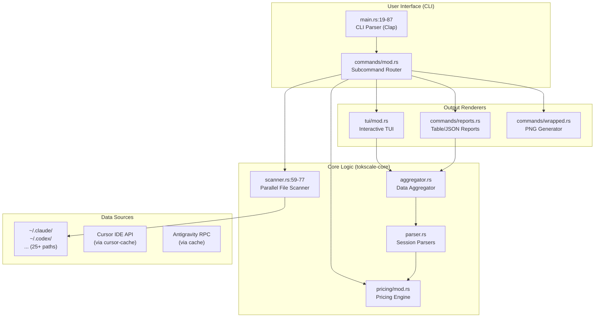
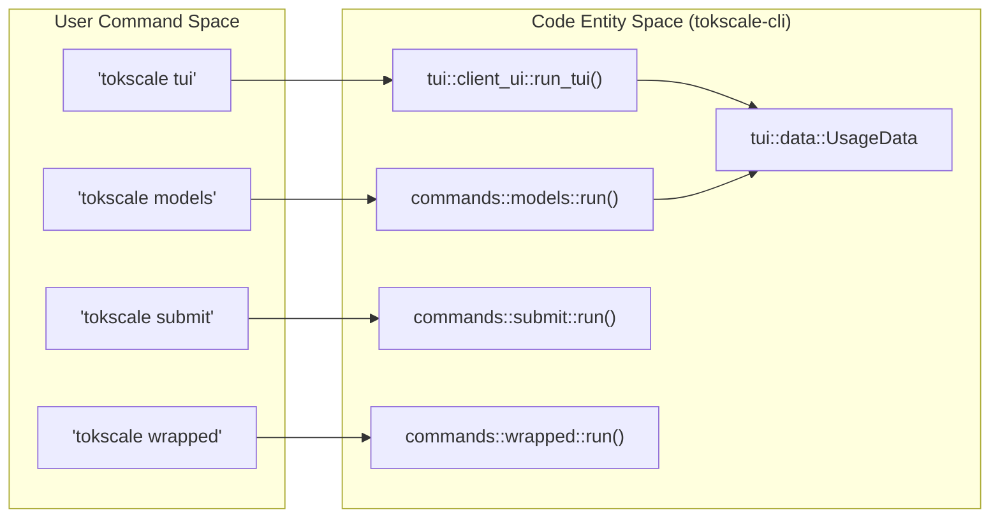
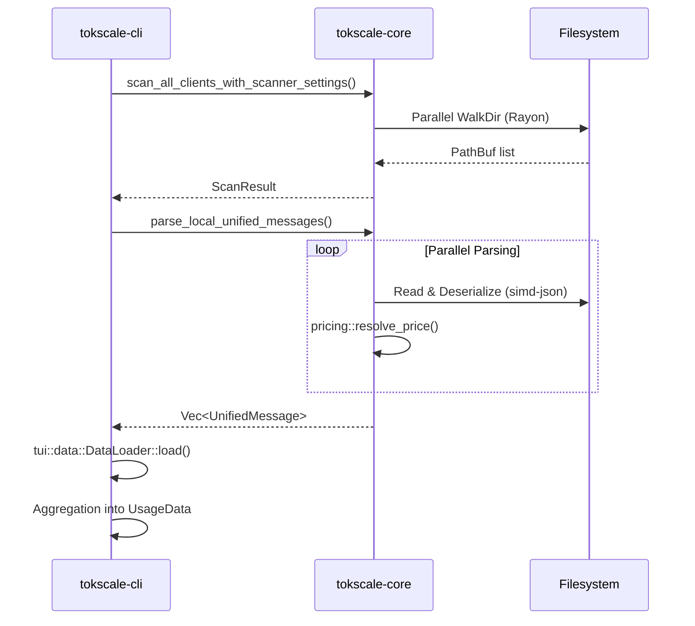

# CLI Tool

Relevant source files

The following files were used as context for generating this wiki page:

- [README.ja.md](README.ja.md)
- [README.ko.md](README.ko.md)
- [README.md](README.md)
- [README.zh-cn.md](README.zh-cn.md)
- [crates/tokscale-cli/src/antigravity.rs](crates/tokscale-cli/src/antigravity.rs)
- [crates/tokscale-cli/src/commands/wrapped.rs](crates/tokscale-cli/src/commands/wrapped.rs)
- [crates/tokscale-cli/src/main.rs](crates/tokscale-cli/src/main.rs)
- [crates/tokscale-cli/src/paths.rs](crates/tokscale-cli/src/paths.rs)
- [crates/tokscale-cli/src/tui/client_ui.rs](crates/tokscale-cli/src/tui/client_ui.rs)
- [crates/tokscale-cli/src/tui/data/mod.rs](crates/tokscale-cli/src/tui/data/mod.rs)
- [crates/tokscale-cli/src/tui/ui/widgets.rs](crates/tokscale-cli/src/tui/ui/widgets.rs)
- [crates/tokscale-core/src/aggregator.rs](crates/tokscale-core/src/aggregator.rs)
- [crates/tokscale-core/src/clients.rs](crates/tokscale-core/src/clients.rs)
- [crates/tokscale-core/src/lib.rs](crates/tokscale-core/src/lib.rs)
- [crates/tokscale-core/src/scanner.rs](crates/tokscale-core/src/scanner.rs)
- [crates/tokscale-core/src/sessions/mod.rs](crates/tokscale-core/src/sessions/mod.rs)

The Tokscale CLI is a high-performance command-line utility written in Rust that tracks, analyzes, and visualizes token usage across multiple AI coding agents. It serves as the primary interface for local data collection, offering an interactive Terminal UI (TUI), standard report commands, and integration with the Tokscale social platform.

For detailed installation steps, see [Installation and Basic Usage](#3.1). For a full list of flags and subcommands, see [Commands Reference](#3.2). For details on the interactive interface, see [Terminal UI (TUI)](#3.3).

## Architecture Overview

The CLI acts as an orchestration layer that interfaces with the local filesystem to scan session files, utilizes the `tokscale-core` library for high-speed parsing and pricing resolution, and renders outputs via `ratatui`.

**Sources:** [crates/tokscale-cli/src/main.rs:19-87](), [crates/tokscale-core/src/lib.rs:205-216](), [crates/tokscale-core/src/scanner.rs:59-77]()

## Natural Language to Code Entity Mapping

The CLI bridges user-friendly command names to specific Rust modules and data structures within the `tokscale-cli` crate.

**Sources:** [crates/tokscale-cli/src/main.rs:90-230](), [crates/tokscale-cli/src/tui/data/mod.rs:137-149]()

## Data Loading Pipeline

The CLI implements a parallel loading strategy using `tokscale-core`'s scanner and the `rayon` library to handle thousands of session files efficiently.

**Sources:** [crates/tokscale-core/src/scanner.rs:59-77](), [crates/tokscale-cli/src/tui/data/mod.rs:151-156](), [crates/tokscale-core/src/lib.rs:171-175]()

## Command Execution Flow

Subcommands are defined using the `clap` derive macro. The execution flow routes through `main.rs` to specialized command handlers.

| Command Category | Commands | Handler File |
| :--- | :--- | :--- |
| **Analytics** | `models`, `monthly`, `hourly`, `graph` | `crates/tokscale-cli/src/main.rs` |
| **Interactive** | `tui` | `crates/tokscale-cli/src/tui/client_ui.rs` |
| **Social** | `login`, `logout`, `whoami`, `submit` | `crates/tokscale-cli/src/auth.rs` |
| **IDE Sync** | `cursor login`, `antigravity sync` | `crates/tokscale-cli/src/cursor.rs` |
| **Visualization** | `wrapped` | `crates/tokscale-cli/src/commands/wrapped.rs` |

**Sources:** [crates/tokscale-cli/src/main.rs:90-230](), [crates/tokscale-cli/src/commands/wrapped.rs:100-103]()

## Native Performance Features

The Rust-based CLI provides several performance advantages over previous iterations:
*   **Parallel Scanning**: Uses `walkdir` with `rayon` to traverse session directories across all CPU cores [crates/tokscale-core/src/scanner.rs:1-8]().
*   **SIMD JSON Parsing**: Leverages `simd-json` for high-speed deserialization of large session logs.
*   **Atomic Caching**: Uses `fs_atomic` to ensure TUI state and Cursor caches are never corrupted during writes [crates/tokscale-core/src/fs_atomic.rs]().
*   **Zero-Copy Aggregation**: Efficiently groups data by model, client, or workspace without redundant allocations [crates/tokscale-core/src/lib.rs:99-106]().

## Configuration and Theming

The CLI behavior can be customized via `~/.config/tokscale/settings.json` or command-line flags.

*   **Themes**: Supports color themes (default: `blue`) via the `--theme` flag [crates/tokscale-cli/src/main.rs:26-27]().
*   **Custom Paths**: Users can define extra scan directories in `ScannerSettings` to track agents in non-standard locations [crates/tokscale-core/src/scanner.rs:25-48]().
*   **Refresh Rate**: The TUI supports an auto-refresh interval (in seconds) via `--refresh` [crates/tokscale-cli/src/main.rs:29-30]().

**Sources:** [crates/tokscale-cli/src/main.rs:26-30](), [crates/tokscale-core/src/scanner.rs:25-48]()
