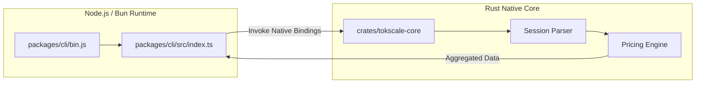

# Installation and Basic Usage

<details>
<summary>Relevant source files</summary>

The following files were used as context for generating this wiki page:

- [Cargo.toml](Cargo.toml)
- [packages/cli-darwin-arm64/package.json](packages/cli-darwin-arm64/package.json)
- [packages/cli-darwin-x64/package.json](packages/cli-darwin-x64/package.json)
- [packages/cli-linux-arm64-gnu/package.json](packages/cli-linux-arm64-gnu/package.json)
- [packages/cli-linux-arm64-musl/package.json](packages/cli-linux-arm64-musl/package.json)
- [packages/cli-linux-x64-gnu/package.json](packages/cli-linux-x64-gnu/package.json)
- [packages/cli-linux-x64-musl/package.json](packages/cli-linux-x64-musl/package.json)
- [packages/cli-win32-arm64-msvc/package.json](packages/cli-win32-arm64-msvc/package.json)
- [packages/cli-win32-x64-msvc/package.json](packages/cli-win32-x64-msvc/package.json)
- [packages/cli/bunfig.toml](packages/cli/bunfig.toml)
- [packages/cli/package.json](packages/cli/package.json)
- [packages/tokscale/package.json](packages/tokscale/package.json)
- [scripts/cli.sh](scripts/cli.sh)

</details>


This document covers the installation of Tokscale via npm and basic command-line usage. Tokscale is designed as a high-performance tracking system for AI token usage, utilizing a native Rust core for speed and a TypeScript-based CLI for the user interface.

## Installation

Tokscale is distributed as a multi-package monorepo. The primary entry point for users is the `tokscale` package, which acts as an alias for the core CLI functionality.

### Global Installation via npm

The recommended way to install the CLI is globally through npm or a compatible package manager:

```bash
npm install -g tokscale
```

This installs the `tokscale` binary [packages/tokscale/package.json:7-9](), which depends on the main CLI logic in `@tokscale/cli` [packages/tokscale/package.json:29-31]().

### Package Dependency Structure

The installation process resolves a chain of dependencies to ensure the correct native binary is available for your architecture.

```mermaid
graph TD
    subgraph "NPM Registry"
        [tokscale] --> ["@tokscale/cli"]
        ["@tokscale/cli"] -.-> ["@tokscale/cli-darwin-arm64"]
        ["@tokscale/cli"] -.-> ["@tokscale/cli-linux-x64-gnu"]
        ["@tokscale/cli"] -.-> ["@tokscale/cli-win32-x64-msvc"]
    end

    subgraph "Local Installation"
        BIN["/usr/local/bin/tokscale"]
        JS_LOGIC["CLI Logic (TypeScript/Node)"]
        NATIVE_BIN["Native Rust Binary (.exe / elf)"]
        
        BIN --> JS_LOGIC
        JS_LOGIC --> NATIVE_BIN
    end

    [tokscale] -- "Installs" --> BIN
    ["@tokscale/cli"] -- "Provides" --> JS_LOGIC
    ["@tokscale/cli-linux-x64-gnu"] -- "Provides" --> NATIVE_BIN
```

**Sources:** [packages/tokscale/package.json:1-41](), [packages/cli/package.json:1-54]()

---

## Basic Usage and Command Syntax

The basic syntax for the `tokscale` command follows a standard CLI pattern:

```bash
tokscale [command] [options]
```

### Running without Arguments
Running `tokscale` without any arguments typically launches the **Terminal User Interface (TUI)**, which provides an interactive dashboard of your token usage.

### Core Command Examples

| Command | Description |
| :--- | :--- |
| `tokscale` | Launches the interactive TUI dashboard |
| `tokscale models` | Lists all detected models and their cumulative costs |
| `tokscale monthly` | Shows a month-by-month breakdown of usage |
| `tokscale pricing` | Fetches latest pricing data for AI models |
| `tokscale login` | Authenticates with tokscale.ai via GitHub |

**Sources:** [packages/cli/package.json:8-10](), [Cargo.toml:56-61]()

---

## Implementation and Execution Flow

When a user executes `tokscale`, the system initiates a data flow from the Node.js/Bun environment into the high-performance Rust core.

### Data Flow Pipeline

The CLI serves as a wrapper that invokes the `tokscale-core` Rust crate to handle heavy lifting such as file system scanning and JSON parsing of session logs.



### Native Binary Distribution
Tokscale uses optional dependencies to distribute platform-specific native binaries. This avoids requiring users to have a Rust toolchain installed. The following platforms are supported:

*   **macOS**: `darwin-arm64`, `darwin-x64` [packages/cli/package.json:32-33]()
*   **Linux**: `linux-x64-gnu`, `linux-x64-musl`, `linux-arm64-gnu`, `linux-arm64-musl` [packages/cli/package.json:34-37]()
*   **Windows**: `win32-x64-msvc`, `win32-arm64-msvc` [packages/cli/package.json:38-39]()

Each platform-specific package (e.g., `@tokscale/cli-linux-arm64-gnu`) contains the pre-compiled `tokscale` binary in its `bin/` directory [packages/cli-linux-arm64-gnu/package.json:16-19]().

**Sources:** [packages/cli/package.json:31-40](), [packages/cli-linux-arm64-gnu/package.json:1-29](), [Cargo.toml:1-6]()

---

## Common Usage Patterns

### 1. Developer Local Preview
Developers working on the codebase can bypass the global installation using the provided helper script:

```bash
./scripts/cli.sh [args]
```
This script uses `bun` to run the TypeScript source directly from `packages/cli/src/index.ts` [scripts/cli.sh:1-8]().

### 2. CI/CD and Scripting
For non-interactive environments, the CLI can be used to output raw data or specific reports. While the TUI is the default, subcommands provide structured text output suitable for logs.

### 3. Cursor IDE Syncing
One of the most common usage patterns is syncing data from the Cursor IDE. Users can run:
```bash
tokscale cursor login
```
This triggers the authentication flow required to access local Cursor usage databases and sync them with the cloud leaderboard.

**Sources:** [scripts/cli.sh:1-8](), [packages/cli/package.json:45-53]()
