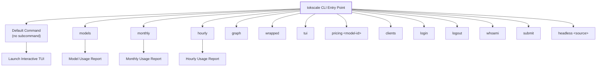
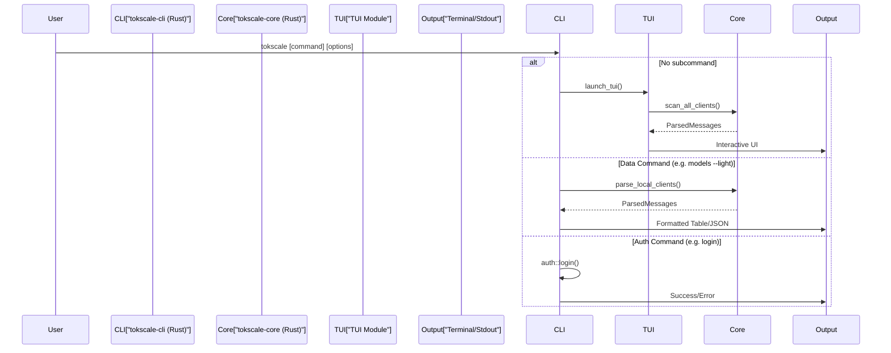
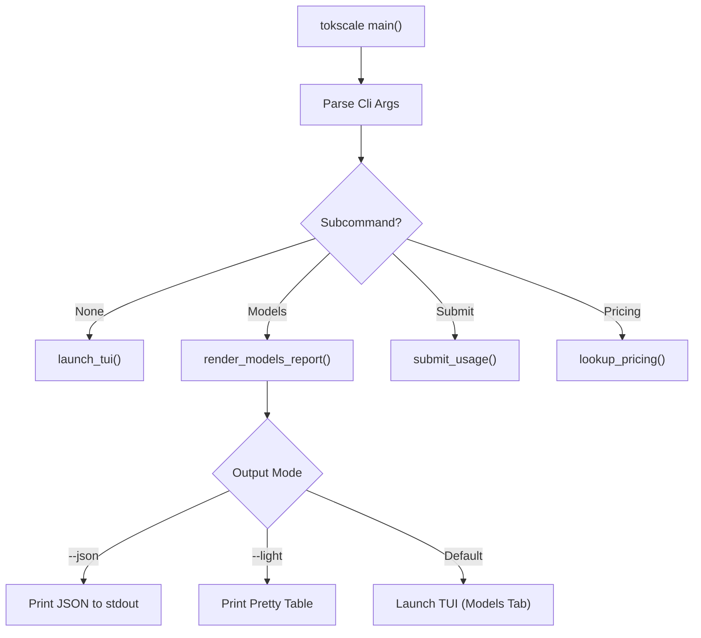

# Commands Reference

Relevant source files

The following files were used as context for generating this wiki page:

- [crates/tokscale-cli/src/commands/mod.rs](crates/tokscale-cli/src/commands/mod.rs)
- [crates/tokscale-cli/src/commands/wrapped.rs](crates/tokscale-cli/src/commands/wrapped.rs)
- [crates/tokscale-cli/src/main.rs](crates/tokscale-cli/src/main.rs)
- [crates/tokscale-cli/src/tui/client_ui.rs](crates/tokscale-cli/src/tui/client_ui.rs)
- [crates/tokscale-cli/src/tui/data/mod.rs](crates/tokscale-cli/src/tui/data/mod.rs)
- [crates/tokscale-cli/src/tui/ui/widgets.rs](crates/tokscale-cli/src/tui/ui/widgets.rs)
- [crates/tokscale-core/src/aggregator.rs](crates/tokscale-core/src/aggregator.rs)
- [crates/tokscale-core/src/clients.rs](crates/tokscale-core/src/clients.rs)
- [crates/tokscale-core/src/lib.rs](crates/tokscale-core/src/lib.rs)
- [crates/tokscale-core/src/scanner.rs](crates/tokscale-core/src/scanner.rs)
- [crates/tokscale-core/src/sessions/mod.rs](crates/tokscale-core/src/sessions/mod.rs)

This page provides a comprehensive reference of all available CLI commands in Tokscale. The CLI is implemented in Rust and uses the `clap` crate for argument parsing.

For detailed documentation on specific command categories, see:
- [Data Visualization Commands](#3.2.1) — `models`, `monthly`, `graph`, `wrapped`
- [Social Platform Commands](#3.2.2) — `login`, `logout`, `whoami`, `submit`
- [Cursor IDE Integration](#3.2.3) — `cursor login/logout/status`
- [Pricing Lookup](#3.2.4) — `pricing` command

For general CLI usage patterns and the Terminal UI (TUI), see [Installation and Basic Usage](#3.1) and [Terminal UI (TUI)](#3.3).

## Command Structure

The Tokscale CLI entry point is defined in `crates/tokscale-cli/src/main.rs`. It uses a subcommand-based architecture with global flags for themes, data filtering, and output formats.

### Command Hierarchy

**Sources:** [crates/tokscale-cli/src/main.rs:19-215]()

## Command Execution Flow

The CLI maps user input to the `Cli` struct and `Commands` enum. If no subcommand is provided, it defaults to launching the interactive TUI.

**Sources:** [crates/tokscale-cli/src/main.rs:22-87](), [crates/tokscale-cli/src/main.rs:90-215]()

## All Available Commands

| Command | Description | Key Options |
|---------|-------------|-------------|
| `tokscale` | Default: Launches TUI | `--light`, `--json`, `--theme`, source/date filters |
| `tokscale models` | Model usage breakdown | `--group-by`, `--write-cache`, `--light`, `--json` |
| `tokscale monthly` | Monthly usage report | `--light`, `--json`, source/date filters |
| `tokscale hourly` | Hourly usage report | `--light`, `--json`, source/date filters |
| `tokscale pricing` | Look up model pricing | `model_id`, `--provider`, `--json` |
| `tokscale clients` | Show local scan locations | `--json` |
| `tokscale login` | GitHub authentication | `--token` (manual save) |
| `tokscale logout` | Logout from Tokscale | None |
| `tokscale whoami` | Show current user | None |
| `tokscale graph` | Export graph data | `--output <file>`, source/date filters |
| `tokscale wrapped` | Generate Wrapped image | `--year`, `--output`, `--agents`, `--short` |
| `tokscale submit` | Submit to leaderboard | `--dry-run`, source/date filters |
| `tokscale headless` | Capture subprocess output | `source`, `args`, `--format`, `--output` |

**Sources:** [crates/tokscale-cli/src/main.rs:90-215]()

## Global Options

### Source Filters (`ClientFlags`)

These flags allow filtering data by specific AI clients. Multiple flags can be provided.

| Flag | Client ID | Default Root Path |
|------|-----------|-------------------|
| `--opencode` | `opencode` | `XDG_DATA_HOME/opencode/storage/message` |
| `--claude` | `claude` | `~/.claude/projects` |
| `--codex` | `codex` | `$CODEX_HOME/sessions` |
| `--cursor` | `cursor` | `~/.config/tokscale/cursor-cache` |
| `--gemini` | `gemini` | `~/.gemini/tmp` |
| `--amp` | `amp` | `XDG_DATA_HOME/amp/threads` |
| `--droid` | `droid` | `~/.factory/sessions` |
| `--openclaw` | `openclaw` | `~/.openclaw/transcripts` |

**Sources:** [crates/tokscale-core/src/clients.rs:167-250](), [crates/tokscale-cli/src/main.rs:60-61]()

### Date Filters (`DateRangeFlags`)

Used to restrict the scope of usage data analysis.

| Flag | Description |
|------|-------------|
| `--today` | Only data from the current day |
| `--week` | Data from the last 7 days |
| `--month` | Data from the current calendar month |
| `--since <YYYY-MM-DD>` | Start date (inclusive) |
| `--until <YYYY-MM-DD>` | End date (inclusive) |
| `--year <YYYY>` | Filter by specific year |

**Sources:** [crates/tokscale-cli/src/main.rs:63-64]()

### Output & Processing Options

| Flag | Description |
|------|-------------|
| `--light` | Use legacy CLI table output instead of interactive TUI |
| `--json` | Output raw data as JSON for script integration |
| `--group-by <strategy>` | Grouping: `model`, `client,model`, `client,provider,model`, `workspace,model` |
| `--benchmark` | Print processing time in milliseconds |
| `--no-spinner` | Disable the terminal loading spinner (useful for CI/AI agents) |
| `--home <PATH>` | Override the home directory for scanning |

**Sources:** [crates/tokscale-cli/src/main.rs:38-87](), [crates/tokscale-core/src/lib.rs:99-135]()

## Command Routing Logic

The CLI determines its behavior by matching the `Commands` enum. If `Cli.command` is `None`, it launches the TUI.

**Sources:** [crates/tokscale-cli/src/main.rs:22-87](), [crates/tokscale-cli/src/tui/mod.rs:56-110]()

## Data Aggregation Patterns

Most report commands (`models`, `monthly`, `hourly`) utilize the `tokscale-core` aggregator to process `UnifiedMessage` streams.

| Pattern | Data Structure | Source |
|---------|----------------|--------|
| **Daily** | `DailyContribution` | [crates/tokscale-core/src/aggregator.rs:14-58]() |
| **Summary** | `DataSummary` | [crates/tokscale-core/src/aggregator.rs:61-102]() |
| **Yearly** | `YearSummary` | [crates/tokscale-core/src/aggregator.rs:105-141]() |
| **Graph** | `GraphResult` | [crates/tokscale-core/src/aggregator.rs:144-172]() |

## Error Handling and Exit Codes

The CLI uses `anyhow::Result` for error propagation.

1. **Scan Errors**: If session directories are missing, the scanner returns empty lists rather than failing. [crates/tokscale-core/src/scanner.rs:168-172]()
2. **Auth Errors**: Commands like `submit` or `whoami` will fail if no valid token is found in the config. [crates/tokscale-cli/src/main.rs:182-183]()
3. **Panic Handling**: The TUI implements a panic hook to restore terminal state (raw mode, alternate screen) before exiting. [crates/tokscale-cli/src/tui/mod.rs:113-125]()

**Sources:** [crates/tokscale-cli/src/main.rs:9-10](), [crates/tokscale-cli/src/tui/mod.rs:113-125]()
