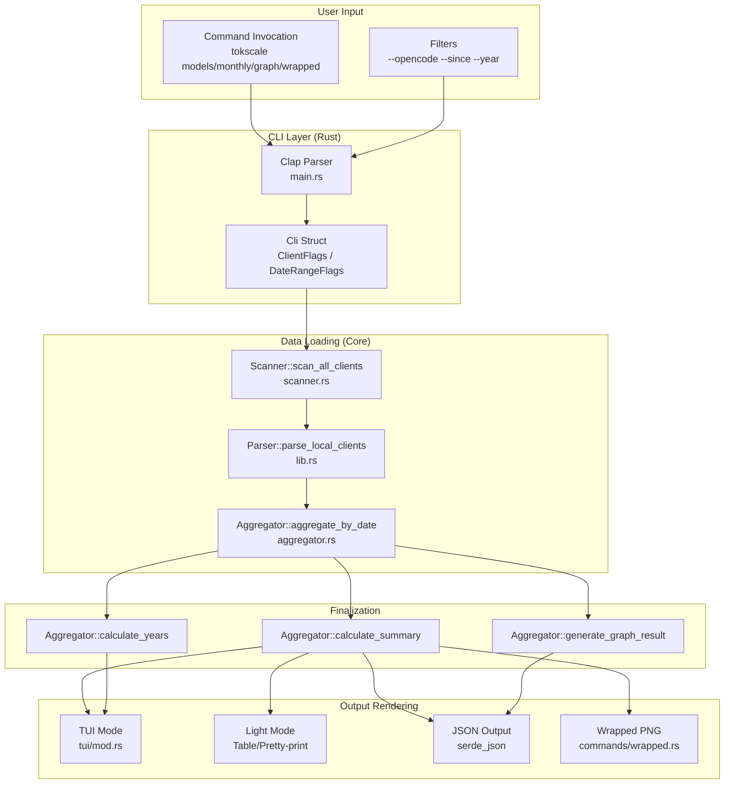

# Data Visualization Commands

<details>
<summary>Relevant source files</summary>

The following files were used as context for generating this wiki page:

- [crates/tokscale-cli/src/commands/mod.rs](crates/tokscale-cli/src/commands/mod.rs)
- [crates/tokscale-cli/src/commands/wrapped.rs](crates/tokscale-cli/src/commands/wrapped.rs)
- [crates/tokscale-cli/src/main.rs](crates/tokscale-cli/src/main.rs)
- [crates/tokscale-cli/src/tui/client_ui.rs](crates/tokscale-cli/src/tui/client_ui.rs)
- [crates/tokscale-cli/src/tui/data/mod.rs](crates/tokscale-cli/src/tui/data/mod.rs)
- [crates/tokscale-cli/src/tui/ui/widgets.rs](crates/tokscale-cli/src/tui/ui/widgets.rs)
- [crates/tokscale-core/src/aggregator.rs](crates/tokscale-core/src/aggregator.rs)
- [crates/tokscale-core/src/clients.rs](crates/tokscale-core/src/clients.rs)
- [crates/tokscale-core/src/lib.rs](crates/tokscale-core/src/lib.rs)
- [crates/tokscale-core/src/scanner.rs](crates/tokscale-core/src/scanner.rs)
- [crates/tokscale-core/src/sessions/mod.rs](crates/tokscale-core/src/sessions/mod.rs)

</details>


## Purpose and Scope

This page documents the data visualization commands in the Tokscale CLI that allow users to view and export token usage data in various formats. These commands provide different perspectives on token consumption patterns: by model, by date, as contribution graphs, or as year-in-review summaries.

The visualization layer bridges the raw session data parsed by the Rust core into human-readable reports and visual assets.

## Command Overview

Tokscale provides four primary visualization commands:

| Command | Purpose | Primary Output |
|---------|---------|----------------|
| `tokscale models` | View token usage breakdown by AI model | TUI/Table/JSON |
| `tokscale monthly` | View token usage breakdown by date | TUI/Table/JSON |
| `tokscale graph` | Export contribution graph data | JSON file |
| `tokscale wrapped` | Generate year-in-review image | PNG image |

All commands support source filtering, date filtering, and operate on data from local session files and optionally Cursor API sync.

Sources: [crates/tokscale-cli/src/main.rs:91-156](), [crates/tokscale-cli/src/main.rs:185-196](), [crates/tokscale-cli/src/commands/wrapped.rs:44-51]()

## Command Data Flow



Sources: [crates/tokscale-cli/src/main.rs:19-87](), [crates/tokscale-core/src/lib.rs:171-175](), [crates/tokscale-core/src/aggregator.rs:143-172]()

## Models Command

### Purpose

The `models` command displays token usage statistics grouped by AI model, showing input/output tokens, cache usage, and estimated costs for each model across all selected data sources.

### Command Syntax

```bash
tokscale models [options]
```

### Options

| Option | Description |
|--------|-------------|
| `--light` | Use legacy CLI table output instead of TUI |
| `--json` | Output as JSON for scripting/automation |
| `--group-by <strategy>` | Grouping strategy: `model`, `client,model`, `client,provider,model`, `workspace,model` |
| `--write-cache` | Overwrite TUI cache with this report's data |
| `--benchmark` | Show processing time |
| `--no-spinner` | Disable spinner |

Sources: [crates/tokscale-cli/src/main.rs:92-126]()

### Implementation Details

The `models` command utilizes the `GroupBy` enum to determine how to bucket token usage.

1. **Parse options**: Handled by the `Cli` parser in `main.rs` [crates/tokscale-cli/src/main.rs:19-24]().
2. **Grouping Strategy**: The `group_by` argument (defaulting to `client,model`) is converted into a `tokscale_core::GroupBy` variant [crates/tokscale-core/src/lib.rs:100-135]().
3. **Data Loading**: In TUI mode, `DataLoader` in `crates/tokscale-cli/src/tui/data/mod.rs` handles the asynchronous fetch and normalization of `ModelUsage` structs [crates/tokscale-cli/src/tui/data/mod.rs:49-58]().
4. **Normalization**: Model IDs are normalized (e.g., stripping parenthesized reasoning tiers or date suffixes) via `normalize_model_for_grouping` to ensure consistent reporting across providers [crates/tokscale-core/src/lib.rs:52-86]().

Sources: [crates/tokscale-core/src/lib.rs:52-86](), [crates/tokscale-cli/src/tui/data/mod.rs:137-149]()

## Monthly Command

### Purpose

The `monthly` command displays token usage statistics grouped by calendar month. Despite its name, when launched in the TUI, it defaults to the daily breakdown view.

### Command Syntax

```bash
tokscale monthly [options]
```

### Implementation Details

The `monthly` command uses the same filtering flags as `models`. It primarily interacts with the `aggregate_by_date` function in the core, which uses `rayon` to perform a parallel fold-reduce aggregation of `UnifiedMessage` objects into `DailyContribution` buckets [crates/tokscale-core/src/aggregator.rs:14-41]().

In the CLI's TUI, this data is mapped to `DailyUsage` structs, which include `source_breakdown` (a `BTreeMap` of source names to `DailySourceInfo`) [crates/tokscale-cli/src/tui/data/mod.rs:94-101]().

Sources: [crates/tokscale-core/src/aggregator.rs:14-41](), [crates/tokscale-cli/src/tui/data/mod.rs:94-101]()

## Graph Command

### Purpose

The `graph` command exports contribution graph data as JSON. This is designed for consumption by the web frontend's 3D contribution graph or external tools.

### Command Syntax

```bash
tokscale graph [--output <file>] [filters]
```

### Implementation Details

The `graph` command triggers `generate_graph_result` in the Rust core [crates/tokscale-core/src/aggregator.rs:144-172](). This function:
1. Calculates summary statistics via `calculate_summary` [crates/tokscale-core/src/aggregator.rs:61-102]().
2. Calculates year-over-year summaries via `calculate_years` [crates/tokscale-core/src/aggregator.rs:105-141]().
3. Returns a `GraphResult` containing metadata, year summaries, and a flat list of `DailyContribution` entries [crates/tokscale-core/src/aggregator.rs:160-171]().

Sources: [crates/tokscale-core/src/aggregator.rs:61-172]()

## Wrapped Command

### Purpose

The `wrapped` command generates a "Year in Review" PNG image. It aggregates usage data for a specific year and renders a visual infographic.

### Implementation Details

The `wrapped` command is implemented in `crates/tokscale-cli/src/commands/wrapped.rs`. It performs a full local scan and optionally syncs Cursor data to build a `WrappedData` struct [crates/tokscale-cli/src/commands/wrapped.rs:54-65]().

**Visual Components**:
- **Contribution Graph**: Renders a GitHub-style grid using `imageproc` and `ab_glyph` [crates/tokscale-cli/src/commands/wrapped.rs:2-7]().
- **Agent Rankings**: If `--include-agents` is set, it specifically looks for OpenCode agent data, normalizing names like "sisyphus" to "Sisyphus" using `normalize_opencode_agent_name` [crates/tokscale-core/src/sessions/mod.rs:83-95]().
- **Color Theming**: It uses hardcoded RGBA values for different contribution "levels" (Grade 0 to Grade 4) to match the Tokscale brand [crates/tokscale-cli/src/commands/wrapped.rs:33-40]().

Sources: [crates/tokscale-cli/src/commands/wrapped.rs:105-158](), [crates/tokscale-core/src/sessions/mod.rs:83-95]()

## Common Visual Elements

### Model and Provider Coloring

The CLI TUI and Wrapped commands share logic for assigning colors to models based on their provider.

| Provider | Base Color (HEX) | Palette Reference |
|----------|------------------|-------------------|
| Anthropic | #DA7756 | `ANTHROPIC_SHADES` |
| OpenAI | #10B981 | `OPENAI_SHADES` |
| Google | #3B82F6 | `GOOGLE_SHADES` |
| DeepSeek | #06B6D4 | `DEEPSEEK_SHADES` |
| Meta | #6366F1 | `META_SHADES` |

The function `get_provider_shade` derives a 7-step monochromatic palette from these base colors by interpolating toward white, allowing the UI to visually distinguish different models from the same provider by their rank/usage [crates/tokscale-cli/src/tui/ui/widgets.rs:69-106]().

Sources: [crates/tokscale-cli/src/tui/ui/widgets.rs:108-176]()

### Token Formatting

Token counts are formatted for readability across all visualization commands using `format_tokens_compact`:
- **Billions**: `1.2B`
- **Millions**: `450.5M`
- **Thousands**: `15K`
- **Small**: `1,234` (with commas)

Sources: [crates/tokscale-cli/src/tui/ui/widgets.rs:7-17]()

### Cache Hit Rate

A unique metric shown in the `models` and `monthly` views is the **Cache Reuse Multiplier**. It is calculated as `cache_read / (input + cache_write)`, representing how many low-cost reads were obtained for every token paid at full price [crates/tokscale-cli/src/tui/ui/widgets.rs:49-60]().

Sources: [crates/tokscale-cli/src/tui/ui/widgets.rs:49-60]()
