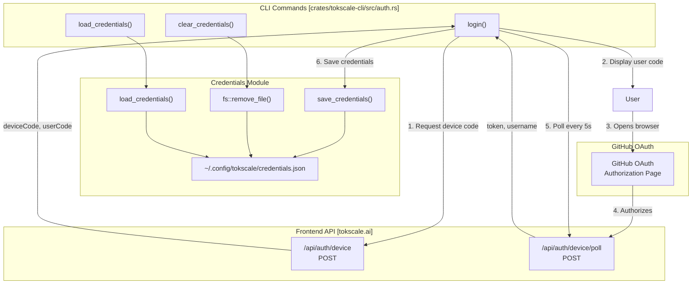

# Social Platform Commands

<details>
<summary>Relevant source files</summary>

The following files were used as context for generating this wiki page:

- [Cargo.lock](Cargo.lock)
- [crates/tokscale-cli/Cargo.toml](crates/tokscale-cli/Cargo.toml)
- [crates/tokscale-cli/src/auth.rs](crates/tokscale-cli/src/auth.rs)
- [crates/tokscale-cli/src/commands/wrapped.rs](crates/tokscale-cli/src/commands/wrapped.rs)
- [crates/tokscale-cli/src/cursor.rs](crates/tokscale-cli/src/cursor.rs)
- [crates/tokscale-cli/src/main.rs](crates/tokscale-cli/src/main.rs)
- [crates/tokscale-cli/src/tui/client_ui.rs](crates/tokscale-cli/src/tui/client_ui.rs)
- [crates/tokscale-cli/src/tui/data/mod.rs](crates/tokscale-cli/src/tui/data/mod.rs)
- [crates/tokscale-cli/src/tui/ui/widgets.rs](crates/tokscale-cli/src/tui/ui/widgets.rs)
- [crates/tokscale-core/Cargo.toml](crates/tokscale-core/Cargo.toml)
- [crates/tokscale-core/src/aggregator.rs](crates/tokscale-core/src/aggregator.rs)
- [crates/tokscale-core/src/clients.rs](crates/tokscale-core/src/clients.rs)
- [crates/tokscale-core/src/lib.rs](crates/tokscale-core/src/lib.rs)
- [crates/tokscale-core/src/scanner.rs](crates/tokscale-core/src/scanner.rs)
- [crates/tokscale-core/src/sessions/mod.rs](crates/tokscale-core/src/sessions/mod.rs)

</details>


This page documents the authentication and data submission commands that enable users to interact with the tokscale.ai social platform. These commands allow users to authenticate via GitHub OAuth, view their login status, and submit local token usage data to the public leaderboard.

## Overview

The social platform commands provide four primary operations:

| Command | Purpose | Authentication Required |
|---------|---------|------------------------|
| `tokscale login` | Authenticate via GitHub OAuth using device flow | No |
| `tokscale logout` | Clear stored credentials from disk | Yes |
| `tokscale whoami` | Display current authenticated user information | Yes |
| `tokscale submit` | Submit local usage data to tokscale.ai leaderboard | Yes |

All authentication state is stored locally in `~/.config/tokscale/credentials.json` with restricted file permissions (0600).

**Sources:** [crates/tokscale-cli/src/main.rs:172-183](), [crates/tokscale-cli/src/main.rs:204-215](), [crates/tokscale-cli/src/auth.rs:72-114]()

## Authentication Architecture



**Diagram: Device Flow Authentication Process**

The authentication system implements the OAuth 2.0 Device Authorization Grant flow, optimized for CLI applications.

**Sources:** [crates/tokscale-cli/src/auth.rs:219-270](), [crates/tokscale-cli/src/auth.rs:90-114]()

## Login Command

### Command Syntax

```bash
tokscale login [--token <existing-token>]
```

The login command initiates a device flow authentication. Alternatively, an existing API token can be saved directly using the `--token` flag.

**Sources:** [crates/tokscale-cli/src/main.rs:173-179]()

### Device Flow Implementation

The device flow proceeds through these phases:

1. **Device Code Request**: POST to `/api/auth/device` with the device name (e.g., "CLI on hostname"). [crates/tokscale-cli/src/auth.rs:243-249]()
2. **User Code Display**: Shows the verification URL and user code. [crates/tokscale-cli/src/auth.rs:257-266]()
3. **Browser Launch**: Attempts to open the URL automatically using `open_browser()`. [crates/tokscale-cli/src/auth.rs:189-217]()
4. **Poll Loop**: Polls `/api/auth/device/poll` based on the server-provided interval. [crates/tokscale-cli/src/auth.rs:271-315]()
5. **Credential Storage**: Saves `Credentials` struct (token, username, avatar) to disk. [crates/tokscale-cli/src/auth.rs:90-114]()

### Credential Storage Format

Credentials are stored as JSON in `~/.config/tokscale/credentials.json`:

```rust
pub struct Credentials {
    pub token: String,
    pub username: String,
    pub avatar_url: Option<String>,
    pub created_at: String,
}
```

The file is created with mode `0o600` on Unix systems.

**Sources:** [crates/tokscale-cli/src/auth.rs:14-22](), [crates/tokscale-cli/src/auth.rs:95-106]()

## Logout and Whoami

### Logout
The `logout` command calls `clear_credentials()`, which deletes the `credentials.json` file.

**Sources:** [crates/tokscale-cli/src/auth.rs:152-160]()

### Whoami
The `whoami` command calls `load_credentials()` and displays the authenticated username and the date the session was created.

**Sources:** [crates/tokscale-cli/src/auth.rs:116-124](), [crates/tokscale-cli/src/auth.rs:356-370]()

## Submit Command

### Command Syntax

```bash
tokscale submit [filters] [--dry-run]
```

The `submit` command aggregates local usage data and sends it to the tokscale.ai leaderboard.

### Submission Data Flow

```mermaid
sequenceDiagram
    participant User
    participant Main["main.rs::Commands::Submit"]
    participant Auth["auth.rs::resolve_api_token"]
    participant Scanner["scanner.rs::scan_all_clients"]
    participant Parser["parser.rs::parse_local_unified_messages"]
    participant Cursor["cursor.rs::sync_cursor_cache"]
    participant API["POST /api/submit"]
    
    User->>Main: tokscale submit
    Main->>Auth: resolve_api_token()
    Auth-->>Main: ApiTokenAuth
    
    rect rgb(240, 240, 240)
    Note over Main, Parser: Data Collection Phase
    Main->>Scanner: scan_all_clients()
    Main->>Cursor: sync_cursor_cache() (if enabled)
    Main->>Parser: parse_local_unified_messages()
    end
    
    Main->>User: Display summary (tokens, cost, sources)
    
    opt Not dry-run
        Main->>API: POST with Bearer token
        API-->>Main: Success/Error
    end
```

**Diagram: Submit Command Data Flow**

**Sources:** [crates/tokscale-cli/src/main.rs:204-215](), [crates/tokscale-core/src/parser.rs:23-50](), [crates/tokscale-cli/src/cursor.rs:230-260]()

### Authentication Resolution
The command first attempts to load a token from the `TOKSCALE_API_TOKEN` environment variable. If missing, it falls back to the stored `credentials.json`.

**Sources:** [crates/tokscale-cli/src/auth.rs:136-150]()

### Data Collection
The command uses the `tokscale-core` scanner and parser to aggregate messages from supported clients (OpenCode, Claude, Codex, etc.). If the `cursor` client is included, it triggers a sync with Cursor's dashboard API to update the local CSV cache.

**Sources:** [crates/tokscale-core/src/scanner.rs:59-77](), [crates/tokscale-cli/src/cursor.rs:230-260]()

### Summary and Submission
Before sending, the CLI displays a summary including:
- Total tokens and estimated cost.
- Active days and date range.
- Breakdown of included sources.

If `--dry-run` is not set, the data is serialized and POSTed to the API base URL (default: `https://tokscale.ai`).

**Sources:** [crates/tokscale-cli/src/auth.rs:162-164](), [crates/tokscale-cli/src/main.rs:210-214]()
